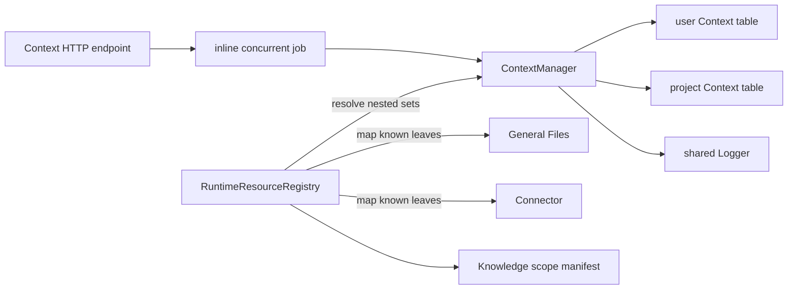
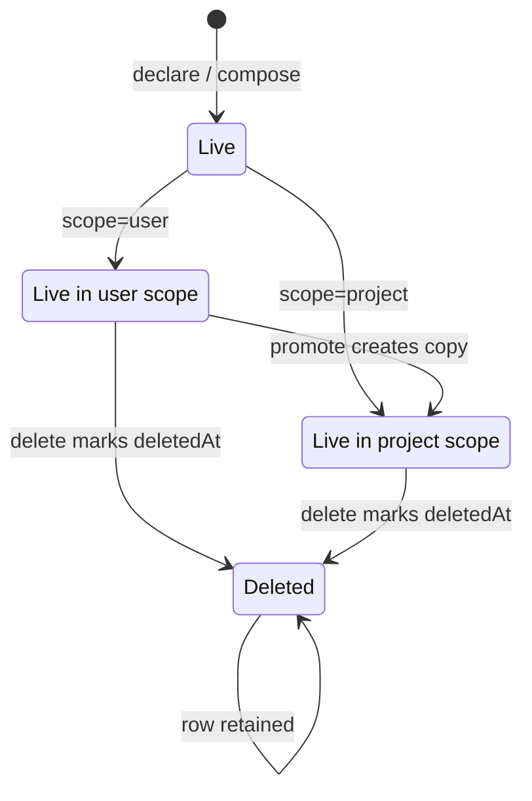
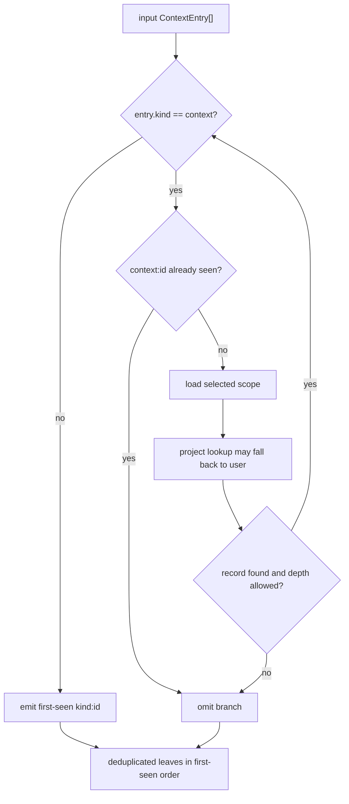

# Context concepts

## Purpose

A Context is a reusable, persisted set of references. A reference is the pair `kind:id`; Context deliberately treats non-`context` kinds as opaque. This lets a caller name a scope without copying the referenced content or depending on another capability's storage shape.

The implemented outcomes are:

- declare and replace named entry sets at user or project scope;
- look up and list those sets;
- recursively expand nested `kind: "context"` references;
- compute union or difference in memory;
- persist a composed result under an anonymous `~…` name; and
- copy a user context into project scope through promotion.

## Vocabulary

| Term | Meaning in the implementation |
|---|---|
| Context entry | `{ id, kind }`, with identity `${kind}:${id}` |
| Leaf | Any entry whose kind is not `context`; it is returned without resource validation |
| Nested context | An entry with `kind: "context"`; its `id` is loaded recursively |
| Named context | A live record whose display name does not start with `~` |
| Anonymous context | A record whose display name begins with `~`; hidden from default list calls |
| User scope | A table derived from the configured `userId` |
| Project scope | A table derived from the configured `projectId`; the default manager scope |
| Project-first lookup | A project `get`, `getByName`, or `resolve` may fall back to the user table |
| Promotion | Copy a user record into project scope with a new ID and revision 1 |
| Resolution depth | Recursion counter bounded by `maxResolveDepth`; over-depth branches are omitted |

## Ownership and boundaries

Context owns reference-set persistence and recursive composition. Knowledge owns source ingestion and retrieval. General Files, Connector, Document, and future resource capabilities own their resource content and revision rules. The resource registry bridges these boundaries after Context resolution.

The manager implements the narrow `KnowledgeResourceResolver.resolve` shape, but startup injects the richer runtime resource registry into Knowledge. That registry first calls Context and then converts known resource identities to the `kind: "document"` source-ID form Knowledge expects.

## Record lifecycle

Promotion is a copy, not a move: the source user row remains. A delete is a soft delete in SQLite. Name lookup and list hide deleted rows, while the current ID lookup does not filter `deleted_at`; that important current limitation is detailed in [Invariants](invariants.md).

## Resolution lifecycle

Resolution walks the supplied array in order. It keeps one `seen` set for both leaves and nested-context identities. A first-seen leaf is emitted; a repeated leaf is omitted. A first-seen context is loaded, then expanded depth-first. A repeated context breaks a cycle or duplicate path. Missing records and branches beyond the configured depth are silently omitted.

## Composition semantics

`combine(a, b)` is a first-seen union over `a` followed by `b`. `difference(a, b)` preserves entries from `a` whose `kind:id` key is absent from `b`; duplicate entries already present in `a` are not independently deduplicated by `difference`. Neither function resolves nested contexts.

`compose` runs one of those operations and inserts the result as a new record named `~${uuid}`. It does not reuse `declare`, so its behavior and limit enforcement are described separately in the runtime and invariant pages.
