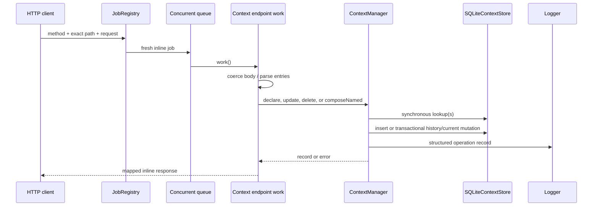
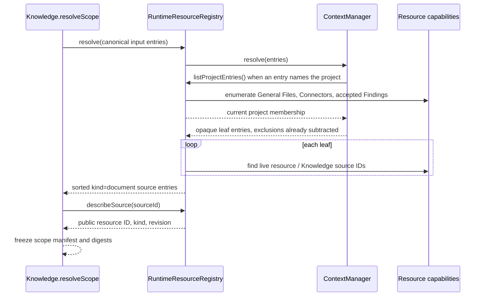

# Context endpoint and job flows

## Common transport behavior

[`registerContextEndpoints`](../../../4-job-wiring/context/registerContextEndpoints.ts)
registers 10 exact method/path pairs, all under `/contexts`. Every mapping
creates a fresh `concurrent`, `inline` job. There is no scope selection in the
path — every route addresses the one project-scoped current/history store.

Typed errors map as follows: not found → 404, current-name conflict → 409,
stale revision → 409, other caught values → 400. Successful records are
returned directly; list and pure-set operations wrap arrays in `{records}` or
`{entries}`. The two persisted composition endpoints return only `{contextId}`.

## Exhaustive endpoint table

| Method and path | Job name | Input normalization | Runtime call | Success | Error behavior |
|---|---|---|---|---|---|
| `POST /contexts` | `context.declare` | `displayName` → string; `entries` via `parseEntries`; optional `excludes` via `parseExcludes`; optional `description`; `private` via `parsePrivate` (only literal `true` counts) | `declare(name, entries, {description, private, excludes})` | 201 record | typed/default mapping |
| `GET /contexts` | `context.list` | `includePrivate === "true"` | `list({includePrivate})` | 200 `{records}` | uncaught unexpected failure |
| `GET /contexts/entry` | `context.get` | query `id`, default `""` | `get(id)` | 200 record | explicit 404 on `null` |
| `GET /contexts/by-name` | `context.getByName` | query `displayName`, default `""` | `getByName(name)` | 200 record | explicit 404 on `null` |
| `PATCH /contexts/entries` | `context.update` | `id` string, parsed entries, `Number(expectedRevision)`, optional `excludes` via `parseExcludes` — absent and `[]` mean different things | `update(id, entries, expected, {excludes})` | 200 record | typed/default mapping |
| `DELETE /contexts` | `context.delete` | body `id` → string | `delete(id)` | 204 null | typed/default mapping |
| `POST /contexts/purge` | `context.purge` | body `id` → string | `purge(id)` | 204 null | current → 409 `not_deleted`; no terminal history → 404 |
| `POST /contexts/resolve` | `context.resolve` | entries via parser | `resolve(entries)` | 200 `{entries}` | unexpected failures not locally mapped |
| `POST /contexts/union` | `context.union` | `a`, `b` via `parseOperand` (`{contextId}` or `{entries}`); `displayName` required; optional `description`; `private` via `parsePrivate` | `composeNamed("union", a, b, displayName, {description, private})` | 201 `{contextId}` | typed/default mapping; missing operand context → 404 |
| `POST /contexts/difference` | `context.difference` | same operand/displayName/description/private normalization | `composeNamed("difference", a, b, displayName, {description, private})` | 201 `{contextId}` | typed/default mapping; missing operand context → 404 |

There are no deferred or internal Context jobs. The shared retention scheduler
invokes Context's maintenance hooks; Context owns no scheduler itself.

## Mutation call chain

## Nested resolution call chain

1. The endpoint parses entries and calls `resolve`.
2. The manager expands the supplied list. Leaves pass through.
3. A `kind: "project"` entry expands to the membership port's answer, fetched at
   most once per call so one resolve observes one membership. With no port
   registered, or on an enumeration failure, it expands to nothing and says so.
4. A `kind: "context"` entry is checked against the ancestor path (a cycle cuts
   the branch) and the memo, then loaded from the single project table. A
   logically deleted nested Context has no current row and is omitted like any
   other missing ID.
5. That record's own `entries` and `excludes` are each expanded, and the
   exclusions are subtracted from the inclusions. The parent sees the result, not
   the exclusions — which is what makes exclusions compose.
6. If a cycle or the depth cap truncated the **exclusion** list, the record
   resolves to nothing and logs at error rather than handing back resources it
   was told to withhold.
7. The manager deduplicates once over the whole result, logs counts and the
   resolved membership, and returns.

## Knowledge scope call chain

Context itself never invokes Knowledge; this direction prevents Context from owning resource ingestion or retrieval. The membership call is to the registry, not to Knowledge, for the same reason — Context asks what the project holds, and something else decides what that means.

Exclusions are applied inside `ContextManager.resolve`, before the registry maps leaves and before Knowledge freezes the manifest. That ordering matters beyond retrieval: `scope.resources` is also the read boundary for the Derived Output tools, so an exclusion applied later than this would leave the excluded resource fully readable.

`Knowledge.resolveScope` distinguishes three inputs. Absent is unscoped and returns no manifest. An empty array is an empty scope that admits nothing, and logs at warn. An entry naming the project resolves to every current source — handled there as well as in Context, so the sentinel arriving unexpanded still means the project instead of being dropped as an unknown kind.
