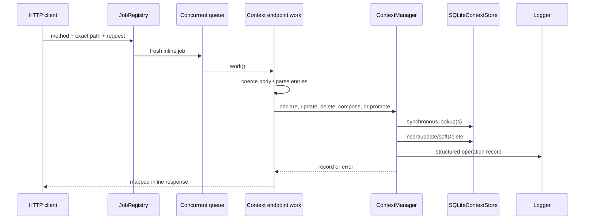
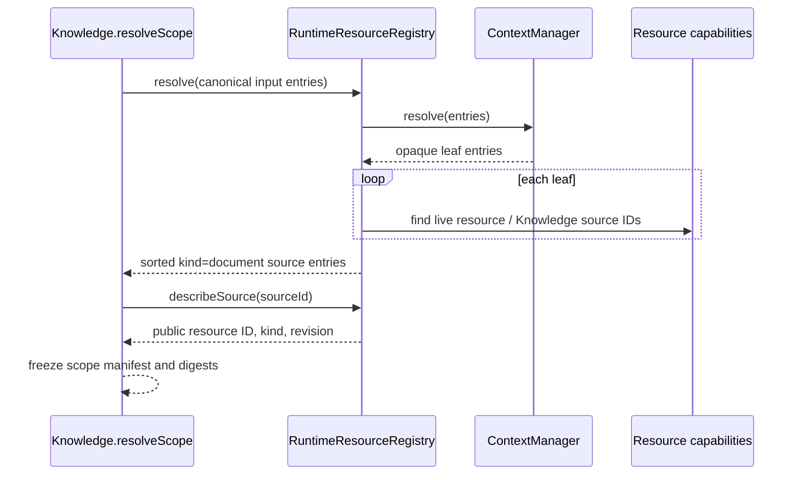

# Context endpoint and job flows

## Common transport behavior

[`registerContextEndpoints`](../../../4-job-wiring/context/registerContextEndpoints.ts) registers 21 exact method/path pairs. Every mapping creates a fresh `concurrent`, `inline` job. Scope is fixed by the path; callers cannot provide a project/user ID or SQL table name.

Typed errors map as follows: not found → 404, live-name conflict → 409, stale revision → 409, other caught values → 400. Successful records are returned directly; list and set operations wrap arrays in `{records}` or `{entries}`.

## Exhaustive endpoint table

| Method and path | Job name | Input normalization | Runtime call | Success | Error behavior |
|---|---|---|---|---|---|
| `POST /user/contexts` | `context.user.declare` | `displayName` → string; `entries` via `parseEntries` | `declare(name, entries, "user")` | 201 record | typed/default mapping |
| `GET /user/contexts` | `context.user.list` | `includeAnonymous === "true"` | `list({scope:"user", includeAnonymous})` | 200 `{records}` | uncaught unexpected failure |
| `GET /user/contexts/entry` | `context.user.get` | query `id`, default `""` | `get(id, "user")` | 200 record | explicit 404 on `null` |
| `GET /user/contexts/by-name` | `context.user.getByName` | query `displayName`, default `""` | `getByName(name, "user")` | 200 record | explicit 404 on `null` |
| `PATCH /user/contexts/entries` | `context.user.update` | `id` string, parsed entries, `Number(expectedRevision)` | `update(id, entries, expected, "user")` | 200 record | typed/default mapping |
| `DELETE /user/contexts` | `context.user.delete` | body `id` → string | `delete(id, "user")` | 204 null | typed/default mapping |
| `POST /user/contexts/resolve` | `context.user.resolve` | entries via parser | `resolve(entries, "user")` | 200 `{entries}` | unexpected failures not locally mapped |
| `POST /user/contexts/combine` | `context.user.combine` | `a`, `b` via parser | `combine(a,b)` | 200 `{entries}` | pure call |
| `POST /user/contexts/difference` | `context.user.difference` | `a`, `b` via parser | `difference(a,b)` | 200 `{entries}` | pure call |
| `POST /user/contexts/compose` | `context.user.compose` | `op === "difference"`, otherwise combine; parsed sets | `compose(op,a,b,"user")` | 201 record | typed/default mapping |
| `POST /project/contexts` | `context.project.declare` | same as user declare | `declare(name, entries, "project")` | 201 record | typed/default mapping |
| `GET /project/contexts` | `context.project.list` | same list query | `list({scope:"project", includeAnonymous})` | 200 `{records}` | uncaught unexpected failure |
| `GET /project/contexts/entry` | `context.project.get` | query `id` | `get(id, "project")` | 200 record | explicit 404 on `null` |
| `GET /project/contexts/by-name` | `context.project.getByName` | query `displayName` | `getByName(name, "project")` | 200 record | explicit 404 on `null` |
| `PATCH /project/contexts/entries` | `context.project.update` | same update normalization | `update(id, entries, expected, "project")` | 200 record | typed/default mapping |
| `DELETE /project/contexts` | `context.project.delete` | body `id` → string | `delete(id, "project")` | 204 null | typed/default mapping |
| `POST /project/contexts/resolve` | `context.project.resolve` | entries via parser | `resolve(entries, "project")` | 200 `{entries}` | unexpected failures not locally mapped |
| `POST /project/contexts/combine` | `context.project.combine` | `a`, `b` via parser | `combine(a,b)` | 200 `{entries}` | pure call |
| `POST /project/contexts/difference` | `context.project.difference` | `a`, `b` via parser | `difference(a,b)` | 200 `{entries}` | pure call |
| `POST /project/contexts/compose` | `context.project.compose` | same compose normalization | `compose(op,a,b,"project")` | 201 record | typed/default mapping |
| `POST /user/contexts/promote` | `context.promote` | body `id` → string | `promote(id)` | 201 project record | typed/default mapping |

There are no deferred Context jobs, scheduled jobs, or internal stage jobs.

## Mutation call chain

## Nested resolution call chain

1. The endpoint parses entries and calls `resolve` with a fixed scope.
2. The manager walks entries depth-first.
3. A leaf is appended on first sight.
4. A nested context is marked seen before loading.
5. Project resolution checks the project table and then user table; user resolution checks only user.
6. Found entries recurse until the depth guard; missing/deleted-as-hidden-by-name is not relevant because resolution loads by ID.
7. The manager logs input and resolved counts and returns the first-seen leaf sequence.

## Knowledge scope call chain

Context itself never invokes Knowledge; this direction prevents Context from owning resource ingestion or retrieval.
