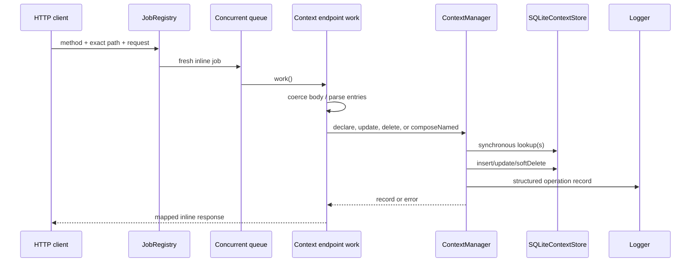
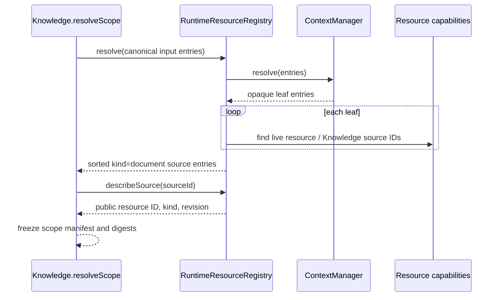

# Context endpoint and job flows

## Common transport behavior

[`registerContextEndpoints`](../../../4-job-wiring/context/registerContextEndpoints.ts) registers 9 exact method/path pairs, all under `/contexts`. Every mapping creates a fresh `concurrent`, `inline` job. There is no scope selection in the path — every route addresses the one project-scoped table.

Typed errors map as follows: not found → 404, live-name conflict → 409, stale revision → 409, other caught values → 400. Successful records are returned directly; list and pure-set operations wrap arrays in `{records}` or `{entries}`. The two persisted composition endpoints return only `{contextId}`.

## Exhaustive endpoint table

| Method and path | Job name | Input normalization | Runtime call | Success | Error behavior |
|---|---|---|---|---|---|
| `POST /contexts` | `context.declare` | `displayName` → string; `entries` via `parseEntries`; optional `description`; `private` via `parsePrivate` (only literal `true` counts) | `declare(name, entries, {description, private})` | 201 record | typed/default mapping |
| `GET /contexts` | `context.list` | `includePrivate === "true"` | `list({includePrivate})` | 200 `{records}` | uncaught unexpected failure |
| `GET /contexts/entry` | `context.get` | query `id`, default `""` | `get(id)` | 200 record | explicit 404 on `null` |
| `GET /contexts/by-name` | `context.getByName` | query `displayName`, default `""` | `getByName(name)` | 200 record | explicit 404 on `null` |
| `PATCH /contexts/entries` | `context.update` | `id` string, parsed entries, `Number(expectedRevision)` | `update(id, entries, expected)` | 200 record | typed/default mapping |
| `DELETE /contexts` | `context.delete` | body `id` → string | `delete(id)` | 204 null | typed/default mapping |
| `POST /contexts/resolve` | `context.resolve` | entries via parser | `resolve(entries)` | 200 `{entries}` | unexpected failures not locally mapped |
| `POST /contexts/union` | `context.union` | `a`, `b` via `parseOperand` (`{contextId}` or `{entries}`); `displayName` required; optional `description`; `private` via `parsePrivate` | `composeNamed("union", a, b, displayName, {description, private})` | 201 `{contextId}` | typed/default mapping; missing operand context → 404 |
| `POST /contexts/difference` | `context.difference` | same operand/displayName/description/private normalization | `composeNamed("difference", a, b, displayName, {description, private})` | 201 `{contextId}` | typed/default mapping; missing operand context → 404 |

There are no deferred Context jobs, scheduled jobs, or internal stage jobs.

## Mutation call chain

## Nested resolution call chain

1. The endpoint parses entries and calls `resolve`.
2. The manager walks entries depth-first.
3. A leaf is appended on first sight.
4. A nested context is marked seen before loading.
5. Resolution loads the nested context by ID from the single project table.
6. Found entries recurse until the depth guard; missing/deleted-as-hidden-by-name is not relevant because resolution loads by ID.
7. The manager logs input and resolved counts and returns the first-seen leaf sequence.

## Knowledge scope call chain

Context itself never invokes Knowledge; this direction prevents Context from owning resource ingestion or retrieval.
