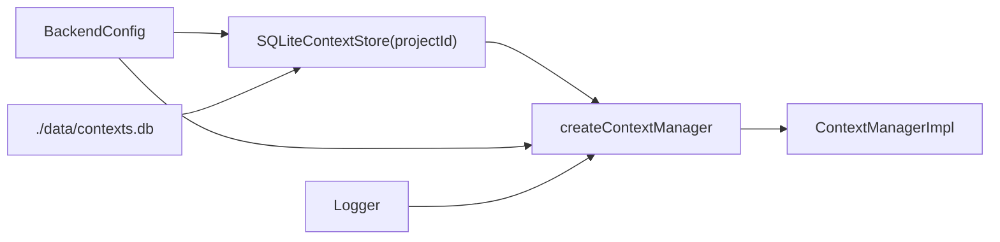

# Context runtime

## Construction

[`createContextManagerInstance`](../../../1-init/create/context.ts) opens `./data/contexts.db`, binds the configured `projectId` into `SQLiteContextStore`, and passes `config.context` plus the shared Logger to [`createContextManager`](../context.ts).

The manager has no mutable cache and keeps only its store, configuration, and logger. The SQLite connection remains owned by the store for process lifetime; the current port exposes no close operation.

## Public manager methods

| Method | Work and result | Persistence / side effects | Logging |
|---|---|---|---|
| `get(id)` | Loads by ID from the project table; returns record or `null` | Read only | debug `context.get` with found/duration |
| `getByName(name)` | Loads by exact current display name | Read only | debug `context.getByName` |
| `list(options={})` | Lists the project table; private records excluded by default | Read only | debug `context.list` with count |
| `declare(name, entries, options?)` | Checks raw entry count, checks current-name conflict, deduplicates, creates UUID at revision 1 with `private` from `options.private` (default `false`) | One current-table insert | info `context.declare` |
| `update(id, entries, expectedRevision)` | Checks raw count, existence, and revision; replaces the complete entry array at revision +1 | Archives prior snapshot and CAS-updates current in one transaction | info `context.update` |
| `delete(id)` | Requires a current row | Archives current revision, appends terminal revision +1, removes current in one transaction | info `context.delete` |
| `purge(id)` | Requires no current row and terminal deletion history | Irreversibly removes retained history | info `context.purge` |
| `pruneHistory(cutoff)` / `purgeExpired(cutoff)` | Shared retention hooks | Prune old current-resource snapshots / purge expired deleted resources | scheduler logging |
| `resolve(entries)` | Depth-first nested expansion, first-seen deduplication, silent cycle/missing/depth omission | Store reads only | debug `context.resolve` |
| `combine(a,b)` | First-seen union keyed by `kind:id` | Pure; no log | none |
| `difference(a,b)` | Returns entries in `a` whose key is absent from `b` | Pure; no log | none |
| `composeNamed(op,a,b,displayName,options?)` | Resolves each operand (by `contextId` or inline `entries`), runs union/difference, checks current-name conflict, and inserts a new named record at revision 1 with `private` from `options.private` (default `false`) | One insert | info `context.composeNamed` |

All public methods return promises where declared, but the current SQLite calls
execute synchronously on the event loop. Startup's shared retention scheduler
supplies the cutoff. Defaults are 30 days and a 24-hour sweep interval, with one
sweep immediately after HTTP binds and per-capability failure isolation.

## Auxiliary helpers

### `dedup`

The module-private helper walks entries once, keys each as `${kind}:${id}`, and preserves the first occurrence. `declare` and `update` use it. `combine` contains equivalent inline logic; `difference` does not deduplicate `a`.

### Recursive `expand`

`resolve` defines an async recursive closure per call. Its shared `seen` set stores leaf keys and `context:${id}` keys. The guard is `if (depth > maxResolveDepth) return`, so depth 0 through the configured depth are visited and a child call one level beyond is omitted.

### Endpoint helpers

[`parseEntries`](../../../4-job-wiring/context/registerContextEndpoints.ts) treats a non-array as empty, ignores non-object elements, coerces `id` and `kind` with `String`, and drops entries with an empty result. It is transport normalization, not a complete schema validator.

`contextErrorResponse` maps Context validation/not-found/conflict/revision
errors plus purge's `not_deleted` and missing-history outcomes. Other caught
values map to a 400 response.

## Store operations

The store derives trusted current/history table names once in its constructor
and uses prepared parameters for values. `createSchema` is idempotent.
`rowToRecord` parses `entries_json` without a recovery path; malformed stored
JSON throws to the caller. Update and delete use SQLite transactions to keep
history and current state atomic.

## Concurrency and queue behavior

Every Context endpoint creates an inline job on the shared `concurrent` queue.
Update's `id + expectedRevision` SQL predicate gives concurrent writers one
winner. Delete is transactionally serialized with current-row lookup, history
append, and current-row removal.

Name uniqueness is enforced by the current table's SQLite unique index even
when two declarations race. The precheck produces `ContextConflictError` in
the ordinary path; a race can instead surface a SQLite error.

## Resource-registry integration

[`ResourceRegistry.resolve`](../../../1-init/create/resource-reader.ts) calls `ContextManager.resolve`, then:

- passes `kind: "document"` leaves through as source IDs;
- maps a live text General File to its `knowledgeSourceId`;
- maps a live active Connector to all exposed `knowledgeSourceIds`; and
- drops unsupported, missing, non-text, pending, or failed resources.

It returns sorted `{id: sourceId, kind: "document"}` entries for Knowledge. This conversion is outside Context's authority and is intentionally not performed by `ContextManager.resolve` itself.
