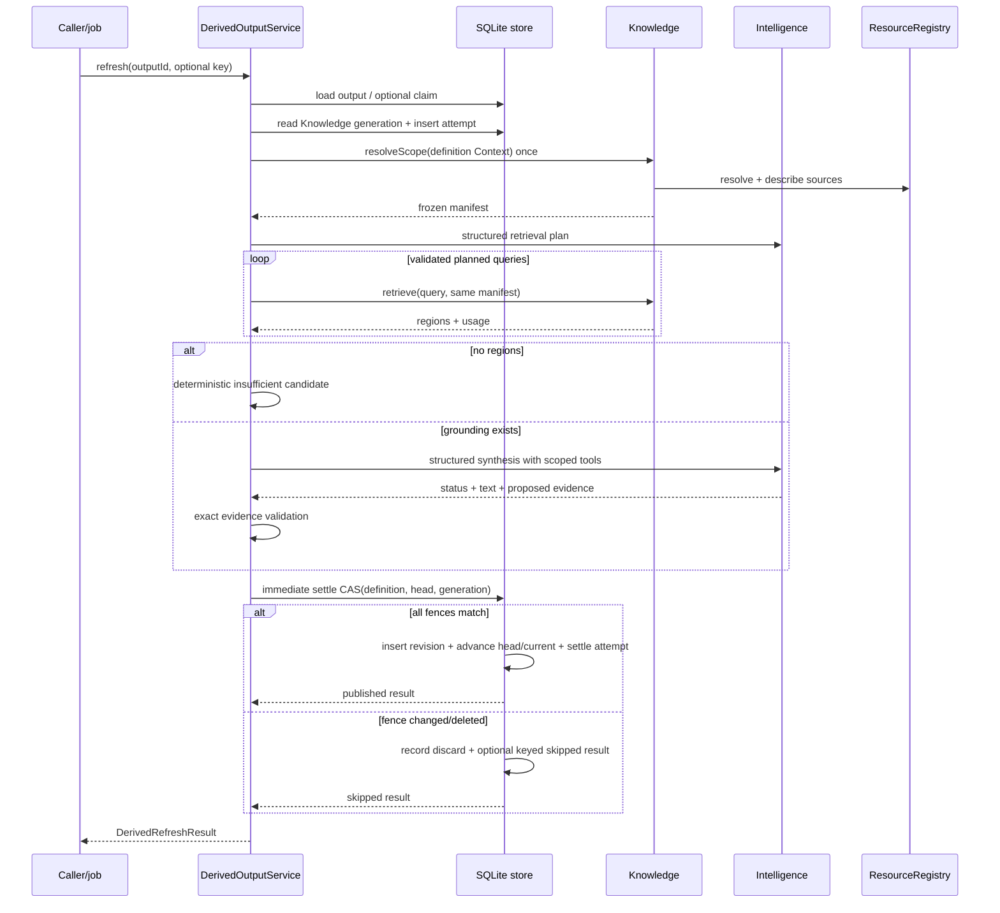
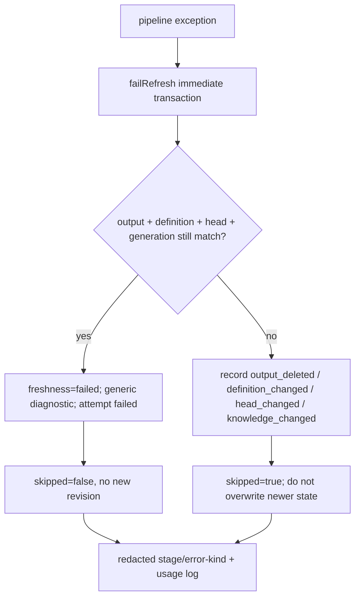
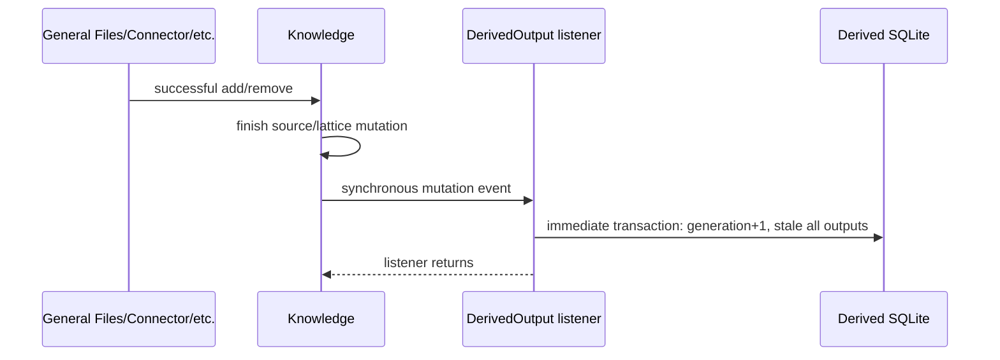

# Derived Outputs endpoint and internal flows

## Exhaustive HTTP endpoint table

[`registerDerivedOutputEndpoints`](../../../4-job-wiring/derived-outputs/registerDerivedOutputEndpoints.ts) registers six inline jobs.

| Method/path | Job | Queue | Input normalization | Calls | Success / notable behavior |
|---|---|---|---|---|---|
| `POST /derived-outputs` | `derived-outputs.declare` | concurrent | prompt/stabilization coerced to strings; Context array cast | `declare`, then unkeyed `refresh` | 201 refresh result, including failed/skipped result |
| `GET /derived-outputs?id=` | `derived-outputs.get` | concurrent | query ID default `""` | `get` | 200 output or explicit 404 |
| `GET /derived-output-revisions?outputId=&revision=` | `derived-outputs.get-revision` | concurrent | revision via `Number`, default 0 | `getRevision` | 200 revision or explicit 404 |
| `PATCH /derived-output-definition` | `derived-outputs.update-definition` | serial | complete strings/array; numeric expected revision | `updateDefinition` | 200 output; 404/409/400 |
| `POST /derived-output-refresh` | `derived-outputs.refresh` | concurrent | body ID string | `refresh` | 200 result; owned pipeline failure is represented in result |
| `DELETE /derived-outputs?id=` | `derived-outputs.delete` | serial | query ID default `""` | `delete` | 204 null or 404 |

The registration logs a six-endpoint manifest at startup. No endpoint forwards an idempotency key. There are no deferred or scheduler-owned Derived Output jobs; concurrency is inside the service/provider calls plus SQLite settlement.

Endpoint typed mapping explicitly handles not found, generic conflict, declaration idempotency mismatch, and stale definition. Refresh/definition-specific idempotency errors fall through to generic 400 if invoked through custom wiring; current endpoints cannot trigger them because they pass no options.

## Full refresh sequence

## Failure sequence

Any exception from scope resolution, planning validation/provider, retrieval, resource mapping, synthesis/tools, structured validation, or settlement enters the catch path. The service calls `failRefresh` with the same frozen fences and accumulated usage.

The underlying exception message is not returned or logged by this method.

## Synthesis tools

| Tool | Input | Returned trusted shape | Scope behavior |
|---|---|---|---|
| `retrieve` | `{query}` | descriptor identity, source ID, character span, text, relevance | Knowledge receives exact manifest; out-of-manifest region throws |
| `read` | resource ID/kind + inclusive line range | descriptor/source identity, line span, text | Reject descriptor outside manifest before reader; registry rejects changed revision |
| `list_resources` | `{}` | exact manifest descriptors | Reader output must match manifest subset exactly |
| `list_evidence` | `{}` | all candidate identities/spans observed so far | Candidate set was built only inside same manifest |

Tool calls occur within `Intelligence.reasonWithToolsStructured` for at most configured rounds. Tool retrieval usage is added to pipeline usage; direct line reads have no model-token usage.

## Evidence acceptance flow

1. Parse model span and enforce safe, ordered bounds.
2. Build resource-kind/ID/span key.
3. Require matching candidate.
4. Reject candidate reuse.
5. Require supplied revision and source ID exactly equal trusted candidate.
6. Require positive integer rank and nondecreasing rank order.
7. Trim nonempty contribution.
8. Require at least one accepted item when status is `ok`.

The implementation checks nonempty contribution, not the prompt's stronger “exactly one sentence” instruction.

## Knowledge mutation/invalidation flow

A revision-matching skipped Knowledge add emits no event. Invalidation is project-wide, not evidence-source selective.

## Resource resolution/read flow

The runtime registry expands nested Context once, passes raw `document` source IDs through, maps text General Files and active Connector source IDs, then Knowledge creates frozen descriptors. General File and Connector reads are implemented. A plain Knowledge/document source receives a default `document` descriptor, but the current registry has no Document content-reader registration, so its direct `read` tool call returns null even though lattice retrieval can still provide regions/evidence.

## Deletion flow

The serial endpoint calls one store transaction that explicitly deletes declaration claims, refresh claims, definition-update claims, revisions, attempts, then output. Subsequent update/refresh/delete sees not found. Referencing Document/Slide/etc. rows are outside this database and remain broken references until their owning capability handles them.
