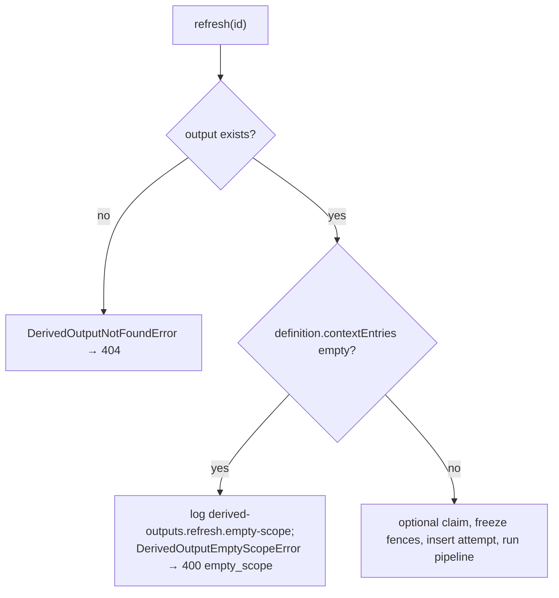
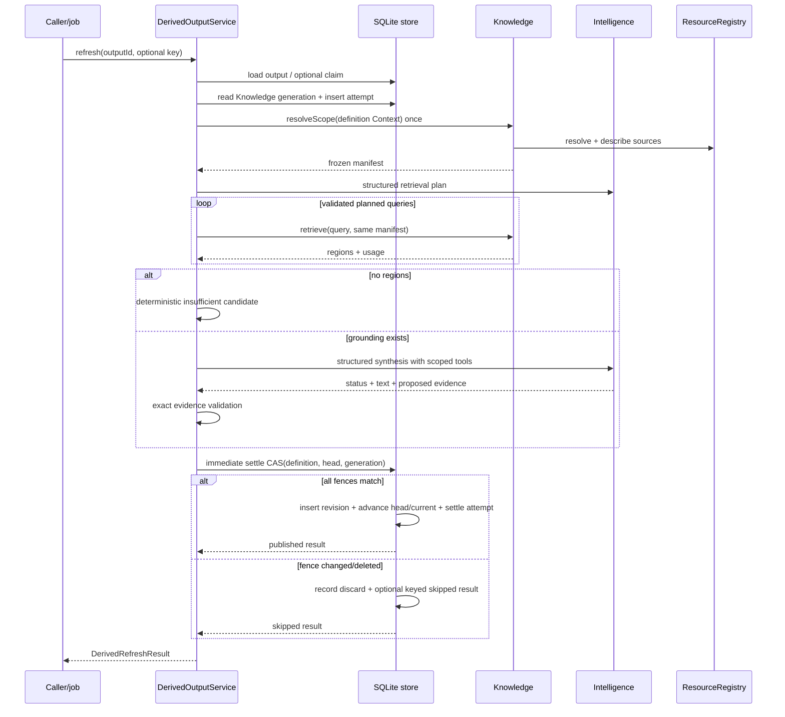
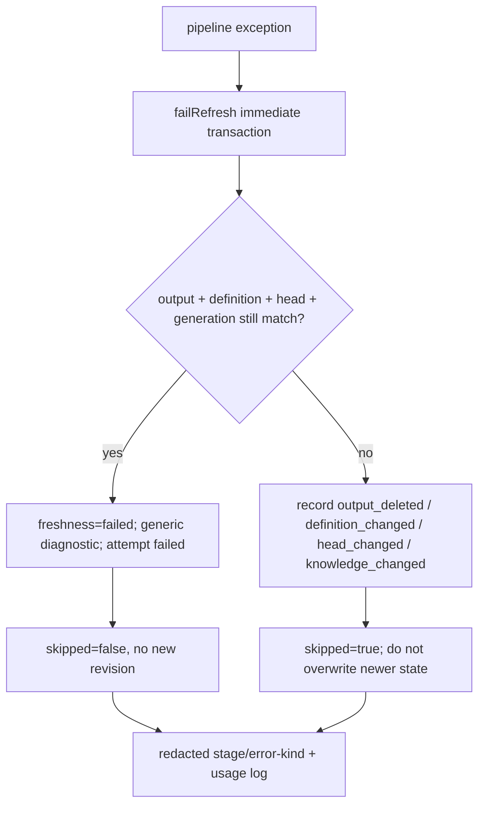
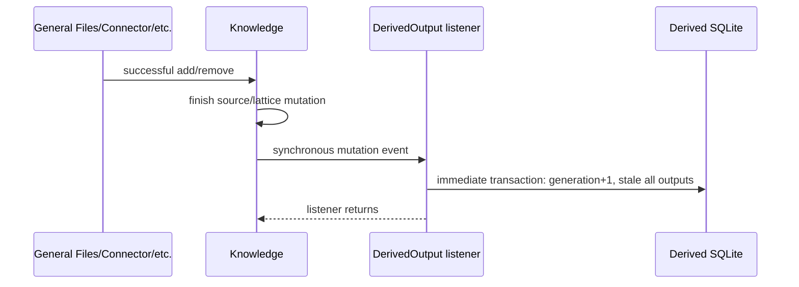
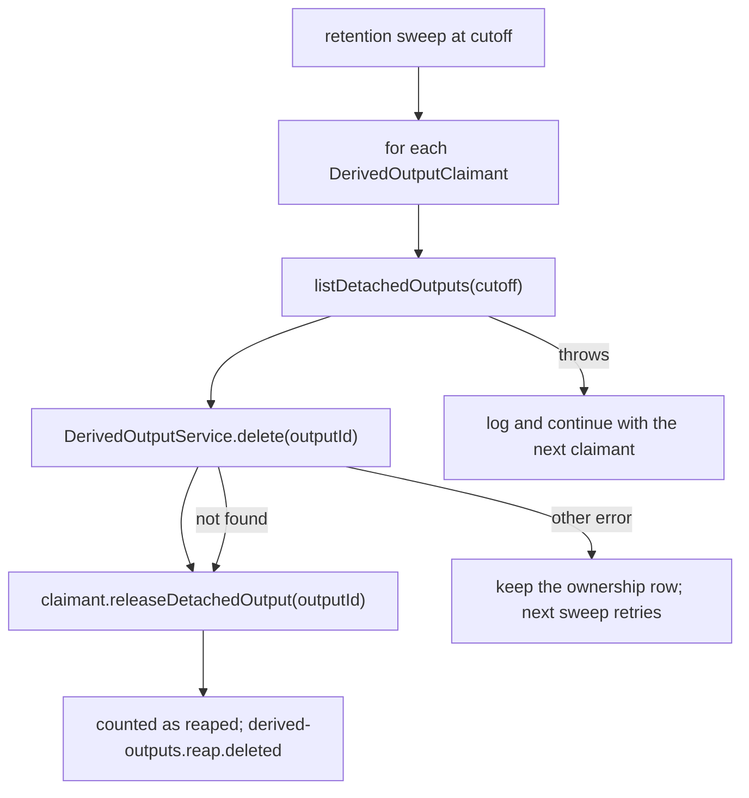

# Derived Outputs endpoint and internal flows

## Exhaustive HTTP endpoint table

[`registerDerivedOutputEndpoints`](../../../4-job-wiring/derived-outputs/registerDerivedOutputEndpoints.ts) registers seven inline jobs.

| Method/path | Job | Queue | Input normalization | Calls | Success / notable behavior |
|---|---|---|---|---|---|
| `POST /derived-outputs` | `derived-outputs.declare` | concurrent | prompt/stabilization coerced to strings; `contextEntries` validated by `requireContextEntries`, optional here | `declare`, then unkeyed `refresh` | 201 refresh result, including failed/skipped result; 400 `empty_scope` when no context was named |
| `GET /derived-outputs?id=` | `derived-outputs.get` | concurrent | query ID default `""` | `get` | 200 output or explicit 404 |
| `GET /derived-output-revisions?outputId=&revision=` | `derived-outputs.get-revision` | concurrent | revision via `Number`, default 0 | `getRevision` | 200 revision or explicit 404 |
| `PATCH /derived-output-definition` | `derived-outputs.update-definition` | serial | complete strings; `contextEntries` validated and required; numeric expected revision | `updateDefinition` | 200 output; 404/409/400 |
| `POST /derived-output-refresh` | `derived-outputs.refresh` | concurrent | body ID string | `refresh` | 200 result; owned pipeline failure is represented in result; 400 `empty_scope` when the definition names no context |
| `DELETE /derived-outputs?id=` | `derived-outputs.delete` | serial | query ID default `""` | `delete` | 204 null or 404 |
| `POST /derived-outputs/purge` | `derived-outputs.purge` | serial | body ID string | `purge` | 204 null; 409 live / 404 no terminal history |

The registration logs a seven-endpoint manifest at startup. No endpoint forwards an idempotency key. There are no deferred or capability-owned Derived Output jobs; concurrency is inside the service/provider calls plus SQLite settlement. The backend-wide retention scheduler calls the service's pruning and expired-purge methods.

Endpoint typed mapping explicitly handles not found, generic conflict, declaration idempotency mismatch, stale definition, and empty scope. `DerivedOutputEmptyScopeError` maps to `400 {"error":"empty_scope"}`. Refresh/definition-specific idempotency errors fall through to generic 400 if invoked through custom wiring; current endpoints cannot trigger them because they pass no options.

`requireContextEntries` rejects a malformed `contextEntries` with a generic `400 bad_request` rather than coercing it. Both handlers used to turn any non-array into `undefined` or `[]`, which then meant the whole project, so a typo in the body produced the broadest possible grounding. Declare treats an omitted value as `undefined`, which `declare` still distinguishes from an explicit empty list; the definition update requires the field, because it replaces the definition wholesale and an omitted scope would silently erase it.

## Refresh precondition

The empty-scope check runs before the idempotency claim and before the attempt insert, so
a refused refresh leaves no attempt row, no usage, no failed revision, and no freshness
change. It is the one error `refresh` throws out of the method rather than converting into
a `DerivedRefreshResult`; every later stage is caught. `POST /derived-outputs` runs
`declare` first, so a declaration that names no context leaves its declared Output behind
and answers 400. That response carries the `outputId`, because the declaration did succeed
and a bare error would strand the Output behind an ID the caller never saw; it can then be
given a scope through a definition update.

`declare` itself accepts an empty scope on purpose. A template legitimately holds unbound
Context Variables, and copying one calls `declare` with the empty entries that produces —
so refusing at declaration time would make template instantiation impossible. Only
`refresh` refuses, which is the moment an answer would otherwise be produced from nothing.

## Full refresh sequence

## Failure sequence

Any exception from scope resolution, planning validation/provider, retrieval, resource mapping, synthesis/tools, structured validation, or settlement enters the catch path. The service calls `failRefresh` with the same frozen fences and accumulated usage.

The underlying exception message is not returned or logged by this method.

## Synthesis tools

| Tool | Input | Returned trusted shape | Scope behavior |
|---|---|---|---|
| `retrieve` | `{query}` | descriptor identity, source ID, character span, text, relevance | Knowledge receives exact manifest; out-of-manifest region throws |
| `read` | resource ID/kind + inclusive line range | descriptor/source identity, line span, text | Reject descriptor outside manifest before reader; registry rejects changed revision |
| `list_resources` | `{}` | exact manifest descriptors | Reader output must match manifest subset exactly |
| `list_evidence` | `{}` | all candidate identities/spans observed so far | Candidate set was built only inside same manifest |

Tool calls occur within `Intelligence.reasonWithToolsStructured` for at most configured rounds. Tool retrieval usage is added to pipeline usage; direct line reads have no model-token usage.

## Evidence acceptance flow

1. Parse model span and enforce safe, ordered bounds.
2. Build resource-kind/ID/span key.
3. Require matching candidate.
4. Reject candidate reuse.
5. Require supplied revision and source ID exactly equal trusted candidate.
6. Require positive integer rank and nondecreasing rank order.
7. Trim nonempty contribution.
8. Require at least one accepted item when status is `ok`.

The implementation checks nonempty contribution, not the prompt's stronger “exactly one sentence” instruction.

## Knowledge mutation/invalidation flow

A revision-matching skipped Knowledge add emits no event. Invalidation is project-wide, not evidence-source selective.

## Resource resolution/read flow

The runtime registry expands nested Context once, passes raw `document` source IDs through, maps text General Files and active Connector source IDs, then Knowledge creates frozen descriptors. General File and Connector reads are implemented. A plain Knowledge/document source receives a default `document` descriptor, but the current registry has no Document content-reader registration, so its direct `read` tool call returns null even though lattice retrieval can still provide regions/evidence.

## Deletion flow

The serial delete endpoint calls one store transaction that archives the final Output
aggregate at resource revision `N`, appends terminal deletion revision `N + 1`, and
deletes the current Output row. Current-owned declaration claims, refresh claims,
definition-update claims, and attempts cascade away. Immutable answer revisions and
lifecycle history remain attached to the stable internal root. Subsequent unqualified
get, update, refresh, and delete operations see not found.

`POST /derived-outputs/purge` requires that current state is absent and the latest history
record is terminal deletion. It removes all lifecycle history and then the stable root,
cascading retained answer revisions. A live Output returns `409 not_deleted`; an unknown
or already-purged id returns `404 not_found`. Retention uses the same physical purge for
expired terminal deletions and prunes old lifecycle snapshots for Outputs that remain
live.

References in Document or another owning capability are outside this database. Owners
must logically delete their Outputs before owner deletion and physically purge them
before owner purge; Derived Outputs does not rewrite external references itself.

## Orphan reaping

[`createDerivedOutputReaper`](../../../1-init/create/derivedOutputReaper.ts) is registered
in [`startBackend.ts`](../../../1-init/startBackend.ts) as the `derived-outputs-orphans`
retention port. It closes the leak where a Prompt Block that was removed or repointed left
its Derived Output alive and named by nothing.

It asks each claimant what it has **released** — an Output it once owned and no longer
attaches to any block, detached before the cutoff. It never enumerates Outputs and never
treats "has no owner" as "orphaned", so the standalone Outputs `POST /derived-outputs`
creates are untouched. The claimant list is a list rather than a hard-wired store because
Document is only the first owner of this shape.

The cutoff is the grace period, not caution: undo re-attaches a detached Output by ID, so
only rows older than the cutoff are past the reach of compensation.

Reaped Outputs are logically deleted, not purged — purge refuses anything still live — and
the resulting history is left to the `derived-outputs` retention port registered just
above it. `pruneHistory` on this port returns 0; the reaper owns no history of its own.
Port order in the scheduler is load-bearing: `derived-outputs-orphans` runs after both
`document` and `derived-outputs`, so it never observes a half-finished document deletion.
