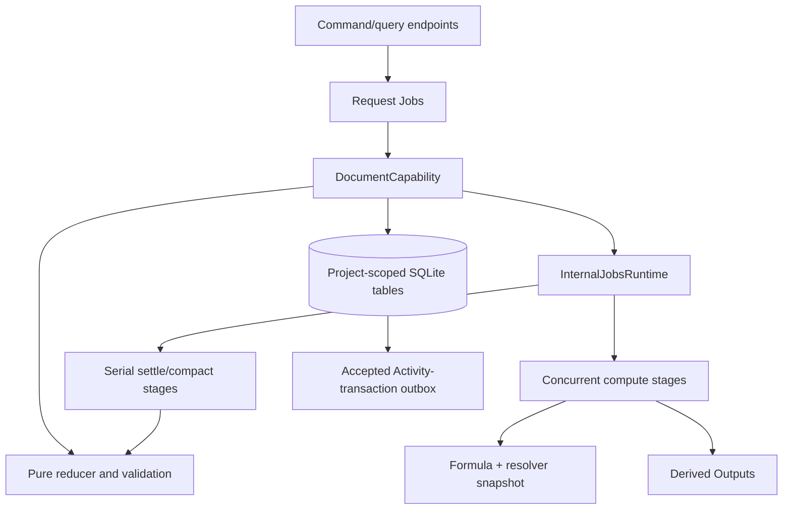
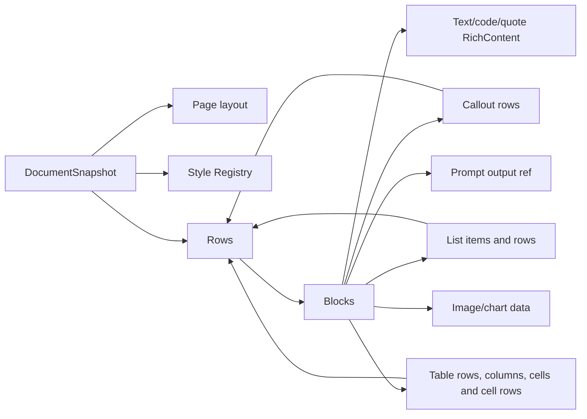

# Document concepts

## High-level model

A Document is a project-scoped, revisioned aggregate. Its canonical snapshot
contains page settings, an embedded Style Registry, and a recursively nested
Row/Block tree. Mutations are admitted as typed operations, reduced against a
copy, recursively validated, and atomically appended as a ChangeSet plus a new
head revision.

## Vocabulary

| Term | Current meaning |
| --- | --- |
| Head | Small current-state record: identity, title/lifecycle, revision, latest Base sequence, semantic digest, timestamps. |
| Snapshot | Complete canonical representation at one revision. |
| Base | Durable full snapshot at a selected revision (`baseSeq`). |
| ChangeSet | One accepted mutation: forward/inverse operations, touched IDs, revision metadata, digest, origin, and optional compensation link. |
| Row | Ordered horizontal container of Blocks with gap/margin and parallel width tracks. |
| Block | One closed variant: text, code, quote, prompt, divider, callout, list, table, image, or chart. |
| Style Registry | Embedded styles plus one default style ID for every Block kind. |
| Prompt Block | Exact reference to one dedicated Derived Output identity and applied revision. |
| Formula atom | Rich Text atom whose expression is evaluated asynchronously and settled as a Rich Text operation. |
| Attempt | Durable prompt-create, prompt-refresh, or formula-evaluation workflow record. |
| Stage receipt | Idempotency/ownership record for one attempt's compute or settle stage. |
| Identity ledger | Permanent per-Document claim for every canonical local identity, including tombstones. |
| Submission receipt | `(documentId, requestId)` replay record with canonical request digest and result. |
| Delegated claim | Local durable half of prompt definition update before calling Derived Outputs. |
| Prompt ownership | Local mapping from a dedicated output to one Document Block, with pending/attached/detached state. |

## Canonical tree

Every local identity is globally unique inside one snapshot. Nested Rows are
traversed through callouts, list items, and table cells. Derived Output IDs and
media snapshot IDs are external references and are not Document identities.

## Revision lifecycle

Creation writes head revision 0 and Base 0. Every accepted mutation advances
the head by exactly one and writes a ChangeSet whose `seq === revision` and
`priorRevision + 1 === revision`. A historical read reconstructs from the
newest Base at or before the target and applies the contiguous forward tail.

Lifecycle (`active | archived | trashed`) is canonical metadata, not physical
deletion. There is no Document hard-delete command in the current model.

## Styling concepts

Style resolution follows the embedded `basedOnStyleId` chain. Rendering then
overlays:

1. the default Style for the Block kind;
2. the Block's selected Style if different;
3. the Block's local presentation override;
4. for text-bearing Blocks, Rich Text inline marks supplement the authoritative
   full-range Document overlay while link marks preserve their targets.

Exactly one Style must carry each heading role 1–6. The outline projection uses
those roles and only text Blocks.

## Prompt and Formula boundaries

A caller cannot insert a live Prompt Block or directly adopt a Derived Output
through generic submit. Prompt creation declares a new dedicated output,
refreshes it, then serially inserts the exact reference. Definition update is a
delegated Derived Outputs mutation and does not revise the Document. Prompt
refresh publishes a new Derived revision and serially adopts it.

Formula expressions live in Rich Text. The Document workflow freezes an
expression/digest, computes through Formula using a Structured Data resolver
snapshot, then settles only if the atom remains the same and was not touched by
intervening changes.

## Boundaries and non-authoritative projections

Plain text, outline, dependency lists, and resolved styling are rebuildable
projections. They perform no I/O and are not stored as canonical state.
Activity source transactions describe accepted commits. An optional publisher port
delivers a committed row after the Document transaction completes; failures
leave that row unpublished for startup recovery. The publisher maps into
Activity outside this capability, so Document does not depend on Activity's
runtime or storage. Exact pagination/render layout is also intentionally
absent; page layout only establishes authored dimensions and usable-width
validation.
