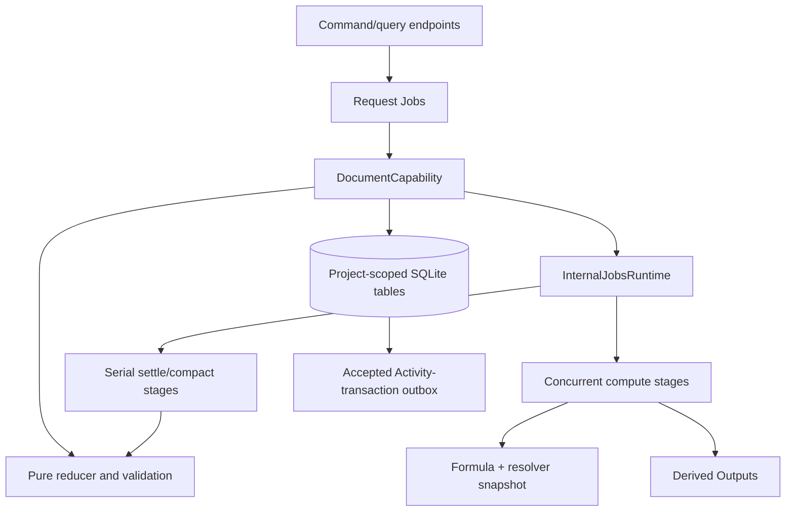
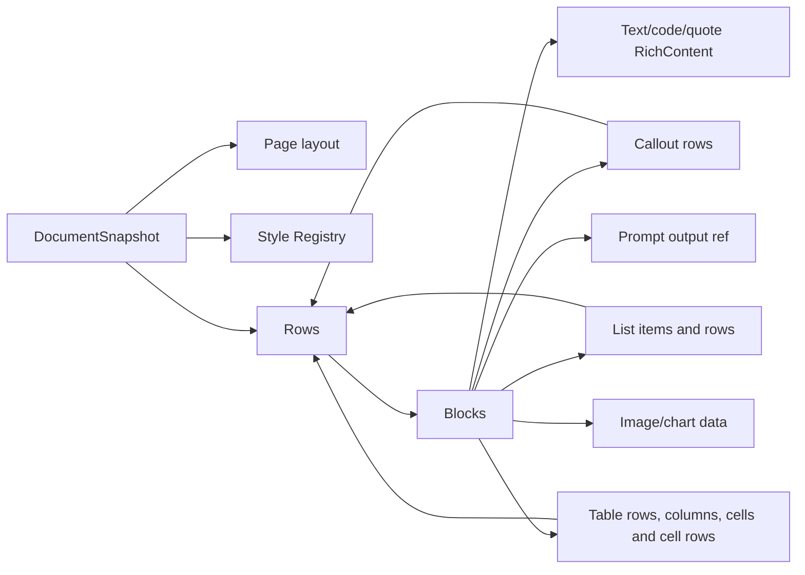

| Prompt Block | Exact reference to one dedicated Derived Output identity and applied revision, plus exactly one context. |
| Context Variable | A named, stable handle a Prompt Block points at instead of a literal context. What makes a Document parameterisable, and therefore templatable. |
| Template mode | A Document `markAsTemplate` has sealed. Its whole public surface is refused, reads included; Templates is the only way in. |# Document concepts

## High-level model

A Document is a project-scoped, revisioned aggregate. Its canonical snapshot
contains page settings, an embedded Style Registry, and a recursively nested
Row/Block tree. Mutations are admitted as typed operations, reduced against a
copy, recursively validated, and atomically appended as a ChangeSet plus a new
head revision.

## Vocabulary

| Term | Current meaning |
| --- | --- |
| Current head | Small live-state record in `documents`: identity, title/lifecycle, revision, latest Base sequence, semantic digest, and timestamps. Its absence means the Document is not current. |
| Resource root | Stable `document_resources` row keyed only by Document ID. It anchors retained Bases, ChangeSets, structural identities, and owned-output references after logical deletion. |
| Head history | `document_history` snapshots of superseded heads plus a terminal deletion revision. |
| Snapshot | Complete canonical representation at one revision. |
| Base | Durable full snapshot at a selected revision (`baseSeq`). |
| ChangeSet | One accepted mutation: forward/inverse operations, touched IDs, revision metadata, digest, origin, and optional compensation link. |
| Row | Ordered horizontal container of Blocks with gap/margin and parallel width tracks. |
| Block | One closed variant: text, code, quote, prompt, divider, callout, list, table, image, or chart. |
| Style Registry | Embedded styles plus one default style ID for every Block kind. |
| Prompt Block | Exact reference to one dedicated Derived Output identity and applied revision. |
| Formula atom | Rich Text atom whose expression is evaluated asynchronously and settled as a Rich Text operation. |
| Attempt | Durable prompt-create, prompt-refresh, or formula-evaluation workflow record. |
| Stage receipt | Idempotency/ownership record for one attempt's compute or settle stage. |
| Identity ledger | Retained per-Document claim for every canonical local identity, including structural tombstones; purge removes it with the resource root. |
| Submission receipt | `(documentId, requestId)` replay record with canonical request digest and result. |
| Create receipt | `requestId` replay record for `document.create`, which has no document id until the service allocates one. Written in the same transaction as the submission receipt, and cascaded away with its document — replaying it after deletion would return a head for something that no longer exists. |
| Prompt ownership | Local mapping from a dedicated output to one Document Block, with pending/attached/detached state. |

## Canonical tree

Every local identity is globally unique inside one snapshot. Nested Rows are
traversed through callouts, list items, and table cells. Derived Output IDs and
media snapshot IDs are external references and are not Document identities.

## Revision lifecycle

Creation writes current head revision 1 and Base 1. Every accepted mutation
archives the previous head in `document_history`, advances the current head by
exactly one, and writes a ChangeSet whose `seq === revision` and
`priorRevision + 1 === revision`. A historical read reconstructs from the
newest Base at or before the target and applies the contiguous forward tail.

Lifecycle (`active | archived`) is live canonical metadata. Logical
`document.delete` archives the last current head, appends a terminal deletion
revision, and removes the `documents` row. Normal list and unqualified load
therefore cannot return a deleted Document. The stable resource root, Bases,
ChangeSets, structural identity ledger, head history, and retained Derived
Output references remain for revision-qualified reads and later purge.

`document.purge` is the separate irreversible operation. It is allowed only
after logical deletion and removes owned Derived Output history before deleting
the resource root and all Document history attached to it.

## Styling concepts

Style resolution follows the embedded `basedOnStyleId` chain. Rendering then
overlays:

1. the default Style for the Block kind;
2. the Block's selected Style if different;
3. the Block's local presentation override;
4. for text-bearing Blocks, Rich Text inline marks supplement the authoritative
   full-range Document overlay while link marks preserve their targets.

Exactly one Style must carry each heading role 1–6. The outline projection uses
those roles and only text Blocks.

## Prompt and Formula boundaries

A caller cannot insert a live Prompt Block or directly adopt a Derived Output
through generic submit. Prompt creation declares a new dedicated output,
refreshes it, then serially inserts the exact reference. Definition update
resolves the Block's current output and calls Derived Outputs directly,
keyed by an idempotency key derived from `(documentId, requestId)` so a retry
after a local crash replays the already-committed result rather than
reapplying it; it does not revise the Document. Prompt refresh publishes a
new Derived revision and serially adopts it.

Formula expressions live in Rich Text. The Document workflow freezes an
expression/digest, computes through Formula using a Structured Data resolver
snapshot, then settles only if the atom remains the same and was not touched by
intervening changes.

## Boundaries and non-authoritative projections

Plain text, outline, dependency lists, and resolved styling are rebuildable
projections. They perform no I/O and are not stored as canonical state.
Activity source transactions describe accepted commits. An optional publisher port
delivers a committed row after the Document transaction completes; failures
leave that row unpublished for startup recovery. The publisher maps into
Activity outside this capability, passing `sourceTransactionId` as Activity's
idempotency key; Document neither selects nor stores the Activity ledger ID.
Document therefore does not depend on Activity's runtime or storage. Exact
pagination/render layout is also intentionally absent; page layout only
establishes authored dimensions and usable-width validation.

## Context Variables and template mode

A **Context Variable** is `{ id, name, target? }` on the snapshot. Prompt Blocks
reference `id`; users and template bindings work in `name`. That split is what
makes a rename cosmetic — renaming cannot break a Block — and what lets a copy
preserve both.

A Prompt Block carries **exactly one** `PromptContext`: either a `direct` target
or a `variable` reference. One rather than a list because a list can only union,
and there is no way to say "these sources except those" in an array of entries.
A Context can say it, so pointing at one Context inherits every composition
Context can express. The caller composes first and points second.

Resolution has no algorithm: `direct` yields its target, `variable` yields the
variable's. An **unbound** variable refuses to resolve rather than yielding
nothing — yielding `[]` would hand Knowledge the zero-length array it reads as
whole-project retrieval, so a half-configured prompt would silently ground itself
on everything.

Unbound variables exist only on **template-mode** Documents, where declaring a
parameter with no default is the point. Templates requires instantiation to bind
every declared parameter, so an ordinary Document cannot hold one.

An **empty** resolution is a different thing and is perfectly legal: a Block may
point at a Context that currently contains nothing. That is a choice someone
made. What is refused is a variable with *no target at all*, which is nobody
having chosen yet.

**Deleting a bound variable cascades.** Each referencing Block is re-pointed at
the variable's current target, so the grounding is identical and only the
indirection is gone. Refusing instead would have pushed the caller into doing
exactly this by hand, one `prompt.set-context` at a time.

**Template mode is one-way and sealing is total.** `markAsTemplate` sets
`isTemplate` on the head; nothing clears it. Every public command *and* query
naming a sealed Document is refused with `DocumentTemplateModeError`, and
`document.list` excludes it. The check is written **once, on the document**, not
enumerated per command — so a command added later is sealed by default rather
than by someone remembering.

Templates reaches past that seal because it holds Document's runtime object and
calls `duplicate` / `applyBindings` / `submit` / `load` directly. Those are the
internal path, which is what "sealed to the public surface" means.
