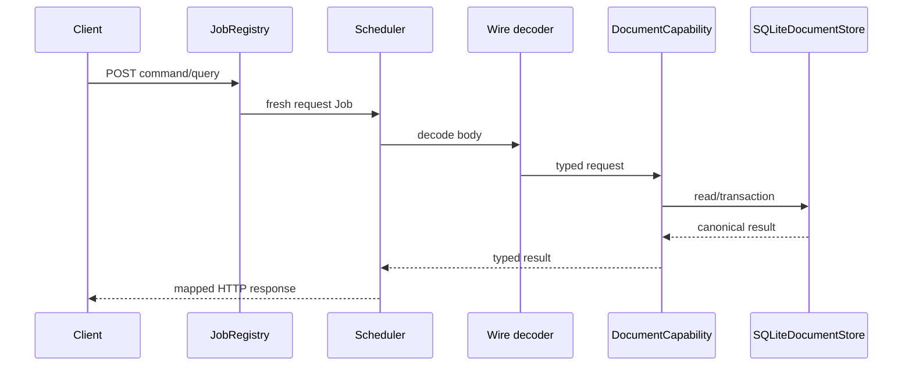
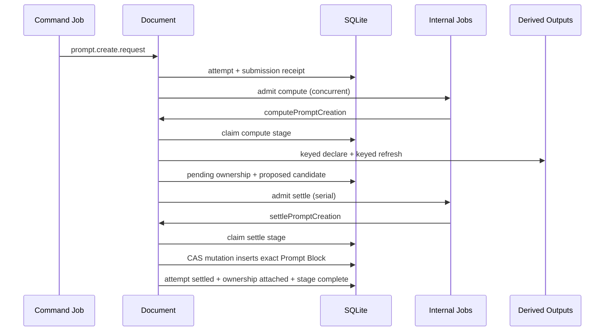
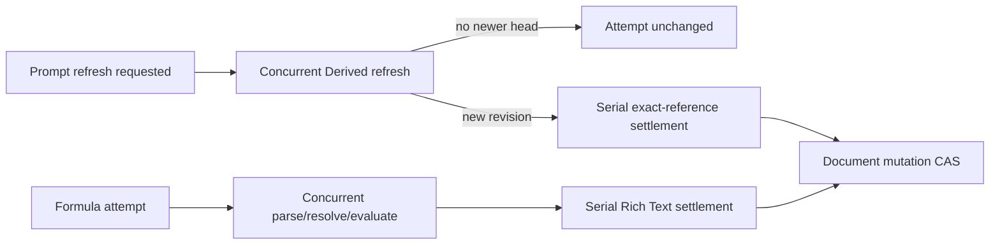

# Document endpoints, jobs, and flows

## Public endpoint map

| Endpoint | Job | Queue/mode | Decoder | Runtime call | Success status |
| --- | --- | --- | --- | --- | --- |
| `POST /documents/command` | `documents.command.v1` | serial / inline | `decodeDocumentCommand` | `document.command` | 201 create; 202 `*-requested`; otherwise 200 |
| `POST /documents/query` | `documents.query.v1` | concurrent / inline | `decodeDocumentQuery` | `document.query` | 200 |

Both handlers catch typed errors and return the mapping described in
[Types](types.md). Only unexpected 500s are explicitly logged by endpoint
wiring; scheduler/transport logging covers request and queue timing.

## Command call chains

| Command | Service chain | Durable outcome |
| --- | --- | --- |
| `document.create` | `command → create → createBlankSnapshot → validateSnapshot → commitCreation` | Head/Base/identity ledger/receipt/outbox at revision 0 |
| `document.submit` | `command → submit → mutate → applyOperations → commitMutation` | CAS head + ChangeSet + transitions + receipt/outbox; Formula attempts when discovered |
| `document.compensate` | `command → compensate → retained target/tail + canRebase → mutate(inverse)` | New compensating ChangeSet; exact same-kind identity reactivation allowed |
| `prompt.create.request` | `command → requestPromptCreation → dry-run placement → createAttemptWithSubmission → dispatch compute` | Requested attempt + replay receipt before external work |
| `prompt.update-definition` | `command → updatePromptDefinition → claimDelegatedCommand → Derived.updateDefinition → completeDelegatedCommand` | Frozen target claim then result receipt; no Document revision |
| `prompt.refresh.request` | `command → requestPromptRefresh → createAttemptWithSubmission → dispatch compute` | Frozen output/applied-revision attempt + receipt |
| `formula.evaluate.request` | `command → requestFormulaEvaluation → createAttemptWithSubmission → dispatch compute` | Frozen atom/expression attempt + receipt |

An accepted generic mutation may create Formula attempts automatically for new
or changed Formula atoms, so Formula compute can be dispatched even when the
client sent `document.submit` rather than an explicit Formula request.

## Query call chains

- List delegates to `store.listHeads` with optional lifecycle and cursor.
- Load calls `loadSnapshot`, which replays a contiguous Base/ChangeSet tail,
  validates it, then fetches each exact prompt output revision.
- History checks the Document exists and delegates to paged ChangeSets.
- Attempt fetches one attempt by `(documentId, attemptId)`.

## Internal job map

| Intent | Job name | Queue | Runtime method |
| --- | --- | --- | --- |
| `document.compact` | `documents.compact` | serial | `compact(documentId)` |
| `document.prompt.create.compute` | `documents.prompt.create.compute` | concurrent | `computePromptCreation(attemptId)` |
| `document.prompt.create.settle` | `documents.prompt.create.settle` | serial | `settlePromptCreation(attemptId)` |
| `document.prompt.refresh.compute` | `documents.prompt.refresh.compute` | concurrent | `computePromptRefresh(attemptId)` |
| `document.prompt.refresh.settle` | `documents.prompt.refresh.settle` | serial | `settlePromptRefresh(attemptId)` |
| `document.formula.evaluate.compute` | `documents.formula.evaluate.compute` | concurrent | `computeFormulaEvaluation(attemptId)` |
| `document.formula.evaluate.settle` | `documents.formula.evaluate.settle` | serial | `settleFormulaEvaluation(attemptId)` |

Internal dispatch returns after scheduler admission. Durable attempts and stage
receipts—not the in-memory queue—are the recovery authority.

## Prompt creation

If initial refresh produces no revision, ownership is detached and the attempt
fails. If insertion conflicts at settlement, it becomes stale and ownership is
detached.

## Prompt refresh and Formula evaluation

Prompt settlement verifies output identity and applied revision. Formula
settlement verifies expression digest and intervening touched IDs. A changed
target becomes stale rather than overwriting newer authored state.

## Compaction and recovery

Once `head.revision - head.baseSeq` reaches configured retained ChangeSets,
mutation dispatches serial compaction. Compaction writes a cutoff Base and
current Base only if the head is unchanged, then prunes according to retention.

At startup, running stage receipts are marked failed and recoverable attempts
are redispatched. Proposed attempts go to settle; requested/computing attempts
go to compute. A failed queue-capacity admission is also retried in process with
bounded exponential delay. There is no durable queue record; redispatch is safe
because attempts, submission receipts, external idempotency keys, and stage
receipts fence duplicate effects.

## Outbox and cleanup flows not wired

The store can list and mark accepted facts and list detached prompt outputs,
but this capability does not register an Activity publisher or detached-output
garbage-collection job. Those methods are maintenance seams, not active flows.
