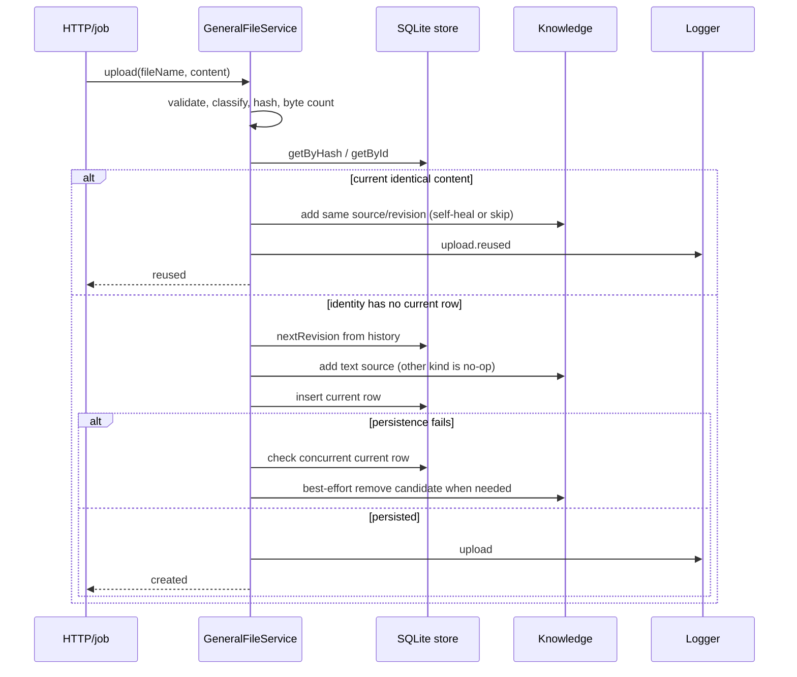
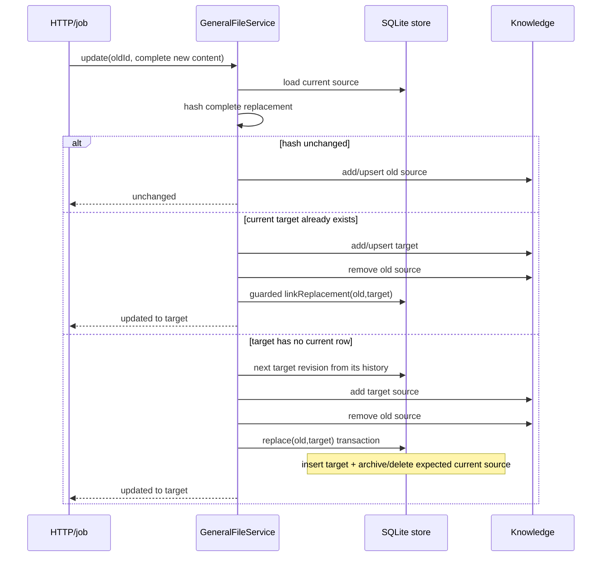

# General Files endpoint and job flows

## Exhaustive endpoint table

All mappings are in [`registerGeneralFileEndpointMappings.ts`](../../../4-job-wiring/general-files/registerGeneralFileEndpointMappings.ts), create inline jobs, and return JSON domain/result shapes directly.

| Method/path | Job | Queue | Body normalization | Service call | Success | Error mapping |
|---|---|---|---|---|---|---|
| `POST /general-files/upload` | `general-files.upload` | serial | Body cast to upload request; service validates filename/content | `upload(body)` | 200 result union | not found 404; encoding 400; other 500 |
| `POST /general-files/update` | `general-files.update` | serial | Destructure `id`, `content`; pass `{content}` | `update(id,{content})` | 200 result union | same mapping |
| `POST /general-files/get` | `general-files.get` | concurrent | Destructure `id` | `get(id)` | 200 full file | same mapping |
| `POST /general-files/list` | `general-files.list` | concurrent | Destructure optional `filters`; no runtime schema validation | `list(filters)` | 200 metadata array | same mapping |
| `POST /general-files/delete` | `general-files.delete` | serial | Destructure `id` | `delete(id)` | 200 `{status:"deleted", id}` | same mapping |
| `POST /general-files/purge` | `general-files.purge` | serial | Destructure `id` | `purge(id)` | 204 null | current → 409 `not_deleted`; no terminal history → 404 |

There are no deferred or internal staged General Files jobs. The shared
retention scheduler invokes its maintenance hooks; General Files owns no
scheduler itself.

## Upload sequence

Knowledge admission deliberately precedes current-row insertion. A failed
Knowledge call leaves no current General File. A later persistence failure
triggers compensation, but compensation can itself fail and is then logged.

## Wholesale replacement sequence

If a step after a Knowledge mutation fails, the service performs a state-aware inverse operation. This narrows inconsistency but does not create atomic commit across databases.

## Delete sequence

1. Load the current row by ID or return not found.
2. Await `Knowledge.remove` when a source ID exists.
3. In one SQLite transaction, archive current snapshot `N`, append terminal
   deletion revision `N + 1`, and remove the current row.
4. If SQLite throws, re-add Knowledge only if the same row/revision remains
   current.
5. Log success and return the endpoint's deletion status object.

Purge is a separate physical-history operation: reject a current row, require
terminal deletion history, then remove all retained snapshots. Shared retention
uses the same outcome rules after its cutoff. Neither purge path touches
Knowledge because logical deletion already removed the source.

## List and resource-read flows

`list` starts from the current table, adds one parameterized clause per filter,
combines them with `AND`, orders by `created_at DESC`, and strips `content` in
the mapper.

Derived Output reads do not call the HTTP get endpoint. The runtime resource
registry checks a descriptor in the frozen Knowledge manifest, loads the
current file through `service.get`, requires descriptor revision equality when
provided, then slices requested lines from the in-memory string.
