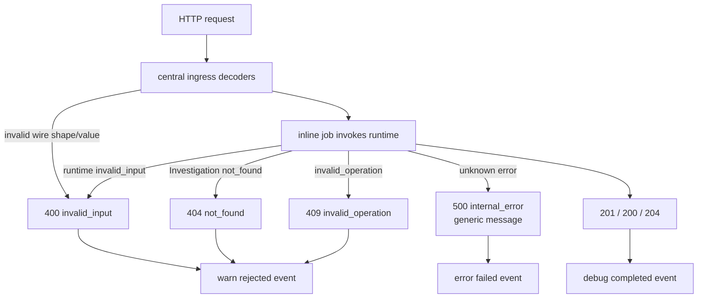
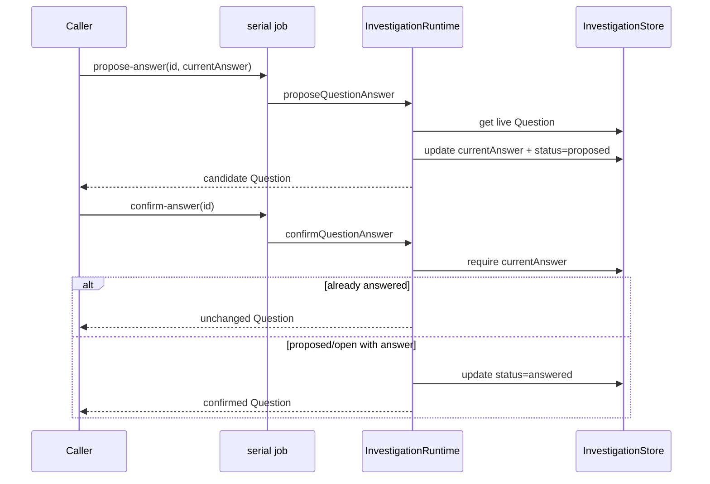
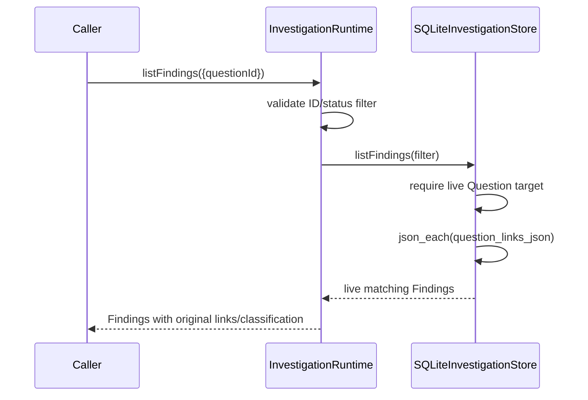
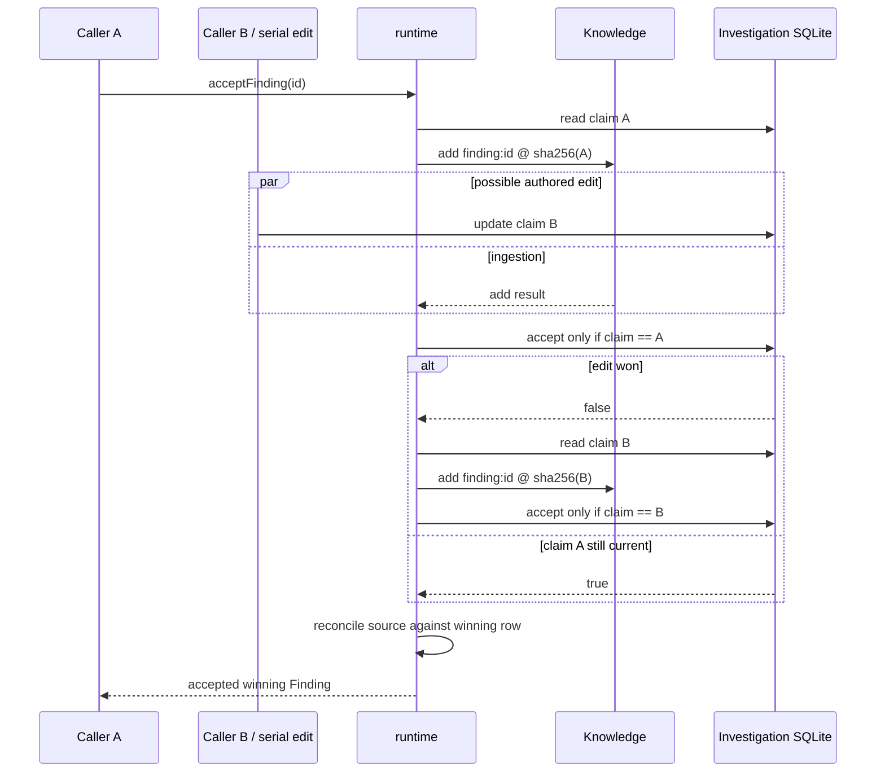
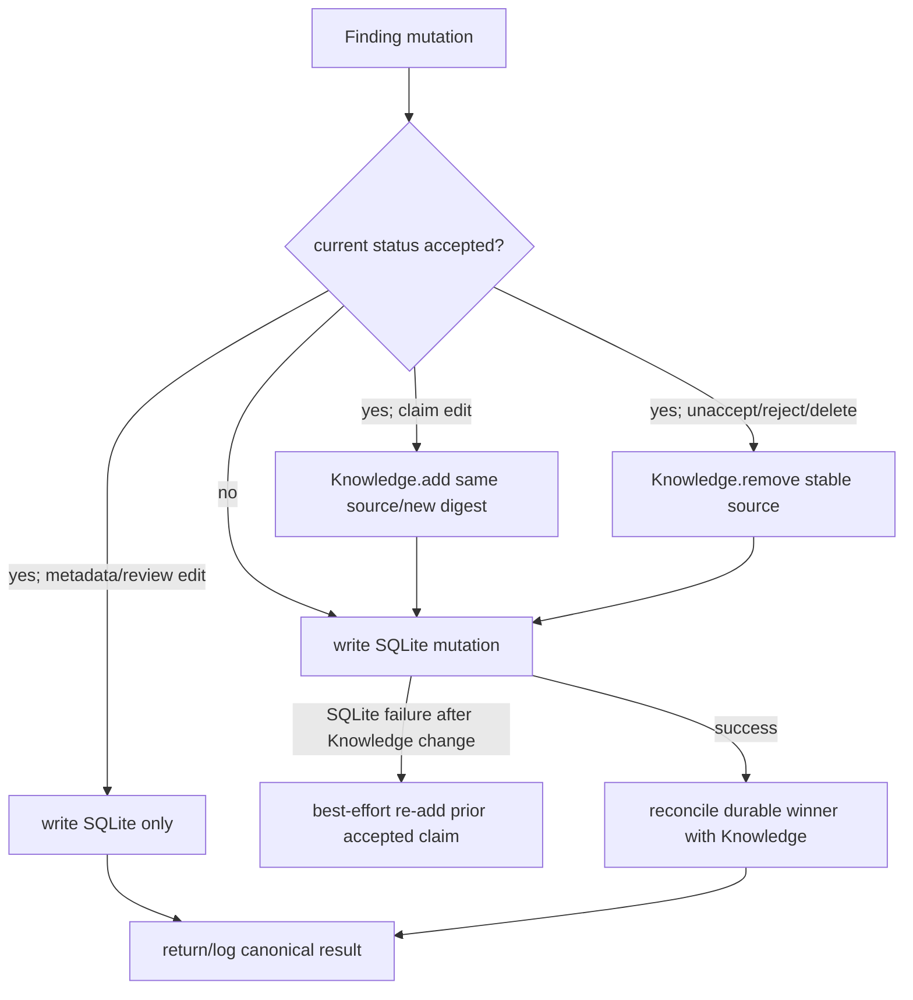
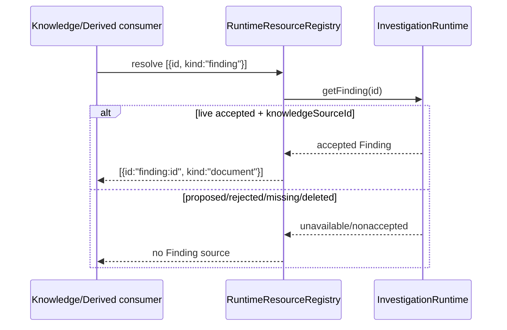

# Investigation endpoint and internal flows

## HTTP/job boundary

[`registerInvestigationEndpoints`](../../../4-job-wiring/investigation/registerInvestigationEndpoints.ts)
registers all 26 resource-oriented routes in one function. Every job responds
inline. IDs stay in JSON bodies for POST mutations and query strings for
GET/DELETE because the transport does not use path parameters.

The adapter centrally decodes raw objects, strings, arrays, enums, safe
integers, Finding references, and links before invoking the runtime. The
runtime performs domain validation again for non-HTTP callers.

### Question endpoints

| Method/path | Queue | Input | Runtime call | Success |
|---|---|---|---|---|
| `POST /questions/create` | serial | body `text`; optional `context`, `assumptions`, `tags` | `createQuestion` | 201 Question |
| `POST /questions/update` | serial | body `id`; optional `text`, nullable `context`, `assumptions`, `tags` | `updateQuestion` | 200 Question |
| `POST /questions/propose-answer` | serial | body `id`, `currentAnswer` | `proposeQuestionAnswer` | 200 Question |
| `POST /questions/confirm-answer` | serial | body `id` | `confirmQuestionAnswer` | 200 Question |
| `POST /questions/clear-answer` | serial | body `id` | `clearQuestionAnswer` | 200 Question |
| `GET /questions/get?id=` | concurrent | required query `id` | `getQuestion` | 200 Question or explicit 404 |
| `GET /questions/list?status=&tag=` | concurrent | optional exact status/tag | `listQuestions` | 200 `{records}` |
| `DELETE /questions/delete?id=` | serial | required query `id` | `deleteQuestion` | 204 `null` |
| `POST /questions/purge` | serial | body `id` | `purgeQuestion` | 204 `null` |

### Hypothesis endpoints

| Method/path | Queue | Input | Runtime call | Success |
|---|---|---|---|---|
| `POST /hypotheses/create` | serial | body `statement`; optional `questionIds`, `rationale`, `assumptions`, `confidenceLevel` | `createHypothesis` | 201 Hypothesis |
| `POST /hypotheses/update` | serial | body `id`; optional Question IDs, statement, nullable rationale, assumptions, status, nullable confidence | `updateHypothesis` | 200 Hypothesis |
| `GET /hypotheses/get?id=` | concurrent | required query `id` | `getHypothesis` | 200 Hypothesis or explicit 404 |
| `GET /hypotheses/list?questionId=&status=` | concurrent | optional live Question/status filters | `listHypotheses` | 200 `{records}` |
| `DELETE /hypotheses/delete?id=` | serial | required query `id` | `deleteHypothesis` | 204 `null` |
| `POST /hypotheses/purge` | serial | body `id` | `purgeHypothesis` | 204 `null` |

### Finding endpoints

| Method/path | Queue | Input | Runtime call | Success |
|---|---|---|---|---|
| `POST /findings/propose` | concurrent | body `claim`, `references`; optional commentary/tags/links | `proposeFinding` | 201 Finding |
| `POST /findings/update` | serial | body `id`; optional claim/references/nullable commentary/tags/links | `updateFinding` | 200 Finding |
| `POST /findings/accept` | concurrent | body `id` | `acceptFinding` | 200 accepted Finding |
| `POST /findings/unaccept` | serial | body `id` | `unacceptFinding` | 200 proposed Finding or 409 for rejected |
| `POST /findings/reject` | serial | body `id` | `rejectFinding` | 200 rejected Finding |
| `POST /findings/mark-reference-review` | serial | body `id`, safe integer `referenceIndex` | `markFindingReferenceForReview` | 200 Finding |
| `POST /findings/clear-reference-review` | serial | body `id`, safe integer `referenceIndex` | `clearFindingReferenceReview` | 200 Finding |
| `GET /findings/get?id=` | concurrent | required query `id` | `getFinding` | 200 Finding or explicit 404 |
| `GET /findings/list?status=&questionId=&hypothesisId=` | concurrent | optional status/live target filters | `listFindings` | 200 `{records}` |
| `DELETE /findings/delete?id=` | serial | required query `id` | `deleteFinding` | 204 `null` |
| `POST /findings/purge` | serial | body `id` | `purgeFinding` | 204 `null` |

There are no `/questions/runtime` or `/hypotheses/runtime` endpoints. Related
data is obtained through filtered list routes or through the one in-process
runtime.

## Error and telemetry flow

The endpoint wrapper records `requestId`, status code, duration, and error name
without request content. Domain error messages are returned for typed 4xx
responses. Unknown errors return `Investigation request failed` rather than the
underlying exception message. Direct GET misses construct an explicit 404
instead of throwing.

## Question answer flow

`clear-answer` removes the value and returns status to `open`. Proposing a new
answer on an answered Question replaces the value and returns it to
`proposed`. No immutable revision is created.

## Relationship write and reverse-read flow

Links are written only on their owner:

1. `createHypothesis`/`updateHypothesis` stores deduplicated `questionIds`.
2. `proposeFinding`/`updateFinding` stores deduplicated `questionLinks` and
   `hypothesisLinks`, with optional four-value relationship classification.
3. No target record receives a reverse array.
4. A list request names the target ID and derives the reverse view from owner
   JSON.

The Hypothesis reverse path uses the same pattern with `question_ids_json`;
Finding-to-Hypothesis uses `hypothesis_links_json`. Missing/deleted target rows
return an empty list. Deleted owner rows are also excluded. Link IDs may remain
after a target deletion, and recreating a different record is not part of the
flow because IDs are generated identities.

## Finding proposal and review flow

Proposal performs no Knowledge operation:

1. decode and validate a nonblank claim;
2. validate at least one resource or URL reference;
3. normalize tags and link arrays;
4. insert a `proposed` Finding; and
5. log counts and derived `needsReview` without logging content.

Review operations address the current reference by zero-based index. Marking
sets `needsReview: true`; clearing removes the property. The runtime updates
actor/time, stores the whole canonical Finding, and returns it. If the Finding
is accepted, this metadata-only operation deliberately does not call Knowledge;
the indexed claim and digest are unchanged. Nonaccepted review writes still
run the general reconciliation path so they remain safe beside a concurrent
acceptance. The overall answer is always recomputed by `findingNeedsReview`;
no aggregate stale row is written.

## Concurrent Finding acceptance flow

Concurrent callers share the same source ID. Once the same claim revision is
present, Knowledge returns a skipped add rather than creating a second source
or re-embedding. Conditional acceptance plus reconciliation provides
convergence, not a claim that only one Knowledge call occurs.

If the Finding disappears during acceptance, the runtime attempts to remove
the stable source and returns not found. Cleanup failure is logged separately.

## Accepted Finding update/status flow

Accepted metadata/review edits use the direct SQLite-only branch and do not
call Knowledge. Explicit repeated `acceptFinding` still calls `Knowledge.add`;
the same digest normally makes that call revision-skipped. Unaccept clears
`knowledgeSourceId` and sets proposed. Reject clears the ID and sets rejected.
Logical delete removes the current row after retaining its final and terminal revisions.

## Context and scoped resource flow

An accepted Finding can be placed in Context as `{id, kind: "finding"}`. The
shared resource registry resolves it into its stable Knowledge source. It also
supports source description and a scoped line read of the claim.

For `describeSource` and `read`, the registry accepts only a `finding:` source
whose current record is live, accepted, and still names exactly that source.
A read additionally requires a matching descriptor in the caller's frozen
scope manifest. This prevents proposed/rejected/deleted Findings from being
exposed merely because a caller knows an ID.

## Logical deletion, purge, and retention flow

Question and Hypothesis deletion requires the current record and performs one
current-to-history transaction. It does not cascade:

- a deleted Question disappears from Question reads and causes Question-based
  reverse filters to return `[]`;
- Hypothesis `questionIds` and Finding `questionLinks` are not rewritten; and
- a deleted Hypothesis disappears from its reads and causes
  Hypothesis-filtered Finding queries to return `[]`.

Finding deletion first removes its source when accepted, archives the final
snapshot and terminal revision, removes the current row, then reconciles source
absence. All ordinary get/list and resource-registry paths treat it as absent.
There is no deleted status or public history-loading operation.

Each resource-specific purge requires no current row and a terminal deletion
record, then irreversibly removes that resource's shared-history rows. Live
resources return `409 not_deleted`; missing history returns 404. The backend
retention sweep prunes old superseded revisions for current records and invokes
purge for terminal deletions older than the configured cutoff.

## Startup registration flow

After constructing the runtime, startup:

- records `investigationReady` in the backend startup log;
- calls `resourceRegistry.registerInvestigation(investigation)` once; and
- calls `registerInvestigationEndpoints(registry, investigation, logger)` once.

Endpoint registration emits one manifest log containing the 26 method/path
pairs. No separate Question/Hypothesis/Finding startup factories, databases,
registrars, or readiness flags exist.
