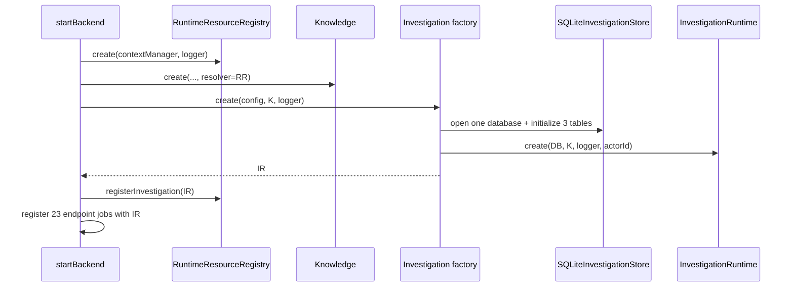

# Investigation runtime

## Construction and composition

[`createInvestigationRuntimeInstance`](../../../1-init/create/investigation.ts)
constructs a project-prefixed `SQLiteInvestigationStore` at
`./data/investigation.db`, then calls
[`createInvestigationRuntime`](../application/investigationRuntime.ts) with the
store, shared Knowledge instance, shared Logger, and `config.userId` as the
actor.

The relevant order in [`startBackend`](../../../1-init/startBackend.ts) is:

1. create Context and an initially unpopulated runtime resource registry;
2. inject that registry into Knowledge;
3. create the one Investigation runtime using that Knowledge instance;
4. register Investigation with the resource registry;
5. construct the remaining resource capabilities and consumers; and
6. register all Investigation endpoints with the same runtime.

This resolves the composition cycle without a service locator. Registration
makes the runtime available to the registry, but resource visibility remains
accepted-only: every Finding resolution/description/read rechecks status and
stable Knowledge source identity.



## Public runtime surface

The full interface is declared in [`domain/model.ts`](../domain/model.ts). It
is intentionally flat: consumers hold one object and use entity-prefixed
methods.

### Question methods

| Method | Behavior |
|---|---|
| `createQuestion(request)` | Validates a nonblank trimmed `text`, optional Context/assumptions, normalized tags; creates `open` with actor/timestamps |
| `updateQuestion(id, request)` | Last-write replacement of supplied fields; `context: null` clears; does not alter answer/status |
| `proposeQuestionAnswer(id, answer)` | Requires a nonblank trimmed answer, stores it as `currentAnswer`, sets `proposed` |
| `confirmQuestionAnswer(id)` | Requires an existing nonblank answer, sets `answered`; already answered returns unchanged |
| `clearQuestionAnswer(id)` | Removes `currentAnswer` and sets `open` |
| `getQuestion(id)` | Returns the live canonical Question or `null` |
| `listQuestions(filter?)` | Filters by exact status and/or exact tag; returns live rows newest-first |
| `deleteQuestion(id)` | Requires current state, archives it plus a terminal revision, then removes current state |
| `purgeQuestion(id)` | Requires terminal deletion history and no current row; removes retained history |

Question mutation methods log IDs, actor, status transition/count metadata,
and durations. They never log Question text, Context, answer, or assumption
content.

### Hypothesis methods

| Method | Behavior |
|---|---|
| `createHypothesis(request)` | Requires a nonblank trimmed statement; deduplicates Question IDs; creates `proposed` with optional rationale/confidence |
| `updateHypothesis(id, request)` | Replaces supplied content/IDs/status/confidence; `null` clears rationale/confidence; no evidence gate |
| `getHypothesis(id)` | Returns the live canonical Hypothesis or `null` |
| `listHypotheses(filter?)` | Filters by status and/or related live Question ID |
| `deleteHypothesis(id)` | Archives the final current snapshot and terminal revision, then removes current state |
| `purgeHypothesis(id)` | Requires terminal deletion history and no current row; removes retained history |

The runtime permits zero Question IDs and all supported direct status changes.
It does not load/assemble related Questions or Findings into the returned
object. Callers traverse those records with `getQuestion` and `listFindings`.

### Finding methods

| Method | Behavior |
|---|---|
| `proposeFinding(request)` | Requires a nonblank claim and at least one valid reference; normalizes tags/links; creates `proposed` |
| `updateFinding(id, request)` | Replaces supplied claim/references/commentary/tags/links; clears commentary with `null`; refreshes Knowledge only when an accepted claim changes |
| `acceptFinding(id)` | Concurrent-safe admission to Knowledge followed by claim-matching conditional acceptance and reconciliation |
| `unacceptFinding(id)` | Accepted becomes proposed and leaves Knowledge; proposed remains proposed; rejected raises `invalid_operation` |
| `rejectFinding(id)` | Moves any live Finding to rejected; removes Knowledge first if accepted |
| `markFindingReferenceForReview(id, index)` | Sets `needsReview: true` on one current zero-based reference index |
| `clearFindingReferenceReview(id, index)` | Removes `needsReview` from one current zero-based reference index |
| `getFinding(id)` | Returns the live canonical Finding or `null` |
| `listFindings(filter?)` | Filters by status, related live Question, and/or related live Hypothesis |
| `deleteFinding(id)` | Removes accepted Knowledge source, then archives and removes current state |
| `purgeFinding(id)` | Requires terminal deletion history and no current row; removes retained history |

Mark/clear validates that `referenceIndex` is a nonnegative safe integer within
the current array. Review operations do not change Finding status or claim.

## Store runtime

[`SQLiteInvestigationStore`](../persistence/sqliteInvestigationStore.ts)
implements the one synchronous
[`InvestigationStore`](../ports/investigationStore.ts). Runtime methods form
canonical domain objects and pass them to entity-specific insert/update
methods. The concrete store maps JSON arrays and nullable fields to/from SQL.

Ordinary reads query only current tables. Every update archives the previous
current revision. Logical deletion archives the final snapshot, appends the
next terminal revision, and removes the current row in one SQLite transaction.
There is no include-deleted runtime operation. The shared history table serves
all three resource kinds.

`pruneHistory(cutoff)` removes expired superseded history for current records.
`purgeExpired(cutoff)` physically purges deleted resources whose terminal
record predates the cutoff. The backend scheduler invokes both through the
capability retention port.

Reverse list behavior is implemented in SQL:

- `listHypotheses({questionId})` first requires a live matching Question, then
  checks `question_ids_json`;
- `listFindings({questionId})` first requires a live matching Question, then
  checks `question_links_json`; and
- `listFindings({hypothesisId})` first requires a live matching Hypothesis,
  then checks `hypothesis_links_json`.

This makes deleted/unavailable targets return `[]` without cascades or reverse
state. When both Finding target filters are supplied, both must match.

`acceptFindingIfClaimMatches` is the one specialized atomic store primitive.
It updates a live row to accepted and records `knowledge_source_id` only where
`id` and `claim` still match; its Boolean result says whether one row won the
comparison.

## Validation and normalization

The HTTP adapter validates raw request shapes, but the runtime validates again
for direct in-process callers. Helpers in
[`investigationRuntime.ts`](../application/investigationRuntime.ts) cover:

| Helper group | Responsibility |
|---|---|
| Required/optional text | Nonblank IDs/claims/statements/answers; optional and nullable text semantics |
| Lists | String-array checks; tag and ID trimming/deduplication where applicable |
| Enum guards | Exact Question/Hypothesis/Finding statuses, categorical confidence, four relationships |
| Time/identity | Parseable normalized ISO timestamps; nonblank generated IDs |
| Spans | Safe character or line ranges and supported discriminants |
| References | Resource/URL discriminants, HTTP(S), observation time, revisions, notes/review flags |
| Links | Nonblank target IDs, optional exact relationship, one entry per target ID |
| Lookup helpers | Consistent typed not-found errors for required live records |

Known revisioned resource kinds require an owner revision. This is a compact
set/prefix check in the runtime, not a resource registry or generic Source
model. The runtime does not verify that referenced resources or relationship
targets currently exist.

## Finding acceptance and Knowledge reconciliation

Acceptance bridges SQLite and Knowledge without inventing a Finding revision
entity or global lock.

```mermaid
sequenceDiagram
  participant C as concurrent caller
  participant IR as InvestigationRuntime
  participant S as InvestigationStore
  participant K as Knowledge
  C->>IR: acceptFinding(id)
  loop until the same claim wins
    IR->>S: get live Finding
    IR->>IR: source=finding:id; revision=sha256(claim)
    IR->>K: add(source, revision, claim)
    K-->>IR: ingested or revision-skipped
    IR->>S: acceptFindingIfClaimMatches(id, claim, source)
    alt claim changed or row deleted
      S-->>IR: false
    else conditional update won
      S-->>IR: true
      IR->>IR: reconcile durable state and Knowledge
    end
  end
  IR-->>C: accepted canonical Finding
```

The stable source ID prevents duplicate logical sources. The claim digest is
the Knowledge revision, so a later or repeated call with unchanged text can be
skipped by Knowledge. The conditional SQL update prevents a caller from
marking claim A accepted after a serial edit has changed the durable claim to
B. The retry comment is kept beside this conditional operation in code.

After operations that can change the claim or acceptance state,
`reconcileFindingKnowledge` repeatedly compares the live durable row with the
stable source:

- no live row means remove the source and finish once absence remains stable;
- accepted without its expected source ID conditionally records that ID;
- accepted with the expected ID re-adds the current claim, then verifies the
  row did not change during ingestion; and
- proposed/rejected removes the source, then verifies the row remained
  nonaccepted with the same claim.

This loop makes completed in-process operations converge despite overlapping
acceptance and serial mutations. Update/reject/unaccept/delete also attempt
simple compensation when a following SQLite write throws after a Knowledge
change.

Knowledge and Investigation SQLite do not share a transaction. A process crash
between their steps is not made durable by a transaction log or startup
reconciler. A later lifecycle operation reconciles the source, but the current
capability does not promise automatic repair after an otherwise idle crash.

## Accepted Finding edits

When an accepted claim changes, `updateFinding` adds the new claim under the
same source and new digest before writing the row. If the row write throws, it
re-adds the prior claim. After the write, general reconciliation verifies the
winner.

An accepted metadata-only edit does not call Knowledge because its source ID,
claim text, and digest cannot change. Review-flag changes follow that same
direct SQLite path. This avoids unnecessary Knowledge mutation/retrieval
invalidation while leaving the indexed claim untouched. Nonaccepted edits
still reconcile because they may overlap concurrent acceptance.

Unaccept/reject/delete remove Knowledge before their SQLite mutation and
re-add the previous accepted claim if the SQLite mutation throws. Finding
deletion then runs reconciliation once more to ensure the stable source is
absent.

## Resource runtime integration

[`ResourceRegistry`](../../../1-init/create/resource-reader.ts) accepts the
single runtime through `registerInvestigation`. Its Finding paths are:

| Registry method | Accepted-Finding behavior |
|---|---|
| `resolve(ContextEntry[])` | `{id, kind:"finding"}` or `finding:{id}` resolves to `knowledgeSourceId` only when live/accepted |
| `describeSource(sourceId)` | `finding:{id}` becomes `{sourceId, resourceId:id, resourceKind:"finding"}` only when still accepted |
| `read(...)` | Returns a scoped inclusive line slice of the current accepted claim and byte size |

The read path first requires the descriptor in the supplied frozen scope and
then rechecks Finding ID/status/source. Proposed, rejected, missing, or deleted
Findings fail closed. Finding descriptors currently expose no public
`resourceRevision`; Knowledge's source revision remains the internal claim
digest.

## Queue and direct-call concurrency

Queue type belongs to HTTP job wiring, not to the runtime object itself:

- reads/lists, Finding proposal, and Finding acceptance use the concurrent
  queue;
- authored Question/Hypothesis mutations and Finding edit/review/unaccept/
  reject/delete use the serial queue.

The serial queue provides deterministic last-write order for HTTP mutations.
The runtime does not add a general lock or revision/CAS protocol for direct
in-process authored callers, so such callers must preserve the same ordering
expectation. Finding acceptance is the explicit exception with its own narrow
claim comparison and reconciliation.

## Logging and redaction

The runtime and endpoint adapter use the injected Logger; Investigation code
does not call `console`.

Runtime event families include:

- `investigation.runtime.created`;
- `investigation.questions.*` for create/update/answer/read/list/delete;
- `investigation.hypotheses.*` for create/update/read/list/delete; and
- `investigation.findings.*` for proposal/update/status/review/read/list/delete
  plus Knowledge add and cleanup failures.

Mutation logs include record/actor IDs, prior/current status where relevant,
reference/link/assumption/tag counts, categorical confidence, review summary,
Knowledge skip/window counts, retry attempts, and duration. Read/list logs
include IDs/filter presence, found/count metadata. They omit Question text,
Context, answers, Hypothesis statement/rationale, Finding claim, assumptions,
reference notes, locators, and URLs.

The endpoint wrapper adds request ID, HTTP status, duration, and error class.
Rejected 4xx operations use `warn`; unexpected 5xx failures use `error` and a
generic response body. A Knowledge cleanup failure additionally records the
underlying error name/message because it is an operational reconciliation
failure, not user content by design.
