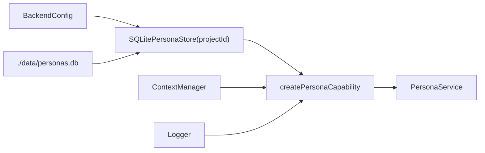

# Persona runtime

## Construction

[`createPersonaInstance`](../../../1-init/create/persona.ts) opens `./data/personas.db`,
binds the configured `projectId` into `SQLitePersonaStore`, and passes the
already-constructed `ContextManager` through as `dependencies.context`.



Persona is constructed immediately after `contextManager` in
[`startBackend.ts`](../../../1-init/startBackend.ts) — Context is its only dependency, so
nothing else needs to exist first. There is no recovery step, no scheduler involvement,
and no background work.

```ts
interface PersonaDependencies {
  readonly context: PersonaContextPort;
  readonly logger: Logger;
  readonly limits?: PersonaLimits;   // defaults to DEFAULT_PERSONA_LIMITS
  readonly clock?: PersonaClock;     // defaults to () => new Date().toISOString()
}
```

The clock is injected rather than read from a module-level `now()`, following Activity
and Comments — it is what makes timestamps assertable in tests.

## Public methods

| Method | Work and result | Persistence / side effects | Logging |
|---|---|---|---|
| `command(cmd)` | Total switch dispatching to create/update/delete | as dispatched | via the target method |
| `query(q)` | Total switch dispatching to get/getByName/list/render | reads only | via the target method |
| `create(input)` | Validates name, description, definition; checks live-name conflict and `maxPersonas`; declares the wrapper; inserts at revision 1 | one Context `declare` (if a context is present), then one store insert | info `persona.create` |
| `get(id)` | Returns the built-in for `builtin:default`, else loads a live row | read only | none |
| `getByName(name)` | Case-insensitive live lookup. Does **not** resolve the built-in. | read only | none |
| `list()` | Live records, name-sorted, case-insensitive | read only | none |
| `update(input)` | Rejects the built-in; revision check; validates supplied fields; reconciles the wrapper; CAS-updates at revision + 1 | up to one Context call, then one store CAS update | info `persona.update` |
| `delete(input)` | Rejects the built-in; revision check; deletes the wrapper; CAS soft-delete | one Context `delete` (if a wrapper exists), then one store CAS | info `persona.delete` |
| `render(definition, sections?)` | Pure. No I/O. | none | none |
| `resolve(id?, options?)` | Absent id → built-in. Renders, digests, and builds the snapshot. | read only | debug `persona.resolve` |

`render` is the one synchronous method on the interface. Marking it `async` would imply
it might touch the store.

## The wrapper reconciliation

`update` routes through a private `reconcileWrapper(existing, definition)`:

| Before | After | Action | Wrapper fields |
|---|---|---|---|
| none | none | nothing | stay absent |
| none | present | `context.declare("persona:<id>", [entry], { private: true })` | set |
| present | present | `context.update(wrapperId, [entry], wrapperRevision)` | id unchanged, revision bumped |
| present | none | `context.delete(wrapperId)` | cleared |

The wrapper id is **stable for the life of the persona**: a changed context updates the
same record rather than declaring a new one, so anything already holding that id keeps
resolving.

Note the third row fires even when the entry is unchanged, because a definition is
replaced wholesale and Persona does not diff prose. The cost is one redundant Context
revision on a no-op definition resubmit.

## Ordering: Context first, then the store

`create`, `update`, and `delete` all call Context **before** writing their own row. The
consequence is stated plainly in [invariants.md](invariants.md): a Context call that
succeeds followed by a store write that fails leaves an orphaned private record. That is
accepted rather than solved with durable-claim machinery.

The ordering is not arbitrary — the reverse would be worse. Writing the persona row first
and then failing the Context call would leave a record whose `context_wrapper_id` points
at nothing, which the schema `CHECK` forbids and which every later read would have to
defend against.

## Logging

```text
persona.create   info   { personaId, revision, definitionDigest, sectionCount,
                          hasContext, durationMs }
persona.update   info   { personaId, revision, definitionDigest, digestChanged, durationMs }
persona.delete   info   { personaId, revision, durationMs }
persona.resolve  debug  { personaId, revision, definitionDigest, promptDigest,
                          sectionCount, promptChars, hasContext, durationMs }
```

**Section text, rendered prompts, display names, and descriptions never appear in a log
record.** `promptDigest` exists so two runs can be compared for identical prompt bytes
without ever writing those bytes to the log. This matches the existing rule that
diagnostics do not echo prompts or provider responses, and there is a regression test
asserting it
([`persona-wiring.test.ts`](../../../../test/capabilities/persona-wiring.test.ts) →
"persona logs carry digests and never section text").

Reads are not logged at all. `get`, `getByName`, and `list` are cheap and frequent, and a
log line per catalog read would be noise.

## Queue behaviour

| Endpoint | Queue | Mode |
|---|---|---|
| `POST /personas/command` | serial | inline |
| `POST /personas/query` | concurrent | inline |

Commands are serial because create, update, and delete each read-then-write across the
store *and* the Context port — the store cannot enforce that invariant on its own, which
is the same reasoning that puts Document and Slide commands on the serial queue. The
revision compare-and-swap is a genuine second line of defence rather than the only one.

There is no deferred work, no internal job intent, and no scheduler involvement.
