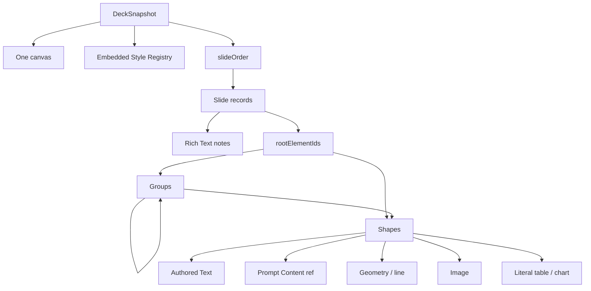
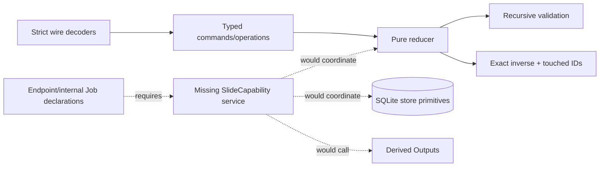

# Slide concepts

## Aggregate model

A Deck is designed as a project-scoped, revisioned aggregate containing one
canvas, an embedded Style Registry, one authoritative Slide order, and a record
of Slides. Each Slide owns notes and an element-membership tree. Groups are
structural ordering nodes; Shapes own renderable frames/transforms/content.

This graph describes the implemented canonical model/reducer. No rendering
runtime or application command runtime is implemented.

## Vocabulary

| Term | Current meaning |
| --- | --- |
| Deck | Root snapshot/head/history boundary. |
| Canvas | Shared width/height in points for every Slide. |
| Slide order | The only authoritative ordering of Slides; keys and IDs must match. |
| Element | Closed union of structural Group or renderable Shape. |
| Membership | An element ID appears exactly once, either at Slide root or in one Group's children. |
| Group | Non-rendering ordered child container; must be non-empty and acyclic. |
| Shape | Frame, transform, Style, visibility/lock flags, and one closed payload kind. |
| Prompt Content | Shape carrying an exact dedicated Derived Output reference. |
| Accepted value | Embedded Formula wire value used literally by Table/Chart; it is not reevaluated on read. |
| Base/ChangeSet | Full snapshot checkpoint plus one-revision forward/inverse history record. |
| Attempt/stage receipt | Typed durable records intended for Prompt Content compute/settle. |
| Identity ledger | Permanent local identity claims with tombstones. |

## Shape family and rendering boundary

The seven Shape kinds are authored text, prompt content, geometry, straight
line, image, literal table, and literal chart. Groups never persist a frame or
transform. `expandGroupTransform` expands a UI gesture into frame/transform
operations for descendant Shapes; hidden descendants still affect bounds.

Style projection overlays kind default, selected Style, then local
presentation. For authored text, the Shape overlay is an authoritative
full-range Rich Text Style and persisted inline marks supplement it.

No renderer, render artifact, export job, text measurement, connector/media
read, Formula evaluation, or live Structured Data binding exists in current
Slide code.

## Canonical versus external identity

Styles, Slides, Groups, Shapes, and Rich Text atom/mark IDs are Deck-local
canonical identities. Derived Output and image snapshot IDs are external
references. Safe identity validation rejects empty and inherited/prototype
record keys before record lookup, protecting record-backed maps.

Prompt Content references are intended to be dedicated: one live Shape per
output identity, with exact applied revision. Generic public command decoding
rejects inserting or restoring Prompt Content and rejects internal output
adoption; only the absent application service could implement the dedicated
creation/update/refresh workflow.

## Implemented architecture and gap

Wire decoding, reducer calls, validation, projections, and store calls are
usable directly by tests or another trusted caller. They are not composed into
an executable capability.

## Lifecycle and revision intent

The model defines `active | archived | trashed`, revision-zero creation, one
revision per ChangeSet, historical Bases, compensation, prompt attempts, and
recovery records. The SQLite adapter enforces transaction/CAS primitives for
these concepts. Because no service creates and coordinates these values in
production, this is a persistence/domain contract rather than an end-to-end
lifecycle guarantee today.
