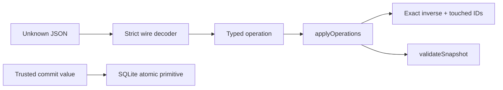
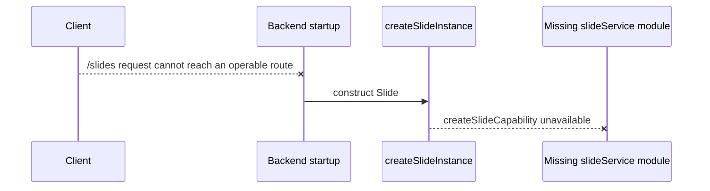

# Slide flows and wiring status

## What runs today

Direct callers/tests can execute these complete flows:

There is no implemented code joining the decoder/reducer/store into a public
command workflow. Direct store commits require trusted, internally coherent
commit structures.

## Declared public endpoint map (currently unreachable)

| Endpoint | Declared Job | Queue/mode | Decoder | Missing target | Declared success |
| --- | --- | --- | --- | --- | --- |
| `POST /slides/command` | `slides.command.v1` | serial / inline | `decodeSlideCommand` | `slide.command` | 201 create; 202 requested; otherwise 200 |
| `POST /slides/query` | `slides.query.v1` | concurrent / inline | `decodeSlideQuery` | `slide.query` | 200 |

The mapping and error conversion exist in
[`registerSlideEndpoints.ts`](../../../4-job-wiring/slide/registerSlideEndpoints.ts),
but startup cannot construct the required runtime.

## Declared command model (not implemented as a flow)

The type/wire surface admits:

- create a Deck with one initial Slide;
- submit generic operations at an expected revision;
- compensate one retained ChangeSet;
- request dedicated Prompt Content creation;
- update Prompt Content definition;
- request Prompt Content refresh.

Wire admission reserves Prompt Content insertion/output adoption for internal
work. The store provides receipts, revision CAS, identity ledger, prompt
ownership, attempts/stages, and outbox primitives. No service currently:

- creates heads/Bases/ChangeSets from these commands;
- replays requests or computes semantic rebase/compensation;
- advances Prompt attempts;
- loads historical snapshots;
- fetches exact Prompt Content revisions on load;
- emits internal intents or logs command durations.

## Declared internal job map (currently no runtime target)

| Intent | Job name | Queue | Expected method |
| --- | --- | --- | --- |
| `slide.compact` | `slides.compact` | serial | `compact(deckId)` |
| `slide.prompt-content.create.compute` | `slides.prompt-content.create.compute` | concurrent | `computePromptCreation(attemptId)` |
| `slide.prompt-content.create.settle` | `slides.prompt-content.create.settle` | serial | `settlePromptCreation(attemptId)` |
| `slide.prompt-content.refresh.compute` | `slides.prompt-content.refresh.compute` | concurrent | `computePromptRefresh(attemptId)` |
| `slide.prompt-content.refresh.settle` | `slides.prompt-content.refresh.settle` | serial | `settlePromptRefresh(attemptId)` |

Queue ownership is implemented in wiring only. There is no dispatch/recovery
behavior until the service exists.

## Expected Prompt flow encoded by types/store (not current behavior)

The types, store schema, and job names encode a two-stage design:

This is useful as an implementation contract, but the dotted arrows emphasize
that no current function performs those transitions.

## Implemented store/recovery primitives

The adapter can atomically claim stages, complete/fail them, convert interrupted
running receipts to failed, list recoverable attempts, and maintain Prompt
ownership. Calling `recoverInterruptedStages` directly changes persisted stage
state. Startup's attempted `slide.recoverPendingAttempts()` cannot run because
that runtime method is missing.

## Error mapping declaration

Endpoint wiring declares 404 for Deck/attempt/Derived not found; 410 for pruned
history; 409 for revision, definition, idempotency, compensation, and existence
conflicts; 400 for wire/domain validation; and a generic non-sensitive 500.
This mapping has no live endpoint until construction is repaired.
