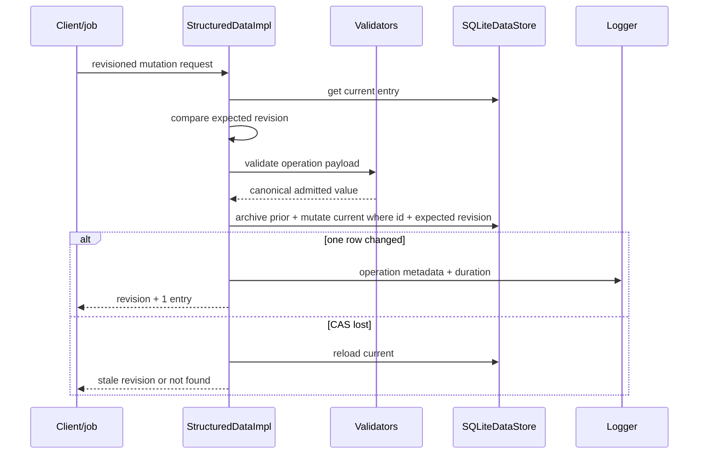

# Structured Data endpoint and job flows

## Common job behavior

[`registerStructuredDataEndpoints`](../../../4-job-wiring/structured-data/registerStructuredDataEndpoints.ts)
registers 16 inline jobs. Every one uses the concurrent queue. Scope is the one
project instance composed at startup; no user/project selector appears in the
path or payload.

CRUD handlers map not-found → 404, name conflict/stale revision → 409, and all other caught errors → 400. Several read/query handlers do not wrap unexpected failures in `sdError`.

## Exhaustive endpoint table

| Method/path | Job name | Input / validation boundary | Main calls | Success and notable errors |
|---|---|---|---|---|
| `POST /structured-data` | `structured-data.declare` | Branch recognized kind; strings are coerced; schema/rows cast then service-validates | `sd.declare` | 201 entry; unknown kind 400 |
| `GET /structured-data` | `structured-data.list` | Optional query `kind` cast without runtime kind validation | `sd.list(kind)` | 200 `{entries}`; unsupported kind currently yields empty store result |
| `GET /structured-data/entry` | `structured-data.get` | query ID default `""` | `sd.get` | 200 entry or explicit 404 |
| `GET /structured-data/by-name` | `structured-data.getByName` | query name default `""` | `sd.getByName` | 200 entry or explicit 404 |
| `PATCH /structured-data/rename` | `structured-data.rename` | string coercion, `Number(expectedRevision)`; service name validation | `sd.rename` | 200 entry; typed mappings |
| `PATCH /structured-data/description` | `structured-data.updateDescription` | description coerced to string, numeric revision | `sd.updateDescription` | 200 entry |
| `DELETE /structured-data` | `structured-data.delete` | ID string, numeric expected revision | `sd.delete` | 204 null |
| `POST /structured-data/purge` | `structured-data.purge` | body ID string | `sd.purge` | 204; current → 409 `not_deleted`; no terminal history → 404 |
| `POST /structured-data/query` | `structured-data.query` | kind/scope cast; text coerced if present | `sd.query` | 200 result; no local catch |
| `PATCH /structured-data/body` | `structured-data.updateBody` | body coerced to string, numeric revision; service validates | `sd.updateBody` | 200 entry |
| `PATCH /structured-data/schema` | `structured-data.replaceSchema` | schema cast; service validates complete shape/retained rows | `sd.replaceSchema` | 200 collection |
| `POST /structured-data/rows` | `structured-data.appendRows` | rows cast; service validates new rows | `sd.appendRows` | 200 collection |
| `DELETE /structured-data/rows` | `structured-data.deleteRows` | indices cast; service validates | `sd.deleteRows` | 200 collection |
| `GET /structured-data/value/entry` | `structured-data.valueByEntryId` | query ID; no body | `sd.get`, `resolver.buildSnapshot`, `toWire` | 200 evaluated value; 404/409/422 |
| `GET /structured-data/value/by-name` | `structured-data.valueByDisplayName` | query display name | `sd.getByName`, resolver, `toWire` | 200 evaluated value; 404/409/422 |
| `POST /structured-data/evaluate` | `structured-data.evaluate` | `source` coerced to string | Formula parse, resolver snapshot, Formula evaluate, `toWire` | 200 result; parse/eval 400; function 422 |

There are no deferred or internal Structured Data jobs. The shared retention
scheduler invokes its maintenance hooks; Structured Data owns no scheduler
itself.

## Mutation sequence



Declaration differs: it checks name and count, validates full input, then
inserts current revision 1. SQLite's current-table `NOCASE` unique index is the
final name-race guard. Delete uses the same transaction boundary to archive
snapshot `N`, append terminal revision `N + 1`, and remove current. Retention
later prunes old snapshots or purges expired terminal history.

## Binding and evaluated-value sequence

```mermaid
sequenceDiagram
  participant E as Value/evaluate endpoint
  participant SD as StructuredData
  participant R as FormulaNameResolver
  participant F as FormulaEngine
  E->>SD: get entry when applicable
  E->>R: buildSnapshot()
  R->>SD: bindingView()
  loop bounded iterative passes
    R->>F: parse + dependencies + evaluate
    F-->>R: value or diagnostics
  end
  R-->>E: bindings + snapshot digest; issues remain separate
  alt value endpoint
    E->>E: select normalized entry binding
  else ad-hoc evaluate
    E->>F: parse and evaluate source against snapshot
  end
  E->>F: isWireSerializable / toWire
  E-->>E: JSON value or typed diagnostic response
```

Value endpoints return entry identity/kind/revision, Formula value kind/wire value, and resolution metadata (`snapshotDigest`, binding count, owner revision, value digest). Ad-hoc evaluate also returns observed dependencies, dependency/evaluation digests, steps, and snapshot metadata.

## Resolver failure status

- Entry absent → value endpoint 404.
- Entry has a resolver issue → 422 `resolution_error` with the typed issue.
- Entry has neither binding nor recorded issue → 409 `unresolved`.
- Function binding or function result → 422 `non_serializable_value`.
- Ad-hoc parse/evaluation diagnostic → 400 with Formula diagnostics.
- Unexpected evaluate exception → logged and returned as 400 `bad_request`.

Resolver issues are process-memory diagnostics for the latest built snapshot; they are not persisted in Structured Data SQLite.
