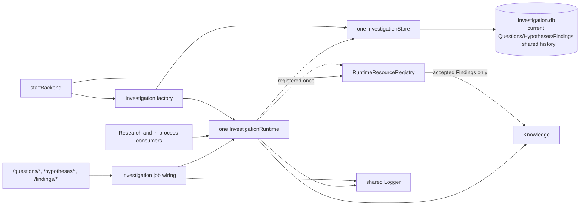

# Investigation capability

## Status and authority

Investigation is an implemented, project-scoped capability for managing
Questions, Hypotheses, and Findings as one coherent domain. It exposes one
flat `InvestigationRuntime`, persists the three record types through one
`InvestigationStore`, and initializes three typed current tables plus one shared
project-prefixed history table on one SQLite connection.

Questions frame work and hold a mutable current answer. Hypotheses express
claims that may relate to zero or more Questions. Findings preserve grounded
claims, own their classified links to Questions and Hypotheses, and enter
Knowledge only while accepted. There is no persisted Investigation aggregate,
separate runtime projection, generic Source entity, or mirrored reverse-link
state.

These pages describe the current implementation. The scratch designs explain
the decisions that led to it, but this package and its composed adapters are
the runtime authority.

## Documentation map

| Document | Purpose |
|---|---|
| [Concepts](concepts.md) | Domain vocabulary, ownership, lifecycles, relationships, references, and architecture |
| [Types](types.md) | Canonical records, requests, filters, errors, store port, and SQLite representation |
| [Runtime](runtime.md) | Construction, every runtime/store operation, validation, Knowledge reconciliation, and logging |
| [Flows](flows.md) | All 26 HTTP jobs, relationship traversal, acceptance, review, deletion, purge, and resource-resolution sequences |
| [Invariants](invariants.md) | Guarantees, concurrency boundaries, validation rules, failure behavior, tests, and non-goals |

## Architecture at a glance

## Source map

| Concern | Current source |
|---|---|
| Canonical domain records, requests, filters, helpers, runtime contract, and errors | [`domain/model.ts`](../domain/model.ts) |
| One persistence port for all three record types | [`ports/investigationStore.ts`](../ports/investigationStore.ts) |
| Service implementation, validation, lifecycle logic, Knowledge reconciliation, and runtime logging | [`application/investigationRuntime.ts`](../application/investigationRuntime.ts) |
| SQLite connection, current/history schema, row mapping, filters, logical deletion/purge, and conditional acceptance | [`persistence/sqliteInvestigationStore.ts`](../persistence/sqliteInvestigationStore.ts) |
| Public capability exports | [`index.ts`](../index.ts) |
| Project-bound store/runtime factory | [`initialization/runtimes/investigation.ts`](../../../initialization/runtimes/investigation.ts) |
| Startup composition and endpoint registration | [`initialization/create-runtime.ts`](../../../initialization/create-runtime.ts) |
| Accepted-Finding Context resolution and scoped list/read integration | [`initialization/runtimes/resource-reader.ts`](../../../initialization/runtimes/resource-reader.ts) |
| HTTP decoding, job queue selection, error mapping, and endpoint logs | [`api/routes/investigation/registerInvestigationEndpoints.ts`](../../../api/routes/investigation/registerInvestigationEndpoints.ts) |
| Knowledge add/remove and revision-skip behavior | [`capabilities/knowledge/knowledge.ts`](../../../capabilities/knowledge/knowledge.ts) |
| Capability regression and integration tests | [`test/capabilities/investigation.test.ts`](../../../../test/capabilities/investigation.test.ts) |

## Dependencies

- Platform [`Knowledge`](../../../capabilities/knowledge/knowledge.ts) for accepted
  Finding ingestion and removal.
- Platform [`Logger`](../../../capabilities/platform/observability/logger.ts) for runtime,
  endpoint, Knowledge, and startup telemetry.
- The shared job registry and scheduler for inline serial/concurrent endpoint
  execution.
- The composition-layer
  [`RuntimeResourceRegistry`](../../../initialization/runtimes/resource-reader.ts) so an
  accepted Finding can be selected in Context and read by scope-contained
  consumers.
- `better-sqlite3` for the single project-partitioned database.

Investigation does not depend on Question, Hypothesis, or Finding sibling
capabilities; those are record families inside this package. It also does not
depend directly on Research or Derived Outputs. Those consumers use the public
runtime when composed with it.

## Related design material

- [Consolidated Investigation design](../../../../../../scratch/investigation-design.md)
- [Question slice design](../../../../../../scratch/questions-design.md)
- [Hypothesis slice design](../../../../../../scratch/hypotheses-design.md)
- [Finding slice design](../../../../../../scratch/findings-design.md)
- [Consolidated implementation plan](../../../../../../scratch/investigation-implementation-plan.md)
- [Knowledge platform documentation](../../../capabilities/knowledge/docs/README.md)

Use the implementation documentation here first when understanding coded
behavior. The scratch documents retain design rationale and may describe
future consumers that are not yet wired.
