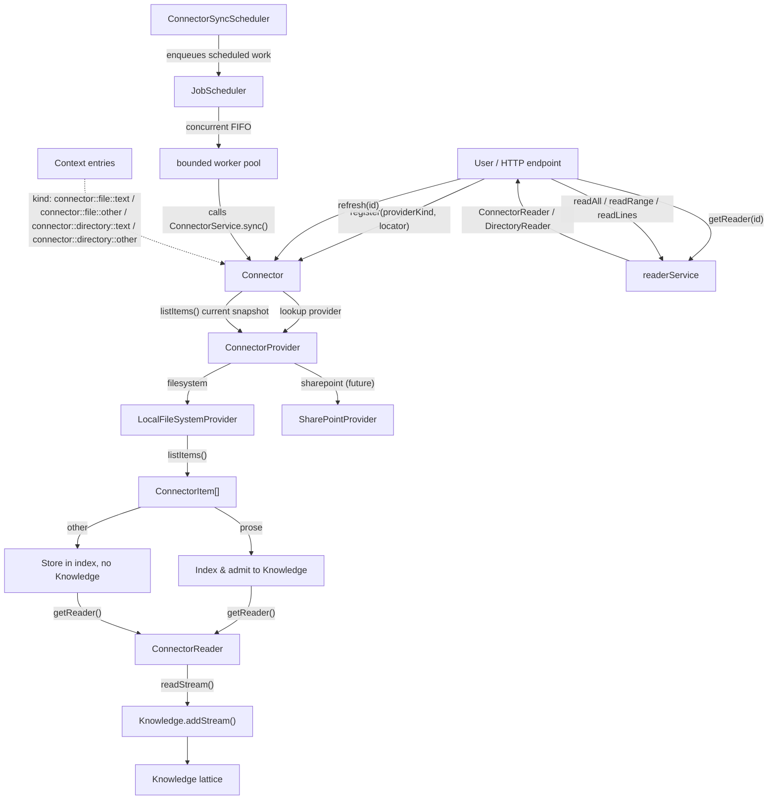

# Connector Capability — Design

## Summary

Connector is a **regular capability** (`3-capabilities/connector/`) that
provides on-demand read access to content stored **outside the project**.
Unlike General Files (which persists content), Connector keeps a **live
reference** to an external resource and reads content on demand through a
reader interface. Content is never fully buffered in memory — the reader
supports bounded range reads and line-based reads so callers can consume
content incrementally.

Connector does not own the transport. It defines a **provider interface** that
backend adapters implement. A provider is anything that can list items and
produce readers: a local filesystem, SharePoint, Google Drive, Dropbox, a
database, an S3 bucket — anything with a stable external identity and readable
content.

The capability supports four sub-kinds:
- `"connector::file::text"` — a single external prose-text item
- `"connector::file::other"` — a single external non-prose item
- `"connector::directory::text"` — a collection with at least one prose item
- `"connector::directory::other"` — a collection with only non-prose items

Items are classified by extension using a standalone copy of the same
prose-text extension list (txt, md, markdown, rst, org, tex, html, htm, log).
Binary containers such as PDF and DOCX remain `other` until an extractor is
available. Each capability owns its own list — they may diverge over time.

The filesystem provider **is a sync-type provider**. On each sync interval it
stats every item and compares `mtime` against the stored `lastModifiedAt`.
Only items whose modification time has changed are re-read and updated in
Knowledge (prose) or the index (other). This gives selective, incremental
sync with minimal I/O.

---

## Kind model

```ts
type ConnectorKind =
  | "connector::file::text"
  | "connector::file::other"
  | "connector::directory::text"
  | "connector::directory::other";
```

The kind encodes:
- `connector` — the owning capability namespace
- `file` or `directory` — the resource shape
- `text` — at least one prose item present; admitted to Knowledge
- `other` — only non-prose items; nothing admitted to Knowledge

Kind is determined at registration:
- One item, prose → `file::text`
- One item, other → `file::other`
- Multiple items, at least one prose → `directory::text`
- Multiple items, none prose → `directory::other`

---

## Where it lives

```
apps/backend/src/
  3-capabilities/
    connector/
      domain/
        model.ts              # ConnectorEntry, ConnectorKind, ConnectorItem
        provider.ts           # ConnectorProvider interface
        text-extensions.ts    # prose-text extension allowlist (standalone copy)
        reader.ts             # ConnectorReader interface
        errors.ts             # UnsupportedExtension, ItemNotFound, etc.
      application/
        registerService.ts    # register provider+locator, index, admit to Knowledge
        refreshService.ts     # re-index on change, update Knowledge
        readerService.ts      # getReader(id) → ConnectorReader
      ports/
        repository.ts         # ConnectorRepository interface
        knowledge.ts           # Knowledge admission port
      providers/
        filesystem.ts         # LocalFileSystemProvider (initial implementation)
        sharepoint.ts         # (future)
        googledrive.ts        # (future)
        dropbox.ts            # (future)
        database.ts           # (future)
      persistence/
        migrations/
          001-connector.ts
        sqliteConnectorRepository.ts
      index.ts
  4-job-wiring/
    connector/
      registerConnectorEndpointMappings.ts
      createConnectorJobs.ts
```

## Provider model

A **provider** is the transport layer. It knows how to list items at an
external location and how to produce readers for them. The capability itself
owns identity, indexing, persistence, Knowledge admission, and the public
endpoint surface — it delegates transport to the provider.

```ts
/**
 * A provider's job: given an external locator, list the items available
 * and produce readers for them. Providers are stateless — every call
 * re-connects to the external system.
 */
interface ConnectorProvider {
  /** Machine-readable provider kind. Used in the ConnectorEntry. */
  readonly kind: string;  // e.g. "filesystem", "sharepoint", "googledrive"

  /** Human-readable label for diagnostics and UI. */
  readonly label: string;

  /**
   * List all readable text items at the given locator.
   * For a file provider, this returns one item (the file itself).
   * For a directory/collection provider, this returns all text items within.
   * Items with unsupported extensions are returned with status "skipped".
   */
  listItems(locator: string): Promise<ConnectorItem[]>;

  /**
   * Produce a reader for a specific item. The locator and itemKey together
   * uniquely identify the item within this provider.
   */
  getReader(locator: string, itemKey: string): Promise<ConnectorReader>;
}

interface ConnectorItem {
  /** Provider-scoped key that uniquely identifies this item within the locator. */
  readonly key: string;
  /** Display name (filename, document title, etc.). */
  readonly name: string;
  /** File extension, lowercased, or null. */
  readonly extension: string | null;
  /** Byte size, if known. -1 if unknown. */
  readonly byteSize: number;
  /** Revision token for change detection (mtime, etag, version hash, etc.). */
  readonly revisionToken: string;
  /**
   * Whether this item is prose text (admitted to Knowledge) or other
   * (registered but not indexed). Classification uses a standalone copy
   * of the prose-text extension list owned by this capability.
   */
  readonly status: "prose" | "other";
}
```

### Local filesystem provider (initial implementation — development only)

The filesystem provider opts into scheduled sync with the `syncType` marker.
On each sync, the Connector service asks it for a fresh item snapshot and
compares revision tokens with the persisted index. Only changed files are
re-read and re-admitted to Knowledge (prose); unchanged files are not read.
This provider intentionally permits arbitrary local paths and must not be
exposed as a production trust boundary.

```ts
const filesystemProvider: ConnectorProvider = {
  kind: "filesystem",
  label: "Local Filesystem (development only)",
  syncType: "scheduled",

  async listItems(locator: string): Promise<ConnectorItem[]> {
    const resolved = path.resolve(locator);
    const stat = await fs.stat(resolved);
    if (stat.isFile()) {
      return [fileToItem(resolved, stat)];
    }
    if (stat.isDirectory()) {
      const entries = await fs.readdir(resolved, { withFileTypes: true });
      return entries
        .filter(e => e.isFile())
        .map(e => fileToItem(path.join(resolved, e.name), /* stat later */));
    }
    throw new ConnectorError("unsupported_locator", `Path is neither file nor directory: ${locator}`);
  },

  async getReader(locator: string, itemKey: string): Promise<ConnectorReader> {
    return createFileReader(itemKey); // itemKey is the absolute path
  },
};
```

Each `ConnectorItemEntry` records the last observed revision and modification
time so the service can do selective sync:

```ts
interface ConnectorItemEntry {
  readonly itemKey: string;
  readonly name: string;
  readonly extension: string;
  readonly byteSize: number;
  readonly revisionToken: string;   // `${mtimeMs}-${size}` for filesystem
  readonly lastModifiedAt: string;   // ISO-8601, from stat.mtime
  readonly status: "prose" | "other";
  readonly knowledgeSourceId: string | null;
}
```

At each interval, `listItems()` returns the current revision token for every
item. The Connector service compares that snapshot with persisted
`revisionToken` values. It re-reads changed prose content, updates metadata for
changed other items, adds new items, and removes missing items.

---

## Core types

```ts
type ConnectorKind =
  | "connector::file::text"
  | "connector::file::other"
  | "connector::directory::text"
  | "connector::directory::other";

interface ConnectorEntry {
  /** Stable ID: SHA-256(providerKind + "::" + locator), hex-encoded. */
  readonly id: string;
  readonly kind: ConnectorKind;
  /** Which provider backs this connector. */
  readonly providerKind: string;  // e.g. "filesystem", "sharepoint"
  /** Provider-specific external locator (path, URL, connection string, etc.). */
  readonly locator: string;
  /** Display label for the connector. */
  readonly label: string;
  /** Revision counter. Incremented on re-register or refresh. Starts at 1. */
  readonly revision: number;
  /** Sync configuration, if this is a sync-type connector. */
  readonly syncConfig: ConnectorSyncConfig | null;
  /** True while a sync Job is actively running for this entry. */
  readonly syncing: boolean;
  /** Whether the persisted snapshot and Knowledge are known to agree. */
  readonly ingestionState: "active" | "pending" | "failed";
  /** For directory connectors: index of all items (prose + other). */
  readonly itemIndex: ConnectorItemEntry[];
  /** Knowledge source IDs, one per prose item. */
  readonly knowledgeSourceIds: string[];
  readonly createdAt: string;
  readonly updatedAt: string;
  readonly deletedAt?: string;
}

interface ConnectorItemEntry {
  /** Provider-scoped key that identifies this item. */
  readonly itemKey: string;
  /** Display name (filename, document title). */
  readonly name: string;
  readonly extension: string;
  readonly byteSize: number;
  /** Provider revision token for change detection. */
  readonly revisionToken: string;
  /** ISO-8601, from stat.mtime. Used for selective sync. */
  readonly lastModifiedAt: string;
  /** Prose vs other — determines Knowledge admission. */
  readonly status: "prose" | "other";
  /** Hashed Knowledge source ID for prose items; null for other items. */
  readonly knowledgeSourceId: string | null;
}

type RegisterConnectorRequest = {
  providerKind: "filesystem";
  locator: string;        // absolute file or directory path
  syncInterval?: SyncInterval;  // required for sync-type providers; one of "5min" | "30min" | "2hr" | "12hr"
};
// Future: providerKind "sharepoint" | "googledrive" | "dropbox" | "database" | ...

interface RegisterConnectorResult {
  status: "registered" | "already_exists";
  entry: ConnectorEntry;
  indexResults: ItemIndexResult[];
}

interface ItemIndexResult {
  itemKey: string;
  name: string;
  status: "indexed" | "stored";
  knowledge?: KnowledgeAddResult;
}

interface KnowledgeAddResult {
  sourceId: string;
  windowsAdded: number;
  windowsReused: number;
}
```

---

## ID strategy

```ts
function connectorId(providerKind: string, locator: string): string {
  const canonical = `${providerKind}::${locator}`;
  return createHash("sha256").update(canonical, "utf8").digest("hex");
}
```

The ID is derived from `providerKind` + `locator`, not content. Rationale:

- Resources may be too large to hash at registration time — the reader is lazy.
- The external identity (path, URL, connection string) is the stable reference.
- Re-registering the same provider+locator returns the existing entry
  (idempotent).
- If a resource moves, it's a different connector entry.
- A refresh checks if content changed (via the provider's revision token) and
  updates Knowledge accordingly — it does **not** change the connector ID.

---

## The ConnectorReader interface

The reader is the core abstraction. Every connector entry can produce a reader
that callers use to access content lazily. Readers are constructed on demand
through the provider — no handles or connections are kept open.

```ts
interface ConnectorReader {
  /** Total byte size of the item, or -1 if unknown. */
  readonly byteSize: number;
  /** MIME type, if known. */
  readonly mimeType: string | null;

  /** Read a bounded range of bytes. Returns UTF-8 text. */
  read(range: ByteRange): Promise<string>;

  /** Read the entire item as UTF-8 text. Use with caution for large items. */
  readAll(): Promise<string>;

  /** Read the item as a stream of text chunks. */
  readStream(chunkSize?: number): AsyncIterable<string>;

  /**
   * Read a range of lines. Line numbers are 1-based, inclusive on both ends.
   * For non-text items, lines are determined by newline splitting — the
   * caller is responsible for knowing whether the content is line-oriented.
   */
  readLines(startLine: number, endLine: number): Promise<string[]>;
}

interface ByteRange {
  start: number; // 0-based, inclusive
  end: number;   // exclusive
}
```

For directory entries, the service layer provides:

```ts
interface DirectoryReader {
  /** List all items in the directory (prose + other). */
  listItems(): ConnectorItemEntry[];

  /** Get a ConnectorReader for a specific indexed item by its key. */
  getItemReader(itemKey: string): Promise<ConnectorReader>;
}
```

---

## Registration flow

1. The caller provides a **provider kind**, **locator**, and optional
   **syncInterval**.
2. The capability looks up the `ConnectorProvider` by kind.
3. `provider.listItems(locator)` is called. The provider returns all items,
   each classified as `"prose"` or `"other"` based on extension (using the
   capability's own `PROSE_TEXT_EXTENSIONS` list).
4. The connector kind is determined:
   - One item, prose → `"connector::file::text"`
   - One item, other → `"connector::file::other"`
   - Multiple items, at least one prose → `"connector::directory::text"`
   - Multiple items, none prose → `"connector::directory::other"`
5. The connector ID is computed: `SHA-256("filesystem::/absolute/path")`.
6. If the provider exposes `syncType: "scheduled"` and `syncInterval` is
   provided, the connector is registered with `syncConfig`. The scheduler
   discovers persisted configurations on startup and on subsequent ticks.
7. For **prose items**: a reader is obtained, content is streamed into
   Knowledge, `lastModifiedAt` is recorded from `stat.mtime`.
8. For **other items**: the item is registered with `status: "other"` and
   `knowledgeSourceId: null`. `lastModifiedAt` is still recorded for mtime
   tracking.

```ts
const provider = getProvider(request.providerKind);
const items = await provider.listItems(request.locator);

const entryId = connectorId(provider.kind, request.locator);
const hasProse = items.some(i => i.status === "prose");
const isSingle = items.length === 1;

const entryKind: ConnectorKind = isSingle
  ? (hasProse ? "connector::file::text" : "connector::file::other")
  : (hasProse ? "connector::directory::text" : "connector::directory::other");

// If the provider supports scheduling and an interval is given, persist it.
const syncConfig: ConnectorSyncConfig | null =
  provider.syncType === "scheduled" && request.syncInterval
    ? { syncType: "scheduled", interval: request.syncInterval }
    : null;

for (const item of items) {
  const lastModifiedAt = item.revisionToken.split("-")[0]; // mtimeMs portion
  if (item.status === "prose") {
    const reader = await provider.getReader(request.locator, item.key);
    const sourceId = connectorKnowledgeSourceId(entryId, item.key);
    const knowledgeResult = await knowledge.addStream({
      sourceId, label: "connector-item",
      revision: item.revisionToken,
      stream: reader.readStream(),
    });
    results.push({
      itemKey: item.key, name: item.name,
      status: "indexed", knowledge: knowledgeResult,
    });
  } else {
    results.push({
      itemKey: item.key, name: item.name,
      status: "stored",
    });
  }
}
```

---

## Refresh / Sync

Manual refresh and scheduled sync share `ConnectorService.sync()`, but enter
it differently. `#connector/refresh` runs the sync inline and returns its
success or validation error. The scheduler acquires the connector's sync lock
before enqueueing work on the concurrent `JobScheduler`.

Overlap is prevented by the persisted **`syncing` state**. A manual sync
acquires it inside `ConnectorService.sync()`; the scheduler acquires it before
enqueueing and tells the service that the lock is already held. The service
clears it in `finally`, and enqueue failures clear it as well.

- **Bounded concurrency:** the concurrent worker pool limits how many syncs
  run at once across different connectors.
- **Per-connector exclusion:** the atomic `setSyncing()` update permits only
  one manual or scheduled sync for a connector at a time.
- **Unified observability:** sync Jobs appear in the same Job logs, command
  receipts, and diagnostics as every other operation. `syncing` is visible
  in the connector metadata.

Before changing Knowledge, sync persists `ingestionState: "pending"` and the
union of source IDs from the last active and current provider snapshots. Only
after every Knowledge operation and the metadata update succeed does it write
`"active"` with the exact current source set. A failure writes `"failed"`
(or safely remains `"pending"` if that write also fails) while retaining the
last active item snapshot and the source-ID union. The next sync re-admits all
current prose and removes every tracked source no longer present. It never
pretends to restore old content by reading new bytes from the provider. Public
Connector projections expose an empty `knowledgeSourceIds` list while pending
or failed, so uncertain partial ingestion cannot enter a Knowledge/resource
scope; the persisted union remains private recovery metadata.

**Enqueue-time contract.** Before a sync Job is placed in the queue, the
scheduled caller atomically sets `syncing = true WHERE id = ?
AND syncing = false`. If zero rows updated, the connector is already syncing
and the Job is never enqueued.

**Sync operation.** Once the lock is held, the service:

1. Loads the `ConnectorEntry` and its `itemIndex`.
2. Calls `provider.listItems(locator)` for the current snapshot and compares
   item keys and revision tokens with the persisted snapshot.
3. Applies the diff: new prose items stream into Knowledge, changed prose
   items re-stream, removed items are cleaned up, and other items get metadata
   updates.
4. Updates `revision`, `lastSyncedAt`, and sets `syncing = false`.
5. Emits structured duration and item-count logs.

### Manual refresh

`#connector/refresh` executes the sync inline. It returns `200` only after the
sync completes, `409` when a sync is already in progress, `404` for a missing
connector, and a mapped validation or server error otherwise.

### Scheduled sync

At each interval the scheduler refreshes the set of persisted sync-enabled
entries, acquires each due connector's lock, and enqueues a concurrent Job.
The Job calls `ConnectorService.sync()` with the lock-already-acquired flag.

```
Scheduler timer fires
  → scheduler discovers persisted sync configurations
  → scheduler atomically acquires the connector lock
  → JobScheduler concurrent FIFO → worker pool
  → ConnectorService snapshots, diffs, and applies results
  → structured outcome logged
```

---

## Sync model

Some providers support automatic periodic refresh on a fixed schedule. Such a
provider sets an optional marker on `ConnectorProvider`; snapshot comparison
and persistence remain owned by the Connector service:

```ts
/**
 * Allowed sync intervals. These are fixed multiples of each other so the
 * scheduler can batch connectors that share a cadence.
 *
 * Values are in milliseconds.
 */
const SYNC_INTERVALS = {
  "5min":   5 * 60 * 1000,        //   300,000 ms
  "30min": 30 * 60 * 1000,        // 1,800,000 ms  (6 × 5min)
  "2hr":    2 * 60 * 60 * 1000,   // 7,200,000 ms  (4 × 30min)
  "12hr":  12 * 60 * 60 * 1000,   // 43,200,000 ms (6 × 2hr)
} as const;

type SyncInterval = keyof typeof SYNC_INTERVALS;

interface ConnectorProvider {
  readonly kind: string;
  readonly label: string;
  readonly syncType?: "scheduled";
  listItems(locator: string): Promise<ConnectorItem[]>;
  getReader(locator: string, itemKey: string): Promise<ConnectorReader>;
}
```

The connector entry records sync configuration only when the provider supports
scheduling and the caller supplied an interval:

```ts
interface ConnectorSyncConfig {
  readonly syncType: "scheduled";
  readonly interval: SyncInterval;
  readonly lastSyncedAt?: string;
}

// ConnectorEntry.syncing is persisted while a sync is queued or running.
```

The sync config is persisted alongside the connector entry in a JSON column
(see SQL schema below). A provider can still be refreshed manually when no
interval is supplied.

### Scheduler

The scheduler is thin. It does not touch provider content directly; it
enqueues work through `JobScheduler`, and that work calls
`ConnectorService.sync()`.

On startup (`1-init/startBackend.ts`):

1. Clear stale persisted `syncing` flags left by a prior process exit and log
   the recovery count.
2. Query all active entries with `syncType = "scheduled"`.
3. Spawn one timer per allowed interval. Each tick re-queries persistence so
   registrations created after startup are discovered automatically.

```
1-init/
  create/
    connectorSyncScheduler.ts   # Scheduler construction & lifecycle
```

```ts
interface ConnectorSyncScheduler {
  /** Register a connector for scheduled sync. Called at registration time. */
  register(entryId: string, config: ConnectorSyncConfig): void;
  /** Remove a connector from the schedule. Called at deletion time. */
  unregister(entryId: string): void;
  /** Start all interval timers. Called during backend startup. */
  start(): void;
  /** Clear all timers. Called during graceful shutdown. */
  stop(): void;
}
```

The scheduler depends on `JobScheduler`, `ConnectorStore`,
`ConnectorService`, and the shared logger. At each tick it queries active,
non-syncing scheduled entries. For each, it attempts the enqueue-time
`syncing = true` update. If successful, it enqueues a concurrent Job. If not,
that connector is skipped and its next tick can retry.

Each interval tick is fire-and-forget. The Job handler never sets `syncing =
true` — that was done at enqueue time. The handler only resets it to `false`
on completion.

### Which providers are sync-type?

| Provider | Sync type | How it detects changes |
|----------|-----------|------------------------|
| `filesystem` | `scheduled` | `stat.mtimeMs` vs stored `lastModifiedAt` per item |
| `sharepoint` (future) | `scheduled` | Delta API / etag comparison |
| `googledrive` (future) | `scheduled` | Changes API / etag comparison |
| `dropbox` (future) | `scheduled` | `/files/list_folder/continue` cursor |
| `database` (future) | `scheduled` or `none` | Depends on use case |

The filesystem provider is sync-type from day one. At each interval it stats
every item in the index. Unchanged items (same `mtime`) produce no work — no
content is re-read. Only items whose `mtime` differs from `lastModifiedAt`
trigger a re-read and Knowledge update (prose) or index update (other).

---

## Knowledge lattice integration

Knowledge source IDs are constructed with care to avoid string-interop issues
from arbitrary external identifiers (filenames, URLs, database keys, etc.).
Raw external identifiers are **never** interpolated directly into a Knowledge
source ID. Instead, every external identifier is first hashed, and the
hex-encoded hash is used in the source ID prefix.

```ts
/**
 * Construct a stable Knowledge source ID from a connector entry ID and an
 * optional sub-item identifier (e.g. a file path within a directory, a
 * document key in a cloud drive, a row key in a database).
 *
 * The subPath is hashed before inclusion — this avoids problems with:
 * - Special characters in filenames/paths (spaces, colons, unicode, etc.)
 * - Unbounded path length exceeding ID column constraints
 * - Injection-like issues from attacker-controlled external identifiers
 */
function connectorKnowledgeSourceId(
  entryId: string,
  subPath?: string
): string {
  if (!subPath) return `connector:${entryId}`;
  const subHash = createHash("sha256").update(subPath, "utf8").digest("hex");
  return `connector:${entryId}:${subHash}`;
}
```

Knowledge source IDs are self-describing and stable. The same external item
always produces the same hash, so the source ID is deterministic. On refresh,
the same source ID is reused so Knowledge can compare revisions.

For **other** items (non-prose), no Knowledge source is created —
`knowledgeSourceId` is `null`. The item is still fully readable through the
reader, including `readLines()` for line-oriented access.

For directory connectors, each prose file gets its own Knowledge source so
retrieval can pinpoint which file a span came from. Other files contribute
nothing to the lattice.

---

## Relationships



---

## Endpoints

| Endpoint | Method | Description |
|----------|--------|-------------|
| `#connector/register` | POST | Register an external resource. Body: `{ providerKind, locator, syncInterval? }`. Supplying one of `"5min"`, `"30min"`, `"2hr"`, or `"12hr"` opts a scheduling-capable provider into periodic sync. |
| `#connector/refresh` | POST | Manually re-index a connector entry inline. Body: `{ id }`; returns after completion or with a mapped error. |
| `#connector/get` | POST | Get connector metadata. Body: `{ id }`. Returns `ConnectorEntry`. |
| `#connector/list` | POST | List all connector entries. Returns `ConnectorEntry[]`. |
| `#connector/read-all` | POST | Read full text of an item. Body: `{ id, itemKey? }`. |
| `#connector/read-range` | POST | Read a byte range. Body: `{ id, itemKey?, start, end }`. |
| `#connector/read-lines` | POST | Read a line range (1-based, inclusive). Body: `{ id, itemKey?, startLine, endLine }`. |
| `#connector/list-items` | POST | List indexed items in a directory connector. Body: `{ id }`. Returns `ConnectorItemEntry[]`. |
| `#connector/delete` | POST | Remove a connector entry. Removes all associated Knowledge sources. Body: `{ id }`. |

---

## Job wiring

| Operation | Queue | Response | Reason |
|-----------|-------|----------|--------|
| `register` (file) | `concurrent` | `inline` | External I/O + Knowledge embed. Concurrent-safe (path-based IDs). |
| `register` (directory) | `concurrent` | `inline` | Directory walk + Knowledge admission completes before success is returned. |
| scheduled sync | `concurrent` | internal | Enqueued by the scheduler and picked up by the worker pool. |
| manual sync via `#connector/refresh` | `concurrent` | `inline` | Runs through the endpoint Job and returns the completed result. |
| `get` / `list` | `concurrent` | `inline` | Read-only. |
| `read-all` / `read-range` / `read-lines` | `concurrent` | `inline` | Bounded file I/O. |
| `delete` | `serial` | `inline` | Ordered canonical mutation. |

---

## SQLite schema

```sql
CREATE TABLE connector_entries (
  id TEXT PRIMARY KEY
    CHECK (length(id) = 64 AND id NOT GLOB '*[^0-9a-f]*'),
  kind TEXT NOT NULL
    CHECK (kind IN ('connector::file::text', 'connector::file::other', 'connector::directory::text', 'connector::directory::other')),
  provider_kind TEXT NOT NULL
    CHECK (length(provider_kind) > 0),
  locator TEXT NOT NULL
    CHECK (length(locator) > 0),
  label TEXT NOT NULL
    CHECK (length(trim(label)) > 0),
  revision INTEGER NOT NULL
    CHECK (revision >= 1),
  sync_config_json TEXT
    CHECK (sync_config_json IS NULL OR (
      json_valid(sync_config_json) AND json_type(sync_config_json) = 'object'
    )),
  syncing INTEGER NOT NULL DEFAULT 0
    CHECK (syncing IN (0, 1)),
  ingestion_state TEXT NOT NULL DEFAULT 'active'
    CHECK (ingestion_state IN ('active', 'pending', 'failed')),
  knowledge_source_ids_json TEXT NOT NULL
    CHECK (json_valid(knowledge_source_ids_json) AND json_type(knowledge_source_ids_json) = 'array'),
  created_at TEXT NOT NULL,
  updated_at TEXT NOT NULL,
  deleted_at TEXT
);

CREATE TABLE connector_items (
  entry_id TEXT NOT NULL,
  item_key TEXT NOT NULL,
  name TEXT NOT NULL
    CHECK (length(trim(name)) > 0),
  extension TEXT NOT NULL,
  byte_size INTEGER NOT NULL
    CHECK (byte_size >= 0),
  status TEXT NOT NULL
    CHECK (status IN ('prose', 'other')),
  revision_token TEXT NOT NULL
    CHECK (length(revision_token) > 0),
  last_modified_at TEXT NOT NULL
    CHECK (length(last_modified_at) > 0),
  knowledge_source_id TEXT,
  PRIMARY KEY (entry_id, item_key),
  FOREIGN KEY (entry_id)
    REFERENCES connector_entries(id)
    ON UPDATE CASCADE ON DELETE CASCADE
);

-- Ensure one active entry per provider + locator pair
CREATE UNIQUE INDEX connector_entries_active_locator
  ON connector_entries(provider_kind, locator)
  WHERE deleted_at IS NULL;

CREATE INDEX connector_entries_kind_created
  ON connector_entries(kind, deleted_at IS NULL, created_at DESC);

CREATE INDEX connector_items_status
  ON connector_items(entry_id, status);
```

---

## Extension validation

Connector owns its own copy of the prose-text extension list. It is not
imported from any other capability — capabilities may have different opinions
about what counts as prose. Items are classified as `"prose"` or `"other"`
by the provider's `listItems()`.

- **Prose items:** Admitted to Knowledge lattice at registration and on each
  sync where `mtime` has changed.
- **Other items** (code, data, config, images, binaries, unknown): Registered
  in the index with `status: "other"` and `knowledgeSourceId: null`. They are
  fully readable via `read()`, `readAll()`, `readStream()`, and `readLines()`.
  Their `lastModifiedAt` is still tracked — if they change on disk their
  `revisionToken` is updated, but no Knowledge work is done.

```ts
interface RegisterDiagnostic {
  itemKey: string;
  name: string;
  reason: "non_prose";  // informational — not an error
  message: string;
}
```

No item is ever rejected at registration. The classification only determines
whether Knowledge admission happens.

---

## Comparison: General Files vs Connector

| Dimension | General Files | Connector |
|-----------|--------------|-----------|
| Content storage | Persisted in DB (full content) | On-demand via provider; `readAll()` is bounded and sync buffers only changed prose items |
| ID strategy | `SHA-256(content)` | `SHA-256(providerKind + "::" + locator)` |
| Kinds | `file::text`, `file::other` | `file::text`, `file::other`, `directory::text`, `directory::other` |
| Prose classification | `PROSE_TEXT_EXTENSIONS` (standalone) | Own copy of same list; no import between capabilities |
| Knowledge admission | Text-kind at upload. Other: none. | Prose items at register + each mtime-change sync. Other: none but readable. |
| Reader | Full content from DB | `ConnectorReader` (range, lines, stream) |
| Line reads | N/A (always full content) | `readLines(startLine, endLine)` |
| Directory support | No (single files) | Yes (per-item readers, all four kinds) |
| Update | Replaces content → new ID | Sync checks mtime → same ID, selective re-read |
| Sync | N/A | Optional `syncType` marker with service-owned snapshot diff and fixed-interval scheduler |
| Transport | N/A (content owned by Icarus) | Provider interface (filesystem, SharePoint, Google Drive, DB, …) |
| Use case | User-uploaded files (own the content) | External resources (reference the content) |

---

## Invariants

1. **Provider-agnostic identity:** Connector ID is always derived from
   `providerKind + locator`. The same provider+locator always maps to the same
   ID.
2. **Bounded reads:** Range, line, stream-chunk, and full-read requests are
   validated against explicit limits. Sync reads the full content only for
   prose items that are new or whose revision token changed.
3. **Standalone prose classification:** Connector owns its own copy of the
   `PROSE_TEXT_EXTENSIONS` list. Capabilities do not import from each other —
   the lists may intentionally diverge.
4. **Prose → Knowledge, other → stored:** Prose items enter the Knowledge
   lattice. Other items are registered and readable but not indexed.
5. **Selective sync via mtime:** During normal active operation, only items
   whose revision token changed trigger a re-read. A pending/failed retry
   deliberately re-reads all current prose to reconcile uncertain Knowledge.
6. **Hashed Knowledge source IDs:** All external identifiers are SHA-256
   hashed before appearing in Knowledge source IDs.
7. **Knowledge sync on register and sync:** Every prose item is admitted on
   registration and selectively updated on sync.
8. **Knowledge sync on delete:** Removing a connector entry removes all
   associated Knowledge sources (prose items only).
9. **Directory items are separate Knowledge sources:** Each prose item in a
   directory connector gets its own Knowledge source ID.
10. **Reader is stateless:** `ConnectorReader` opens and releases provider
    resources per read operation.
11. **Sync intervals are fixed:** `5min`, `30min`, `2hr`, `12hr` — multiples of
    each other, declared at registration, no arbitrary values.
12. **Filesystem is sync-type:** From day one the filesystem provider uses
    `mtime`-based selective sync. There is no manual-only provider.
13. **Explicit reconciliation state:** Metadata is authoritative only while
    ingestion is `active`; pending/failed states retain every source ID needed
    for an idempotent retry and never synthesize unavailable historical bytes.
