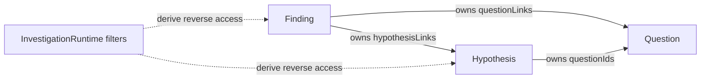
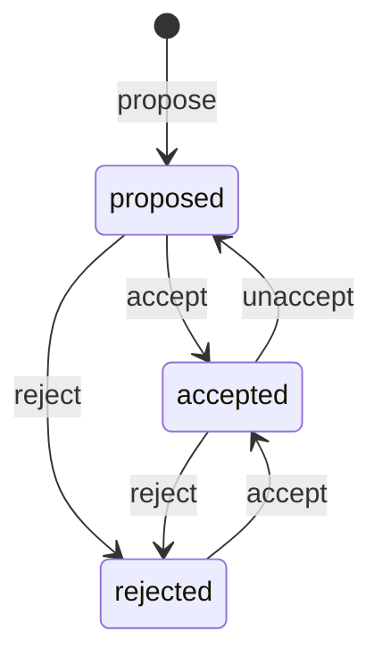

# Finding — Investigation Domain Design

## Summary

Finding is one of the three record types owned by the
[Investigation capability](./investigation-design.md). It is a durable,
reference-grounded claim: what was observed, what material it refers to, and
what conclusion or implication was drawn.

Finding is not a separate capability. It has no standalone service, store,
database, startup factory, endpoint registrar, or import alias. Callers create
and access Findings through the single `InvestigationRuntime`.

## Outcomes

Investigation can use a Finding to:

- persist an extracted fact, observation, or inference;
- ground it in one or more lightweight resource or URL references;
- relate it to Questions and Hypotheses with an optional settled meaning;
- flag individual references for review and derive whether the Finding may be
  stale;
- accept or reject the claim; and
- idempotently admit an accepted claim into Knowledge.

## What a Finding is not

- It is not raw evidence attached to one Derived Output generation. Evidence
  is generation-time provenance; a Finding is independently managed and
  curated.
- It is not a replacement for referenced material. The resource or webpage
  remains authoritative; the Finding is an interpretation.
- It is not a first-class Source. References point to existing resource IDs or
  URLs.
- It has no attachment mechanism. Upload material through General Files and
  reference that resource.

## Finding model

`Finding` is the only public representation of this record:

```ts
type FindingStatus = "proposed" | "accepted" | "rejected";

type FindingRelationship =
  | "supports"
  | "refutes"
  | "qualifies"
  | "contextualizes";

interface FindingQuestionLink {
  readonly questionId: string;
  /** Omit when the Finding is relevant but unclassified. */
  readonly relationship?: FindingRelationship;
}

interface FindingHypothesisLink {
  readonly hypothesisId: string;
  /** Omit when the Finding is relevant but unclassified. */
  readonly relationship?: FindingRelationship;
}

interface Finding {
  readonly id: string;
  readonly claim: string;
  readonly references: readonly FindingReference[];
  readonly commentary?: string;
  readonly status: FindingStatus;
  readonly tags: readonly string[];

  /** Authoritative relationships owned by the Finding. */
  readonly questionLinks: readonly FindingQuestionLink[];
  readonly hypothesisLinks: readonly FindingHypothesisLink[];

  /** Existing internal Knowledge source ID; present only while accepted. */
  readonly knowledgeSourceId?: string;

  readonly createdBy: string;
  readonly updatedBy: string;
  readonly createdAt: string;
  readonly updatedAt: string;
  readonly deletedAt?: string;
}
```

Findings are mutable and do not add a domain revision or custom conflict
protocol. Authored mutations use Investigation's serial queue and deterministic
last-write-wins order.

## References

There is no generic Source object. A `FindingReference` uses the identity and
revision convention already owned by a resource, or an ordinary webpage URL:

```ts
type FindingReference =
  | {
      readonly kind: "resource";
      readonly resourceKind: string;
      readonly resourceId: string;
      /** Optional subresource locator, such as a slide or connector item. */
      readonly locator?: string;
      /** Required when the known resource owner exposes revisions. */
      readonly resourceRevision?: number | string;
      readonly span?: FindingReferenceSpan;
      readonly note?: string;
      readonly needsReview?: boolean;
    }
  | {
      readonly kind: "url";
      readonly href: string;
      /** When this external page was retrieved or observed. */
      readonly observedAt: string;
      readonly span?: FindingReferenceSpan;
      readonly note?: string;
      readonly needsReview?: boolean;
    };

type FindingReferenceSpan =
  | { kind: "characters"; start: number; end: number }
  | { kind: "lines"; startLine: number; endLine: number };

const findingNeedsReview = (finding: Finding): boolean =>
  finding.references.some((reference) => reference.needsReview === true);
```

Revision values retain the owning capability's native type:

- General Files expose a numeric resource revision; their content-addressed ID
  also pins uploaded bytes.
- Connector resource manifests currently expose a numeric Connector revision.
  A precise item integration may use its string provider `revisionToken`.
- Documents and Decks expose numeric revisions through their owners.
- Known revisioned resource kinds must record the revision used. Only an owner
  that exposes no revision may omit `resourceRevision`.
- A webpage has no controlled revision. `observedAt` records when it was seen
  and does not imply future change detection.

`span` and `note` are optional. Character spans use UTF-16 code units and line
spans are 1-based, matching Derived Outputs evidence.

## Review and staleness

Each reference may be marked `needsReview: true`. Investigation provides
operations to mark or clear that flag by current reference index. Clearing it
means a caller validated the reference against the current material; it does
not change the claim or Finding status.

The Finding-level answer to “might this be stale?” is always the derived
`findingNeedsReview` function. There is no stored Finding stale field,
review-state enum, review timestamp, review-history entity, or automatic
webpage-change subsystem.

An owning resource may call the mark operation when it already knows content
changed, but that optional integration is not required for Findings to work.

## Relationship meaning and ownership

The optional relationship has exactly four meanings:

- `supports`: the Finding favors the Question or Hypothesis;
- `refutes`: the Finding weighs against it;
- `qualifies`: the Finding narrows, conditions, or limits it; and
- `contextualizes`: the Finding supplies background or explains why it is
  worth considering without supporting or refuting it.

Finding persists both link arrays and is their only mutable authority.
Hypothesis separately owns `questionIds`; Question stores no reverse links.

Investigation derives reverse access through its ordinary filters:

```ts
await investigation.listFindings({ questionId });
await investigation.listFindings({ hypothesisId });
await investigation.listHypotheses({ questionId });
```

The returned Finding contains the matching link, so no inverse relationship
type or assembled projection is needed. A reverse `supports` query result still
means “the Finding supports the target.”



## Status lifecycle



Findings may be edited in any status. Deletion is outside the status machine:
it sets `deletedAt`, removes Knowledge if necessary, and makes the Finding
absent from ordinary Investigation reads.

## Investigation runtime functions

The Finding portion of the single runtime is:

```ts
interface InvestigationRuntime {
  proposeFinding(request: ProposeFindingRequest): Promise<Finding>;
  updateFinding(id: string, request: UpdateFindingRequest): Promise<Finding>;
  acceptFinding(id: string): Promise<Finding>;
  unacceptFinding(id: string): Promise<Finding>;
  rejectFinding(id: string): Promise<Finding>;
  markFindingReferenceForReview(
    id: string,
    referenceIndex: number
  ): Promise<Finding>;
  clearFindingReferenceReview(
    id: string,
    referenceIndex: number
  ): Promise<Finding>;
  getFinding(id: string): Promise<Finding | null>;
  listFindings(filter?: FindingFilter): Promise<Finding[]>;
  deleteFinding(id: string): Promise<void>;
}

interface ProposeFindingRequest {
  readonly claim: string;
  readonly references: readonly FindingReference[];
  readonly commentary?: string;
  readonly tags?: readonly string[];
  readonly questionLinks?: readonly FindingQuestionLink[];
  readonly hypothesisLinks?: readonly FindingHypothesisLink[];
}

interface UpdateFindingRequest {
  readonly claim?: string;
  readonly references?: readonly FindingReference[];
  readonly commentary?: string | null;
  readonly tags?: readonly string[];
  readonly questionLinks?: readonly FindingQuestionLink[];
  readonly hypothesisLinks?: readonly FindingHypothesisLink[];
}

interface FindingFilter {
  readonly status?: FindingStatus;
  readonly questionId?: string;
  readonly hypothesisId?: string;
}
```

The mark/clear operations reject an out-of-range index and change only that
reference's `needsReview` flag. They do not require a reference ID.

## Knowledge integration and idempotent acceptance

When `acceptFinding` runs:

1. Investigation reads the current non-deleted Finding and computes a digest of
   its claim.
2. It calls `knowledge.add` with stable `sourceId = finding:{id}`, label
   `finding`, the claim digest as Knowledge revision, and the claim text.
3. It conditionally records `accepted` and `knowledgeSourceId` only if the
   stored claim still matches the indexed claim.
4. If a serial edit won the race, it reloads and repeats with the current claim.

Repeated concurrent acceptance uses the same Knowledge source ID and revision,
so ingestion is skipped when already current and all callers converge on the
same accepted state. The implementation must document this idempotency beside
the conditional retry.

An accepted claim edit calls `knowledge.add` with the same source ID and a new
claim digest. Metadata-only edits do not re-index. `unacceptFinding`, rejection
of an accepted Finding, and deletion remove the stable Knowledge source.

`knowledgeSourceId` is an existing internal Knowledge term, not a Source domain
object and never a `FindingReference`.

## Context integration

An accepted Finding may appear in Context as:

```ts
const entry: ContextEntry = { id: findingId, kind: "finding" };
```

The shared resource resolver receives Investigation and maps a live accepted
Finding to its `knowledgeSourceId`. Proposed, rejected, missing, or deleted
Findings resolve to no Knowledge source.

## Endpoints

The single Investigation endpoint registrar exposes:

| Method | Path | Queue | Runtime method |
|---|---|---|---|
| `POST` | `/findings/propose` | concurrent | `proposeFinding` |
| `POST` | `/findings/accept` | concurrent | `acceptFinding` |
| `POST` | `/findings/update` | serial | `updateFinding` |
| `POST` | `/findings/unaccept` | serial | `unacceptFinding` |
| `POST` | `/findings/reject` | serial | `rejectFinding` |
| `POST` | `/findings/mark-reference-review` | serial | `markFindingReferenceForReview` |
| `POST` | `/findings/clear-reference-review` | serial | `clearFindingReferenceReview` |
| `GET` | `/findings/get?id=...` | concurrent | `getFinding` |
| `GET` | `/findings/list?status=...&questionId=...&hypothesisId=...` | concurrent | `listFindings` |
| `DELETE` | `/findings/delete?id=...` | serial | `deleteFinding` |

IDs remain in bodies or query strings because the transport does not support
path parameters.

## Persistence

The central `SQLiteInvestigationStore` creates this table together with the
Question and Hypothesis tables on its one connection:

```sql
CREATE TABLE IF NOT EXISTS inv_${prefix}_findings (
  id                    TEXT PRIMARY KEY,
  claim                 TEXT NOT NULL,
  references_json       TEXT NOT NULL,
  commentary            TEXT,
  status                TEXT NOT NULL
                          CHECK (status IN ('proposed','accepted','rejected')),
  tags_json             TEXT NOT NULL DEFAULT '[]',
  question_links_json   TEXT NOT NULL DEFAULT '[]',
  hypothesis_links_json TEXT NOT NULL DEFAULT '[]',
  knowledge_source_id   TEXT,
  created_by            TEXT NOT NULL,
  updated_by            TEXT NOT NULL,
  created_at            TEXT NOT NULL,
  updated_at            TEXT NOT NULL,
  deleted_at            TEXT
);

CREATE INDEX IF NOT EXISTS inv_${prefix}_findings_recent
  ON inv_${prefix}_findings(status, updated_at DESC)
  WHERE deleted_at IS NULL;

CREATE INDEX IF NOT EXISTS inv_${prefix}_findings_knowledge_source
  ON inv_${prefix}_findings(knowledge_source_id)
  WHERE deleted_at IS NULL AND status = 'accepted';
```

There is no Finding-specific database connection. Relationship JSON remains on
the authoritative Finding row; no mirrored Question/Hypothesis columns or link
table is introduced.

## Logging

Finding events use the shared Logger under `investigation.findings.*`. Logs
include operation, Finding ID, actor ID, status transition, reference/link and
review-needed counts, Knowledge outcome, duration, and errors. They do not
include claims, notes, locators, or URLs.

## Research and Derived Outputs integration

Research receives one `InvestigationRuntime`, uses `listFindings` for Question
or Hypothesis traversal, and may create proposed Findings from its results.
Accepted Findings are also retrievable through Knowledge. Derived Output
evidence may be promoted into a Finding using the same runtime; no separate
Findings capability is required.

## Invariants

1. `Finding` is the only public Finding representation.
2. Every Finding has a non-empty claim and at least one reference.
3. Known revisioned resources record their owner's numeric or string revision;
   URLs record `observedAt`.
4. `findingNeedsReview` is derived from reference flags; no Finding stale field
   is stored.
5. Accepted Findings have `knowledgeSourceId` and idempotently converge on one
   Knowledge source.
6. Finding owns all classified Question/Hypothesis links; reverse access is a
   filtered Investigation query.
7. Relationship values are optional and exactly `supports`, `refutes`,
   `qualifies`, or `contextualizes`.
8. Finding acceptance is concurrent/idempotent; authored edits, review
   changes, unaccept, reject, and delete are serial last-write-wins.
9. Soft-deleted Findings are absent from normal Investigation reads and removed
   from Knowledge when previously accepted.
