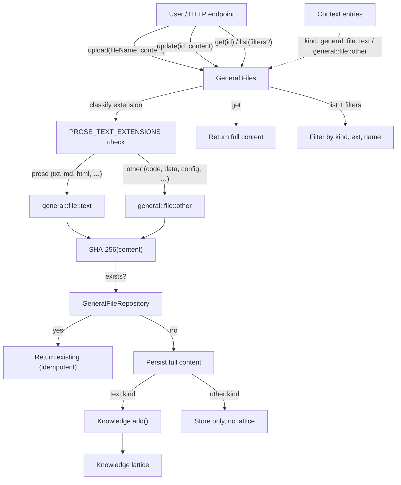

# General Files Capability — Design

## Summary

General Files is a **regular capability** (`3-capabilities/general-files/`) that
owns user-uploaded files. It accepts any file by extension, hashes the content
for a stable ID, persists the full content, and — for prose-text files only —
admits the content into the Knowledge lattice.

Every file carries a kind-string that encodes all type information. There are
two sub-kinds:

- `"general::file::text"` — prose documents. Admitted to the Knowledge lattice.
- `"general::file::other"` — everything else. Stored but not semantically indexed.

See Extension validation below for the full list of prose extensions.

The extension-to-kind mapping is explicit. Unknown extensions default to
`"other"` — nothing is rejected at the door, but only prose files get indexed.

Because the content is read and hashed at upload time, identical files produce
identical IDs. Re-uploading the same file is idempotent — the existing entry is
returned with no duplicate storage work.

---

## Kind model

```ts
type GeneralFileKind = "general::file::text" | "general::file::other";
```

The kind encodes:
- `general` — the owning capability namespace
- `file` — the resource shape (always a single file)
- `text` — prose document, admitted to Knowledge lattice
- `other` — anything else, stored but not semantically indexed

Kind is determined at upload time from the extension. See Extension validation
below for the full mapping.

---

## Where it lives

```
apps/backend/src/
  3-capabilities/
    general-files/
      domain/
        model.ts           # GeneralFile, GeneralFileVersion, GeneralFileKind
        text-extensions.ts # canonical text extension allowlist
        errors.ts          # UnsupportedExtension, FileTooLarge, etc.
      application/
        uploadService.ts   # hash, persist, admit to Knowledge
        updateService.ts   # content replacement with re-hash
        readService.ts     # get by ID, list
      ports/
        repository.ts      # GeneralFileRepository interface
        knowledge.ts        # Knowledge admission port
      persistence/
        migrations/
          001-general-files.ts
        sqliteGeneralFileRepository.ts
      index.ts
  4-job-wiring/
    general-files/
      registerGeneralFileEndpointMappings.ts
      createGeneralFileJobs.ts
```

---

## Core types

```ts
/**
 * Prose-text extensions — files with these extensions are classified as
 * "general::file::text" and admitted to the Knowledge lattice.
 */
const PROSE_TEXT_EXTENSIONS = new Set([
  "txt", "md", "markdown", "rst", "org", "tex",
  "html", "htm",
  "log",
]);

// PDF and DOCX are binary containers, so they remain `other` until a text
// extractor is introduced.

/** Everything not in PROSE_TEXT_EXTENSIONS defaults to "general::file::other". */
type GeneralFileKind = "general::file::text" | "general::file::other";

function kindFromExtension(ext: string): GeneralFileKind {
  return PROSE_TEXT_EXTENSIONS.has(ext) ? "general::file::text" : "general::file::other";
}

interface GeneralFile {
  /** Content-addressed: SHA-256 of the UTF-8 transport string, hex-encoded. */
  readonly id: string;
  readonly kind: GeneralFileKind;
  /** Original filename at upload time. */
  readonly fileName: string;
  /** Detected extension, lowercased. */
  readonly extension: string;
  /**
   * Full UTF-8 transport string. For text-kind files this is prose. For
   * other-kind files the string is opaque and may contain base64 by caller
   * convention; this capability does not decode it.
   */
  readonly content: string;
  /** UTF-8 byte length of the stored transport string. */
  readonly byteSize: number;
  /** SHA-256 of content. Matches id. */
  readonly contentHash: string;
  /** Revision counter, incremented on update. Starts at 1. */
  readonly revision: number;
  /**
   * ID of the Knowledge source, if this is a text-kind file.
   * null for other-kind files — they are not admitted to the lattice.
   */
  readonly knowledgeSourceId: string | null;
  /** When this file replaced another, the previous file's ID. */
  readonly replacesId?: string;
  /** When this file was replaced, the new file's ID. */
  readonly replacedById?: string;
  readonly createdAt: string;
  readonly updatedAt: string;
  readonly deletedAt?: string;
}

interface GeneralFileUploadRequest {
  fileName: string;
  content: string; // UTF-8 transport string; opaque for other-kind files
}

interface GeneralFileUpdateRequest {
  content: string;
}

type GeneralFileUploadResult =
  | { kind: "created"; file: GeneralFile; knowledge?: KnowledgeAddResult }
  | { kind: "reused"; file: GeneralFile; message: "identical content already exists" };

type GeneralFileUpdateResult =
  | { kind: "updated"; file: GeneralFile; knowledge?: KnowledgeAddResult }
  | { kind: "unchanged"; file: GeneralFile; message: "new content identical to current" };

interface KnowledgeAddResult {
  sourceId: string;
  windowsAdded: number;
  windowsReused: number;
}

// -- Search / filter support --

type GeneralFileFilter =
  | { kind: "by-kind"; value: GeneralFileKind }
  | { kind: "by-extension"; value: string }
  | { kind: "by-name-contains"; value: string }
  | { kind: "by-name-starts-with"; value: string }
  | { kind: "by-name-ends-with"; value: string };

interface GeneralFilesListRequest {
  /** Optional filters. If empty, returns all files. */
  filters?: GeneralFileFilter[];
}
```

---

## Extension validation & kind assignment

General Files accepts **all extensions** — nothing is rejected at upload. The
extension determines the **kind**, which determines whether the file enters the
Knowledge lattice.

When a file is uploaded:

1. Extract the extension from `fileName` — everything after the last `.`,
   lowercased.
2. If the extension is in `PROSE_TEXT_EXTENSIONS` → kind is
   `"general::file::text"`. Validate content as valid UTF-8 and admit to
   Knowledge lattice.
3. Otherwise → kind is `"general::file::other"`. Store the transport string
   as-is (opaque content, no prose validation) and **do not** admit to Knowledge. The file is
   still retrievable by ID and appears in list/search results.

No extension is rejected. Users can upload any file — only prose documents
get semantically indexed.

```ts
/** Prose-text extensions that trigger Knowledge admission. */
const PROSE_TEXT_EXTENSIONS = new Set([
  "txt", "md", "markdown", "rst", "org", "tex",
  "html", "htm",
  "log",
]);

function classifyExtension(ext: string): GeneralFileKind {
  return PROSE_TEXT_EXTENSIONS.has(ext)
    ? "general::file::text"
    : "general::file::other";
}
```

---

## ID strategy

```ts
function generalFileId(content: string): string {
  return createHash("sha256").update(content, "utf8").digest("hex");
}
```

The ID **is** the SHA-256 of the content. This means:
- Identical files always map to the same ID.
- Re-uploading the same content returns the existing record (idempotent).
- Updating content changes the ID — an update is a replacement that creates a
  new `GeneralFile` record and soft-deletes the old one with a `replacesId`
  reference.

```ts
interface GeneralFile {
  // ...existing fields...
  /** When this file replaced another, the previous file's ID. */
  readonly replacesId?: string;
  /** When this file was replaced, the new file's ID. */
  readonly replacedById?: string;
}
```

---

## Knowledge lattice integration

Only **text-kind** files (`"general::file::text"`) are admitted to Knowledge.
Other-kind files are stored but bypass the lattice entirely.

```ts
// During upload:
const kind = classifyExtension(extension);
if (kind === "general::file::text") {
  const sourceId = `general-file:${file.id}`;
  const knowledgeResult = await knowledge.add({
    sourceId,
    label: "general-file",
    revision: file.contentHash,
    text: file.content,
  });
  file.knowledgeSourceId = sourceId;
} else {
  file.knowledgeSourceId = null;
}
```

On update, if the kind changes between text and other (possible if the new
content has a different extension baked into its filename), the old Knowledge
source (if any) is removed and the new content is either admitted or skipped.

```ts
if (oldFile.knowledgeSourceId) {
  await knowledge.remove(oldFile.knowledgeSourceId);
}
if (newFile.kind === "general::file::text") {
  const sourceId = `general-file:${newFile.id}`;
  await knowledge.add({ sourceId, label: "general-file", ... });
  newFile.knowledgeSourceId = sourceId;
}
```

---

## Relationships



---

## Endpoints

| Endpoint | Method | Description |
|----------|--------|-------------|
| `#general-files/upload` | POST | Upload a file. Body: `{ fileName, content }`. Accepts all extensions; kind is derived from extension. |
| `#general-files/update` | POST | Replace content of an existing file. Body: `{ id?, content }`. If `id` is omitted, the new content hash is used. |
| `#general-files/get` | POST | Get a file by ID. Body: `{ id }`. Returns full `GeneralFile`. |
| `#general-files/list` | POST | List files with optional filters. Body: `{ filters? }`. Returns `GeneralFile[]` (metadata, no content). See `GeneralFileFilter`. |
| `#general-files/delete` | POST | Soft-delete a file. Body: `{ id }`. Removes from Knowledge lattice if applicable. |

---

## Job wiring

| Operation | Queue | Response | Reason |
|-----------|-------|----------|--------|
| `upload` | `concurrent` | `inline` | Hashing + SQLite insert (+ Knowledge embed for text-kind). Concurrent-safe due to content-addressed IDs. |
| `update` | `concurrent` | `inline` | Replacement + re-embed if text-kind. |
| `get` | `concurrent` | `inline` | Read-only. |
| `list` | `concurrent` | `inline` | Read-only with optional filters. |
| `delete` | `serial` | `inline` | Ordered canonical mutation. |

---

## SQLite schema

```sql
CREATE TABLE general_files (
  id TEXT PRIMARY KEY
    CHECK (length(id) = 64 AND id NOT GLOB '*[^0-9a-f]*'),
  kind TEXT NOT NULL
    CHECK (kind IN ('general::file::text', 'general::file::other')),
  file_name TEXT NOT NULL
    CHECK (length(trim(file_name)) > 0),
  extension TEXT NOT NULL,
  content TEXT NOT NULL,
  byte_size INTEGER NOT NULL
    CHECK (byte_size >= 0),
  content_hash TEXT NOT NULL
    CHECK (length(content_hash) = 64 AND content_hash NOT GLOB '*[^0-9a-f]*'),
  revision INTEGER NOT NULL
    CHECK (revision >= 1),
  knowledge_source_id TEXT,
  replaces_id TEXT,
  replaced_by_id TEXT,
  created_at TEXT NOT NULL,
  updated_at TEXT NOT NULL,
  deleted_at TEXT,
  CHECK (byte_size = length(CAST(content AS BLOB))),
  CHECK (content_hash = id),
  FOREIGN KEY (replaces_id)
    REFERENCES general_files(id)
    ON UPDATE CASCADE ON DELETE SET NULL,
  FOREIGN KEY (replaced_by_id)
    REFERENCES general_files(id)
    ON UPDATE CASCADE ON DELETE SET NULL
);

CREATE INDEX general_files_kind_created
  ON general_files(kind, deleted_at IS NULL, created_at DESC);

CREATE INDEX general_files_extension
  ON general_files(extension, deleted_at IS NULL);

-- Support name-based search/filter
CREATE INDEX general_files_file_name
  ON general_files(file_name COLLATE NOCASE, deleted_at IS NULL)
  WHERE deleted_at IS NULL;

-- Enforce one active file per content hash
CREATE UNIQUE INDEX general_files_active_content
  ON general_files(content_hash)
  WHERE deleted_at IS NULL;
```

---

## Invariants

1. **No rejection at the door:** Any extension is accepted. The extension only
   determines the kind (`text` vs `other`) and whether Knowledge admission
   happens.
2. **Content-addressed identity:** `id === SHA-256(content)`. Always.
3. **Text-kind → Knowledge lattice:** `general::file::text` files are
   automatically admitted to Knowledge. `general::file::other` files
   (`knowledgeSourceId = null`) are not.
4. **One active per hash:** The unique partial index ensures at most one
   non-deleted file per content hash.
5. **Knowledge sync on delete:** Deleting a text-kind file removes its
   Knowledge source. Other-kind files have nothing to remove.
6. **Update = replace:** Updating content creates a new record with a new
   content-addressed ID. The old record is soft-deleted with a `replacedById`
   link.
7. **Filter/search:** `list` supports filtering by kind, extension, and
   filename pattern (contains, starts-with, ends-with) so callers can find
   files without needing full text search.
