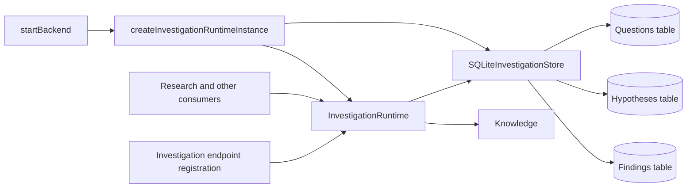

# Investigation Capability — Design

## Summary

Investigation is one project-scoped capability that defines and manages
Questions, Hypotheses, and Findings together. These records form one domain:
Questions frame the work, Hypotheses express claims to evaluate, and Findings
capture reference-grounded conclusions that bear on both.

The capability exposes one `InvestigationRuntime`, constructs one SQLite store,
and initializes all three tables on one database connection. Question,
Hypothesis, and Finding remain distinct record types, but they are not separate
capabilities and do not have separate public services or runtime projections.

This consolidation removes the artificial boundary that previously required
`RuntimeQuestion`, `RuntimeHypothesis`, assemblers, and narrow cross-capability
reader ports.

## Outcomes

Given project and actor context, Investigation can:

- create, update, read, list, and soft-delete Questions, Hypotheses, and
  Findings;
- manage Question answers and Hypothesis assessments;
- associate Hypotheses with Questions;
- associate Findings with Questions and Hypotheses using the settled optional
  relationship meanings;
- traverse those relationships without storing reverse copies;
- flag Finding references for review and derive whether a Finding may be
  stale; and
- idempotently admit accepted Findings into Knowledge.

Investigation is not a fourth persisted aggregate. It has no Investigation ID,
table, lifecycle, or record that contains all three collections.

## Capability boundary



Only `#investigation` is a public capability import. Internal files may split
Question, Hypothesis, and Finding logic for readability, and those files may
import each other's types. They do not become independent capability
boundaries.

## Canonical domain objects

Investigation exports exactly one domain representation for each record:

- `Question` — wording, context, current answer, assumptions, and Question
  status;
- `Hypothesis` — statement, rationale, assumptions, related Question IDs,
  Hypothesis status, and optional categorical confidence; and
- `Finding` — claim, lightweight references, Finding status, and authoritative
  Question/Hypothesis links.

There is no exported `PersistedQuestion`, `RuntimeQuestion`,
`PersistedHypothesis`, or `RuntimeHypothesis`. SQLite row shapes and mapping
helpers are private persistence details, not additional domain objects.

The capability does not recursively embed full related records inside these
objects. A caller traverses relationships through the same runtime, which
keeps object graphs finite and preserves one source of truth.

## Relationship ownership and traversal

```ts
type FindingRelationship =
  | "supports"
  | "refutes"
  | "qualifies"
  | "contextualizes";

interface FindingQuestionLink {
  readonly questionId: string;
  readonly relationship?: FindingRelationship;
}

interface FindingHypothesisLink {
  readonly hypothesisId: string;
  readonly relationship?: FindingRelationship;
}
```

Ownership is fixed:

- `Finding.questionLinks` owns Finding-to-Question relationships and their
  optional meaning.
- `Finding.hypothesisLinks` owns Finding-to-Hypothesis relationships and their
  optional meaning.
- `Hypothesis.questionIds` owns Hypothesis-to-Question association.
- `Question` stores no reverse arrays.
- `Hypothesis` stores no Finding array.

Reverse access is a filtered query on the owning records:

```ts
const questionFindings = await investigation.listFindings({ questionId });
const questionHypotheses = await investigation.listHypotheses({ questionId });
const hypothesisFindings = await investigation.listFindings({ hypothesisId });
```

Each returned Finding already contains the matching link and optional
relationship value. The value is always interpreted from the Finding toward
the target; it is never inverted by a reverse query.

When a reverse filter names a deleted or unavailable target, Investigation
returns an empty list. Target IDs may remain in the owning record;
Investigation does not cascade deletion or rewrite relationship history.

## Investigation runtime

`InvestigationRuntime` is the only public service/runtime object:

```ts
interface InvestigationRuntime {
  // Questions
  createQuestion(request: CreateQuestionRequest): Promise<Question>;
  updateQuestion(id: string, request: UpdateQuestionRequest): Promise<Question>;
  proposeQuestionAnswer(id: string, currentAnswer: string): Promise<Question>;
  confirmQuestionAnswer(id: string): Promise<Question>;
  clearQuestionAnswer(id: string): Promise<Question>;
  getQuestion(id: string): Promise<Question | null>;
  listQuestions(filter?: QuestionFilter): Promise<Question[]>;
  deleteQuestion(id: string): Promise<void>;

  // Hypotheses
  createHypothesis(request: CreateHypothesisRequest): Promise<Hypothesis>;
  updateHypothesis(
    id: string,
    request: UpdateHypothesisRequest
  ): Promise<Hypothesis>;
  getHypothesis(id: string): Promise<Hypothesis | null>;
  listHypotheses(filter?: HypothesisFilter): Promise<Hypothesis[]>;
  deleteHypothesis(id: string): Promise<void>;

  // Findings
  proposeFinding(request: ProposeFindingRequest): Promise<Finding>;
  updateFinding(id: string, request: UpdateFindingRequest): Promise<Finding>;
  acceptFinding(id: string): Promise<Finding>;
  unacceptFinding(id: string): Promise<Finding>;
  rejectFinding(id: string): Promise<Finding>;
  markFindingReferenceForReview(
    id: string,
    referenceIndex: number
  ): Promise<Finding>;
  clearFindingReferenceReview(
    id: string,
    referenceIndex: number
  ): Promise<Finding>;
  getFinding(id: string): Promise<Finding | null>;
  listFindings(filter?: FindingFilter): Promise<Finding[]>;
  deleteFinding(id: string): Promise<void>;
}

interface QuestionFilter {
  readonly status?: QuestionStatus;
  readonly tag?: string;
}

interface HypothesisFilter {
  readonly questionId?: string;
  readonly status?: HypothesisStatus;
}

interface FindingFilter {
  readonly questionId?: string;
  readonly hypothesisId?: string;
  readonly status?: FindingStatus;
}
```

The flat, entity-prefixed surface makes it clear that callers hold one runtime,
not three nested services. Research and other in-process consumers receive this
runtime and may snapshot returned domain objects when they need run-stable
inputs. Investigation does not persist a second runtime representation.

## Runtime factory and dependencies

```ts
function createInvestigationRuntime(
  store: InvestigationStore,
  knowledge: Knowledge,
  logger: Logger
): InvestigationRuntime;
```

The startup factory owns composition:

```ts
function createInvestigationRuntimeInstance(
  config: BackendConfig,
  knowledge: Knowledge,
  logger: Logger
): InvestigationRuntime;
```

It creates one `SQLiteInvestigationStore` for the project, then creates and
returns one runtime. `startBackend` holds one `investigation` value, emits one
readiness field, gives the same object to endpoint wiring and consumers, and
registers accepted-Finding resolution with the resource/Context boundary.

## Persistence

`SQLiteInvestigationStore` owns one `better-sqlite3` connection to:

```text
./data/investigation.db
```

Its constructor performs one schema initialization that creates all three
project-prefixed tables:

```text
inv_${projectPrefix}_questions
inv_${projectPrefix}_hypotheses
inv_${projectPrefix}_findings
```

The schema is applied together on the same connection, preferably in one
SQLite transaction. There is no fourth Investigation table. The slice design
documents define the columns and checks for each table.

`InvestigationStore` is one internal port with entity-prefixed methods such as
`getQuestion`, `listHypotheses`, and `updateFinding`. It may use private helpers
to keep the implementation readable, but it does not export generic
repositories or three independent stores.

Relationship arrays remain JSON columns on their authoritative records.
Consolidation does not require foreign keys, join entities, mirrored columns,
or cascading deletes. Reverse filters can initially inspect the bounded JSON
arrays; indexes should be added only when measurements justify them.

## File layout

```text
apps/backend/src/
  1-init/create/investigation.ts

  3-capabilities/investigation/
    index.ts
    domain/model.ts
    application/investigationRuntime.ts
    ports/investigationStore.ts
    persistence/sqliteInvestigationStore.ts
    docs/
      README.md
      concepts.md
      types.md
      runtime.md
      flows.md
      invariants.md

  4-job-wiring/investigation/
    registerInvestigationEndpoints.ts

apps/backend/test/capabilities/investigation.test.ts
```

The initial implementation may keep private helpers in the runtime/store files.
Split them by domain only when file size materially harms readability; any such
split stays inside `#investigation`.

## Endpoints

One `registerInvestigationEndpoints` function registers all Question,
Hypothesis, and Finding routes. Existing resource-oriented paths remain
unchanged:

- `/questions/*`
- `/hypotheses/*`
- `/findings/*`

Consolidating the internal capability does not require an HTTP rename. The old
`/questions/runtime` and `/hypotheses/runtime` endpoints are removed because
there are no assembled runtime projection types.

Ingress parsing and error mapping are shared by the single registration group.
IDs remain in bodies or query strings because the transport has no path
parameters.

## Concurrency and mutation ordering

- Reads and list filters run on the concurrent queue.
- Authored content, relationship, status, review, and deletion mutations run on
  the serial queue and use deterministic last-write-wins order.
- Finding proposal may run concurrently because it creates an independent ID.
- `acceptFinding` is the explicit concurrent/idempotent exception. Stable
  Knowledge source identity plus claim digest makes repeated acceptance
  converge without duplicate admission.
- Accepted Finding edits, unaccept, reject, and delete preserve the existing
  Knowledge cleanup and conditional-commit rules described by the Findings
  design.

No Investigation-specific job graph, lock manager, or conflict-resolution
framework is introduced.

## Logging and errors

The runtime and endpoint registrar share one injected Logger. Event names are
grouped below `investigation.questions.*`, `investigation.hypotheses.*`, and
`investigation.findings.*`.

Logs include operation, record ID, actor ID, status transition, relationship or
reference counts, Knowledge outcome where relevant, duration, and error
name/message. They do not include Question text, answers, Hypothesis statements,
Finding claims, assumptions, notes, resource locators, or URLs. No Investigation
code calls `console`.

A small shared error family covers not-found, invalid input, and invalid
operation errors while preserving entity-specific messages. Unsupported enum
or relationship values fail at ingress.

## Integrations

- **Knowledge:** accepted Findings are admitted under stable source IDs and
  removed or refreshed according to the Findings lifecycle.
- **Context/resource registry:** accepted Findings resolve as
  `{ id, kind: "finding" }`; other Finding states do not resolve to Knowledge.
- **Research:** receives one `InvestigationRuntime` and uses ordinary get/list
  methods to access or create all three record types.
- **Derived Outputs:** evidence may be promoted into a Finding through the
  Investigation runtime; no separate Findings capability is required.

## Shared invariants

1. There is one Investigation runtime, one store, one SQLite connection, and
   exactly three Investigation tables per project.
2. `Question`, `Hypothesis`, and `Finding` are the only public domain objects
   for their respective records.
3. No runtime projection or assembler type exists for a Question or
   Hypothesis.
4. Finding links and Hypothesis `questionIds` are the only mutable relationship
   authorities; reverse access is derived by runtime list filters.
5. Relationship meanings are optional and limited to `supports`, `refutes`,
   `qualifies`, and `contextualizes`.
6. Deletion uses `deletedAt`; deleted records are absent from normal reads and
   are not represented as a domain status.
7. Authored edits are serial last-write-wins; Finding acceptance remains
   concurrent and idempotent.
8. No first-class Source, Investigation aggregate, answer revision,
   relationship entity, or automatic webpage-change subsystem is introduced.
