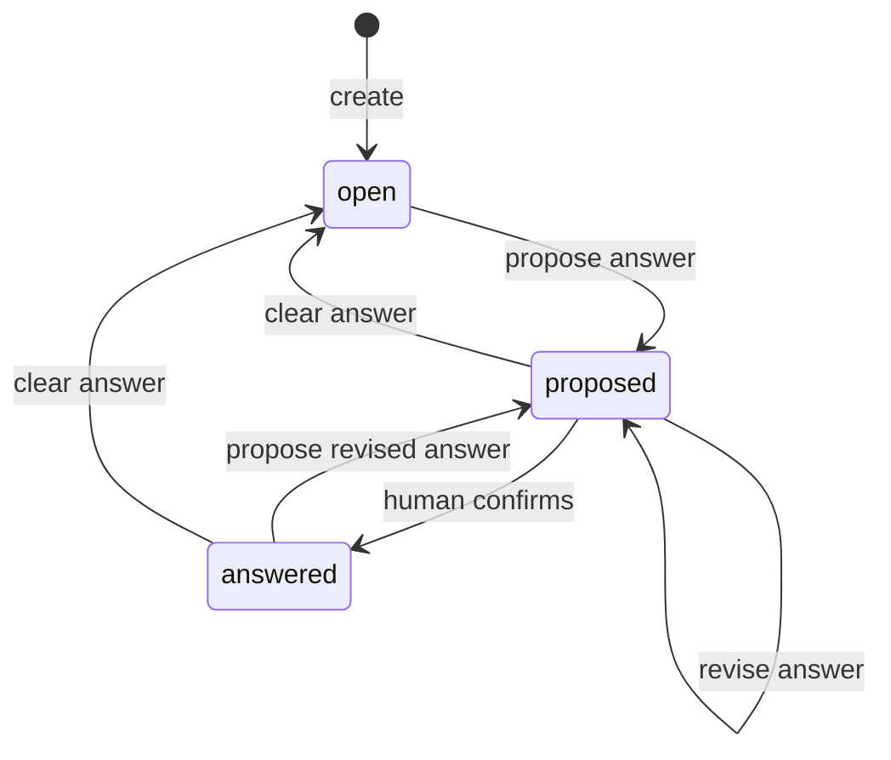

# Question — Investigation Domain Design

## Summary

Question is one of the three record types owned by the
[Investigation capability](./investigation-design.md). It records what the
project is trying to learn, decide, or verify: the wording, the context needed
to understand it, optional assumptions, and one current answer.

Question is not a separate capability. It has no standalone service, runtime
projection, store, database, startup factory, or import alias. Callers create
and access Questions through the single `InvestigationRuntime`.

## Outcomes

Investigation can use a Question to:

- record and edit durable research framing;
- distinguish unanswered work, a proposed answer, and a human-confirmed
  answer;
- expose one mutable current answer without adding answer revisions; and
- locate related Findings and Hypotheses through the runtime's filtered list
  methods.

`answered` does not guarantee factual correctness. It means a human confirmed
the current answer.

## Question model

`Question` is the only public representation of this record:

```ts
type IsoTimestamp = string;
type ActorId = string;

type QuestionStatus = "open" | "proposed" | "answered";

interface Question {
  /** Stable project-local identity. */
  readonly id: string;

  /** The question being asked. */
  readonly text: string;

  /** Optional framing, constraints, background, and research details. */
  readonly context?: string;

  /** The presently proposed or human-confirmed answer. */
  readonly currentAnswer?: string;

  /** Plain-text assumptions; empty means none were recorded. */
  readonly assumptions: readonly string[];

  readonly status: QuestionStatus;
  readonly tags: readonly string[];

  readonly createdBy: ActorId;
  readonly updatedBy: ActorId;
  readonly createdAt: IsoTimestamp;
  readonly updatedAt: IsoTimestamp;
  readonly deletedAt?: IsoTimestamp;
}
```

`context` intentionally combines framing, constraints, background, and any
other detail needed to understand or research the Question. Those concepts are
not separate required fields.

`currentAnswer` is mutable and may change as research progresses. There is no
Answer entity, immutable answer-revision model, `answeredAt`, `answeredBy`, or
separate approval field. The platform's general change history may capture
edits if that becomes a broader requirement.

Assumptions are plain strings. They have no IDs, statuses, confidence values,
approval workflow, or independent lifecycle.

## Status semantics

| Status | Meaning |
|---|---|
| `open` | No candidate conclusion is ready for approval. `currentAnswer` is absent. |
| `proposed` | `currentAnswer` contains a candidate that a human has not confirmed. |
| `answered` | `currentAnswer` is the conclusion currently confirmed by a human. |

The status is the approval signal. Proposing or revising an answer sets
`proposed`; confirming it sets `answered`; clearing it sets `open`.



Deletion is outside this lifecycle. It sets `deletedAt`, and ordinary
Investigation reads then treat the Question as absent.

## Relationships

Question stores no Finding IDs and no Hypothesis IDs.

- Findings own `questionLinks` and their optional relationship meanings.
- Hypotheses own `questionIds`.
- Investigation derives reverse access from those fields.

```ts
const findings = await investigation.listFindings({ questionId });
const hypotheses = await investigation.listHypotheses({ questionId });
```

Each returned Finding contains the matching `FindingQuestionLink`. Its optional
relationship retains the Finding-to-Question direction; `supports` means the
Finding supports the Question.

This exposes both reverse relationships without adding mutable reverse arrays,
a `RuntimeQuestion`, or a recursively nested object graph. Deleted related
records are omitted from ordinary list results, and filtering by a deleted
Question returns an empty list. No cascade or link rewrite is required.

## Investigation runtime functions

The Question portion of the single runtime is:

```ts
interface InvestigationRuntime {
  createQuestion(request: CreateQuestionRequest): Promise<Question>;
  updateQuestion(id: string, request: UpdateQuestionRequest): Promise<Question>;
  proposeQuestionAnswer(id: string, currentAnswer: string): Promise<Question>;
  confirmQuestionAnswer(id: string): Promise<Question>;
  clearQuestionAnswer(id: string): Promise<Question>;
  getQuestion(id: string): Promise<Question | null>;
  listQuestions(filter?: QuestionFilter): Promise<Question[]>;
  deleteQuestion(id: string): Promise<void>;
}

interface CreateQuestionRequest {
  readonly text: string;
  readonly context?: string;
  readonly assumptions?: readonly string[];
  readonly tags?: readonly string[];
}

interface UpdateQuestionRequest {
  readonly text?: string;
  readonly context?: string | null;
  readonly assumptions?: readonly string[];
  readonly tags?: readonly string[];
}

interface QuestionFilter {
  readonly status?: QuestionStatus;
  readonly tag?: string;
}
```

Creation starts in `open`. `proposeQuestionAnswer` sets or replaces
`currentAnswer` and sets `proposed`. `confirmQuestionAnswer` is the explicit
human confirmation operation and is harmless when repeated for the same
answer. `clearQuestionAnswer` removes the value and sets `open`.

Question methods share the Investigation store, Logger, actor/clock context,
and validation boundary. Authored mutations run serially in deterministic
last-write-wins order; get/list operations run concurrently.

## Endpoints

The single Investigation endpoint registrar exposes:

| Method | Path | Queue | Runtime method |
|---|---|---|---|
| `POST` | `/questions/create` | serial | `createQuestion` |
| `POST` | `/questions/update` | serial | `updateQuestion` |
| `POST` | `/questions/propose-answer` | serial | `proposeQuestionAnswer` |
| `POST` | `/questions/confirm-answer` | serial | `confirmQuestionAnswer` |
| `POST` | `/questions/clear-answer` | serial | `clearQuestionAnswer` |
| `GET` | `/questions/get?id=...` | concurrent | `getQuestion` |
| `GET` | `/questions/list?status=...&tag=...` | concurrent | `listQuestions` |
| `DELETE` | `/questions/delete?id=...` | serial | `deleteQuestion` |

There is no `/questions/runtime` endpoint. In-process consumers already hold
`InvestigationRuntime`; HTTP consumers traverse relationships with the existing
filtered Finding and Hypothesis list endpoints.

## Persistence

The central `SQLiteInvestigationStore` creates this table together with the
Hypothesis and Finding tables on its one connection:

```sql
CREATE TABLE IF NOT EXISTS inv_${prefix}_questions (
  id                   TEXT PRIMARY KEY,
  text                 TEXT NOT NULL,
  context              TEXT,
  current_answer       TEXT,
  assumptions_json     TEXT NOT NULL DEFAULT '[]',
  status               TEXT NOT NULL
                         CHECK (status IN ('open', 'proposed', 'answered')),
  tags_json            TEXT NOT NULL DEFAULT '[]',
  created_by           TEXT NOT NULL,
  updated_by           TEXT NOT NULL,
  created_at           TEXT NOT NULL,
  updated_at           TEXT NOT NULL,
  deleted_at           TEXT
);

CREATE INDEX IF NOT EXISTS inv_${prefix}_questions_recent
  ON inv_${prefix}_questions(status, updated_at DESC)
  WHERE deleted_at IS NULL;
```

There are no Finding/Hypothesis reverse columns and no Question-specific
database connection. SQLite row mapping is private implementation detail;
`Question` remains the only exported record type.

## Logging

Question events use the shared Logger under `investigation.questions.*`.
Mutation logs include operation, Question ID, actor ID, prior/next status,
assumption/tag counts, outcome, and duration. Logs do not include Question text,
context, assumptions, or answer content.

## Research integration

Research receives one `InvestigationRuntime`, calls `getQuestion`, and uses
`listFindings({ questionId })` and `listHypotheses({ questionId })` when it needs
related records. Research may snapshot those canonical objects at run start;
Investigation does not define or persist a separate runtime Question.

## Invariants

1. `Question` is the only public Question representation.
2. `text` is non-empty.
3. `open` has no `currentAnswer`.
4. `proposed` and `answered` have a non-empty `currentAnswer`.
5. `answered` means explicit human confirmation; there is no approval field.
6. Assumptions are plain text with no nested lifecycle.
7. Reverse relationships are runtime filters over Finding and Hypothesis
   authority, never Question columns.
8. Soft-deleted Questions are absent from normal Investigation reads.
