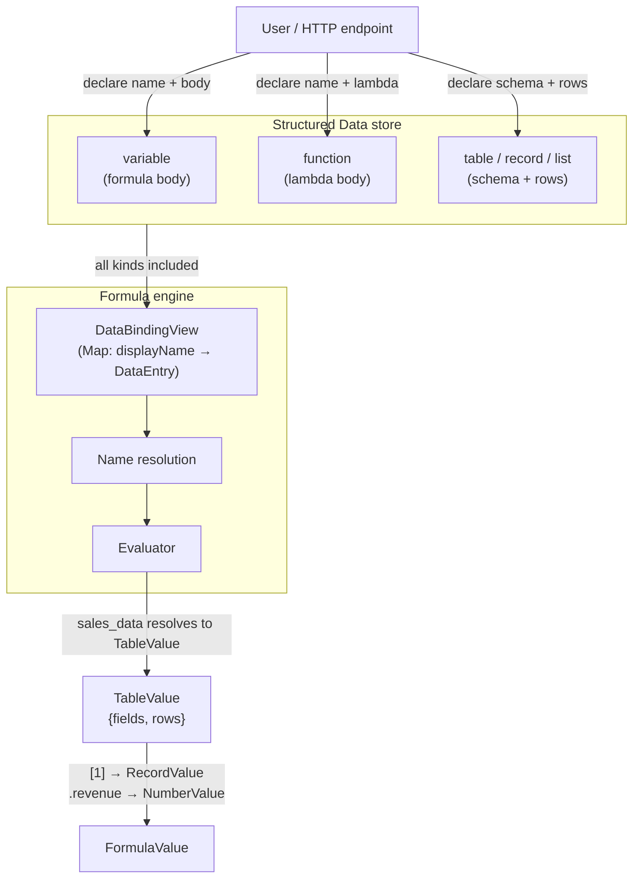

# Structured Data Capability — Design

## Summary

Structured Data is the **regular capability** that owns every explicitly-declared,
named value in a project under one unified
identity model. Every entry is a named value; the `kind` describes the storage
shape of the body:

| kind       | body                                   | Formula value at eval time                         |
|------------|----------------------------------------|----------------------------------------------------|
| `variable` | formula source text                    | any ValueKind (text, number, table, record, …)     |
| `function` | lambda source text                     | FunctionValue                                      |
| `table`    | schema + rows (many fields, many rows) | TableValue                                         |
| `record`   | schema + rows (many fields, one row)   | RecordValue                                        |
| `list`     | schema + rows (one unnamed field, many rows) | ListValue                                   |

A record is a table with one row. A list is a table with one field. From
Formula's perspective all five kinds are identical: a display name resolves to a
stable ID, which resolves to a value. `sales_data[1].revenue` works naturally —
`sales_data` resolves to a `TableValue`, `[1]` returns the first row as a
`RecordValue`, `.revenue` extracts the field.

Scoping is achieved through naming conventions (e.g. `"doc.sales_data"`) rather
than a dedicated namespace field. The capability is accessible at **user** and
**project** persistence scope, using the same two-table pattern as Context.

---

## Relationships



---

## Traversal algebra (Formula)

The four collection kinds have a precise algebra for indexing and projection:

| Operation          | Input    | Result   | Notes                                          |
|--------------------|----------|----------|------------------------------------------------|
| `T[n]`             | table    | record   | nth row; produces all fields of that row       |
| `T.field`          | table    | list     | all values in `field` column across all rows   |
| `R.field`          | record   | value    | single field from single-row value             |
| `L[n]`             | list     | value    | nth element; list has one implicit field       |

**Commutativity**: `T[n].field == T.field[n]` — positional index then project
equals project then positional index. Both produce the same scalar.

**Restrictions**:
- A list cannot be projected (`.field`) — it has no named field; use `[n]` only.
- A record cannot be meaningfully indexed (`[n]`) — it has exactly one row;
  use `.field` only.

These fall out naturally from Formula's existing `[n]` (index) and `.field`
(project) evaluation rules applied to `TableValue`, `RecordValue`, and
`ListValue`. No Formula engine changes are required.

---

## Single name authority

Formula's `BoundFormulaReference` uses `DataEntry.id` as the stable binding key.
Structured Data is the only runtime source for project Formula names.

---

## Core types

```ts
type DataKind = "variable" | "function" | "table" | "record" | "list";

interface DataEntryBase {
  readonly id: string;                      // stable UUID — never changes
  readonly kind: DataKind;
  readonly displayName: string;             // current user-visible name
  readonly description: string;            // human/AI summary
  readonly contextEntries: ContextEntry[]; // which resources this is relevant to
  readonly revision: number;              // monotone counter; starts at 1
  readonly createdAt: string;
  readonly updatedAt: string;
  readonly deletedAt?: string;
}

// variable and function — body is formula/lambda source text
interface FormulaEntry extends DataEntryBase {
  readonly kind: "variable" | "function";
  readonly body: string;
}

// The authoritative set of value kinds — used by FieldDef and as the
// resolved type annotation anywhere a value kind is needed.
type ValueKind =
  | "text" | "number" | "logic" | "date"
  | "table" | "record" | "list"
  | "function"
  | "unknown";  // escape hatch: not statically typeable

// schema field: name + expected resolved kind of each cell value.
// A field whose kind is "table", "record", or "list" means each cell in that
// column is itself a collection value (nested structure).
// A list entry has no named field — the value IS the entry; schema is inferred.
interface FieldDef {
  readonly name: string;
  readonly kind: ValueKind;
}

// a cell is either a literal value or a formula body that must resolve to
// the kind declared in the field's FieldDef
type CellLiteral = string | number | boolean | null;
type CellFormula = { formula: string };
type CellValue  = CellLiteral | CellFormula;

type DataRow = Record<string, CellValue>;

// table (many fields, many rows), record (many fields, one row),
// list (one unnamed field, many rows — schema has one synthetic field or is empty).
// All share the same storage shape.
interface CollectionEntry extends DataEntryBase {
  readonly kind: "table" | "record" | "list";
  readonly schema: FieldDef[];
  readonly rows: DataRow[];
  readonly rowCount: number;  // denormalised
}

type DataEntry = FormulaEntry | CollectionEntry;
```

`contextEntries` and `description` on every entry are what let callers ask
"which entries are relevant to this task?" in the query path.

---

## DataBindingView (Formula name resolution)

When Formula binds a formula source text, it needs a consistent
point-in-time view of all named entries — a `Map<displayName, DataEntry>` —
so that if a rename happens mid-bind the result is coherent and every
`BoundFormulaReference` records the stable ID and revision live at bind time.

All five kinds are included. Collection entries resolve to their structural
value (`TableValue`, `RecordValue`, `ListValue`); formula/function entries are
evaluated from their body.

```ts
interface DataBindingView {
  readonly id: string;
  readonly entries: ReadonlyMap<string, DataEntry>;  // keyed by displayName
  readonly viewRevision: number;   // max revision across all included entries
  readonly createdAt: string;
}
```

`viewRevision` lets callers detect staleness without re-reading the DB.

---

## Query (flat retrieval)

Initial implementation is a flat linear scan. No lattice or embedding.

```ts
interface DataQuery {
  readonly kind?: DataKind;         // omit to query all kinds
  readonly text?: string;           // substring match on displayName + description
  readonly scope?: ContextEntry[];  // only return entries whose contextEntries overlap
}

interface DataQueryResult {
  readonly entries: DataEntry[];
  readonly totalCount: number;
}
```

The `scope` filter narrows by context overlap: an entry matches if any of its
`contextEntries` keys (`kind:id`) appear in the query scope.

---

## AI-assisted table import (future path)

1. Parse Excel/CSV into candidate `schema` + rows.
2. Query Knowledge retrieval with file name, column headers, and row sample.
3. Pass retrieved passages + structure to the inference model.
4. Model returns a `description` and suggested `contextEntries`.
5. Persist the `CollectionEntry` with those fields populated.

The `description` and `contextEntries` fields are designed now so no schema
migration is needed when this flow is added.

---

## SQLite schema

Two tables per database (user + project persistence scope):

- `sd_user_${SHA256(userId).slice(0,16)}_entries`
- `sd_proj_${SHA256(projectId).slice(0,16)}_entries`

```sql
CREATE TABLE sd_proj_${prefix}_entries (
  id              TEXT    PRIMARY KEY,
  kind            TEXT    NOT NULL,         -- variable | function | table | record | list (DataKind)
                                            -- field values use ValueKind (includes table/record/list/function/unknown)
  display_name    TEXT    NOT NULL,
  description     TEXT    NOT NULL DEFAULT '',
  context_entries TEXT    NOT NULL DEFAULT '[]',  -- JSON ContextEntry[]
  body            TEXT,                     -- NULL for collection entries
  schema_json     TEXT,                     -- NULL for variable/function
  rows_json       TEXT,                     -- NULL for variable/function
  row_count       INTEGER NOT NULL DEFAULT 0,
  revision        INTEGER NOT NULL DEFAULT 1,
  created_at      TEXT    NOT NULL,
  updated_at      TEXT    NOT NULL,
  deleted_at      TEXT
);

CREATE UNIQUE INDEX sd_proj_${prefix}_entries_name
  ON sd_proj_${prefix}_entries(display_name)
  WHERE deleted_at IS NULL;

CREATE INDEX sd_proj_${prefix}_entries_kind
  ON sd_proj_${prefix}_entries(kind);
```

---

## HTTP endpoints

`[scope]` is `user` or `project`.

**All entry kinds (shared operations):**

| Method | Path                            | Notes                                                            |
|--------|---------------------------------|------------------------------------------------------------------|
| POST   | `/[scope]/structured-data`                 | declare; body: `{kind, displayName, body?, schema?, rows?, description?, contextEntries?}` |
| GET    | `/[scope]/structured-data`                 | list; query: `?kind=`                                            |
| GET    | `/[scope]/structured-data/entry`           | get by id; query: `?id=`                                         |
| GET    | `/[scope]/structured-data/by-name`         | get by name; query: `?displayName=`                              |
| PATCH  | `/[scope]/structured-data/rename`          | body: `{id, newDisplayName, expectedRevision}`                   |
| PATCH  | `/[scope]/structured-data/description`     | body: `{id, description, contextEntries, expectedRevision}`      |
| DELETE | `/[scope]/structured-data`                 | soft-delete; body: `{id, expectedRevision}`                      |
| POST   | `/[scope]/structured-data/query`           | body: `{kind?, text?, scope?}`                                   |

**Variable/function specific:**

| Method | Path                                        | Notes                                |
|--------|---------------------------------------------|--------------------------------------|
| PATCH  | `/[scope]/structured-data/body`             | body: `{id, body, expectedRevision}` |

**Collection specific (table, record, list):**

| Method | Path                                        | Notes                                                      |
|--------|---------------------------------------------|------------------------------------------------------------||
| PATCH  | `/[scope]/structured-data/schema`           | replace schema; body: `{id, schema, expectedRevision}`     |
| POST   | `/[scope]/structured-data/rows`             | append rows; body: `{id, rows, expectedRevision}`          |
| DELETE | `/[scope]/structured-data/rows`             | delete by index; body: `{id, indices, expectedRevision}`   |

---

## Config

```ts
interface StructuredDataConfig {
  maxDisplayNameBytes: number;    // default 256
  maxEntries: number;             // default 10000
  maxFieldsPerCollection: number; // default 256
  maxRowsPerCollection: number;   // default 100000
  maxBodyBytes: number;           // default 65536
}
```

---

## Validation boundary

Structured Data canonicalizes display names once at ingress and rejects names
that Formula cannot lex or that collide with Formula built-ins. Collection
schema shape is validated once on declare or schema replacement. Declare scans
only its submitted rows, and append validates only the newly submitted rows;
existing table values are not rescanned on every mutation. Formula cells remain
lazy semantic work for the resolver, which validates their resolved kind when
the collection value is requested. Unsupported object cells, non-finite or
unsafe integer literals, invalid record/list shapes, and undeclared row fields
are rejected before persistence.

---

## Logging

```
data.declare         info   { id, kind, displayName, durationMs }
data.rename          info   { id, newDisplayName, revision, durationMs }
data.update.body     info   { id, revision, durationMs }
data.update.desc     info   { id, contextEntryCount, revision, durationMs }
data.delete          info   { id, durationMs }
data.rows.append     info   { id, rowsAdded, rowCount, durationMs }
data.schema.replace  info   { id, fieldCount, revision, durationMs }
data.query           debug  { kind, hasText, hasScopeFilter, resultCount, durationMs }
data.bindingView     debug  { count, viewRevision, durationMs }
```

---

## File layout

```
3-capabilities/structured-data/
  types.ts                    DataEntry, DataKind, FieldDef, DataBindingView, error classes
  store.ts                    DataStore interface
  sqlite-store.ts             SQLite implementation (two-table: user + project)
  structured-data.ts          createStructuredData(store, config, logger)
  index.ts                    barrel

4-job-wiring/structured-data/
  registerStructuredDataEndpoints.ts
```

---

## What this does NOT do (yet)

- **AI-assisted import** — fields are designed for it; the flow is not implemented.
- **Collection lattice / embedding** — flat scan for now.
- **Row-level access control** — all rows visible.
- **Change history per row** — only entry revision is tracked.
