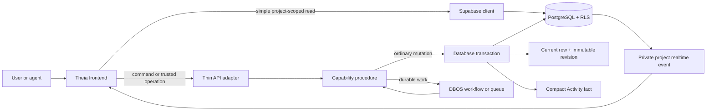

# Icarus Architecture

## Status

This document is the architectural baseline for rebuilding Icarus. It defines where code belongs before the active application is scaffolded. The archived implementations and `original-taurus-reference/` are references, not active architecture.

The first implementation should prove one thin vertical slice through this structure before more capabilities are migrated.

## Governing rules

1. The repository must make the frontend and backend obvious at a glance.
2. Backend capability code has exactly one home: `backend/src/capabilities/`.
3. Frontend product areas are called **features**, not capabilities. A feature may present several backend capabilities without duplicating their business rules.
4. A capability owns its domain types, public procedures, database schema, revision behavior, and optional durable workflows.
5. Supabase owns database, authentication, project authorization, storage, and realtime infrastructure. DBOS owns durable workflow execution and queue control. Icarus does not rebuild those systems.
6. Every data operation is explicitly scoped to a bound user and project. PostgreSQL row-level security is the final isolation boundary.
7. Eclipse Theia is used as a browser workbench. Electron is not part of the plan.
8. Shared code contains stable cross-boundary values only. It does not become a second home for capability behavior.

## Planned repository tree

```text
icarus/
├── frontend/                         # Eclipse Theia browser application
│   ├── application/                  # Product composition and browser target
│   └── extension/                    # One Icarus Theia extension to begin with
├── backend/                          # Icarus domain and server-side execution
│   ├── src/
│   │   ├── initialization/           # Construct runtimes in dependency order
│   │   ├── api/                      # Thin transport/authentication adapters
│   │   ├── capabilities/             # The only backend capability directory
│   │   ├── workflows/                # DBOS bootstrap and shared queue declarations
│   │   └── shared/                   # Backend-only primitives and utilities
│   └── supabase/
│       ├── migrations/               # Capability-owned PostgreSQL schemas and RLS
│       ├── tests/                    # Database and policy tests
│       ├── config.toml
│       └── seed.sql
├── shared/                           # Generated DB types and stable wire values
├── configuration/                    # Checked-in, non-secret application configuration
├── tests/                            # Cross-system and end-to-end tests
├── docs/                             # Architecture and capability documentation
├── archive/                          # Preserved, inactive implementations
├── original-taurus-reference/        # Preserved design and behavior reference
└── flake.nix                         # Reproducible Nix development shell
```

Only create a directory when the first real file needs it. This is a destination map, not permission to add empty scaffolding.

## Responsibility map

| Area | Owns | Does not own |
| --- | --- | --- |
| `frontend/application` | Theia browser composition, startup, product metadata | Domain behavior |
| `frontend/extension` | Widgets, commands, views, feature state, client data access | Canonical project data |
| `backend/src/api` | Request context, transport mapping, error mapping | Business rules |
| `backend/src/capabilities` | Domain objects, procedures, revisions, capability workflows | Generic infrastructure |
| `backend/supabase` | PostgreSQL schema, RLS, migrations, database tests | Capability procedure design |
| `backend/src/workflows` | DBOS startup and shared queue definitions | Capability-specific workflow steps |
| `shared` | Generated or stable data shapes crossing the frontend/backend boundary | Mutable state or service logic |

## Capability shape

A capability is a cohesive unit of backend behavior. Most have one runtime object. A second runtime is justified only when it represents a genuinely separate lifecycle or authority.

```text
backend/src/capabilities/<capability>/
├── index.ts                          # Public exports only
├── runtime.ts                        # Runtime interface and constructor
├── types.ts                          # Capability-owned values
├── procedures/                       # One file per public procedure
├── workflows.ts                      # Optional DBOS workflow definitions
├── README.md                         # Objects, API, procedures, and invariants
└── test/                             # Capability tests
```

Each public procedure is one of three kinds:

- **Query:** reads project-scoped state without mutation.
- **Mutation:** validates authorization and commits a database transaction.
- **Workflow:** coordinates durable or queued work through DBOS, then calls ordinary capability procedures.

The workflow is not a second implementation of the capability. It is a durable coordinator around the same procedures.

## Canonical request and change flow



The backend may run as multiple stateless server instances. No instance owns a project lock in memory. Database transactions, constraints, and RLS remain authoritative, so requests for different users and projects can safely arrive at any instance. A dedicated project process can be added later for exceptional workloads without changing capability contracts.

## Resource history

A revisioned capability normally owns two logical tables:

1. A current/head table used for normal reads.
2. An immutable revision table containing complete historical versions.

This is a schema convention, not a generic revision runtime and not a separate runtime object. The owning capability exposes `getRevision`, `listRevisions`, and `revert` only when its use cases require them. Revert creates a new current revision; it never erases history. Non-resource or derived state may use a different storage model when its behavior requires one.

Activity is a compact project feed of committed facts and references. It does not own the complete history or undo logic of other capabilities.

## Project isolation

Every request context includes `userId`, `projectId`, and `requestId`. The initial application receives the bound user/project from its bootstrap configuration; it does not implement sign-in, project creation, or project selection. The project identifier must also be present in every project-owned primary key, foreign key, query, workflow identity, storage path, and realtime topic.

Defense is layered:

1. The bootstrap/integration boundary supplies the bound user and project; future authentication may establish the same context without changing capability APIs.
2. API adapters construct and preserve the trusted request context.
3. Capability procedures authorize the requested operation.
4. PostgreSQL RLS and project-aware constraints reject cross-project access even if a caller or procedure is wrong.
5. DBOS workflow IDs and queue partitions include the project scope.

## Implementation order

1. Add the root workspace and Nix development shell.
2. Compose the smallest Theia browser application and one Icarus extension.
3. Start local Supabase and apply one project-scoped schema with an RLS denial test.
4. Add the TypeScript backend initialization and one capability runtime.
5. Add one DBOS workflow only for a use case that needs durability or queue ordering.
6. Prove the complete frontend-to-database-to-realtime vertical slice.
7. Migrate capabilities in dependency order.

The architecture should grow by completed slices, not by creating every planned directory at once.
