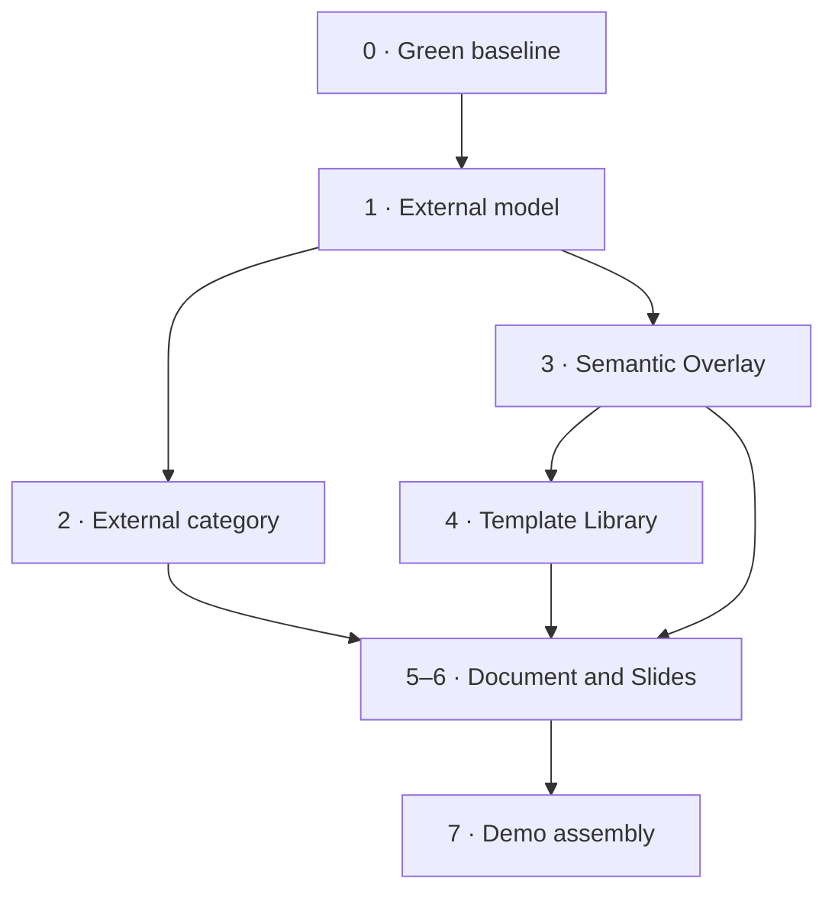

# Icarus Minimum Demo Build Plan

**Prepared:** 4 September 2026 
**Code baseline:** [`gccurtis/icarus@ec31bcce`](https://github.com/gccurtis/icarus/tree/ec31bcce77a83c97235a24d368b7acdf9af8ca4c) 
**Planning unit:** a small set of outcome-oriented workstreams, organized around the product surfaces we need to finish.

## 1. What we are building

The goal is a short demonstration that makes one product capability obvious:

> Icarus can resolve Prompt Content Blocks from external source material, refresh those blocks when their source context changes, and carry the same behavior into newly instantiated or inserted template content.

The artifact itself is not regenerated. Documents, decks, slides, static content blocks, layout, styles, ordering, and direct edits remain native authored content. The semantic behavior is confined to Prompt Content Blocks.

The slide deck is the primary demonstration. A document is the companion proof that the same content-block and semantic systems work across both editors.

## 2. Demo sequence

### Cold open — credible finished work

Open a professional, already-resolved deck. Establish that Icarus is an editor for real work before showing how the content was produced.

### Step 1 — change the source context

1. Open or instantiate a deck template containing Prompt Content Blocks.
2. Target Source Set A and show the resolved deck.
3. Change the template or deck's source target to Source Set B.
4. Allow the Prompt Content Blocks throughout the deck to resolve against Source Set B.
5. Show that static blocks, direct edits, structure, layout, and styling did not change.

“The whole deck updates” means that Prompt Content Blocks distributed across the deck update. It does not mean that the deck body or every content block is replaced.

### Step 2 — revise one external source

1. Open the External Library.
2. Replace or re-upload one source used by the deck.
3. Return to the deck.
4. Show that the Prompt Content Blocks affected by that source are refreshed.
5. Inspect one changed Prompt Content Block to show its source context and resolution state.

For the rehearsed fixture, the revised source should be designed so that only one planned claim or passage changes visibly. The system may initially recompute a broader safe scope; the visible application must remain confined to Prompt Content Blocks whose resolved content changed.

### Step 3 — insert templated content

1. From the document or slide editor, open the template picker.
2. Select compatible template content.
3. Insert it into the current artifact.
4. Preserve its Prompt Content Blocks and resolve them using the destination artifact's current source context.

This does not require a separate “document-section template” system. A Document can be inserted into a Document by composing or concatenating compatible document content. The equivalent Deck/Slide composition should use the same general template mechanism; whether Deck and Slide remain separate canonical types is still an open representation decision.

### Document companion

Repeat the same three actions in a report:

1. Change the report's source target and refresh its Prompt Content Blocks.
2. Replace one external source and refresh the affected Prompt Content Blocks.
3. Insert another Document's templated content into the report and resolve its Prompt Content Blocks in the destination context.

## 3. Scope

### Minimum demo

- Professional Document and Slide Deck editors.
- External file upload, list, selection, inspection, download, and re-upload or replacement.
- Named source context that can target a different set of external files.
- Text and prose consumption through the new Semantic Overlay.
- Prompt Content Blocks that resolve from that source context.
- Refresh behavior after a source-target change or external-file revision.
- Template Library browsing, preview, and standalone instantiation.
- Template insertion initiated from the destination editor.
- Persistent demo state and deterministic demo fixtures.
- No placeholder view or dead primary control on the rehearsed path.

### First stretch

- Structured Data representation and ingestion.
- Formula support.
- Analysis support.
- Table Content Block rendering and editing.
- Chart Content Block representation, rendering, and inspection.
- One data change that updates a chart and an associated Prompt Content Block.

### Deferred

- Agentic or copilot editing as a required demo step.
- Live connectors and provider synchronization.
- Office-format import and export.
- Editing external files in place.
- General template publishing, governance, and sharing.
- Presentation mode, animations, and transitions.
- Advanced collaborative review features.
- Broad spreadsheet and analysis-product development beyond the chart stretch.

## 4. Confirmed constraints and open decisions

### Confirmed

| Constraint | Consequence for the plan |
| --- | --- |
| Only Prompt Content Blocks are semantically replaced | No workstream should describe document, deck, slide, or arbitrary block regeneration |
| Template variables are already intentionally narrow | Do not create a separate variable-scope project; only integrate the existing model |
| The Knowledge Lattice will be substantially reconsidered | Semantic Overlay work begins with the intended new model, not with a presumption that current lattice internals should survive |
| Template content should compose through one system | Do not add a special document-section template type |
| Template insertion belongs to the destination editor | The Template Library supplies discovery and selection; Documents and Slides own insertion behavior |
| Work should be planned around surfaces and outcomes | Every surface workstream names its Content, Context, and Inspector deliverables |

### Open decisions to resolve inside the workstreams

| Decision | Owning workstream |
| --- | --- |
| Relationship among External File, Connector, Connection, and connected remote item | 1 — External model |
| Whether re-upload is a revision of one stable file or a replacement identity | 1 — External model |
| Exact new Semantic Overlay representation and old-lattice deletion/migration path | 3 — Semantic Overlay |
| Whether Deck and Slide remain separate canonical types | 4 and 6 — Templates and Slides |
| Whether template authoring is needed for the demo or fixtures are sufficient | 4 — Template Library |
| Which external prose formats are supported in the first demo | 1 and 3 — External and Semantic Overlay |
| Whether image and table support are minimum-editor work or stretch work | 5 and 6 — Editors |
| Final product term for Structured Data | Stretch lane |

## 5. Workstream map

| # | Workstream | Type | Primary outcome |
| --- | --- | --- | --- |
| 0 | Green product baseline | Stabilization | The product build is clean enough to develop and rehearse reliably |
| 1 | External model | Representation and product design | External files, connectors, connections, revisions, and source references have a finalized contract |
| 2 | External category | Category and surface implementation | A professional External Library supports the complete demo file workflow |
| 3 | Semantic Overlay | Foundational representation and runtime | Text and prose can resolve Prompt Content Blocks and refresh them after relevant changes |
| 4 | Template Library | Category and surface implementation | Templates can be found, inspected, and instantiated; editors can invoke a compatible-content picker |
| 5 | Document editor | Editor and surface implementation | The Document editor is professionally credible and owns Document-template insertion |
| 6 | Slide Deck editor | Editor and surface implementation | The Slide editor is professionally credible and owns slide/deck-template insertion |
| 7 | Demo assembly | Integration, content, and QA | The exact three-step deck and document demonstrations run repeatably |

### Dependency path

Workstreams 2, 3, and 4 can overlap after the contracts they consume are stable. Their final integration converges in the two editors.

## 6. Workstream 0 — Green product baseline

**Type:** stabilization and scope cleanup

**Outcome:** a green, intentionally scoped application baseline.

### Current evidence

At the inspected commit:

- Unit tests: 581 of 581 passed.
- Type-checking: 32 errors across 10 files.
- Linting: 34 findings.
- Script tests: 108 of 110 passed.
- Several visible categories import capability modules that do not exist.

### Plan

| Phase | Work |
| --- | --- |
| Inventory | Classify every failing import, check, route, and placeholder as required, temporarily triaged, or obsolete |
| Simplify | Delete obsolete code; hide or gate unfinished surfaces that are not part of the current product |
| Repair | Fix required modules and real correctness failures |
| Recalibrate | Remove or relax a check only when it enforces a constraint the product no longer intends to honor |
| Verify | Run type-check, lint, unit tests, script tests, build, and a smoke path through the demo categories |

### Completion gate

- The main build passes the checks retained by the project.
- Overview, External, Templates, Document, and Slide Deck routes open without missing modules.
- No rehearsed route points to a placeholder panel.
- Deferred categories have an intentional hidden or unavailable state.

## 7. Workstream 1 — Finalize the External model

**Type:** representation and product design

**Outcome:** one reviewed contract for uploaded files and the future connector system.

### Decisions to settle

| Topic | Question the model must answer |
| --- | --- |
| Vocabulary | What exactly are an External File, Connector, Connection, and connected item? |
| Ownership | Which bytes or snapshots does Icarus own, and which remain provider-owned? |
| Identity | Does a re-upload append a revision to one stable item or create a replacement item? |
| Connected items | Does a connection expose remote items directly, materialize local snapshots, or create another source subtype? |
| Lifecycle | What are the valid upload, processing, ready, revised, unavailable, disconnected, and deleted states? |
| Source membership | How are files and connected items included in the source context used by Prompt Content Blocks? |
| Content kinds | Which text/prose formats are minimum, and how will Structured Data join later? |
| Isolation | How do project, organization, authorization, and deletion boundaries apply? |

### Required deliverables

1. **Vocabulary and relationship diagram:** canonical types and their relationships.
2. **Lifecycle specification:** states and transitions for upload, re-upload, processing, failure, and removal.
3. **Representation schema:** identities, metadata, revisions, storage references, source membership, and future connection references.
4. **Operation contract:** upload, list, inspect, download, re-upload or replace, remove, and manage source membership.
5. **Semantic handoff:** the exact source identity and content projection consumed by the Semantic Overlay.
6. **Migration plan:** keep, adapt, or delete the current `externalFiles`, `connectors`, `connections`, and source-set structures.
7. **Fixtures:** enough records to exercise uploads, revisions, source targeting, and a mocked future connection.

### Completion gate

The representation can express the entire minimum External workflow without UI-specific exceptions, and the team has explicitly settled the connector/connection questions that would otherwise force a later rewrite.

## 8. Workstream 2 — Build the External category

**Type:** category and surface implementation

**Outcome:** one professional External Library through which the demo's source work can be completed.

### Content surface: External Library

| Area | Minimum behavior |
| --- | --- |
| Header | Search, current project scope, Upload, and source-set action |
| Filters | Content kind, origin, readiness, source membership, and updated time |
| Main view | Table or dense list with name, kind, origin, status, source membership, revision/update time, and size where relevant |
| Selection | Single selection for inspection; multi-selection for source-membership actions |
| Upload | File chooser and drop zone with visible progress and failure states |
| File actions | Download original, re-upload or replace, add/remove from source context, and remove |
| Status | Uploaded, processing, ready, failed, and unavailable states without blanking existing usable content |
| Connected content | Hidden or explicitly preview-only until the connection model is implemented |

An editable external-file detail page is not required. External content is inspected here; native editing belongs to Documents, not External Files.

### Context panel views

| View | Purpose |
| --- | --- |
| Overview | Library totals, recent items, processing problems, and a concise explanation of what External contains |
| Source Sets | Create, select, rename, and edit the sets or targets consumed by templates and Prompt Content Blocks |
| Connections | Future connector and connection entry point; hidden or clearly mocked in the minimum demo |

### Inspector views

| Selection | Inspector content |
| --- | --- |
| No selection | Upload guidance, supported types, and recent processing status |
| External file | Preview, metadata, origin, current state, revision history, source membership, used-by relationships, and file actions |
| Multiple files | Shared source-membership actions and selection summary |
| Source set | Name, members, used-by artifacts, and edit actions |
| Connected item | Provider, sync state, source identity, and connection; implemented only after the model is real |

### Build path

1. Implement the Workstream 1 representation and operations.
2. Build the central library list and selection model.
3. Add upload, download, and re-upload or replacement.
4. Add source-set management.
5. Build the three Context views and selection-driven Inspector.
6. Wire Project Overview external rows into this category.
7. Add failure, empty, loading, and processing states.

### Completion gate

A user can upload the demo sources, target them as a set, replace one file, inspect its state, and return to the editor without encountering a placeholder or changing categories unnecessarily.

## 9. Workstream 3 — Rebuild the Semantic Overlay

**Type:** foundational representation, ingestion, and runtime

**Outcome:** the intended new semantic model can consume text/prose and resolve Prompt Content Blocks across product surfaces.

This workstream begins by documenting the new model already envisioned for the Semantic Overlay. It does not assume that the current Knowledge Lattice types, terminology, or implementation boundaries should remain.

### Capability contract

The minimum Semantic Overlay must:

1. consume the text or prose projection supplied by External and native sources;
2. represent the source context targeted by a Prompt Content Block;
3. resolve the Prompt Content Block's prompt against that context;
4. retain the resolved content and its processing state;
5. know when a source-target change, source revision, or prompt edit requires refresh;
6. apply resolved content only to the owning Prompt Content Block;
7. expose enough source and resolution information for the Inspector;
8. provide the same interface to Documents, Slides, and Templates.

### Refresh rules

| Trigger | Eligible effect |
| --- | --- |
| Source target changes | Refresh Prompt Content Blocks bound to the changed target |
| External source is revised | Refresh Prompt Content Blocks whose source context includes that source |
| Prompt is edited | Refresh that Prompt Content Block |
| Template is instantiated or inserted | Resolve the Prompt Content Blocks introduced by the template |
| Literal or static content changes | No Semantic Overlay refresh unless it changes an explicitly referenced source |

Static blocks, direct edits, geometry, document structure, slide structure, styles, and unrelated content are outside the replacement path.

### Required deliverables

| Deliverable | Contents |
| --- | --- |
| Canonical model | New types, identities, relationships, versioning, and boundaries |
| Ingestion contract | Text/prose inputs, normalization, locators, failure states, and refresh behavior |
| Resolution contract | Prompt input, source context, output state, and deterministic test seam |
| Dependency contract | The minimum relationship needed to decide which Prompt Content Blocks require refresh |
| Application contract | How a resolved value is written to one Prompt Content Block without rewriting its artifact |
| Inspection contract | Status, target/source context, evidence or trace information, timestamps, and errors exposed to UI |
| Transition plan | Which current lattice, prompt, derived-output, and evidence types are deleted, renamed, or migrated |

### Build path

1. Hold the model review and record the new Semantic Overlay contract.
2. Delete or migrate conflicting Knowledge Lattice assumptions.
3. Implement text/prose ingestion behind the new contract.
4. Implement one Prompt Content Block resolution path with deterministic fixtures.
5. Add refresh behavior for target changes and external revisions.
6. Add shared status and inspection data.
7. Integrate the same contract into Document and Slides.

### Completion gate

One Prompt Content Block can resolve from external prose, persist, refresh after a relevant source change, show its state in the Inspector, and leave every non-Prompt Content Block untouched.

## 10. Workstream 4 — Build the Template Library

**Type:** category and surface implementation

**Outcome:** templates can be discovered, inspected, and instantiated, while editors can request compatible template content for insertion.

### Composition rule

Use one template system:

- **Instantiate** creates a new native resource from template content.
- **Insert** asks the destination editor to compose compatible native content into an existing resource.

The Template Library owns discovery, preview, selection, and standalone instantiation. The Document and Slide editors own the insertion transaction.

No separate document-section template kind is required. Do not add another Deck/Slide distinction until the representation decision about those types is settled.

### Content surfaces

| Surface | Minimum behavior |
| --- | --- |
| Library | Grid or list, search, kind filters, preview, selection, and Use Template |
| Template preview | Credible visual preview, description, native content kind, included Prompt Content Blocks, and required source context |
| Template editor | Reuse the native Document or Slide editor in a template mode if authoring is included; otherwise defer and use seeded fixtures |
| Picker presentation | A focused library view callable from Document and Slides, filtered to compatible content |

### Context panel views

| View | Purpose |
| --- | --- |
| Browse | All, recent, and optionally pinned templates |
| Kinds | Filter by the canonical native content types that survive the representation review |
| Collections | Optional organization if a real collection model exists; otherwise omit |

### Inspector views

| Selection | Inspector content |
| --- | --- |
| No selection | Library guidance and recently used templates |
| Template | Preview, description, kind, contents, Prompt Content Block count, source requirements, version, and Use action |
| Use Template | Destination project, resource name, existing narrow variable/source bindings, and creation action |

### Build path

1. Resolve Document/Deck/Slide template representation questions.
2. Make library reads and previews real rather than local mock state.
3. Implement standalone instantiation.
4. Expose a compatible-template picker contract to both editors.
5. Reuse native editor rendering for previews and optional authoring.
6. Build Context and Inspector states without placeholder entries.

### Completion gate

A user can find and inspect a template, instantiate a standalone Document or Deck, and open the same library as a compatible-content picker from either destination editor.

## 11. Workstream 5 — Finish the Document editor

**Type:** editor and surface implementation

**Outcome:** a professional Document editor that supports the document version of all three demo steps.

### Content surface

| Capability | Minimum behavior |
| --- | --- |
| Text model | Paragraphs, headings, marks, links, lists, and stable selections |
| Formatting | Font, size, bold, italic, underline, color, highlight, alignment, indentation, and paragraph spacing |
| Structure | Insert, delete, reorder where appropriate, outline navigation, and undo/redo |
| Page presentation | Credible page canvas, zoom, saved layout, margins, and pagination behavior |
| Prompt Content Blocks | Resolved content plus ready, refreshing, and failed states without replacing surrounding document content |
| Template composition | Insert compatible Document content at the current location, remap identities, preserve its Prompt Content Blocks, and inherit or resolve destination context |
| Persistence | Editing, insertion, prompt resolution, and reload preserve the same document |

### Context panel views

| View | What it contains |
| --- | --- |
| Sections | Document outline and navigation; recommended default |
| Insert | Text structures and supported Content Block types |
| Templates | Compatible Document templates and insertion action |
| Sources | Current source context and Prompt Content Blocks using it |
| Styles | Named text and paragraph styles |
| Layout | Page size, orientation, margins, and related presentation settings |
| Find | Search and navigation; replacement can follow |

Only expose a view when its primary interactions work.

### Inspector views

| Selection state | Controls and information |
| --- | --- |
| Document or background | Document metadata and page/layout settings |
| Empty block | Block type, insertion choices, and paragraph defaults |
| Next letter or caret | Formatting that will apply to newly typed text |
| Text selection | Marks, font, size, color, link, and paragraph formatting |
| Text block | Block type, alignment, spacing, indentation, and style |
| Prompt Content Block | Prompt, source target, status, last resolution, refresh, and source/evidence inspection |
| Table | Added when Table Content Blocks enter minimum or stretch scope |

### Build path

1. Expand the current text-only ProseMirror schema and projection.
2. Wire formatting and alignment controls to real transactions and persisted operations.
3. Implement the Context views and selection-state routing.
4. Render and inspect Prompt Content Blocks through the shared Semantic Overlay contract.
5. Implement Document-into-Document insertion through the template picker.
6. Add reload, undo/redo, selection, insertion, and refresh tests.
7. Complete visual polish at the actual demo viewport.

### Completion gate

The report can be edited like a credible professional document and can perform source-target refresh, one-file refresh, and Document-template insertion without leaving the editor.

## 12. Workstream 6 — Finish the Slide Deck editor

**Type:** editor and surface implementation

**Outcome:** a professional Slide Deck editor that supports the primary demo.

### Content surface

| Capability | Minimum behavior |
| --- | --- |
| Slide management | Activate, add, duplicate, delete, and drag-reorder |
| Text | Insert and directly edit text boxes with normal text and paragraph formatting |
| Objects | Select, move, resize, rotate, duplicate, delete, and keyboard-nudge shapes and images |
| Multiple selection | Modifier selection, marquee, shared Inspector state, and bulk transformation where valid |
| Arrangement | Align, distribute, z-order, snapping, and guides |
| Styling | Fill, stroke, opacity, corner treatment, text alignment, theme, and layout |
| Notes | Editable speaker notes using the shared text system |
| Prompt Content Blocks | Resolved content and refresh states inside slide elements without regenerating the slide |
| Template composition | Insert compatible slide/deck content at a chosen position through the editor's template picker |
| Persistence | Selection-independent state, object edits, insertion, prompt resolution, and reload remain stable |

Image support should be included if it is needed to make the opening deck credible. Table and Chart Content Blocks can remain in the stretch lane unless the final demo content requires them earlier.

### Context panel views

| View | What it contains |
| --- | --- |
| Slides | Thumbnail navigation and slide actions; recommended default |
| Insert | Text, shapes, image, and only the Content Block types that are actually implemented |
| Templates | Compatible slide/deck templates and insertion action |
| Layers | Object order, visibility, lock state, and groups when grouping exists |
| Layouts | Apply a slide layout |
| Theme | Deck palette and typography |
| Notes | Current slide's notes |
| Sources | Current source context and Prompt Content Blocks using it |

### Inspector views

| Selection state | Controls and information |
| --- | --- |
| Deck or no selection | Deck metadata, theme, size, and defaults |
| Slide | Layout, background, transition placeholder only if transitions are real |
| Shape | Frame, rotation, fill, stroke, opacity, corner treatment, and order |
| Image | Frame, crop/fit, opacity, replacement, and order |
| Text box | Frame, internal padding, vertical alignment, and text defaults |
| Next letter or caret | Formatting for newly typed text |
| Text selection | Marks, font, size, color, link, and paragraph alignment |
| Multiple elements | Shared geometry, align/distribute, order, group, and delete actions |
| Prompt Content Block | Prompt, source target, status, last resolution, refresh, and source/evidence inspection |
| Table or chart | Added with their respective Content Blocks |

### Build path

1. Connect canvas selection to Workspace Inspector state.
2. Complete direct text editing and shared text formatting.
3. Enable and persist resize, rotation, multi-selection, alignment, distribution, and z-order.
4. Add real image rendering if required by the opening deck.
5. Implement the eight Context views, hiding unsupported controls.
6. Render and inspect Prompt Content Blocks through the shared Semantic Overlay.
7. Implement editor-owned insertion through the template picker.
8. Resolve Deck/Slide consolidation before adding more type-specific template behavior.
9. Add transform, selection, insertion, refresh, and reload tests.

### Completion gate

The deck looks and behaves like a real presentation editor and completes the full three-step demo without relying on mock controls.

## 13. Workstream 7 — Assemble and rehearse the demo

**Type:** integration, demo content, visual QA, and reliability

**Outcome:** one repeatable deck demonstration and one shorter document demonstration.

### Demo content package

| Asset | Purpose |
| --- | --- |
| Source Set A | First credible source context |
| Source Set B | Clearly different context for the same template |
| Revised source | Engineered to change one planned Prompt Content Block result |
| Deck template | Primary finished-work and source-target demonstration |
| Document template | Companion proof using the same semantic contract |
| Insertable Document content | Exercises Document-into-Document composition |
| Insertable slide/deck content | Exercises editor-owned slide/deck composition |
| Recovery snapshots | Known-good state at the cold open and after each step |

### Integration path

| Demo moment | System path being proven | Visible result |
| --- | --- | --- |
| Change source target | External → Semantic Overlay → Prompt Content Blocks | Prompt Content Blocks throughout the artifact resolve for the new context |
| Re-upload one source | External revision → refresh decision → Prompt Content Block | One planned claim or passage changes |
| Insert template content | Template picker → editor composition → Semantic Overlay | Inserted content appears and its Prompt Content Blocks resolve |

### Readiness work

1. Write the exact 6–8 minute click script.
2. Seed deterministic source, template, and artifact fixtures.
3. Add end-to-end coverage for the rehearsed path.
4. Exercise every loading, refreshing, and failure state visible during the demo.
5. Remove placeholder views and nonfunctional controls from frame.
6. Perform visual QA at the actual presentation resolution.
7. Run the full sequence repeatedly from a reset state.
8. Prepare a recovery action for each asynchronous step.

### Completion gate

The deck sequence runs three consecutive times with the intended visible changes, the document companion uses the same implementation contracts, and no step depends on a live connector, agent, or Office conversion.

## 14. Stretch lane — Structured Data, Formula, Analysis, Tables, and Charts

This is a coordinated stretch lane rather than a numbered minimum-demo workstream.

### Capability sequence

| Order | Capability | Required work |
| --- | --- | --- |
| 1 | Structured Data | Settle the product term; define datasets, schemas, fields, records/ranges, revisions, and ingestion |
| 2 | Formula | Finalize formula representation, evaluation, references, errors, revisions, and Inspector behavior |
| 3 | Analysis | Define analysis inputs, operations, outputs, dependency behavior, and how results become reusable content |
| 4 | Table Content Block | Finish representation alignment, renderer/editor behavior, formatting, and Document/Slides integration |
| 5 | Chart Content Block | Define chart data binding, chart specification, renderer, styling, and Inspector controls |
| 6 | Semantic integration | Allow data or analysis changes to refresh both a chart/table and a related Prompt Content Block |

The likely chart implementation is a shared Chart Content Block with surface-specific rendering adapters. That choice should be confirmed alongside the Structured Data and Analysis representations rather than added as an isolated canvas widget.

### Stretch completion gate

A structured-data revision flows through Formula or Analysis as needed, updates a real chart or table, and refreshes the related prose interpretation without changing unrelated content.

## 15. Overall execution order

1. Restore the green baseline.
2. Finalize the External representation.
3. Begin External surfaces and the new Semantic Overlay against that contract.
4. Build the Template Library and picker contract.
5. Finish Prompt Content Block integration in the Document editor.
6. Finish the same integration and professional editing behavior in Slides.
7. Add editor-owned template insertion.
8. Assemble, polish, test, and rehearse the demo.
9. Pull in the Structured Data and chart stretch only when the minimum path is stable.

## 16. Reference context

- [Icarus — Home](https://app.notion.com/p/3b8b6410e502811ebc39d1c74aff82f5)
- [Canonical Market Study Demo](https://app.notion.com/p/3aab6410e502815f813cdaa2bdbefda2)
- [Capability — General Files](https://app.notion.com/p/3b8b6410e50281e09a3ff13165c5327c)
- [Knowledge Lattice](https://app.notion.com/p/3b8b6410e50281d08a8be2bb2c122b8c)
- [Current implementation baseline](https://github.com/gccurtis/icarus/tree/ec31bcce77a83c97235a24d368b7acdf9af8ca4c)
