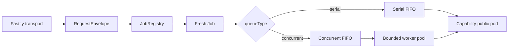
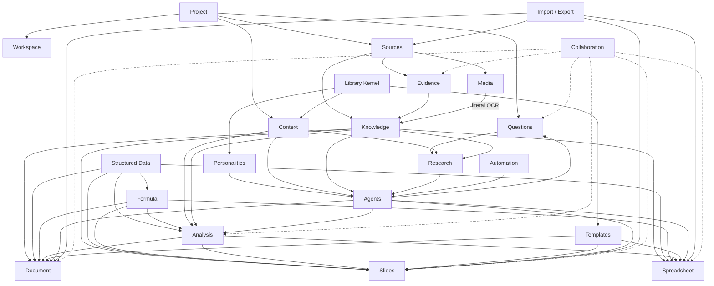

# Icarus capability reference

This directory defines the domain and runtime contracts for Icarus capabilities. Each specification describes:

- canonical authority and project scope;
- TypeScript domain types and public ports;
- request-type endpoints and their Job classifications;
- revision, ChangeSet, immutable-version, or generation-publication behavior;
- capability-owned tables and SQL indexes;
- rebuildable projections;
- integration boundaries and principal flows;
- invariants and acceptance criteria.

The specifications are implementation references. Capability code should remain compatible with these contracts as storage adapters, user interfaces, and provider integrations evolve.

## Runtime conventions

All capability requests enter the shared backend runtime:



The numbered backend layers remain authoritative:

```text
apps/backend/src/
  0-platform/       runtime providers and infrastructure interfaces
  0-utils/          configuration, request envelopes, Jobs, registry, scheduler
  1-init/           composition root
  2-transport/      Fastify adapter
  3-capabilities/   domain models, services, ports, persistence, projections
  4-job-wiring/     request validation and request/stage-intent-to-Job mapping
```

Capability specifications use request-type names such as `questions.create` or `research.start`. Job Wiring maps each request type to one queue and response mode.

Multi-stage work commits a typed stage intent and returns. `4-job-wiring/internal` maps that intent to a fresh idempotent Job. Every stage enters the same scheduler independently.

## Project scope

Canonical project state carries:

```typescript
export interface ProjectScope {
  userId: string;
  projectId: string;
}
```

Persistence uses matching `user_id` and `project_id` columns. Capability-internal foreign keys preserve that scope across aggregate roots and child rows.

## Persistence conventions

Platform Database supplies connection lifecycle, transaction primitives, and the migration runner. Each capability owns:

- its repository interfaces and SQLite adapters;
- its migration definitions;
- its table family and query SQL;
- its ordinary SQL indexes;
- its rebuildable projections.

Mutable editor-style aggregates use a compacted Base, append-only typed ChangeSets, optimistic revision checks, idempotent submission IDs, and compensating operations for undo/redo.

Immutable material uses version or generation publication with atomic head pointers. Run-oriented capabilities use durable state transitions and append-only events.

## Capability map

### Project and inquiry

- [Project](project.md) — project identity, metadata, lifecycle, and revision.
- [Workspace](workspace.md) — project workspace state and cross-family Resource summaries.
- [Questions](questions.md) — Questions with owned Hypotheses, Assumptions, and Answer revisions.
- [Research](research.md) — Question, Hypothesis, and Discovery research runs.
- [Sources](sources.md) — external/captured material and immutable Source Versions.
- [Context](context.md) — named project scopes and reusable Context definitions.
- [Evidence](evidence.md) — source-grounded statements, citations, and review history.
- [Knowledge](knowledge.md) — grounded text projections and retrieval lattice generations.
- [Media](media.md) — visual descriptors, OCR, and image retrieval projections.

### Structured data and analysis

- [Structured Data](structured-data.md) — tables, variables, stable names, bindings, and imported structured artifacts.
- [Formula](formula.md) — pure typed expressions, recursive table values, querying, indexing, slicing, and evaluation.
- [Analysis](analysis.md) — graph specifications, scenarios, executions, and immutable analytical results.

### Native Resources

- [Document](document.md) — structured authored documents, bindings, provenance, and ChangeSets.
- [Slides](slides.md) — Decks, Slides, VisualObjects, Notes, bindings, provenance, and ChangeSets.
- [Spreadsheet](spreadsheet.md) — sparse single-grid Resources, stable axes/cells, formulas, overlays, and ChangeSets.

### Libraries and orchestration

- [Library Kernel](library-kernel.md) — shared asset, version, lineage, and materialization envelopes.
- [Templates](templates.md) — reusable Document, Slides, and Spreadsheet payloads.
- [Personalities](personalities.md) — reusable behavior definitions and project pins.
- [Agents](agents.md) — tasks, runs, exchanges, tool calls, and results.
- [Automation](automation.md) — schedule/change/condition triggers and Agent dispatch.

### Integration and collaboration

- [Import and Export](import-export.md) — format translation, isolated workers, diagnostics, and receipts.
- [Collaboration](collaboration.md) — comments, activity facts/projections, and presence.

## Platform reference

Capabilities that perform semantic model work consume the implemented [Intelligence runtime](../platform/intelligence.md). Intelligence resolves `purpose + strength + speed` casts to configured inference or reasoning routes and provides embeddings through the same provider boundary.

## Dependency topology



Arrows represent public-port dependencies and materialization/command flows. Every capability remains the authority for its own canonical state.
