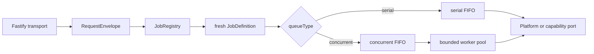

# Index — Icarus Capability Reference & Build Groups

> Mirrored from [Notion](https://app.notion.com/p/3aeb6410e5028170a2e5f628d32384c6).

> **Reference authority.** These pages define the domain, runtime, persistence, prerequisite, endpoint, and Job contracts used to implement Icarus. The pushed repository remains authoritative for the numbered layers and objects already implemented.
## Start Here
- [Icarus Backend Runtime & Capability Build Map](../runtime/backend-map.md) — runtime layers, logical build groups, dependency topology, execution, and persistence laws.
- [Icarus Capability Build Groups & Order](../runtime/build-order.md) — the ordered implementation sequence and completion gates.
- [Runtime Foundation & Repository Boundaries](../runtime/repository-boundaries.md) — layer responsibilities, file placement, and dependency direction.
- [Request, Job & Dual-Queue Runtime](../runtime/dual-queue.md) — request mapping, fresh Job construction, serial FIFO, concurrent waiting queue, and bounded worker pool.
- [Runtime Scope Configuration](../platform/runtime-scope.md) — configuration-bound stores and attribution.
- [Icarus Project](../product/icarus.md) — product posture, canonical group order, and capability-page anatomy.
- [Icarus Complete Product Definition](../product/definition.md) — permanent screens, native resources, inquiry workflow, libraries, collaboration surfaces, and agentic behavior.

## 1 · Foundations
1. [Intelligence](../platform/intelligence.md) — provider-neutral inference, structured output, tools, embeddings, and purpose/strength/speed routing.
2. [Context](context.md) — named, revisioned reference sets, recursive composition, and exact scope manifests.
3. [Formula](../platform/formula.md) — exact value algebra, parsing, binding, set queries, indexing, slicing, diagnostics, and wire values.
4. [Data](data.md) — stable names plus typed tables, columns, rows, cells, variables, resolver snapshots, and structured imports.
Intelligence and Formula are Platform services. Context and Data are endpoint-owning capabilities. The logical group does not change their physical runtime layers.
## 2 · Resources
1. [Knowledge](../platform/knowledge.md) — source windows, embeddings, lattice generations, normal retrieval, and Context admissibility filtering.
2. [Document](document.md) — content-first authored Documents, rich Blocks, bindings, exact snapshots, and retained history.
3. [Slides](slides.md) — Decks, Slides, Shapes, Notes, exact geometry, bindings, snapshots, and retained history.
4. [Spreadsheet](spreadsheet.md) — one sparse grid, stable axes and cells, formulas, spills, ranges, overlays, calculation, and retained history.
Knowledge remains a Platform service. Document, Slides, and Spreadsheet own the three native authored resource models.
## 3 · Research
1. [Analysis](analysis.md) — specifications, variables, scenarios, executions, charts, and immutable analytical results.
2. [Evidence](evidence.md) — source-grounded statements, quotations, citations, lineage, review, and history.
3. [Research](research.md) — Question, Hypothesis, and Discovery investigation from inline briefs across web, Context, Knowledge, Data, Analysis, and Evidence.
Research builds from inline inquiries. A later Question may bind to a Research run through an optional typed bridge.
## 4 · Project
1. [Project](project.md) — aggregate summaries, resource catalog, typed target-address vocabulary, and project-level read/command seams.
2. [Workspace](workspace.md) — Overview, Research, Analyze, native-resource tabs, and durable workbench state.
Project aggregates summaries through public readers; each owning capability retains its canonical state.
## 5 · Collaboration
Collaboration is an index and build-order heading over four independent capabilities:
1. [Activity](activity.md) — immutable committed facts and rebuildable project, target, and actor feeds.
2. [Presence](presence.md) — ephemeral TTL leases, heartbeat, leave, list, expiry, and realtime messages.
3. [Comments](comments.md) — durable threads, immutable comment revisions, stable typed anchors, scans, and settlement.
4. [Questions](questions.md) — Questions with owned Hypotheses, Assumptions, and accepted Answer revisions.
Each has its own domain, endpoints, Jobs, persistence boundary, and runtime page.
## 6 · Agentic
1. [Persona](persona.md) — versioned behavior definitions, exact snapshots, local copies, and default selection.
2. [Agents](agents.md) — durable tasks, runs, exchange, tool calls, checkpoints, settlements, and results.
3. [Automation](automation.md) — schedule, change, condition, and manual triggers with Agent dispatch and durable run settlement.
## Platform & Runtime Support
- [Database](../platform/database.md) — connection lifecycle, transactions, migration execution, and capability-owned store support.
- [Observability](../platform/observability.md) — structured Logger, correlation, safe records, and runtime events.
- [Web Retrieval](../platform/web-retrieval.md) — bounded provider-neutral search and page acquisition.
- [Runtime Scope Configuration](../platform/runtime-scope.md) — store binding and attribution during initialization.
## Supporting References
These pages remain active while their final build-group placement is assigned:
- [Sources](sources.md) — captured material, immutable Source Versions, locators, and native-resource publication adapters.
- [Media](media.md) — visual artifacts, projections, OCR, descriptors, and image retrieval data.
- [Library Kernel](library-kernel.md) — generic asset identity, immutable versions, lineage, and materialization receipts.
- [Templates](templates.md) — reusable native-resource recipes and typed materialization.
- [Import & Export](import-export.md) — typed format translation, diagnostics, artifacts, and target admission.
Data's component references remain available for implementation comparison:
- [Name Manager component model](https://app.notion.com/p/3aeb6410e502810eb5e9f934994e730d)
- [Structured Data component model](https://app.notion.com/p/3aeb6410e502814ea854f1990496b5e4)
## Standard Capability Anatomy
Every capability page uses these primary sections in order:
1. Summary / Concept.
2. Types & Interfaces.
3. Runtime Objects.
4. Change Operations.
5. Endpoints.
6. Jobs.
7. SQL Tables.
The Jobs section connects the whole pipeline: endpoint or internal intent, fresh Job, queue, response mode, called port, emitted Change Operations, and follow-on stage. Invariants, projections, scenarios, and acceptance checks may follow.
## State Vocabulary
- **Canonical state:** minimum durable state required to reproduce an accepted revision.
- **Operational state:** attempts, checkpoints, receipts, and failures required for safe recovery.
- **Derived index:** rebuildable acceleration or presentation state such as the Knowledge lattice index, Formula dependency map, editor outline, chart render, or Activity item.
- **SQL index:** a database access path or integrity constraint.
A derived index is never a capability or canonical authority.
