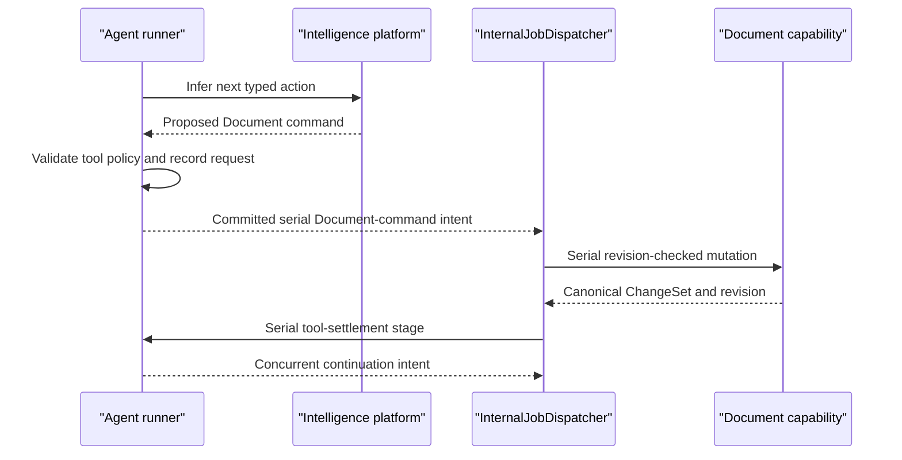

# Agents Capability Reference

## Purpose

Agents owns durable project-scoped tasks, runs, product-facing exchange, tool execution records, and results. An Agent changes Questions, admits Evidence, saves Analysis, and edits Documents, Slides, or Spreadsheets by calling each capability’s public command port. Automation creates or steers Agent tasks. Intelligence is an injected `0-platform` interface and provider implementation.

## Bottom line

An Agent is durable project-scoped work. A task pins its objective, user, project, requester, Personality snapshot, starting Context, and tool policy. It can have several runs, ask explicit questions, accept steering, pause, resume, fail, partially complete, and produce observable changes.

The Agents screen is a cross-project projection over tasks requested by the user. Tasks themselves remain project-scoped. The task exchange records communication about one specific task.

The core boundary is:

```plain text
Automation → Agent task
Agent tool → owning capability public command
Owning capability → its own state, revision, ChangeSet, and validation
```

When an Automation ultimately updates a Document, the Agent submits `DocumentCommands`; Document remains authoritative for the mutation and its ChangeSet.

## Runtime placement

Agents runs inside the Icarus backend. Long runs occupy bounded concurrent workers. Model calls go through the injected Intelligence platform port.

```plain text
apps/backend/src/
  3-capabilities/
    agents/
      domain/
        task.ts
        run.ts
        exchange.ts
        toolPolicy.ts
        events.ts
      application/
        agentTaskService.ts
        agentRunner.ts
        contextAssembler.ts
        toolIntentBuilder.ts
        resultVerifier.ts
      tools/
        questionTools.ts
        evidenceTools.ts
        analysisTools.ts
        documentTools.ts
        slidesTools.ts
        spreadsheetTools.ts
        researchTools.ts
      ports/
        intelligence.ts
        personalityReader.ts
        knowledgeReader.ts
        capabilityCommands.ts
        repository.ts
      persistence/
        migrations.ts
        sqliteAgentRepository.ts
      projections/
        activityProjection.ts
        attentionProjection.ts
      index.ts
  4-job-wiring/
    internal/
      InternalJobDispatcher.ts
    agents/
      registerAgentEndpointMappings.ts
      createAgentCommandJobs.ts
      createAgentExecutionJobs.ts
```

`1-init` injects the Intelligence implementation from `0-platform/intelligence`, repositories, and public capability ports. `4-job-wiring/agents` chooses queue and response modes. Composition-owned `4-job-wiring/internal/InternalJobDispatcher` enqueues typed post-commit stage intents.

## Authority and integration boundaries

Agents owns:

- task identity, objective, state, revision, requester, and immutable project scope;
- exact Personality snapshot;
- task Context references/snapshot manifest;
- runs, attempts, steps, checkpoints, progress, and results;
- product-facing questions, answers, steering, and system messages;
- task tool policy and records of proposed/executed tool calls;
- verification summaries and task-local artifacts.

Integrated authority:

- Personalities owns behavior definitions and project defaults.
- Questions owns questions, hypotheses, assumptions, and answers. Evidence, Analysis, Document, Slides, and Spreadsheet own their canonical state and revisions.
- Research owns Research runs, web retrieval orchestration, Sources, and candidate Evidence. Knowledge owns lattice projections.
- Automation owns definitions, trigger evaluation, and Automation run settlement.
- Platform Intelligence owns provider implementation and configuration.
- Agent output becomes canonical domain content through the owning capability’s command.

## Task and run model

```typescript
type AgentTaskState =
  | "queued" | "running" | "waiting"
  | "completed" | "partially_completed" | "failed" | "canceled";

interface AgentTask {
  id: string;
  userId: string;
  projectId: string;
  requesterUserId: string;
  revision: number;
  mode: "plan" | "action";
  state: AgentTaskState;
  objective: string;
  personality: PersonalitySnapshot;
  contextManifest: AgentContextManifest;
  toolPolicy: AgentToolPolicy;
  attentionReason?: "question" | "approval" | "conflict";
  createdAt: string;
  updatedAt: string;
}

interface AgentRun {
  id: string;
  taskId: string;
  attempt: number;
  status: "queued" | "running" | "settled";
  consumedThroughMessageSeq: number;
  result?: AgentRunResult;
}
```

The durable exchange contains objective, progress summaries, explicit questions, user answers, steering, approvals, result summaries, and safe system state. Provider-local traces and reasoning stay behind the Intelligence port.

## Operations and queue classification

| Request type or stage | Queue | Response |
|---|---|---|
| `agents.tasks.create.v1` | Serial | Inline `201` with task ID and deferred run receipt |
| `agents.runs.execute.v1`, `agents.runs.resume.v1` | Concurrent | Deferred `202` or internal stage result |
| `agents.tasks.answer.v1`, `steer.v1`, `pause.v1`, `resume.v1`, `cancel.v1` | Serial | Inline |
| `agents.tasks.get.v1`, `exchange.list.v1`, `activity.list.v1` | Concurrent | Inline |
| Provider inference and Knowledge retrieval | Within concurrent run | Internal |
| Owning-capability tool command | Separate owning-capability serial job | Internal result |

A concurrent Agent run persists a durable, idempotent tool-call stage, returns a typed destination-command intent, and ends or enters `waiting`. `InternalJobDispatcher` later enqueues the owning capability’s serial command. Its result records the tool outcome and returns a separate concurrent continuation intent. Job wiring owns Scheduler invocation and next-stage enqueueing.

Task creation follows the same rule: the serial create command commits the Task, objective message, first queued run, creation receipt, and `agent.execute` stage receipt; it returns the task response plus a typed concurrent execution intent. A replay of the same stage key and digest returns its stored result. A different digest is `idempotency_mismatch`.

## Revision, ChangeSet, and event model

Task control is revision-checked. User-visible task mutations append `agent_task_changesets` with operations such as answer, steer, pause, resume, and cancel. Run progress is append-only operational history, not undoable content.

Task creation is idempotent before a Task ID exists: `(requesterUserId, projectId, clientRequestId)` maps to one request digest, Task ID, and stored response. Once an aggregate exists, every Task mutation is unique by `(taskId, clientRequestId)` and stores a request digest. Reusing an ID with different input is always `idempotency_mismatch`.

Each run consumes exchange messages through a recorded sequence. A new answer or steering message after that sequence schedules another run. Tool effects are recorded twice by design:

1. Agent records the requested tool call and outcome.
2. The target capability records its canonical ChangeSet with actor `{kind: "agent", taskId, runId}`.

Agent stores the target capability’s result reference while the target capability retains its ChangeSet body.

Events include `AgentTaskCreated`, `AgentRunStarted`, `AgentQuestionAsked`, `AgentToolRequested`, `AgentToolSettled`, and `AgentTaskSettled`.

When a settled task has `originKind = "automation"`, Agents returns an `automation.settle` intent carrying the Automation run ID and safe outcome. `InternalJobDispatcher` enqueues the later serial Automation settlement.

## Capability-owned tables

```sql
CREATE TABLE agent_tasks (
  id TEXT PRIMARY KEY,
  user_id TEXT NOT NULL,
  project_id TEXT NOT NULL,
  requester_user_id TEXT NOT NULL,
  revision INTEGER NOT NULL,
  mode TEXT NOT NULL,
  state TEXT NOT NULL,
  objective TEXT NOT NULL,
  personality_snapshot_json TEXT NOT NULL,
  context_manifest_json TEXT NOT NULL,
  tool_policy_json TEXT NOT NULL,
  origin_kind TEXT,
  origin_id TEXT,
  attention_reason TEXT,
  latest_summary TEXT NOT NULL DEFAULT '',
  created_at TEXT NOT NULL,
  updated_at TEXT NOT NULL,
  UNIQUE (project_id, id),
  UNIQUE (user_id, project_id, id),
  UNIQUE (requester_user_id, project_id, id)
);

CREATE TABLE agent_task_changesets (
  id TEXT PRIMARY KEY,
  user_id TEXT NOT NULL,
  project_id TEXT NOT NULL,
  task_id TEXT NOT NULL,
  seq INTEGER NOT NULL,
  actor_user_id TEXT NOT NULL,
  client_request_id TEXT NOT NULL,
  request_digest TEXT NOT NULL,
  expected_revision INTEGER NOT NULL,
  operations_json TEXT NOT NULL,
  inverse_json TEXT,
  created_at TEXT NOT NULL,
  UNIQUE (task_id, seq),
  UNIQUE (task_id, client_request_id),
  FOREIGN KEY (user_id, project_id, task_id)
    REFERENCES agent_tasks(user_id, project_id, id)
);

CREATE TABLE agent_task_creation_receipts (
  requester_user_id TEXT NOT NULL,
  project_id TEXT NOT NULL,
  client_request_id TEXT NOT NULL,
  request_digest TEXT NOT NULL,
  task_id TEXT NOT NULL,
  response_json TEXT NOT NULL,
  created_at TEXT NOT NULL,
  PRIMARY KEY (requester_user_id, project_id, client_request_id),
  UNIQUE (task_id),
  FOREIGN KEY (requester_user_id, project_id, task_id)
    REFERENCES agent_tasks(requester_user_id, project_id, id)
);

CREATE TABLE agent_runs (
  id TEXT PRIMARY KEY,
  user_id TEXT NOT NULL,
  project_id TEXT NOT NULL,
  task_id TEXT NOT NULL,
  attempt INTEGER NOT NULL,
  status TEXT NOT NULL,
  consumed_through_message_seq INTEGER NOT NULL,
  provider_trace_id TEXT,
  result_json TEXT,
  error_code TEXT,
  started_at TEXT,
  completed_at TEXT,
  UNIQUE (task_id, attempt),
  UNIQUE (task_id, id),
  UNIQUE (user_id, project_id, task_id, id),
  FOREIGN KEY (user_id, project_id, task_id)
    REFERENCES agent_tasks(user_id, project_id, id)
);

CREATE TABLE agent_run_steps (
  id TEXT PRIMARY KEY,
  user_id TEXT NOT NULL,
  project_id TEXT NOT NULL,
  task_id TEXT NOT NULL,
  run_id TEXT NOT NULL,
  seq INTEGER NOT NULL,
  kind TEXT NOT NULL,
  status TEXT NOT NULL,
  safe_summary TEXT NOT NULL,
  input_digest TEXT,
  output_digest TEXT,
  started_at TEXT,
  completed_at TEXT,
  UNIQUE (run_id, seq),
  FOREIGN KEY (user_id, project_id, task_id)
    REFERENCES agent_tasks(user_id, project_id, id),
  FOREIGN KEY (user_id, project_id, task_id, run_id)
    REFERENCES agent_runs(user_id, project_id, task_id, id)
);

CREATE TABLE agent_messages (
  user_id TEXT NOT NULL,
  project_id TEXT NOT NULL,
  task_id TEXT NOT NULL,
  seq INTEGER NOT NULL,
  kind TEXT NOT NULL,
  actor_kind TEXT NOT NULL,
  actor_user_id TEXT,
  question_id TEXT,
  body TEXT NOT NULL,
  payload_json TEXT NOT NULL DEFAULT '{}',
  created_at TEXT NOT NULL,
  PRIMARY KEY (task_id, seq),
  FOREIGN KEY (user_id, project_id, task_id)
    REFERENCES agent_tasks(user_id, project_id, id)
);

CREATE TABLE agent_questions (
  id TEXT PRIMARY KEY,
  user_id TEXT NOT NULL,
  project_id TEXT NOT NULL,
  task_id TEXT NOT NULL,
  prompt TEXT NOT NULL,
  required INTEGER NOT NULL,
  state TEXT NOT NULL,
  options_json TEXT NOT NULL DEFAULT '[]',
  answer_seq INTEGER,
  created_at TEXT NOT NULL,
  answered_at TEXT,
  FOREIGN KEY (user_id, project_id, task_id)
    REFERENCES agent_tasks(user_id, project_id, id)
);

CREATE TABLE agent_tool_calls (
  id TEXT PRIMARY KEY,
  user_id TEXT NOT NULL,
  project_id TEXT NOT NULL,
  task_id TEXT NOT NULL,
  run_id TEXT NOT NULL,
  seq INTEGER NOT NULL,
  capability TEXT NOT NULL,
  command_type TEXT NOT NULL,
  target_id TEXT,
  request_digest TEXT NOT NULL,
  state TEXT NOT NULL,
  result_ref_json TEXT,
  error_code TEXT,
  created_at TEXT NOT NULL,
  settled_at TEXT,
  UNIQUE (run_id, seq),
  FOREIGN KEY (user_id, project_id, task_id)
    REFERENCES agent_tasks(user_id, project_id, id),
  FOREIGN KEY (user_id, project_id, task_id, run_id)
    REFERENCES agent_runs(user_id, project_id, task_id, id)
);

CREATE TABLE agent_stage_receipts (
  user_id TEXT NOT NULL,
  project_id TEXT NOT NULL,
  task_id TEXT NOT NULL,
  stage_key TEXT NOT NULL,
  stage_kind TEXT NOT NULL,
  queue_type TEXT NOT NULL CHECK (queue_type IN ('serial','concurrent')),
  request_digest TEXT NOT NULL,
  state TEXT NOT NULL,
  result_json TEXT,
  error_code TEXT,
  created_at TEXT NOT NULL,
  updated_at TEXT NOT NULL,
  PRIMARY KEY (task_id, stage_key),
  FOREIGN KEY (user_id, project_id, task_id)
    REFERENCES agent_tasks(user_id, project_id, id)
);
```

Agent Tasks and their execution history are retained records. `origin_id` and tool `target_id` are cross-capability typed addresses validated through the owning capability’s command and result contracts.

## SQL indexes

```sql
CREATE INDEX agent_tasks_requester_state_updated
  ON agent_tasks(
    requester_user_id, state, updated_at DESC, user_id, project_id, id DESC
  );
CREATE INDEX agent_tasks_project_updated
  ON agent_tasks(user_id, project_id, updated_at DESC, id DESC);
CREATE INDEX agent_task_changesets_tail
  ON agent_task_changesets(user_id, project_id, task_id, seq DESC);
CREATE INDEX agent_task_creation_receipts_task
  ON agent_task_creation_receipts(requester_user_id, project_id, task_id);
CREATE INDEX agent_runs_task_attempt
  ON agent_runs(user_id, project_id, task_id, attempt DESC);
CREATE INDEX agent_messages_task_seq
  ON agent_messages(user_id, project_id, task_id, seq);
CREATE INDEX agent_questions_open
  ON agent_questions(user_id, project_id, task_id, state, created_at);
CREATE INDEX agent_tool_calls_target
  ON agent_tool_calls(user_id, project_id, capability, target_id, created_at DESC);
CREATE INDEX agent_stages_pending
  ON agent_stage_receipts(
    state, queue_type, updated_at, user_id, project_id, task_id
  );
```

## Named rebuildable projections

- `agent_activity`: cross-project task rows derived from tasks, latest run, Personality snapshot, and latest safe message.
- `agent_attention_queue`: tasks with open required questions, approvals, or conflicts.
- `agent_progress_timeline`: product-facing progress derived from safe run-step summaries and exchange.

These read models can be rebuilt from canonical Agent tables and are distinct from SQL indexes.

## Dependencies and ports

Required:

- `IntelligencePort` from `0-platform/intelligence`.
- Personality exact snapshot reader.
- Knowledge retrieval reader and project Context assembler.
- Research command/read port for web-oriented investigation.
- public command/result contracts for Questions, Evidence admission, Analysis, Document, Slides, and Spreadsheet; wiring owns invocation.
- Database, IDs, clock, logger.

Provided:

- task creation/control/read ports;
- task exchange;
- Automation-facing `CreateAgentTask` and `SteerAgentTask`;
- activity and attention projections.

Each tool adapter accepts and returns the target capability’s public DTOs. Repository operations remain encapsulated by the owning capability.

## Intelligence and web use

Agents uses Intelligence through an injected platform interface. Provider selection, credentials, retries, structured-output transport, and model-specific request shaping live under `0-platform/intelligence`.

When web work is needed, an Agent starts or reads a Research run. Research owns retrieval, Sources, candidate Evidence, and research modes.

## Principal action flow



## Invariants

- A task never changes user or project.
- The Personality snapshot is immutable.
- Exchange sequence is strictly increasing.
- A required open question produces attention and accepts one canonical answer.
- A run consumes a recorded exchange prefix.
- Agents mutate other domains only through public commands.
- Target capabilities own validation, revision conflicts, ChangeSets, and undo.
- Automation creates or steers tasks; the Agents capability executes each task’s tool policy.
- Product-facing storage contains safe exchange and progress summaries.
- A model proposal becomes authoritative only through a validated owning-capability command.
- Task creation and every aggregate mutation enforce digest-backed idempotency.
- Every internal stage is idempotent by Task ID, stage key, and digest.
- A settled Automation-origin task schedules settlement through job wiring.
- Job wiring owns Scheduler invocation and each stage commits before its continuation is dispatched.

## Conformance scenarios

1. Create an action task with one Personality snapshot and project Context manifest.
2. Exercise queued, running, waiting, completed, partially completed, failed, and canceled task states.
3. Ask and answer an explicit question, apply steering, and record safe progress.
4. Execute model work through the configured Platform Intelligence interface.
5. Read Knowledge and issue public commands to Questions, Evidence, Analysis, Document, Slides, and Spreadsheet through the same tool-adapter law.
6. Rebuild activity and attention projections from task, run, and exchange state.

## Acceptance criteria

- [ ] Task creation atomically records task, objective message, first run, creation receipt, and execution-stage receipt.
- [ ] More concurrent Agent runs than pool slots wait in the concurrent FIFO queue.
- [ ] A stale task revision returns a conflict and preserves current control state.
- [ ] Answering a question closes it exactly once and schedules a new run.
- [ ] Agent-created Document edits appear as Document ChangeSets authored by the task actor.
- [ ] Tool policy gates every destination capability command.
- [ ] Automation reaches Resource mutations by creating or steering an Agent.
- [ ] An Automation-origin task result produces a dispatcher-owned settlement intent.
- [ ] Activity projections rebuild from canonical task/run/exchange state.
- [ ] Provider SDKs, Research, and target stores remain behind their typed ports.

## References

- [Product — Icarus Complete Product Definition](https://app.notion.com/p/3aeb6410e502810ba9c0c26442d5255a)
- [Model — Icarus Request, Job & Dual-Queue Runtime](https://app.notion.com/p/3adb6410e50281c498f4d7f6a621eba2)
- [Implementation — User Agents & Personality Library](https://app.notion.com/p/3acb6410e50281229fe9eec53047607c)
- [Operation Legion — Agents, Personas, Memory, and Automation](https://app.notion.com/p/394b6410e502814994ceece646403c79)
- [Architecture — Taurus Layered Application Model](https://app.notion.com/p/3acb6410e502812bb4e0ff2c91ff753f)
- [Architecture — Interaction, Intent & Operation Pipeline](https://app.notion.com/p/3adb6410e50281d887f1f53fcc2b5575)
