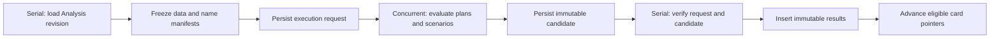
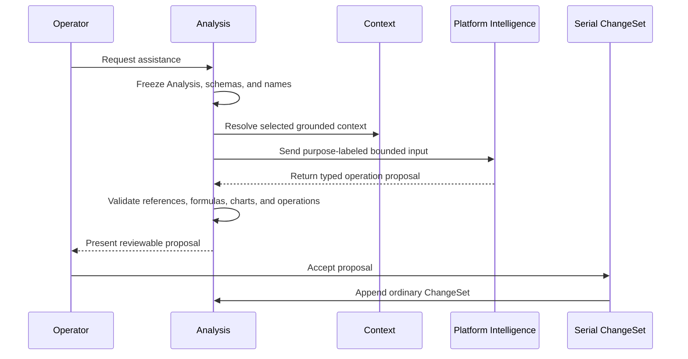

# Capability — Icarus Analysis Runtime Model

> Mirrored from [Notion](https://app.notion.com/p/3aeb6410e5028186b403ec5a0f07e561).

## Summary / Concept
Analysis is build position **Research 1 of 3**. Its required construction path is Foundations → Resources → Analysis; Evidence and Research build on its stable outputs. Question links and destination-resource bindings attach through narrow ports and do not change Analysis ownership.
### Prerequisites and build position
#### Required for the core capability
- Platform Database transactions, SQLite migrations, logging, and the serial/concurrent job runtime.
- Data exact-snapshot reads for stable table, column, row, and variable identities.
- Platform Formula compilation and deterministic evaluation.
- Data name registry stable declarations and a resolver adapter that can produce a frozen name-resolution snapshot.
#### Required for the corresponding integration
- Questions for typed Question and Hypothesis links.
- Context for selected research context and grounded proposal inputs.
- Platform Intelligence for analysis, chart, scenario, and explanation proposals.
- Document, Slides, and Spreadsheet admission contracts for placing an Analysis result in another resource.
#### Implementation order
1. Define the aggregate, typed operations, footprints, repository port, migrations, and Base plus ChangeSet replay.
2. Implement Data snapshot resolution, data-plan validation, Formula compilation, and deterministic local execution.
3. Add immutable execution requests, concurrent computation, serial settlement, scenarios, result history, and dependency projections.
4. Add Questions, Hypotheses, and Context links.
5. Add Intelligence proposals and typed result-binding packages.
Initialization constructs Analysis with a bound repository, bound readers, Platform Formula, the Data name registry resolver adapter, and the configured ChangeSet attribution. HTTP requests and jobs carry Analysis and resource identities. Accepted ChangeSets receive the configured attribution.
### Capability purpose
Analysis is the graph and chart workbench over Data. It owns reusable analytical specifications, transformations, calculated fields, scenarios, chart and table cards, dependency presentations, layouts, executions, immutable results, and reviewable Intelligence proposals.
Authored state and computed state are distinct:
```plain text
Analysis Base + ChangeSet tail
+ exact Data input manifest
+ frozen name-resolution snapshot
+ scenario overlay
+ Formula runtime revision
+ executor revision
= immutable result snapshot
```
A rerun creates a new result identity. Cards point to an accepted result; they never contain the result as editable authored state.
### Authority boundaries
<table fit-page-width="true" header-row="true">
<tr>
<td>Concern</td>
<td>Authority</td>
</tr>
<tr>
<td>Analysis pages, cards, data plans, calculated fields, scenarios, layouts, links, ChangeSets, executions, results, and proposals</td>
<td>Analysis</td>
</tr>
<tr>
<td>Tables, columns, rows, variables, values, and exact source revisions</td>
<td>Data</td>
</tr>
<tr>
<td>Formula grammar, value model, compilation, diagnostics, and deterministic evaluation</td>
<td>Platform Formula</td>
</tr>
<tr>
<td>Stable declarations, aliases, collision rules, and name resolution</td>
<td>Data name registry</td>
</tr>
<tr>
<td>Questions and Question-owned Hypotheses</td>
<td>Questions</td>
</tr>
<tr>
<td>Selected source sets and grounded retrieval</td>
<td>Context</td>
</tr>
<tr>
<td>Model selection and model execution</td>
<td>Platform Intelligence</td>
</tr>
<tr>
<td>Placement and presentation of a bound result inside a resource</td>
<td>Document, Slides, or Spreadsheet</td>
</tr>
</table>
Analysis stores stable references to external objects and exact manifests for completed work. It does not duplicate mutable Data values or Data name registry declarations.
### Repository placement
```plain text
apps/backend/src/
  1-init/
    create/
      analysis.ts

  3-capabilities/
    analysis/
      domain/
        model.ts
        data-plan.ts
        chart-spec.ts
        scenarios.ts
        dependencies.ts
        operations.ts
        footprints.ts
        apply.ts
        validation.ts
        errors.ts
      application/
        service.ts
        execution.ts
        settlement.ts
        proposals.ts
        bindings.ts
      ports/
        analysisRepository.ts
        structuredDataSnapshotReader.ts
        nameResolutionAdapter.ts
        questionReader.ts
        contextReader.ts
      persistence/
        migrations.ts
        sqliteAnalysisRepository.ts
        projections.ts
      index.ts
      tests/

  4-job-wiring/
    analysis/
      registerAnalysisEndpointMappings.ts
      createAnalysisJobs.ts
      createAnalysisStageJobs.ts
```
Analysis SQL and migrations remain with the capability. Initialization supplies bound ports. Job wiring translates normalized endpoint requests into serial or concurrent jobs and coordinates internal stages.
## Types & Interfaces
### Analysis aggregate
```typescript
interface Analysis {
  id: string;
  name: string;
  description?: string;
  lifecycle: "active" | "archived";
  revision: number;
  baseSeq: number;
  createdAt: string;
  updatedAt: string;
}

interface AnalysisBase {
  representation: "analysis";
  pages: AnalysisPage[];
  dataPlans: AnalysisDataPlan[];
  calculatedFields: CalculatedField[];
  scenarios: AnalysisScenario[];
  questionLinks: AnalysisQuestionLink[];
  contextSelection: AnalysisContextSelection;
}

interface AnalysisPage {
  id: string;
  name: string;
  orderKey: string;
  cards: AnalysisCard[];
}

interface CardPlacement {
  x: number;
  y: number;
  width: number;
  height: number;
}

interface AnalysisContextSelection {
  contextIds: string[];
  includeQuestionEvidence: boolean;
}
```
IDs remain stable through rename, movement, and layout changes. Order keys support insertion without renumbering unrelated objects. The Base contains a normalized snapshot through baseSeq; ChangeSets after baseSeq form the authoritative tail.
### Data plans and transforms
A data plan is a directed acyclic graph. Source nodes reference Data by stable IDs. Transform nodes consume named node outputs. A plan publishes one or more stable outputs for cards and downstream plans.
```typescript
interface AnalysisDataPlan {
  id: string;
  name: string;
  nodes: AnalysisPlanNode[];
  edges: AnalysisPlanEdge[];
  outputs: AnalysisPlanOutput[];
}

interface AnalysisPlanEdge {
  fromNodeId: string;
  fromPort: string;
  toNodeId: string;
  toPort: string;
}

interface AnalysisPlanOutput {
  id: string;
  nodeId: string;
  port: string;
  label: string;
}

type StructuredDataRef =
  | {
      kind: "table";
      tableId: string;
      columnIds: string[];
    }
  | {
      kind: "variable";
      variableId: string;
    };

type AnalysisPlanNode =
  | {
      id: string;
      kind: "source";
      source: StructuredDataRef;
    }
  | {
      id: string;
      kind: "select";
      inputPort: string;
      fieldIds: string[];
    }
  | {
      id: string;
      kind: "filter";
      inputPort: string;
      predicate: FormulaSource;
    }
  | {
      id: string;
      kind: "derive";
      inputPort: string;
      fields: DerivedFieldSpec[];
    }
  | {
      id: string;
      kind: "aggregate";
      inputPort: string;
      groupByFieldIds: string[];
      measures: AggregateMeasureSpec[];
    }
  | {
      id: string;
      kind: "join";
      leftPort: string;
      rightPort: string;
      join: "inner" | "left" | "right" | "full";
      keys: JoinKeySpec[];
    }
  | {
      id: string;
      kind: "union";
      inputPorts: string[];
      mode: "all" | "distinct";
    }
  | {
      id: string;
      kind: "sort";
      inputPort: string;
      fields: SortFieldSpec[];
    }
  | {
      id: string;
      kind: "limit";
      inputPort: string;
      count: number;
      offset: number;
    }
  | {
      id: string;
      kind: "pivot";
      inputPort: string;
      rowFieldIds: string[];
      columnFieldId: string;
      valueSpecs: AggregateMeasureSpec[];
    }
  | {
      id: string;
      kind: "unpivot";
      inputPort: string;
      fieldIds: string[];
      nameField: string;
      valueField: string;
    }
  | {
      id: string;
      kind: "window";
      inputPort: string;
      partitionByFieldIds: string[];
      orderBy: SortFieldSpec[];
      fields: WindowFieldSpec[];
    };

interface FormulaSource {
  source: string;
  expectedType?: FormulaTypeDescriptor;
}
```
Validation resolves every node and port, verifies field IDs and types, rejects cycles, validates join compatibility, validates aggregate and window semantics, and compiles each Formula source. Execution follows a deterministic topological order. Set ordering is explicit wherever ordering affects a result.
Data remains authoritative for source values. An execution asks for an exact snapshot and records every observed table, column, row-set, and variable revision in its input manifest.
### Formula and Data name-resolution seam
Calculated fields are authored Analysis objects. Their display labels belong to Analysis; resolvable names and aliases remain Data name registry declarations.
```typescript
interface CalculatedField {
  id: string;
  label: string;
  source: FormulaSource;
  outputType?: FormulaTypeDescriptor;
  nullPolicy: "propagate" | "allow" | "reject";
}

interface NameResolutionRequest {
  analysisId: string;
  analysisRevision: number;
  formulaSources: Array<{
    ownerKind: "calculated-field" | "plan-node" | "scenario";
    ownerId: string;
    source: string;
  }>;
  localBindings: LocalFormulaBinding[];
}

interface NameResolutionSnapshot {
  declarations: StableDeclarationRef[];
  resolutions: ResolvedNameBinding[];
  resolverRevision: number;
  digest: string;
}
```
The injected resolver adapter asks Data name registry to resolve Formula identifiers against stable declarations. Analysis records the resulting snapshot and digest for validation and execution. Analysis does not create, rename, alias, or delete declaration identities.
Platform Formula receives source text, the frozen resolution snapshot, immutable row bindings, scenario bindings, and execution limits. Compiled syntax trees are rebuildable caches. Formula values and diagnostics pass through unchanged.
### Scenarios and assumptions
Scenarios are authored overlays used to test assumptions without mutating Data.
```typescript
interface AnalysisScenario {
  id: string;
  name: string;
  description?: string;
  assumptionStatements: string[];
  overrides: ScenarioOverride[];
}

type ScenarioOverride =
  | {
      id: string;
      kind: "variable-value";
      variableId: string;
      value: DataValue;
      rationale?: string;
    }
  | {
      id: string;
      kind: "table-selection-value";
      tableId: string;
      selector: StableRowSelector;
      columnId: string;
      value: DataValue;
      rationale?: string;
    }
  | {
      id: string;
      kind: "formula";
      targetFieldId: string;
      source: FormulaSource;
      rationale?: string;
    };
```
Each execution freezes the selected scenario definitions at the Analysis revision it executes. Overrides apply to an immutable execution view. Scenario identity, normalized overrides, and resolved formulas produce a scenario digest included in every result.
### Cards, charts, and dependency presentation
Cards are presentation specifications over stable data-plan outputs or accepted result outputs.
```typescript
interface AnalysisCardBase {
  id: string;
  title: string;
  description?: string;
  placement: CardPlacement;
  latestAcceptedResultId?: string;
}

type AnalysisCard =
  | (AnalysisCardBase & {
      kind: "chart";
      binding: AnalysisOutputBinding;
      chart: ChartSpec;
    })
  | (AnalysisCardBase & {
      kind: "table";
      binding: AnalysisOutputBinding;
      table: TablePresentationSpec;
    })
  | (AnalysisCardBase & {
      kind: "metric";
      binding: AnalysisOutputBinding;
      metric: MetricPresentationSpec;
    })
  | (AnalysisCardBase & {
      kind: "dependency";
      dependency: DependencyPresentationSpec;
    })
  | (AnalysisCardBase & {
      kind: "note";
      markdown: string;
    });

interface AnalysisOutputBinding {
  dataPlanId: string;
  outputId: string;
  fieldIds?: string[];
}

interface ChartSpec {
  mark:
    | "bar"
    | "line"
    | "area"
    | "point"
    | "scatter"
    | "pie"
    | "heatmap"
    | "box"
    | "histogram";
  channels: ChartChannelBinding[];
  orientation?: "horizontal" | "vertical";
  stack?: "none" | "zero" | "normalize";
  facet?: ChartFacetSpec;
  title?: string;
  subtitle?: string;
  accessibilityLabel: string;
}

interface ChartChannelBinding {
  channel:
    | "x"
    | "y"
    | "color"
    | "size"
    | "shape"
    | "detail"
    | "row"
    | "column"
    | "tooltip";
  fieldId: string;
  aggregate?: AggregateFunction;
  sort?: SortSpec;
  scale?: ScaleSpec;
}

interface DependencyPresentationSpec {
  roots: DependencyRootRef[];
  direction: "upstream" | "downstream" | "both";
  depth?: number;
  includeKinds: DependencyKind[];
  layout: "layered" | "radial" | "force";
  showAssumptions: boolean;
  showQuestionLinks: boolean;
}
```
Chart validation checks that channels are legal for the selected mark and compatible with output field types. Render scenes, thumbnails, and accessible data tables are derived from immutable results and renderer revisions. They are not canonical Analysis state.
The dependency graph combines data-plan edges, Formula dependencies, Data references, scenario overrides, Question and Hypothesis links, Context links, and card-output bindings. The authored specification controls what a dependency card presents; graph edges themselves are rebuildable projections.
### Question, Hypothesis, and Context links
```typescript
interface AnalysisQuestionLink {
  questionId: string;
  hypothesisId?: string;
  purpose:
    | "motivates"
    | "tests"
    | "supports"
    | "challenges"
    | "explains";
  cardIds: string[];
  note?: string;
}

interface GroundedAnalysisContext {
  selection: AnalysisContextSelection;
  exactContextRefs: ExactContextRef[];
  evidenceRefs: string[];
  digest: string;
}
```
A hypothesis reference is always subordinate to its Question. Analysis stores the pair and its analytical purpose. Questions owns Question and Hypothesis content.
Context selection is authored in the Analysis Base. At proposal time, the Context reader resolves the selection to exact references and evidence. The frozen context digest becomes part of the proposal manifest.
### Capability ports and construction
```typescript
interface StructuredDataSnapshotReader {
  readExactSnapshot(input: {
    requestedRefs: StructuredDataRef[];
    atRevision?: number;
  }): Promise<StructuredDataSnapshot>;
}

interface AnalysisNameResolutionAdapter {
  resolve(
    input: NameResolutionRequest,
  ): Promise<NameResolutionSnapshot>;
}

interface AnalysisQuestionReader {
  getQuestionAndHypothesis(
    input: AnalysisQuestionLink,
  ): Promise<QuestionProjection>;
}

interface AnalysisContextReader {
  readSelectedContext(
    selection: AnalysisContextSelection,
  ): Promise<GroundedAnalysisContext>;
}

interface AnalysisRepository {
  create(input: CreateStoredAnalysis): Promise<Analysis>;
  list(input: ListAnalysisQuery): Promise<AnalysisPageResult>;
  load(
    analysisId: string,
    atRevision?: number,
  ): Promise<StoredAnalysis>;
  appendChangeSet(
    input: AppendAnalysisChangeSet,
  ): Promise<AnalysisChangeSet>;
  createExecutionRequest(
    input: CreateAnalysisExecutionRequest,
  ): Promise<AnalysisExecutionRequest>;
  storeExecutionCandidate(
    input: StoreExecutionCandidate,
  ): Promise<AnalysisExecutionCandidate>;
  settleExecution(
    input: SettleAnalysisExecution,
  ): Promise<AnalysisResultSnapshot[]>;
  createProposalRequest(
    input: CreateAnalysisProposalRequest,
  ): Promise<AnalysisProposalRequest>;
  storeProposalCandidate(
    input: StoreProposalCandidate,
  ): Promise<AnalysisProposalCandidate>;
  publishProposal(
    input: PublishAnalysisProposal,
  ): Promise<AnalysisProposal>;
  replaceBase(input: ReplaceAnalysisBase): Promise<void>;
}

interface CreateAnalysisDependencies {
  repository: AnalysisRepository;
  structuredData: StructuredDataSnapshotReader;
  formula: FormulaEngine;
  names: AnalysisNameResolutionAdapter;
  questions: AnalysisQuestionReader;
  context: AnalysisContextReader;
  intelligence: Intelligence;
  changeSetAttribution: ChangeSetAttribution;
  logger: Logger;
  clock: Clock;
  ids: IdGenerator;
}
```
Formula is injected as a pure engine. Data name registry is injected through a resolver adapter. Platform Intelligence is injected through its implemented purpose-labeled interface. Readers return exact-revision DTOs. The application factory binds every dependency once and exposes the Analysis service to job wiring.
## Runtime Objects
### Base, revisions, and ChangeSets
```typescript
interface AnalysisSubmission {
  submissionId: string;
  expectedRevision: number;
  operations: AnalysisOperation[];
}

interface AnalysisChangeSet {
  id: string;
  analysisId: string;
  submissionId: string;
  submissionHash: string;
  priorRevision: number;
  revision: number;
  seq: number;
  authorId: string;
  createdAt: string;
  operations: AnalysisOperation[];
  inverseOperations: AnalysisOperation[];
  footprint: AnalysisFootprint;
  undoOfChangeSetId?: string;
  redoOfChangeSetId?: string;
}

interface AnalysisFootprint {
  metadata: boolean;
  pageIds: string[];
  cardIds: string[];
  dataPlanIds: string[];
  calculatedFieldIds: string[];
  scenarioIds: string[];
  questionLinkKeys: string[];
  contextSelection: boolean;
}
```
Submission identity is unique within an Analysis. Retrying the same submissionId with the same canonical hash returns the accepted ChangeSet. Reusing the identity with another hash is an idempotency conflict.
Revision compare-and-swap protects the head. A stale submission may be retained only when its complete footprint is disjoint from intervening ChangeSets and all referenced targets still exist with compatible shapes. Examples:
- Edits to different cards may commute.
- Layout edits to different cards may commute.
- Deleting a page conflicts with stale edits to cards on that page.
- Changing a plan output conflicts with stale card bindings to the former output shape.
- Changes to separate scenarios may commute.
- Renaming an Analysis conflicts with another metadata edit.
Undo and redo append compensating ChangeSets. Base compaction folds a contiguous ChangeSet prefix into base_json under a baseSeq compare-and-swap while preserving the logical revision and replay result.
### Execution requests and immutable results
```typescript
interface AnalysisExecutionRequest {
  id: string;
  analysisId: string;
  idempotencyKey: string;
  analysisRevision: number;
  pageId?: string;
  cardIds: string[];
  scenarioIds: string[];
  inputManifest: ExactAnalysisInputRef[];
  nameResolution: NameResolutionSnapshot;
  inputDigest: string;
  requestDigest: string;
  state:
    | "queued"
    | "running"
    | "candidate-ready"
    | "ready"
    | "failed"
    | "interrupted"
    | "stale";
  failure?: AnalysisExecutionFailure;
  createdAt: string;
  updatedAt: string;
}

type ExactAnalysisInputRef =
  | {
      kind: "table";
      tableId: string;
      tableRevision: number;
      columnIds: string[];
      rowSetDigest: string;
      valueDigest: string;
    }
  | {
      kind: "variable";
      variableId: string;
      variableRevision: number;
      valueDigest: string;
    };

interface AnalysisResultSnapshot {
  id: string;
  requestId: string;
  analysisId: string;
  analysisRevision: number;
  scenarioId?: string;
  inputManifest: ExactAnalysisInputRef[];
  inputDigest: string;
  nameResolutionDigest: string;
  scenarioDigest: string;
  outputs: AnalysisOutput[];
  dependencyManifest: ObservedDependency[];
  formulaRuntimeRevision: string;
  executorRevision: string;
  digest: string;
  createdAt: string;
}

type AnalysisOutput =
  | { kind: "value"; name: string; value: DataValue }
  | { kind: "table"; name: string; value: TableValue }
  | {
      kind: "chart-data";
      name: string;
      schema: ChartResultSchema;
      rows: TableValue;
    }
  | {
      kind: "dependency-graph";
      name: string;
      graph: AnalysisDependencyGraph;
    };
```
The serial request stage resolves the exact Analysis revision, validates selected pages/cards/scenarios, freezes Data and name-resolution manifests, computes request digests, persists the request, and enqueues compute.
Concurrent compute evaluates plans and scenarios without holding the serial queue. It persists an immutable candidate keyed by request identity and returns a settlement intent.
Serial settlement verifies the request and candidate, inserts immutable result snapshots, advances only eligible card result pointers under revision compare-and-swap, and marks the request ready. A completion for an older Analysis revision remains valid history and does not advance a card changed after the request was frozen.
### Intelligence proposals
```typescript
interface AnalysisProposalRequest {
  id: string;
  analysisId: string;
  idempotencyKey: string;
  sourceAnalysisRevision: number;
  purpose:
    | "analysis-design"
    | "chart-design"
    | "scenario-design"
    | "analysis-explanation";
  instruction: string;
  selectedCardIds: string[];
  contextSelection: AnalysisContextSelection;
  inputManifest: ExactAnalysisInputRef[];
  contextManifest: ExactContextRef[];
  requestDigest: string;
  state: "queued" | "running" | "candidate-ready" | "ready" | "failed";
  createdAt: string;
  updatedAt: string;
}

interface AnalysisProposal {
  id: string;
  requestId: string;
  analysisId: string;
  sourceAnalysisRevision: number;
  inputManifest: ExactAnalysisInputRef[];
  contextManifest: ExactContextRef[];
  operations: AnalysisOperation[];
  rationale: string;
  assumptions: string[];
  evidenceRefs: string[];
  providerReceipt: IntelligenceReceipt;
  state: "ready" | "accepted" | "superseded";
  digest: string;
  acceptedChangeSetId?: string;
  createdAt: string;
}
```
Proposal preparation freezes the Analysis, selected source schemas, name-resolution snapshot, and Context selection. Platform Intelligence receives a purpose label and bounded grounded input. Analysis validates every referenced field, Formula source, chart channel, scenario override, and operation before publishing the proposal.
Acceptance revalidates the source revision and operations, then appends one ordinary ChangeSet. The proposal record links to that ChangeSet.
### Result-binding packages
```typescript
interface AnalysisResultBindingPackage {
  analysisId: string;
  analysisRevision: number;
  cardId: string;
  resultId: string;
  resultDigest: string;
  outputSelector: AnalysisOutputSelector;
  chartSpec?: ChartSpec;
  dependencyManifest: ObservedDependency[];
  createdAt: string;
}
```
Document, Slides, and Spreadsheet admit this package through their own typed operations and ChangeSets. Analysis remains authoritative for the upstream result. The destination owns placement, local presentation overrides, refresh state, and the accepted displayed binding.
### Rebuildable projections and caches
Rebuildable data includes:
- Compiled Formula syntax trees keyed by source, name-resolution digest, Formula runtime revision, and limits.
- Data-plan validation and output-schema caches keyed by Analysis revision and exact Data schemas.
- Input-reference and dependency-edge projections.
- Transformed datasets keyed by exact input, plan, scenario, Formula, and executor digests.
- Dependency layout keyed by graph digest, presentation specification, and layout engine revision.
- Chart scenes keyed by result digest, chart specification digest, and renderer revision.
- Thumbnails and accessible data tables keyed by rendered scene digest.
- Search text derived from Analysis labels, Question links, and source field metadata.
Deleting rebuildable data preserves Bases, ChangeSets, requests, candidates, results, and proposals.
### Execution flow

### Intelligence proposal flow

## Change Operations
### Typed operation vocabulary
```typescript
type AnalysisOperation =
  | { type: "rename-analysis"; name: string }
  | { type: "set-description"; description?: string }
  | { type: "archive-analysis" }
  | { type: "restore-analysis" }
  | {
      type: "set-context-selection";
      selection: AnalysisContextSelection;
    }
  | { type: "create-page"; page: NewAnalysisPage }
  | { type: "rename-page"; pageId: string; name: string }
  | { type: "move-page"; pageId: string; afterPageId?: string }
  | { type: "delete-page"; pageId: string }
  | { type: "create-data-plan"; dataPlan: AnalysisDataPlan }
  | {
      type: "update-data-plan";
      dataPlanId: string;
      patch: AnalysisDataPlanPatch;
    }
  | { type: "delete-data-plan"; dataPlanId: string }
  | {
      type: "create-calculated-field";
      field: CalculatedField;
    }
  | {
      type: "update-calculated-field";
      fieldId: string;
      patch: CalculatedFieldPatch;
    }
  | { type: "delete-calculated-field"; fieldId: string }
  | {
      type: "create-card";
      pageId: string;
      card: NewAnalysisCard;
    }
  | {
      type: "update-card";
      pageId: string;
      cardId: string;
      patch: AnalysisCardPatch;
    }
  | {
      type: "move-card";
      pageId: string;
      cardId: string;
      placement: CardPlacement;
    }
  | { type: "delete-card"; pageId: string; cardId: string }
  | { type: "create-scenario"; scenario: AnalysisScenario }
  | {
      type: "update-scenario";
      scenarioId: string;
      patch: AnalysisScenarioPatch;
    }
  | {
      type: "set-scenario-override";
      scenarioId: string;
      override: ScenarioOverride;
    }
  | {
      type: "remove-scenario-override";
      scenarioId: string;
      overrideId: string;
    }
  | { type: "delete-scenario"; scenarioId: string }
  | { type: "link-question"; link: AnalysisQuestionLink }
  | {
      type: "unlink-question";
      questionId: string;
      hypothesisId?: string;
    }
  | {
      type: "accept-intelligence-proposal";
      proposalId: string;
      operations: AnalysisOperation[];
    }
  | {
      type: "accept-result-pointer";
      cardId: string;
      resultId: string;
      expectedSourceRevision: number;
    };
```
Every operation validates stable IDs, ownership, types, and referential integrity before the ChangeSet is appended. Intelligence proposals contain this same operation vocabulary and cannot enter canonical state through a separate mutation path.
## Endpoints
### Public requests and endpoints
```typescript
interface CreateAnalysisRequest {
  requestId: string;
  name: string;
  description?: string;
}

interface SubmitAnalysisRequest {
  analysisId: string;
  submission: AnalysisSubmission;
}

interface ExecuteAnalysisRequest {
  analysisId: string;
  idempotencyKey: string;
  expectedAnalysisRevision: number;
  pageId?: string;
  cardIds: string[];
  scenarioIds: string[];
}

interface RequestAnalysisProposal {
  analysisId: string;
  idempotencyKey: string;
  expectedAnalysisRevision: number;
  purpose: AnalysisProposalRequest["purpose"];
  instruction: string;
  selectedCardIds: string[];
}
```
<table fit-page-width="true" header-row="true">
<tr>
<td>Method and path</td>
<td>Request type</td>
<td>Queue</td>
<td>Result</td>
</tr>
<tr>
<td>POST /analyses</td>
<td>analysis.create</td>
<td>Serial</td>
<td>Analysis at revision zero</td>
</tr>
<tr>
<td>GET /analyses</td>
<td>analysis.list</td>
<td>Concurrent</td>
<td>Bounded Analysis summaries</td>
</tr>
<tr>
<td>GET /analyses/:analysisId</td>
<td>analysis.get</td>
<td>Concurrent</td>
<td>Resolved Analysis or exact Base and tail</td>
</tr>
<tr>
<td>POST /analyses/:analysisId/submissions</td>
<td>analysis.submit</td>
<td>Serial</td>
<td>Accepted ChangeSet or typed conflict</td>
</tr>
<tr>
<td>POST /analyses/:analysisId/undo</td>
<td>analysis.undo</td>
<td>Serial</td>
<td>Compensating ChangeSet</td>
</tr>
<tr>
<td>POST /analyses/:analysisId/redo</td>
<td>analysis.redo</td>
<td>Serial</td>
<td>Compensating ChangeSet</td>
</tr>
<tr>
<td>GET /analyses/:analysisId/history</td>
<td>analysis.history.list</td>
<td>Concurrent</td>
<td>Bounded ChangeSet summaries</td>
</tr>
<tr>
<td>POST /analyses/:analysisId/executions</td>
<td>analysis.execute</td>
<td>Serial</td>
<td>Accepted execution request</td>
</tr>
<tr>
<td>GET /analysis-executions/:requestId</td>
<td>analysis.executions.get</td>
<td>Concurrent</td>
<td>Execution state and diagnostics</td>
</tr>
<tr>
<td>GET /analysis-results/:resultId</td>
<td>analysis.results.get</td>
<td>Concurrent</td>
<td>Immutable result or bounded output page</td>
</tr>
<tr>
<td>POST /analyses/:analysisId/proposals</td>
<td>analysis.proposals.request</td>
<td>Serial</td>
<td>Accepted proposal request</td>
</tr>
<tr>
<td>GET /analysis-proposals/:proposalId</td>
<td>analysis.proposals.get</td>
<td>Concurrent</td>
<td>Validated proposal</td>
</tr>
<tr>
<td>GET /analysis-results/:resultId/binding</td>
<td>analysis.bind-result</td>
<td>Concurrent</td>
<td>Typed result-binding package</td>
</tr>
</table>
List and result endpoints use bounded cursors. Result output pagination is stable against the immutable result digest.
## Jobs
### Endpoint jobs and asynchronous stages
<table fit-page-width="true" header-row="true">
<tr>
<td>Work</td>
<td>Queue</td>
<td>Response</td>
</tr>
<tr>
<td>List, get, history, execution status, result, proposal, and binding reads</td>
<td>Concurrent</td>
<td>Inline</td>
</tr>
<tr>
<td>Create, submit, undo, redo, archive, and restore</td>
<td>Serial</td>
<td>Inline</td>
</tr>
<tr>
<td>Freeze an execution request and its manifests</td>
<td>Serial</td>
<td>Accepted request identity</td>
</tr>
<tr>
<td>Execute data plans and scenarios</td>
<td>Concurrent internal stage</td>
<td>Candidate and settlement intent</td>
</tr>
<tr>
<td>Settle results and card pointers</td>
<td>Serial internal stage</td>
<td>Internal</td>
</tr>
<tr>
<td>Freeze a proposal request</td>
<td>Serial</td>
<td>Accepted request identity</td>
</tr>
<tr>
<td>Generate and validate an Intelligence proposal</td>
<td>Concurrent internal stage</td>
<td>Candidate and publication intent</td>
</tr>
<tr>
<td>Publish a proposal</td>
<td>Serial internal stage</td>
<td>Internal</td>
</tr>
<tr>
<td>Compact an Analysis Base</td>
<td>Serial internal stage</td>
<td>Internal</td>
</tr>
</table>
```typescript
const analysisJobFactories: EndpointJobFactoryMap = {
  "analysis.create": createSerialInlineJob(createAnalysis),
  "analysis.list": createConcurrentInlineJob(listAnalyses),
  "analysis.get": createConcurrentInlineJob(getAnalysis),
  "analysis.submit": createSerialInlineJob(submitAnalysis),
  "analysis.undo": createSerialInlineJob(undoAnalysis),
  "analysis.redo": createSerialInlineJob(redoAnalysis),
  "analysis.history.list": createConcurrentInlineJob(listHistory),
  "analysis.execute": createSerialInlineJob(requestExecution),
  "analysis.executions.get":
    createConcurrentInlineJob(getExecutionRequest),
  "analysis.results.get": createConcurrentInlineJob(getResult),
  "analysis.proposals.request":
    createSerialInlineJob(requestProposal),
  "analysis.proposals.get":
    createConcurrentInlineJob(getProposal),
  "analysis.bind-result":
    createConcurrentInlineJob(createResultBinding),
};

type AnalysisStageIntent =
  | {
      requestType: "analysis.execution.compute";
      idempotencyKey: string;
      requestId: string;
    }
  | {
      requestType: "analysis.execution.settle";
      idempotencyKey: string;
      requestId: string;
      candidateId: string;
    }
  | {
      requestType: "analysis.proposal.compute";
      idempotencyKey: string;
      requestId: string;
    }
  | {
      requestType: "analysis.proposal.publish";
      idempotencyKey: string;
      requestId: string;
      candidateId: string;
    }
  | {
      requestType: "analysis.base.compact";
      idempotencyKey: string;
      analysisId: string;
      throughSeq: number;
    };
```
Every stage has a deterministic idempotency key. A stage persists its durable output before emitting the next intent. Each queue slot is released before the next stage begins.
## SQL Tables
### Canonical schema and write protocol
The following schema is canonical for authored state, requests, candidates, immutable results, and proposals. JSON columns contain canonical serialized domain values and are validated again at repository boundaries.
```sql
PRAGMA foreign_keys = ON;

CREATE TABLE analyses (
  id TEXT PRIMARY KEY,
  name TEXT NOT NULL
    CHECK (length(trim(name)) BETWEEN 1 AND 200),
  description TEXT
    CHECK (description IS NULL OR length(description) <= 20000),
  lifecycle TEXT NOT NULL
    CHECK (lifecycle IN ('active', 'archived')),
  revision INTEGER NOT NULL DEFAULT 0
    CHECK (revision >= 0),
  base_seq INTEGER NOT NULL DEFAULT 0
    CHECK (base_seq >= 0 AND base_seq <= revision),
  base_json TEXT NOT NULL
    CHECK (json_valid(base_json)),
  created_at TEXT NOT NULL
    CHECK (length(created_at) > 0),
  updated_at TEXT NOT NULL
    CHECK (length(updated_at) > 0)
);

CREATE INDEX analyses_lifecycle_updated_idx
  ON analyses(lifecycle, updated_at DESC, id);

CREATE TABLE analysis_change_sets (
  id TEXT PRIMARY KEY,
  analysis_id TEXT NOT NULL
    REFERENCES analyses(id) ON DELETE CASCADE,
  submission_id TEXT NOT NULL
    CHECK (length(submission_id) > 0),
  submission_hash TEXT NOT NULL
    CHECK (length(submission_hash) > 0),
  prior_revision INTEGER NOT NULL
    CHECK (prior_revision >= 0),
  revision INTEGER NOT NULL
    CHECK (revision = prior_revision + 1),
  seq INTEGER NOT NULL
    CHECK (seq = revision),
  author_id TEXT NOT NULL
    CHECK (length(author_id) > 0),
  created_at TEXT NOT NULL
    CHECK (length(created_at) > 0),
  operations_json TEXT NOT NULL
    CHECK (json_valid(operations_json)),
  inverse_operations_json TEXT NOT NULL
    CHECK (json_valid(inverse_operations_json)),
  footprint_json TEXT NOT NULL
    CHECK (json_valid(footprint_json)),
  undo_of_change_set_id TEXT
    REFERENCES analysis_change_sets(id) ON DELETE SET NULL,
  redo_of_change_set_id TEXT
    REFERENCES analysis_change_sets(id) ON DELETE SET NULL,
  CHECK (
    undo_of_change_set_id IS NULL
    OR redo_of_change_set_id IS NULL
  ),
  UNIQUE (analysis_id, submission_id),
  UNIQUE (analysis_id, revision),
  UNIQUE (analysis_id, seq)
);

CREATE INDEX analysis_change_sets_recent_idx
  ON analysis_change_sets(analysis_id, seq DESC);

CREATE INDEX analysis_change_sets_undo_idx
  ON analysis_change_sets(analysis_id, undo_of_change_set_id)
  WHERE undo_of_change_set_id IS NOT NULL;

CREATE INDEX analysis_change_sets_redo_idx
  ON analysis_change_sets(analysis_id, redo_of_change_set_id)
  WHERE redo_of_change_set_id IS NOT NULL;

CREATE TABLE analysis_execution_requests (
  id TEXT PRIMARY KEY,
  analysis_id TEXT NOT NULL
    REFERENCES analyses(id) ON DELETE CASCADE,
  idempotency_key TEXT NOT NULL
    CHECK (length(idempotency_key) > 0),
  analysis_revision INTEGER NOT NULL
    CHECK (analysis_revision >= 0),
  page_id TEXT,
  card_ids_json TEXT NOT NULL
    CHECK (json_valid(card_ids_json)),
  scenario_ids_json TEXT NOT NULL
    CHECK (json_valid(scenario_ids_json)),
  input_manifest_json TEXT NOT NULL
    CHECK (json_valid(input_manifest_json)),
  name_resolution_json TEXT NOT NULL
    CHECK (json_valid(name_resolution_json)),
  input_digest TEXT NOT NULL
    CHECK (length(input_digest) > 0),
  request_digest TEXT NOT NULL
    CHECK (length(request_digest) > 0),
  state TEXT NOT NULL
    CHECK (
      state IN (
        'queued',
        'running',
        'candidate-ready',
        'ready',
        'failed',
        'interrupted',
        'stale'
      )
    ),
  failure_json TEXT
    CHECK (failure_json IS NULL OR json_valid(failure_json)),
  created_at TEXT NOT NULL
    CHECK (length(created_at) > 0),
  updated_at TEXT NOT NULL
    CHECK (length(updated_at) > 0),
  UNIQUE (analysis_id, idempotency_key)
);

CREATE INDEX analysis_execution_requests_state_idx
  ON analysis_execution_requests(state, updated_at, id);

CREATE INDEX analysis_execution_requests_analysis_idx
  ON analysis_execution_requests(
    analysis_id,
    created_at DESC,
    id
  );

CREATE TABLE analysis_execution_candidates (
  id TEXT PRIMARY KEY,
  request_id TEXT NOT NULL UNIQUE
    REFERENCES analysis_execution_requests(id) ON DELETE CASCADE,
  payload_json TEXT NOT NULL
    CHECK (json_valid(payload_json)),
  dependency_manifest_json TEXT NOT NULL
    CHECK (json_valid(dependency_manifest_json)),
  formula_runtime_revision TEXT NOT NULL
    CHECK (length(formula_runtime_revision) > 0),
  executor_revision TEXT NOT NULL
    CHECK (length(executor_revision) > 0),
  digest TEXT NOT NULL
    CHECK (length(digest) > 0),
  created_at TEXT NOT NULL
    CHECK (length(created_at) > 0)
);

CREATE TABLE analysis_result_snapshots (
  id TEXT PRIMARY KEY,
  request_id TEXT NOT NULL
    REFERENCES analysis_execution_requests(id) ON DELETE RESTRICT,
  analysis_id TEXT NOT NULL
    REFERENCES analyses(id) ON DELETE RESTRICT,
  analysis_revision INTEGER NOT NULL
    CHECK (analysis_revision >= 0),
  scenario_id TEXT,
  scenario_key TEXT NOT NULL,
  input_manifest_json TEXT NOT NULL
    CHECK (json_valid(input_manifest_json)),
  input_digest TEXT NOT NULL
    CHECK (length(input_digest) > 0),
  name_resolution_digest TEXT NOT NULL
    CHECK (length(name_resolution_digest) > 0),
  scenario_digest TEXT NOT NULL
    CHECK (length(scenario_digest) > 0),
  outputs_json TEXT NOT NULL
    CHECK (json_valid(outputs_json)),
  dependency_manifest_json TEXT NOT NULL
    CHECK (json_valid(dependency_manifest_json)),
  formula_runtime_revision TEXT NOT NULL
    CHECK (length(formula_runtime_revision) > 0),
  executor_revision TEXT NOT NULL
    CHECK (length(executor_revision) > 0),
  digest TEXT NOT NULL
    CHECK (length(digest) > 0),
  created_at TEXT NOT NULL
    CHECK (length(created_at) > 0),
  CHECK (
    (scenario_id IS NULL AND scenario_key = 'base')
    OR
    (scenario_id IS NOT NULL AND scenario_key = scenario_id)
  ),
  UNIQUE (request_id, scenario_key),
  UNIQUE (digest)
);

CREATE INDEX analysis_result_snapshots_analysis_idx
  ON analysis_result_snapshots(
    analysis_id,
    created_at DESC,
    id
  );

CREATE INDEX analysis_result_snapshots_request_idx
  ON analysis_result_snapshots(request_id, scenario_key);

CREATE TABLE analysis_proposal_requests (
  id TEXT PRIMARY KEY,
  analysis_id TEXT NOT NULL
    REFERENCES analyses(id) ON DELETE CASCADE,
  idempotency_key TEXT NOT NULL
    CHECK (length(idempotency_key) > 0),
  source_analysis_revision INTEGER NOT NULL
    CHECK (source_analysis_revision >= 0),
  purpose TEXT NOT NULL
    CHECK (
      purpose IN (
        'analysis-design',
        'chart-design',
        'scenario-design',
        'analysis-explanation'
      )
    ),
  instruction TEXT NOT NULL
    CHECK (length(trim(instruction)) > 0),
  selected_card_ids_json TEXT NOT NULL
    CHECK (json_valid(selected_card_ids_json)),
  context_selection_json TEXT NOT NULL
    CHECK (json_valid(context_selection_json)),
  input_manifest_json TEXT NOT NULL
    CHECK (json_valid(input_manifest_json)),
  context_manifest_json TEXT NOT NULL
    CHECK (json_valid(context_manifest_json)),
  request_digest TEXT NOT NULL
    CHECK (length(request_digest) > 0),
  state TEXT NOT NULL
    CHECK (
      state IN (
        'queued',
        'running',
        'candidate-ready',
        'ready',
        'failed'
      )
    ),
  failure_json TEXT
    CHECK (failure_json IS NULL OR json_valid(failure_json)),
  created_at TEXT NOT NULL
    CHECK (length(created_at) > 0),
  updated_at TEXT NOT NULL
    CHECK (length(updated_at) > 0),
  UNIQUE (analysis_id, idempotency_key)
);

CREATE INDEX analysis_proposal_requests_state_idx
  ON analysis_proposal_requests(state, updated_at, id);

CREATE INDEX analysis_proposal_requests_analysis_idx
  ON analysis_proposal_requests(
    analysis_id,
    created_at DESC,
    id
  );

CREATE TABLE analysis_proposal_candidates (
  id TEXT PRIMARY KEY,
  request_id TEXT NOT NULL UNIQUE
    REFERENCES analysis_proposal_requests(id) ON DELETE CASCADE,
  operations_json TEXT NOT NULL
    CHECK (json_valid(operations_json)),
  rationale TEXT NOT NULL,
  assumptions_json TEXT NOT NULL
    CHECK (json_valid(assumptions_json)),
  evidence_refs_json TEXT NOT NULL
    CHECK (json_valid(evidence_refs_json)),
  provider_receipt_json TEXT NOT NULL
    CHECK (json_valid(provider_receipt_json)),
  digest TEXT NOT NULL
    CHECK (length(digest) > 0),
  created_at TEXT NOT NULL
    CHECK (length(created_at) > 0)
);

CREATE TABLE analysis_proposals (
  id TEXT PRIMARY KEY,
  request_id TEXT NOT NULL UNIQUE
    REFERENCES analysis_proposal_requests(id) ON DELETE CASCADE,
  analysis_id TEXT NOT NULL
    REFERENCES analyses(id) ON DELETE CASCADE,
  source_analysis_revision INTEGER NOT NULL
    CHECK (source_analysis_revision >= 0),
  input_manifest_json TEXT NOT NULL
    CHECK (json_valid(input_manifest_json)),
  context_manifest_json TEXT NOT NULL
    CHECK (json_valid(context_manifest_json)),
  operations_json TEXT NOT NULL
    CHECK (json_valid(operations_json)),
  rationale TEXT NOT NULL,
  assumptions_json TEXT NOT NULL
    CHECK (json_valid(assumptions_json)),
  evidence_refs_json TEXT NOT NULL
    CHECK (json_valid(evidence_refs_json)),
  provider_receipt_json TEXT NOT NULL
    CHECK (json_valid(provider_receipt_json)),
  state TEXT NOT NULL
    CHECK (state IN ('ready', 'accepted', 'superseded')),
  digest TEXT NOT NULL UNIQUE
    CHECK (length(digest) > 0),
  accepted_change_set_id TEXT
    REFERENCES analysis_change_sets(id) ON DELETE SET NULL,
  created_at TEXT NOT NULL
    CHECK (length(created_at) > 0)
);

CREATE INDEX analysis_proposals_review_idx
  ON analysis_proposals(analysis_id, state, created_at DESC, id);

CREATE TABLE analysis_input_ref_projection (
  analysis_id TEXT NOT NULL
    REFERENCES analyses(id) ON DELETE CASCADE,
  projection_revision INTEGER NOT NULL
    CHECK (projection_revision >= 0),
  ref_key TEXT NOT NULL,
  owner_kind TEXT NOT NULL
    CHECK (
      owner_kind IN (
        'data-plan',
        'calculated-field',
        'scenario',
        'card'
      )
    ),
  owner_id TEXT NOT NULL,
  source_kind TEXT NOT NULL
    CHECK (
      source_kind IN (
        'table',
        'column',
        'variable',
        'declaration'
      )
    ),
  source_id TEXT NOT NULL,
  path_json TEXT NOT NULL
    CHECK (json_valid(path_json)),
  dependency_kind TEXT NOT NULL,
  PRIMARY KEY (analysis_id, ref_key)
);

CREATE INDEX analysis_input_ref_projection_reverse_idx
  ON analysis_input_ref_projection(
    source_kind,
    source_id,
    analysis_id,
    owner_kind,
    owner_id
  );

CREATE TABLE analysis_dependency_edge_projection (
  analysis_id TEXT NOT NULL
    REFERENCES analyses(id) ON DELETE CASCADE,
  projection_revision INTEGER NOT NULL
    CHECK (projection_revision >= 0),
  edge_key TEXT NOT NULL,
  from_node_id TEXT NOT NULL,
  to_node_id TEXT NOT NULL,
  edge_kind TEXT NOT NULL,
  card_id TEXT,
  metadata_json TEXT NOT NULL
    CHECK (json_valid(metadata_json)),
  CHECK (from_node_id <> to_node_id),
  PRIMARY KEY (analysis_id, edge_key)
);

CREATE INDEX analysis_dependency_edge_from_idx
  ON analysis_dependency_edge_projection(
    analysis_id,
    from_node_id,
    edge_kind
  );

CREATE INDEX analysis_dependency_edge_to_idx
  ON analysis_dependency_edge_projection(
    analysis_id,
    to_node_id,
    edge_kind
  );
```
The repository updates an Analysis head and inserts its ChangeSet in one transaction. Execution settlement inserts results, advances eligible pointers, and updates request state in one transaction. Proposal publication inserts the proposal and updates request state in one transaction.
The input-reference and dependency-edge tables are rebuildable projections of the current Analysis revision. A projection writer replaces all rows for an Analysis inside one transaction and records the projected revision on every row.
## Invariants & Acceptance
### Governing invariants
1. Authored Analysis state has one monotonic revision and one contiguous ChangeSet sequence.
2. Stable IDs identify pages, plans, nodes, outputs, fields, cards, scenarios, and links through rename and movement.
3. Data owns source objects and values; Analysis records stable references and exact execution manifests.
4. Data name registry owns declaration identity and resolution; Analysis records frozen resolver snapshots.
5. Platform Formula owns language semantics and deterministic evaluation.
6. Data plans are acyclic and every input/output port is type-valid.
7. Formula evaluation receives immutable row bindings, variable bindings, and a frozen resolver snapshot.
8. Scenario overlays never mutate Data.
9. Every execution pins an exact Analysis revision, complete input manifest, name-resolution digest, and selected scenarios.
10. Result snapshots are immutable; reruns create new identities.
11. Card result pointers advance only through revision-checked serial settlement.
12. Question and Hypothesis references preserve the Question-owned relationship.
13. Intelligence produces validated ordinary operations; accepted proposals append ordinary ChangeSets.
14. Destination resources admit binding packages through their own ChangeSets.
15. Base compaction preserves logical revision and replay equivalence.
16. Rebuildable projections and caches can be recreated from canonical state and immutable manifests.
17. Analysis SQL, migrations, domain code, and repository adapters remain colocated with the capability.
18. Every accepted ChangeSet records the configured attribution.
### Acceptance criteria
- Create, load, list, replay, archive, restore, undo, redo, and Base compaction preserve stable identities.
- Identical submission retries return the original ChangeSet; a changed payload under the same submission identity returns an idempotency conflict.
- Conflicting stale edits report the current revision and affected footprint.
- Provably disjoint card, page, plan, and scenario edits apply deterministically.
- A data plan rejects cycles, missing ports, incompatible joins, invalid aggregations, and unstable ordering.
- Exact Data manifests reproduce the same input values after source data advances.
- Calculated fields use Platform Formula values and diagnostics unchanged.
- Name resolution is frozen for execution and is reproducible from its declaration references and digest.
- Scenario execution changes outputs while preserving source Data.
- Every result records exact input, scenario, name-resolution, Formula, and executor digests.
- A result completing against an older Analysis revision remains historical and cannot advance an incompatible card pointer.
- Chart specifications validate mark/channel/type compatibility and produce accessible titles and data tables.
- Dependency cards present data-plan, Formula, scenario, Question, Hypothesis, Context, and output relationships from rebuildable edges.
- Question and Hypothesis links preserve their typed analytical purpose.
- Intelligence proposals cannot bypass operation validation or expected-revision compare-and-swap.
- Document, Slides, and Spreadsheet bindings pin an Analysis, card, result, and digest.
- Removing projections and caches preserves authored state, ChangeSets, execution requests, candidates, immutable results, and proposals.
## References
- [Product — Icarus Complete Product Definition](../product/definition.md)
- [Architecture — Icarus Runtime Foundation & Repository Boundaries](../runtime/repository-boundaries.md)
- [Model — Icarus Request, Job & Dual-Queue Runtime](../runtime/dual-queue.md)
- [Model — Data Capability & Descriptor Lattice](https://app.notion.com/p/3acb6410e5028157b9e4e8228237cfb8)
- [Taurus Omega — Formula Evaluation & Query Semantics](https://app.notion.com/p/3a6b6410e5028148a0bffc4ea9cabad0)
- [Taurus Omega — Formula Value & Table Model](https://app.notion.com/p/3a6b6410e50281d3aff6cb92f54476cd)
