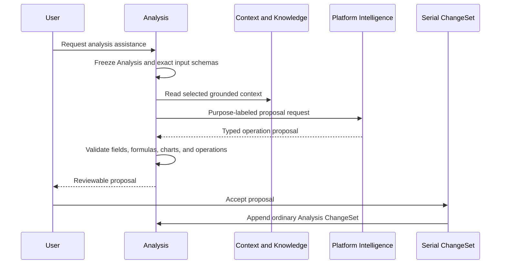

# Analysis Capability Reference

Analysis is the project workbench for transforming structured inputs, building charts, tracing dependencies, testing assumptions, comparing scenarios, and preserving reproducible analytical results. It powers the permanent Analyze screen.

An Analysis contains authored analytical specifications and layout. Each execution freezes exact Analysis and input revisions and produces immutable result snapshots. This separates collaborative editing from computation:

```text
versioned Analysis specification
+ exact input manifest
+ scenario overlay
+ Formula and execution versions
= immutable Analysis result snapshot
```

Analysis objects are project-scoped. Every aggregate, execution, result, proposal, and reference carries `userId` and `projectId`.

## Authority and integration boundaries

| Concern | Authority |
| --- | --- |
| Saved analytical workspaces, pages, cards, chart specifications, transforms, scenarios, layouts, ChangeSets, executions, and results | Analysis |
| Editable project tables, variables, and names | Structured Data |
| Formula language, values, and deterministic evaluation | Formula |
| Sparse grid values and exact range snapshots | Spreadsheet |
| Questions and their hypotheses | Questions |
| Selected project context and grounded knowledge | Context and Knowledge |
| Placed analytical bindings in native resources | The destination Document, Slides, or Spreadsheet capability |
| Model execution and provider selection | Platform Intelligence |
| Analysis SQL, repository adapter, and migrations | Analysis |

Analysis stores stable references and exact input manifests. Source capabilities remain authoritative for the mutable data those references identify.

## Repository placement

```text
apps/backend/src/
  3-capabilities/
    built-in/
      analysis/
        domain/
          model.ts
          data-plan.ts
          chart-spec.ts
          scenarios.ts
          operations.ts
          footprints.ts
          apply.ts
          errors.ts
        application/
          service.ts
          execution.ts
          results.ts
          proposals.ts
        ports/
          analysisRepository.ts
          structuredDataReader.ts
          spreadsheetReader.ts
          questionReader.ts
          contextReader.ts
        persistence/
          migrations.ts
          sqliteAnalysisRepository.ts
        index.ts
        tests/

  4-job-wiring/
    analysis/
      registerAnalysisEndpointMappings.ts
      createAnalysisJobs.ts
```

Analysis owns domain code and SQL under `3-capabilities`. Job wiring maps normalized requests to jobs, chooses serial or concurrent execution, chooses inline or deferred responses, and dispatches typed internal stages. Platform Database supplies generic transaction and connection primitives.

## Aggregate model

```typescript
interface ProjectScope {
  userId: string;
  projectId: string;
}

interface Analysis {
  id: string;
  userId: string;
  projectId: string;
  name: string;
  description?: string;
  lifecycle: "active" | "archived";
  revision: number;
  baseSeq: number;
  createdAt: string;
  updatedAt: string;
}

interface AnalysisBase {
  representationVersion: "analysis/v1";
  pages: AnalysisPage[];
  dataPlans: AnalysisDataPlan[];
  calculatedFields: CalculatedField[];
  scenarios: AnalysisScenario[];
  questionLinks: AnalysisQuestionLink[];
  contextSelection: AnalysisContextSelection;
  defaults: AnalysisDefaults;
}

interface AnalysisPage {
  id: string;
  name: string;
  rank: string;
  cards: AnalysisCard[];
  filters: AnalysisFilter[];
  layout: AnalysisLayout;
}

type AnalysisCard =
  | ChartCard
  | TableCard
  | MetricCard
  | DependencyCard
  | ScenarioComparisonCard
  | NarrativeCard;
```

Stable IDs identify every page, data plan, field, scenario, card, and layout item. Rank strings determine deterministic order. Layout is canonical authored presentation; renderer-specific scenes are projections.

## Data references

```typescript
type AnalysisDataRef =
  | {
      kind: "structured-table";
      tableId: string;
      columnIds?: string[];
      pinnedRevision?: number;
    }
  | {
      kind: "structured-variable";
      variableId: string;
      pinnedRevision?: number;
    }
  | {
      kind: "spreadsheet-range";
      spreadsheetId: string;
      start: StableCellRef;
      end: StableCellRef;
      pinnedRevision?: number;
    }
  | {
      kind: "analysis-result";
      analysisId: string;
      resultId: string;
      outputName: string;
    }
  | {
      kind: "evidence-calculation";
      evidenceId: string;
      valueLocator: string;
    };

interface StableAnalysisFieldRef {
  dataPlanId: string;
  fieldId: string;
}

interface ExactAnalysisInputRef {
  reference: AnalysisDataRef;
  ownerRevision: number | string;
  contentDigest: string;
  schemaDigest: string;
}
```

An authored reference may follow the current owner revision or pin a specific revision. Execution resolves every reference to an `ExactAnalysisInputRef` before computation. Historical result inspection always uses the saved exact manifest.

## Data plans and transforms

An Analysis data plan is a declarative transformation graph:

```typescript
interface AnalysisDataPlan {
  id: string;
  name: string;
  nodes: AnalysisPlanNode[];
  outputNodeId: string;
}

type AnalysisPlanNode =
  | {
      id: string;
      kind: "source";
      source: AnalysisDataRef;
    }
  | {
      id: string;
      kind: "select";
      inputNodeId: string;
      fields: StableAnalysisFieldRef[];
    }
  | {
      id: string;
      kind: "filter";
      inputNodeId: string;
      predicate: AnalysisFormulaExpression;
    }
  | {
      id: string;
      kind: "calculate";
      inputNodeId: string;
      fields: CalculatedFieldRef[];
    }
  | {
      id: string;
      kind: "join";
      leftNodeId: string;
      rightNodeId: string;
      join: AnalysisJoin;
    }
  | {
      id: string;
      kind: "group";
      inputNodeId: string;
      dimensions: StableAnalysisFieldRef[];
      measures: AnalysisMeasure[];
    }
  | {
      id: string;
      kind: "sort";
      inputNodeId: string;
      sort: AnalysisSort[];
    }
  | {
      id: string;
      kind: "limit";
      inputNodeId: string;
      count: number;
    }
  | {
      id: string;
      kind: "pivot";
      inputNodeId: string;
      pivot: AnalysisPivot;
    };

interface AnalysisJoin {
  type: "inner" | "left";
  conditions: Array<{
    left: StableAnalysisFieldRef;
    right: StableAnalysisFieldRef;
  }>;
}

interface AnalysisMeasure {
  id: string;
  field: StableAnalysisFieldRef;
  aggregate: "sum" | "average" | "minimum" | "maximum" | "count" | "distinct-count";
  outputName: string;
}
```

The graph is acyclic. Every edge references a stable node ID. Execution validates source schemas, field identities, join compatibility, bounded cardinality, and output schemas before materializing results.

Formula evaluates calculated fields and predicates over bounded immutable tables. Analysis owns plan ordering, joins, grouping, aggregation, sorting, pivoting, and result materialization.

## Calculated fields

```typescript
interface CalculatedField {
  id: string;
  name: string;
  expression: AnalysisFormulaExpression;
  expectedKind?: DataValue["kind"];
  outputType?: DataType;
}

interface AnalysisFormulaExpression {
  source: string;
  languageVersion: "formula/v1";
  sourceDigest: string;
  boundReferences: BoundFormulaReference[];
  bindingDigest: string;
}
```

Calculated fields store authored Formula source and accepted stable references. Each run supplies an immutable row scope and resolver snapshot. Formula returns the value and observed dependency manifest; Analysis records both in the result.

## Chart specification

```typescript
interface ChartSpec {
  version: "chart/v1";
  mark:
    | "bar"
    | "line"
    | "area"
    | "scatter"
    | "pie"
    | "donut"
    | "waterfall"
    | "table"
    | "metric";
  dataPlanId: string;
  encodings: ChartEncoding[];
  filters: AnalysisFilter[];
  sort: AnalysisSort[];
  style: ChartStyle;
  accessibility: ChartAccessibility;
}

interface ChartEncoding {
  channel:
    | "x"
    | "y"
    | "color"
    | "size"
    | "label"
    | "detail"
    | "facet";
  field: StableAnalysisFieldRef;
  aggregate?:
    | "sum"
    | "average"
    | "minimum"
    | "maximum"
    | "count"
    | "distinct-count";
  bin?: BinSpec;
  scale?: ScaleSpec;
  title?: string;
}

interface ChartAccessibility {
  title: string;
  description?: string;
  sonificationLabel?: string;
  dataTableEnabled: boolean;
}
```

`chart/v1` is renderer-independent. The frontend compiles the declarative specification and immutable typed result into its chart library. Export adapters consume the same chart specification and result.

## Scenarios and assumptions

```typescript
interface AnalysisScenario {
  id: string;
  name: string;
  description?: string;
  rank: string;
  overrides: ScenarioOverride[];
}

interface ScenarioOverride {
  id: string;
  target:
    | { kind: "structured-variable"; variableId: string }
    | {
        kind: "structured-cell";
        tableId: string;
        rowId: string;
        columnId: string;
      }
    | {
        kind: "calculated-field-input";
        calculatedFieldId: string;
        bindingId: string;
      };
  value: DataValue;
  note?: string;
}
```

A scenario is an Analysis-owned resolver overlay. Execution applies the overlay after freezing source inputs and before Formula evaluation. The exact override manifest and digest are part of each result snapshot.

Applying an analytical assumption to project data is a separate user-visible Structured Data command. That command enters Structured Data's serial ChangeSet history.

## Dependency presentation

Analysis can show how tables, variables, fields, calculations, scenarios, cards, and outputs depend on one another:

```typescript
interface AnalysisDependencyGraph {
  nodes: AnalysisDependencyNode[];
  edges: AnalysisDependencyEdge[];
  sourceAnalysisRevision: number;
  sourceDigest: string;
}

type AnalysisDependencyNode =
  | { kind: "input"; id: string; reference: AnalysisDataRef }
  | { kind: "plan-node"; id: string; dataPlanId: string }
  | { kind: "calculated-field"; id: string; fieldId: string }
  | { kind: "scenario"; id: string; scenarioId: string }
  | { kind: "card"; id: string; cardId: string }
  | { kind: "result"; id: string; resultId: string };

interface AnalysisDependencyEdge {
  from: string;
  to: string;
  role: "reads" | "transforms" | "overrides" | "renders" | "produces";
}
```

The graph is a rebuildable projection of canonical specifications and immutable result manifests. User-authored graph layout lives in a `DependencyCard`; automatic layout coordinates are disposable.

## Question, hypothesis, and context links

```typescript
interface AnalysisQuestionLink {
  questionId: string;
  hypothesisId?: string;
  purpose: "test" | "support" | "refute" | "context";
}

interface AnalysisContextSelection {
  contextIds: string[];
  evidenceIds: string[];
  includeProjectKnowledge: boolean;
}
```

Questions owns Question and Hypothesis identity. Analysis stores typed links and an analytical purpose. Context selection scopes material provided to Intelligence for chart proposals, model interpretation, and narrative explanation.

## Cards and result bindings

```typescript
interface ChartCard {
  id: string;
  kind: "chart";
  title: string;
  chart: ChartSpec;
  latestAcceptedResultId?: string;
}

interface TableCard {
  id: string;
  kind: "table";
  title: string;
  dataPlanId: string;
  visibleFieldIds: string[];
  latestAcceptedResultId?: string;
}

interface ScenarioComparisonCard {
  id: string;
  kind: "scenario-comparison";
  title: string;
  scenarioIds: string[];
  outputRefs: AnalysisOutputRef[];
  latestAcceptedResultId?: string;
}

interface AnalysisBindingPackage {
  analysisId: string;
  analysisRevision: number;
  cardId: string;
  resultId: string;
  resultDigest: string;
  chartSpec?: ChartSpec;
  outputs: AnalysisOutput[];
  inputManifest: ExactAnalysisInputRef[];
  refreshPolicy: "pinned" | "follow-explicit-refresh";
}
```

Document, Slides, and Spreadsheet admit a binding package through their own typed operations and ChangeSets. Analysis remains authoritative for the upstream result; the destination capability owns placement, presentation overrides, refresh state, and accepted display.

## Base, revisions, and ChangeSets

```typescript
interface AnalysisSubmission {
  submissionId: string;
  expectedRevision: number;
  operations: AnalysisOperation[];
}

interface AnalysisChangeSet {
  id: string;
  analysisId: string;
  userId: string;
  projectId: string;
  submissionId: string;
  submissionHash: string;
  priorRevision: number;
  revision: number;
  seq: number;
  authorId: string;
  createdAt: string;
  operations: AnalysisOperation[];
  inverseOperations: AnalysisOperation[];
  footprint: AnalysisFootprint;
  undoOf?: string;
  redoOf?: string;
}

interface AnalysisFootprint {
  metadata: boolean;
  pageIds: string[];
  cardIds: string[];
  dataPlanIds: string[];
  calculatedFieldIds: string[];
  scenarioIds: string[];
  questionLinkKeys: string[];
  contextSelection: boolean;
}
```

An accepted submission is idempotent by `(analysisId, submissionId, submissionHash)`. Revision compare-and-swap protects the aggregate head. A retained stale edit may apply when footprints prove that every target remains stable and disjoint from intervening ChangeSets.

Examples:

- edits to different cards may commute;
- layout edits to different cards may commute;
- deleting a page conflicts with stale edits to cards on that page;
- changing a data-plan output conflicts with stale edits that bind the former output schema;
- changes to separate scenarios may commute.

Undo and redo append compensating ChangeSets. Base compaction folds a contiguous history prefix into `base_json` under `baseSeq` compare-and-swap and preserves the logical revision.

## Typed operation vocabulary

```typescript
type AnalysisOperation =
  | { type: "rename-analysis"; name: string }
  | { type: "set-description"; description?: string }
  | { type: "archive-analysis" }
  | { type: "restore-analysis" }
  | {
      type: "set-context-selection";
      context: AnalysisContextSelection;
    }
  | { type: "create-page"; page: NewAnalysisPage }
  | { type: "rename-page"; pageId: string; name: string }
  | { type: "move-page"; pageId: string; afterPageId?: string }
  | { type: "delete-page"; pageId: string }
  | {
      type: "create-data-plan";
      dataPlan: AnalysisDataPlan;
    }
  | {
      type: "update-data-plan";
      dataPlanId: string;
      patch: AnalysisDataPlanPatch;
    }
  | { type: "delete-data-plan"; dataPlanId: string }
  | {
      type: "create-calculated-field";
      field: CalculatedField;
    }
  | {
      type: "update-calculated-field";
      fieldId: string;
      patch: CalculatedFieldPatch;
    }
  | { type: "delete-calculated-field"; fieldId: string }
  | {
      type: "create-card";
      pageId: string;
      card: NewAnalysisCard;
    }
  | {
      type: "update-card";
      pageId: string;
      cardId: string;
      patch: AnalysisCardPatch;
    }
  | {
      type: "move-card";
      pageId: string;
      cardId: string;
      placement: CardPlacement;
    }
  | { type: "delete-card"; pageId: string; cardId: string }
  | {
      type: "create-scenario";
      scenario: AnalysisScenario;
    }
  | {
      type: "update-scenario";
      scenarioId: string;
      patch: ScenarioPatch;
    }
  | {
      type: "set-scenario-override";
      scenarioId: string;
      override: ScenarioOverride;
    }
  | {
      type: "remove-scenario-override";
      scenarioId: string;
      overrideId: string;
    }
  | { type: "delete-scenario"; scenarioId: string }
  | { type: "link-question"; link: AnalysisQuestionLink }
  | {
      type: "unlink-question";
      questionId: string;
      hypothesisId?: string;
    }
  | {
      type: "accept-intelligence-proposal";
      proposalId: string;
      operations: AnalysisOperation[];
    }
  | {
      type: "accept-result-pointer";
      cardId: string;
      resultId: string;
      expectedSourceRevision: number;
    };
```

Intelligence proposals contain ordinary typed operations. Acceptance validates the proposal, current revision, stable references, and every operation before appending one ChangeSet.

## Execution requests and immutable results

```typescript
interface AnalysisExecutionRequest {
  id: string;
  userId: string;
  projectId: string;
  analysisId: string;
  analysisRevision: number;
  pageId?: string;
  cardIds: string[];
  scenarioIds: string[];
  inputManifest: ExactAnalysisInputRef[];
  inputDigest: string;
  requestDigest: string;
  state:
    | "queued"
    | "running"
    | "candidate-ready"
    | "ready"
    | "failed"
    | "interrupted"
    | "stale";
  createdAt: string;
  updatedAt: string;
}

interface AnalysisResultSnapshot {
  id: string;
  requestId: string;
  userId: string;
  projectId: string;
  analysisId: string;
  analysisRevision: number;
  scenarioId?: string;
  inputManifest: ExactAnalysisInputRef[];
  inputDigest: string;
  scenarioDigest: string;
  outputs: AnalysisOutput[];
  dependencyManifest: ObservedDependency[];
  formulaVersion: string;
  executionVersion: string;
  digest: string;
  createdAt: string;
}

type AnalysisOutput =
  | { kind: "value"; name: string; value: DataValue }
  | { kind: "table"; name: string; value: TableValue }
  | {
      kind: "chart-data";
      name: string;
      schema: ChartResultSchema;
      rows: TableValue;
    }
  | {
      kind: "dependency-graph";
      name: string;
      graph: AnalysisDependencyGraph;
    };
```

Each result is immutable. Rerunning creates another result identity. A card's `latestAcceptedResultId` is an authored pointer advanced through revision-checked settlement.

Deterministic equivalence is based on exact input, scenario, plan, Formula, and execution digests. Display rendering versions remain separate from analytical result identity.

## Intelligence proposals

```typescript
interface AnalysisProposalRequest {
  scope: ProjectScope;
  analysisId: string;
  expectedRevision: number;
  requestId: string;
  purpose:
    | "analysis-design"
    | "chart-design"
    | "scenario-design"
    | "analysis-explanation";
  instruction: string;
  selectedCardIds: string[];
  contextSelection: AnalysisContextSelection;
}

interface AnalysisProposal {
  id: string;
  userId: string;
  projectId: string;
  analysisId: string;
  sourceAnalysisRevision: number;
  inputManifest: ExactAnalysisInputRef[];
  operations: AnalysisOperation[];
  rationale: string;
  assumptions: string[];
  evidenceRefs: string[];
  providerReceipt: IntelligenceReceipt;
  state: "ready" | "accepted" | "superseded";
  digest: string;
}
```

Analysis calls the injected Platform Intelligence interface with a purpose label. The capability validates proposed node references, fields, Formula source, chart channels, scenarios, and operation shapes before presenting the proposal.

## Public request types

```typescript
interface CreateAnalysisRequest {
  scope: ProjectScope;
  requestId: string;
  name: string;
}

interface SubmitAnalysisRequest {
  scope: ProjectScope;
  analysisId: string;
  submission: AnalysisSubmission;
}

interface ExecuteAnalysisRequest {
  scope: ProjectScope;
  analysisId: string;
  idempotencyKey: string;
  expectedAnalysisRevision: number;
  cardIds: string[];
  scenarioIds: string[];
}
```

| Request type | Kind | Result |
| --- | --- | --- |
| `analysis.create.v1` | Idempotent command | Analysis identity at revision zero |
| `analysis.list.v1` | Query | Project Analysis summaries |
| `analysis.get.v1` | Query | Exact Base/tail or resolved projection |
| `analysis.submit.v1` | Idempotent command | Accepted ChangeSet or typed conflict |
| `analysis.undo.v1` | Idempotent command | Compensating ChangeSet |
| `analysis.redo.v1` | Idempotent command | Compensating ChangeSet |
| `analysis.history.list.v1` | Query | Bounded ChangeSet summaries |
| `analysis.execute.v1` | Idempotent command | Execution request and exact frozen manifest |
| `analysis.executions.get.v1` | Query | Execution status and diagnostics |
| `analysis.results.get.v1` | Query | Immutable result or bounded output page |
| `analysis.proposals.request.v1` | Idempotent command | Proposal request identity |
| `analysis.proposals.get.v1` | Query | Validated reviewable proposal |
| `analysis.bind-result.v1` | Query | Typed binding package for a destination capability |

## Request-to-job mapping

| Work | Queue | Response |
| --- | --- | --- |
| List, get, history, execution status, result, proposal, and binding reads | Concurrent | Inline |
| Create, submit, undo, redo, archive, restore | Serial | Inline |
| Create execution request and freeze manifest | Serial | Inline |
| Execute data plans and scenarios | Concurrent internal stage | Internal |
| Settle immutable results and card pointers | Serial internal stage | Internal |
| Create proposal request | Serial | Inline |
| Generate and validate Intelligence proposal | Concurrent internal stage | Internal |
| Publish proposal | Serial internal stage | Internal |
| Compact Base | Serial internal stage | Internal |

```typescript
const analysisJobFactories: EndpointJobFactoryMap = {
  "analysis.list.v1": createConcurrentInlineJob(listAnalyses),
  "analysis.get.v1": createConcurrentInlineJob(getAnalysis),
  "analysis.submit.v1": createSerialInlineJob(submitAnalysis),
  "analysis.undo.v1": createSerialInlineJob(undoAnalysis),
  "analysis.redo.v1": createSerialInlineJob(redoAnalysis),
  "analysis.execute.v1": createSerialInlineJob(requestExecution),
  "analysis.results.get.v1": createConcurrentInlineJob(getResult),
  "analysis.proposals.request.v1":
    createSerialInlineJob(requestProposal),
};
```

Serial request jobs persist the exact request and a typed next-stage intent, return the request identity, and release the serial queue. Job wiring then enqueues concurrent compute. Compute persists its candidate result and returns a serial settlement intent. Each stage has a deterministic idempotency key, and each queue slot is released before a later stage begins.

```typescript
interface AnalysisStageIntent {
  requestType:
    | "analysis.execution.compute.v1"
    | "analysis.execution.settle.v1"
    | "analysis.proposal.compute.v1"
    | "analysis.proposal.publish.v1"
    | "analysis.base.compact.v1";
  idempotencyKey: string;
  userId: string;
  projectId: string;
  payload: unknown;
}
```

## Persistence

### Analysis aggregates and ChangeSets

```sql
CREATE TABLE analyses (
  id             TEXT PRIMARY KEY,
  user_id        TEXT NOT NULL,
  project_id     TEXT NOT NULL,
  name           TEXT NOT NULL,
  description    TEXT,
  lifecycle      TEXT NOT NULL DEFAULT 'active',
  revision       INTEGER NOT NULL DEFAULT 0,
  base_seq       INTEGER NOT NULL DEFAULT 0,
  base_json      BLOB NOT NULL,
  created_at     TEXT NOT NULL,
  updated_at     TEXT NOT NULL,
  UNIQUE (user_id, project_id, id)
);

CREATE INDEX analyses_project_updated
  ON analyses(project_id, lifecycle, updated_at DESC, id);

CREATE TABLE analysis_change_sets (
  id                TEXT PRIMARY KEY,
  analysis_id       TEXT NOT NULL,
  user_id           TEXT NOT NULL,
  project_id        TEXT NOT NULL,
  submission_id     TEXT NOT NULL,
  submission_hash   TEXT NOT NULL,
  prior_revision    INTEGER NOT NULL,
  revision          INTEGER NOT NULL,
  seq               INTEGER NOT NULL,
  author_id         TEXT NOT NULL,
  operations_json   BLOB NOT NULL,
  inverse_ops_json  BLOB NOT NULL,
  footprint_json    BLOB NOT NULL,
  undo_of           TEXT,
  redo_of           TEXT,
  created_at        TEXT NOT NULL,
  UNIQUE (analysis_id, seq),
  UNIQUE (analysis_id, submission_id),
  FOREIGN KEY (user_id, project_id, analysis_id)
    REFERENCES analyses(user_id, project_id, id)
    ON DELETE CASCADE
);

CREATE INDEX analysis_changes_project_recent
  ON analysis_change_sets(
    project_id, created_at DESC, id
  );
```

### Executions and results

```sql
CREATE TABLE analysis_execution_requests (
  id                   TEXT PRIMARY KEY,
  analysis_id          TEXT NOT NULL,
  user_id              TEXT NOT NULL,
  project_id           TEXT NOT NULL,
  idempotency_key      TEXT NOT NULL,
  request_hash         TEXT NOT NULL,
  analysis_revision    INTEGER NOT NULL,
  input_manifest_json  BLOB NOT NULL,
  input_digest         TEXT NOT NULL,
  request_json         BLOB NOT NULL,
  state                TEXT NOT NULL,
  failure_json         BLOB,
  created_at           TEXT NOT NULL,
  updated_at           TEXT NOT NULL,
  UNIQUE (analysis_id, idempotency_key),
  UNIQUE (user_id, project_id, id),
  FOREIGN KEY (user_id, project_id, analysis_id)
    REFERENCES analyses(user_id, project_id, id)
    ON DELETE CASCADE
);

CREATE INDEX analysis_executions_project_state
  ON analysis_execution_requests(
    project_id, state, updated_at DESC, id
  );

CREATE TABLE analysis_result_snapshots (
  id                    TEXT PRIMARY KEY,
  request_id            TEXT NOT NULL,
  analysis_id           TEXT NOT NULL,
  user_id               TEXT NOT NULL,
  project_id            TEXT NOT NULL,
  analysis_revision     INTEGER NOT NULL,
  scenario_id           TEXT,
  input_digest          TEXT NOT NULL,
  scenario_digest       TEXT NOT NULL,
  input_manifest_json   BLOB NOT NULL,
  outputs_json          BLOB NOT NULL,
  dependencies_json     BLOB NOT NULL,
  formula_version       TEXT NOT NULL,
  execution_version     TEXT NOT NULL,
  digest                TEXT NOT NULL,
  created_at            TEXT NOT NULL,
  FOREIGN KEY (user_id, project_id, request_id)
    REFERENCES analysis_execution_requests(
      user_id, project_id, id
    ) ON DELETE CASCADE,
  FOREIGN KEY (user_id, project_id, analysis_id)
    REFERENCES analyses(user_id, project_id, id)
    ON DELETE CASCADE
);

CREATE UNIQUE INDEX analysis_results_request_scenario
  ON analysis_result_snapshots(
    request_id,
    COALESCE(scenario_id, '')
  );

CREATE INDEX analysis_results_analysis_created
  ON analysis_result_snapshots(
    analysis_id, created_at DESC, id
  );

CREATE TABLE analysis_stage_results (
  request_id         TEXT NOT NULL,
  user_id            TEXT NOT NULL,
  project_id         TEXT NOT NULL,
  stage              TEXT NOT NULL,
  idempotency_key    TEXT NOT NULL,
  output_json        BLOB NOT NULL,
  next_intent_json   BLOB,
  created_at         TEXT NOT NULL,
  PRIMARY KEY (request_id, stage),
  UNIQUE (idempotency_key)
);

CREATE INDEX analysis_stage_results_project
  ON analysis_stage_results(
    project_id, stage, created_at, request_id
  );
```

### Intelligence proposals

```sql
CREATE TABLE analysis_proposals (
  id                        TEXT PRIMARY KEY,
  analysis_id               TEXT NOT NULL,
  user_id                   TEXT NOT NULL,
  project_id                TEXT NOT NULL,
  idempotency_key           TEXT NOT NULL,
  source_analysis_revision  INTEGER NOT NULL,
  purpose                   TEXT NOT NULL,
  input_manifest_json       BLOB NOT NULL,
  operations_json           BLOB NOT NULL,
  rationale                 TEXT NOT NULL,
  assumptions_json          BLOB NOT NULL,
  evidence_refs_json        BLOB NOT NULL,
  provider_receipt_json     BLOB NOT NULL,
  state                     TEXT NOT NULL,
  digest                    TEXT NOT NULL,
  created_at                TEXT NOT NULL,
  updated_at                TEXT NOT NULL,
  UNIQUE (analysis_id, idempotency_key),
  FOREIGN KEY (user_id, project_id, analysis_id)
    REFERENCES analyses(user_id, project_id, id)
    ON DELETE CASCADE
);

CREATE INDEX analysis_proposals_project_state
  ON analysis_proposals(
    project_id, state, updated_at DESC, id
  );
```

`base_json` is the normalized Analysis specification through `baseSeq`. Analysis specifications are aggregate-shaped and loaded together. Frequently queried references and dependency edges may be materialized as projections.

## SQL indexes and rebuildable projections

Canonical SQL indexes accelerate project lists, ChangeSet replay, execution status, result history, and proposal review. Rebuildable projections include:

- reverse input-to-Analysis and input-to-card lookup;
- compiled Formula ASTs;
- data-plan validation and output-schema caches;
- dependency graph edges and automatic layout;
- transformed datasets keyed by exact input and plan digests;
- chart scenes keyed by result, chart, and renderer versions;
- thumbnails and accessible data tables;
- project field search derived from exact source schemas.

Every cache key includes all source revisions and implementation versions that affect the output. Rebuilding projections preserves authored Analysis state and immutable results.

## Capability ports

```typescript
interface StructuredDataSnapshotReader {
  readExactSnapshot(input: {
    scope: ProjectScope;
    requestedRefs: AnalysisDataRef[];
    atRevision?: number;
  }): Promise<StructuredDataSnapshot>;
}

interface SpreadsheetSnapshotReader {
  readExactRange(
    input: ExactSpreadsheetRangeRequest,
  ): Promise<TableValue>;
}

interface QuestionReader {
  getQuestionAndHypothesis(
    input: QuestionHypothesisRef,
  ): Promise<QuestionProjection>;
}

interface AnalysisContextReader {
  readSelectedContext(
    input: AnalysisContextSelection,
  ): Promise<GroundedContext>;
}

interface AnalysisRepository {
  create(input: CreateStoredAnalysis): Promise<Analysis>;
  load(
    scope: ProjectScope,
    analysisId: string,
    atRevision?: number,
  ): Promise<StoredAnalysis>;
  appendChangeSet(
    input: AppendAnalysisChangeSet,
  ): Promise<AnalysisChangeSet>;
  createExecutionRequest(
    input: CreateAnalysisExecutionRequest,
  ): Promise<AnalysisExecutionRequest>;
  settleExecution(
    input: SettleAnalysisExecution,
  ): Promise<AnalysisResultSnapshot[]>;
  createProposal(
    input: CreateAnalysisProposal,
  ): Promise<AnalysisProposal>;
  replaceBase(input: ReplaceAnalysisBase): Promise<void>;
}
```

Formula is injected as a pure engine. Platform Intelligence is injected through its implemented interface and selected by proposal purpose. Capability readers are assembled through application wiring and return exact-version DTOs.

## Execution flow

```mermaid
flowchart LR
  A[Serially freeze Analysis and input manifest] --> B[Persist execution request]
  B --> C[Enqueue concurrent compute stage]
  C --> D[Resolve exact data and scenario overlays]
  D --> E[Execute data plans and Formula expressions]
  E --> F[Persist candidate results and settlement intent]
  F --> G[Enqueue serial settlement]
  G --> H[Insert immutable results]
  H --> I[Advance eligible card pointers under revision CAS]
```



## Intelligence proposal flow



## Governing invariants

1. Every Analysis object is scoped by `userId` and `projectId`.
2. Authored Analysis state has one monotonic revision and contiguous ChangeSet sequence.
3. Stable IDs identify pages, plans, fields, cards, scenarios, and links through rename and movement.
4. Data plans form an acyclic graph with stable node and field references.
5. Every execution pins an exact Analysis revision and complete input manifest.
6. Scenarios are immutable overlays within an execution.
7. Formula evaluation receives immutable row scopes and resolver snapshots.
8. Result snapshots are immutable and reruns create new result identities.
9. Card result pointers advance through revision-checked serial settlement.
10. Intelligence produces validated operation proposals that enter canonical state through ordinary ChangeSets.
11. Destination resources admit Analysis binding packages through their own ChangeSets.
12. Base compaction preserves logical revision and replay equivalence.
13. Rebuildable projections can be recreated from Analysis state and result manifests.
14. Analysis SQL and migrations remain colocated with the capability.

## Acceptance criteria

- Multiple projects create and query independent Analysis aggregates.
- Analysis reload, replay, undo, redo, and Base compaction preserve stable identities.
- Identical submission retries return the original ChangeSet.
- Conflicting stale edits fail with the current revision and affected footprint.
- Provably disjoint card edits apply deterministically.
- A data plan validates stable source fields and rejects cycles or incompatible joins.
- Calculated fields use Formula's exact value and diagnostic contracts.
- Scenario execution changes outputs while preserving source Structured Data.
- Every result records exact input, scenario, Formula, and execution digests.
- A result completing against an older revision remains historical and cannot advance a newer card pointer.
- Chart specifications render from immutable typed outputs and include accessible titles and data-table support.
- Question and Hypothesis links preserve their typed analytical purpose.
- Intelligence proposals cannot bypass operation validation or expected-revision compare-and-swap.
- Document, Slides, and Spreadsheet bindings pin a stable Analysis, card, result, and digest.
- Deleting projection and rendering caches preserves authored state, ChangeSets, execution requests, and immutable results.

## References

- [Product — Icarus Complete Product Definition](https://app.notion.com/p/3aeb6410e502810ba9c0c26442d5255a)
- [Architecture — Icarus Runtime Foundation & Repository Boundaries](https://app.notion.com/p/3adb6410e50281e09d83ed36daacf8d8)
- [Model — Icarus Request, Job & Dual-Queue Runtime](https://app.notion.com/p/3adb6410e50281c498f4d7f6a621eba2)
- [Model — Structured Data Capability & Descriptor Lattice](https://app.notion.com/p/3acb6410e5028157b9e4e8228237cfb8)
- [Taurus Omega — Formula Evaluation & Query Semantics](https://app.notion.com/p/3a6b6410e5028148a0bffc4ea9cabad0)
- [Taurus Omega — Formula Value & Table Model](https://app.notion.com/p/3a6b6410e50281d3aff6cb92f54476cd)
- [Model — Spreadsheet Capability & Runtime Contract](https://app.notion.com/p/3abb6410e5028179a844c0af77b21ffe)
