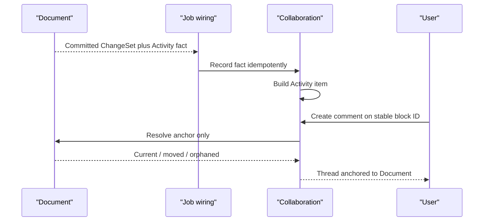

# Collaboration Capability Reference

## Purpose

Collaboration owns project-scoped comments, the Activity presentation pipeline, and ephemeral presence attached to typed targets. A comment on a Document block, Question, hypothesis, Evidence item, Analysis chart, Slide object, or Spreadsheet range remains Collaboration state anchored to an identity resolved by the owning capability. Target capabilities remain authoritative for their content and revisions.

## Bottom line

Collaboration has three integration surfaces:

1. **Comments:** durable project-shared threads anchored to stable typed targets.
2. **Activity:** a rebuildable project/user-facing feed derived from minimal committed activity facts.
3. **Presence:** ephemeral “who is here / what are they viewing” leases.

## Runtime placement

Durable commands use the Fastify server and queues. SSE or WebSocket connection handling lives in `2-transport`; typed subscription and heartbeat messages are delegated to Collaboration.

```plain text
apps/backend/src/
  3-capabilities/
    collaboration/
      domain/
        target.ts
        comments.ts
        activity.ts
        presence.ts
        events.ts
      application/
        commentService.ts
        activityRecorder.ts
        presenceRegistry.ts
        anchorResolver.ts
      ports/
        targetResolvers.ts
        activityFactSources.ts
        repository.ts
      persistence/
        migrations.ts
        sqliteCollaborationRepository.ts
      projections/
        activityFeed.ts
        commentCounts.ts
      index.ts
  4-job-wiring/
    internal/
      InternalJobDispatcher.ts
    collaboration/
      registerCollaborationEndpointMappings.ts
      createCommentJobs.ts
      createActivityJobs.ts
      createPresenceJobs.ts
```

Presence uses a TTL-backed `PresenceRegistry` port. An in-memory implementation serves a single backend process, while a shared TTL implementation serves multi-instance composition through the same contract.

## Typed targets

```typescript
type CollaborationTarget =
  | { kind: "question"; questionId: string }
  | { kind: "hypothesis"; questionId: string; hypothesisId: string }
  | { kind: "evidence"; evidenceId: string }
  | { kind: "analysis"; analysisId: string; componentId?: string }
  | { kind: "document"; documentId: string; componentId?: string; subpath?: string }
  | { kind: "slides"; deckId: string; slideId?: string; objectId?: string }
  | { kind: "spreadsheet"; spreadsheetId: string; rangeRef?: StableRangeRef };

interface Anchor {
  userId: string;
  projectId: string;
  target: CollaborationTarget;
  observedTargetRevision: number;
  selectionHash?: string;
}

interface CommentThread {
  id: string;
  userId: string;
  projectId: string;
  revision: number;
  anchor: Anchor;
  state: "open" | "resolved" | "archived";
  createdByUserId: string;
  createdAt: string;
  updatedAt: string;
}

interface Comment {
  id: string;
  userId: string;
  projectId: string;
  threadId: string;
  revision: number;
  authorUserId: string;
  body: string;
  state: "active" | "deleted";
  createdAt: string;
  updatedAt: string;
}

interface PresenceLease {
  connectionId: string;
  userId: string;
  projectId: string;
  target?: CollaborationTarget;
  display: { name: string; color: string };
  expiresAt: string;
}
```

Stable IDs are authoritative; visible position and selected text are descriptive. The owning capability resolves whether an anchor is current, moved, orphaned, or removed. Reattachment is an explicit user-confirmed anchor mutation.

## Authority and integration boundaries

Collaboration owns:

- comment threads, comments, comment revisions, resolution state, and mentions as text metadata;
- stable anchor record and its resolution state;
- minimal committed activity facts received through an explicit port;
- rebuildable Activity presentation rows;
- ephemeral presence connection/target/expiry state.

Integrated authority:

- Questions, Evidence, Analysis, Document, Slides, and Spreadsheet own target content, revision, ChangeSets, and anchor resolution.
- `2-transport` owns realtime connection transport; Collaboration owns typed presence messages and leases.
- Observability owns operational logs. Agents owns task context. Knowledge owns lattice admission and projections.
- Presence is descriptive state, Activity is a presentation record, and comments enter Agent or Knowledge context only through explicit selection.

## Operations and job classification

| Request type or stage | Queue | Response |
|---|---|---|
| `collaboration.threads.create.v1`, `comments.add.v1` | Serial | Inline |
| `comments.edit.v1`, `comments.delete.v1`, `threads.resolve.v1`, `threads.reopen.v1` | Serial | Inline |
| `collaboration.threads.list.v1`, `comments.list.v1` | Concurrent | Inline |
| `collaboration.activity.record.v1` | Serial | Internal idempotent result |
| `collaboration.activity.list.v1` | Concurrent | Inline |
| `collaboration.presence.heartbeat.v1`, `presence.list.v1`, `presence.leave.v1` | Concurrent | Inline or realtime message |
| `collaboration.anchors.recheck.v1` | Serial | Deferred receipt plus concurrent scan intent |
| `collaboration.anchors.scan` | Concurrent | Internal result plus serial settlement intent |
| `collaboration.anchors.settle` | Serial | Internal stage result |

A broad anchor recheck freezes a bounded target set and records a scan-stage receipt. The concurrent scan returns a typed `collaboration.anchors.settle` intent containing target IDs, observed revisions, resolutions, and a request digest. `InternalJobDispatcher` enqueues the serial settlement after the scan result commits. Settlement revalidates the Thread revision before appending the anchor-state ChangeSet. Replaying the same `(threadId, stageKey, requestDigest)` returns the recorded result.

## Revision, ChangeSet, and event model

Threads have revision CAS. Adding a comment, resolving, reopening, or changing the anchor appends a `collaboration_changesets` row. After thread creation, command uniqueness is `(threadId, clientRequestId)` plus a stored request digest; the same ID with different input is `idempotency_mismatch`. Before a thread ID exists, a creation receipt maps `(userId, projectId, clientRequestId)` and digest to the created thread. Comment edits preserve immutable body revisions; deletion leaves a tombstone.

Target capabilities return a minimal `CommittedActivityFact` after their own commit:

```typescript
interface CommittedActivityFact {
  factId: string;
  userId: string;
  projectId: string;
  actor: { kind: "user" | "agent" | "automation"; id: string };
  target: CollaborationTarget;
  action: string;
  targetRevision?: number;
  safeMetadata: Record<string, unknown>;
  occurredAt: string;
}
```

Job wiring records it idempotently. Activity presentation is derived from committed facts. Recovery can replay public ChangeSet-history readers into the Activity fact recorder.

Presence uses TTL leases rather than ChangeSets. A lease expires automatically.

## Capability-owned tables

```sql
CREATE TABLE comment_threads (
  id TEXT PRIMARY KEY,
  user_id TEXT NOT NULL,
  project_id TEXT NOT NULL,
  revision INTEGER NOT NULL,
  target_kind TEXT NOT NULL,
  target_id TEXT NOT NULL,
  anchor_json TEXT NOT NULL,
  anchor_state TEXT NOT NULL,
  state TEXT NOT NULL CHECK (state IN ('open','resolved','archived')),
  created_by_user_id TEXT NOT NULL,
  created_at TEXT NOT NULL,
  updated_at TEXT NOT NULL,
  UNIQUE (user_id, project_id, id)
);

CREATE TABLE comments (
  id TEXT PRIMARY KEY,
  user_id TEXT NOT NULL,
  project_id TEXT NOT NULL,
  thread_id TEXT NOT NULL,
  revision INTEGER NOT NULL,
  author_user_id TEXT NOT NULL,
  body TEXT NOT NULL,
  state TEXT NOT NULL CHECK (state IN ('active','deleted')),
  created_at TEXT NOT NULL,
  updated_at TEXT NOT NULL,
  UNIQUE (user_id, project_id, id),
  FOREIGN KEY (user_id, project_id, thread_id)
    REFERENCES comment_threads(user_id, project_id, id)
);

CREATE TABLE comment_revisions (
  comment_id TEXT NOT NULL,
  user_id TEXT NOT NULL,
  project_id TEXT NOT NULL,
  revision INTEGER NOT NULL,
  body TEXT NOT NULL,
  edited_by_user_id TEXT NOT NULL,
  created_at TEXT NOT NULL,
  PRIMARY KEY (comment_id, revision),
  FOREIGN KEY (user_id, project_id, comment_id)
    REFERENCES comments(user_id, project_id, id)
);

CREATE TABLE collaboration_changesets (
  id TEXT PRIMARY KEY,
  thread_id TEXT NOT NULL,
  user_id TEXT NOT NULL,
  project_id TEXT NOT NULL,
  seq INTEGER NOT NULL,
  actor_user_id TEXT NOT NULL,
  client_request_id TEXT NOT NULL,
  request_digest TEXT NOT NULL,
  expected_revision INTEGER NOT NULL,
  operations_json TEXT NOT NULL,
  inverse_json TEXT,
  created_at TEXT NOT NULL,
  UNIQUE (thread_id, seq),
  UNIQUE (thread_id, client_request_id),
  FOREIGN KEY (user_id, project_id, thread_id)
    REFERENCES comment_threads(user_id, project_id, id)
);

CREATE TABLE comment_thread_creation_receipts (
  user_id TEXT NOT NULL,
  project_id TEXT NOT NULL,
  client_request_id TEXT NOT NULL,
  request_digest TEXT NOT NULL,
  thread_id TEXT NOT NULL,
  response_json TEXT NOT NULL,
  created_at TEXT NOT NULL,
  PRIMARY KEY (user_id, project_id, client_request_id),
  UNIQUE (thread_id),
  FOREIGN KEY (user_id, project_id, thread_id)
    REFERENCES comment_threads(user_id, project_id, id)
);

CREATE TABLE collaboration_stage_receipts (
  thread_id TEXT NOT NULL,
  user_id TEXT NOT NULL,
  project_id TEXT NOT NULL,
  stage_key TEXT NOT NULL,
  stage_kind TEXT NOT NULL,
  queue_type TEXT NOT NULL CHECK (queue_type IN ('serial','concurrent')),
  request_digest TEXT NOT NULL,
  state TEXT NOT NULL,
  result_json TEXT,
  error_code TEXT,
  created_at TEXT NOT NULL,
  updated_at TEXT NOT NULL,
  PRIMARY KEY (thread_id, stage_key),
  FOREIGN KEY (user_id, project_id, thread_id)
    REFERENCES comment_threads(user_id, project_id, id)
);

CREATE TABLE activity_facts (
  fact_id TEXT PRIMARY KEY,
  user_id TEXT NOT NULL,
  project_id TEXT NOT NULL,
  actor_kind TEXT NOT NULL,
  actor_id TEXT NOT NULL,
  target_kind TEXT NOT NULL,
  target_id TEXT NOT NULL,
  action TEXT NOT NULL,
  target_revision INTEGER,
  safe_metadata_json TEXT NOT NULL,
  occurred_at TEXT NOT NULL,
  UNIQUE (user_id, project_id, fact_id)
);

CREATE TABLE activity_items (
  fact_id TEXT PRIMARY KEY,
  user_id TEXT NOT NULL,
  project_id TEXT NOT NULL,
  actor_kind TEXT NOT NULL,
  actor_id TEXT NOT NULL,
  target_kind TEXT NOT NULL,
  target_id TEXT NOT NULL,
  action TEXT NOT NULL,
  summary TEXT NOT NULL,
  navigation_json TEXT NOT NULL,
  occurred_at TEXT NOT NULL,
  projection_version INTEGER NOT NULL,
  FOREIGN KEY (user_id, project_id, fact_id)
    REFERENCES activity_facts(user_id, project_id, fact_id)
);
```

`activity_items` is a rebuildable projection. `activity_facts` is the minimal canonical input log. Presence remains outside SQLite.

Collaboration roots and child rows repeat `user_id` and `project_id`; composite foreign keys guarantee that Comments, revisions, ChangeSets, creation receipts, and Activity items share their parent scope. Comment and Activity history use retained records and tombstones. Typed target IDs are cross-capability addresses validated by target resolvers.

## SQL indexes

```sql
CREATE INDEX comment_threads_target_state
  ON comment_threads(user_id, project_id, target_kind, target_id, state, updated_at DESC);
CREATE INDEX comments_thread_created
  ON comments(user_id, project_id, thread_id, created_at, id);
CREATE INDEX collaboration_changesets_tail
  ON collaboration_changesets(user_id, project_id, thread_id, seq DESC);
CREATE INDEX comment_thread_creation_receipts_thread
  ON comment_thread_creation_receipts(user_id, project_id, thread_id);
CREATE INDEX collaboration_stages_pending
  ON collaboration_stage_receipts(
    state, queue_type, updated_at, user_id, project_id, thread_id
  );
CREATE INDEX activity_facts_project_time
  ON activity_facts(user_id, project_id, occurred_at DESC, fact_id);
CREATE INDEX activity_facts_target_time
  ON activity_facts(user_id, project_id, target_kind, target_id, occurred_at DESC);
CREATE INDEX activity_items_time
  ON activity_items(user_id, project_id, occurred_at DESC, fact_id);
```

## Named rebuildable projections

- `project_activity_feed`: Activity rows rendered from `activity_facts` plus safe target summaries.
- `target_activity_feed`: the same facts filtered and resolved for one typed target.
- `comment_count_by_target`: open/resolved thread and comment counts.
- `active_presence_by_target`: ephemeral in-memory projection from unexpired leases.

The first three can be regenerated. Presence disappears naturally. These are distinct from SQL indexes.

## Dependencies and ports

Required:

- `TargetResolver` implementations from Questions, Evidence, Analysis, Document, Slides, and Spreadsheet.
- safe target-summary readers for Activity presentation.
- public ChangeSet-history readers for repair/rebuild.
- database, IDs, clock, logger.

Provided:

- comment thread commands/readers;
- Activity fact recorder and feed reader;
- presence heartbeat/list/leave;
- comment-count and target-activity projections.

Collaboration receives typed target adapters during composition.

## Intelligence and web use

Comments and Activity are user-generated display content. Agents may include explicitly selected comments in task Context; Knowledge admission follows the ordinary Evidence and Knowledge contracts. Research owns web retrieval.

## Principal flow



## Invariants

- Every durable root carries user/project scope; every child inherits one unambiguous scope through its parent foreign key.
- Thread creation and every aggregate mutation enforce digest-backed idempotency.
- Every comment anchor names a stable typed target and observed revision.
- Target content mutations remain with the owning capability.
- Comment edits preserve prior revisions.
- Activity facts are minimal, committed, and idempotent.
- Activity presentation rebuilds from committed facts without changing domain state.
- Presence is ephemeral and TTL-bound.
- Orphaned anchors remain explicit and reattachment is user-confirmed.
- Comment admission to Knowledge or Agent Context is explicit.

## Conformance scenarios

1. Create and revise comments on Questions and Document blocks.
2. Record Activity facts for Question, Research/Evidence admission, Analysis, and native Resource mutations.
3. Derive the Overview project feed and per-target activity list.
4. Maintain TTL-backed presence for open Resources and Question drawers.
5. Serve polling and realtime subscriptions through `2-transport`.
6. Rebuild Activity and anchor-state projections from canonical facts and target readers.

## Acceptance criteria

- [ ] A comment can anchor to a typed target without copying target content.
- [ ] Reusing a thread command request ID with another digest returns `idempotency_mismatch`.
- [ ] Editing a comment preserves the previous body revision.
- [ ] A target deletion or orphaning changes anchor state; reattachment requires an explicit command.
- [ ] A committed Agent-authored Resource change appears in Activity with the Agent actor.
- [ ] Replaying the same Activity fact returns the existing feed item.
- [ ] Deleting `activity_items` and rebuilding produces the same feed.
- [ ] Presence expires after missed heartbeats and remains descriptive state.
- [ ] Target capabilities, Agents, Research, Knowledge, and Platform Intelligence integrate through typed ports.

## References

- [Product — Icarus Complete Product Definition](https://app.notion.com/p/3aeb6410e502810ba9c0c26442d5255a)
- [Model — Icarus Request, Job & Dual-Queue Runtime](https://app.notion.com/p/3adb6410e50281c498f4d7f6a621eba2)
- [SOL X 48 — Collaboration, Comments, Notes, Search & Activity Views](https://app.notion.com/p/39ab6410e50281ee91b3ef6cf6cdda53)
- [SOL Y 82 — Collaboration, Comments, Notes, Search & Notifications](https://app.notion.com/p/39ab6410e50281a88307ca9cd064a447)
- [Architecture — Interaction, Intent & Operation Pipeline](https://app.notion.com/p/3adb6410e50281d887f1f53fcc2b5575)
