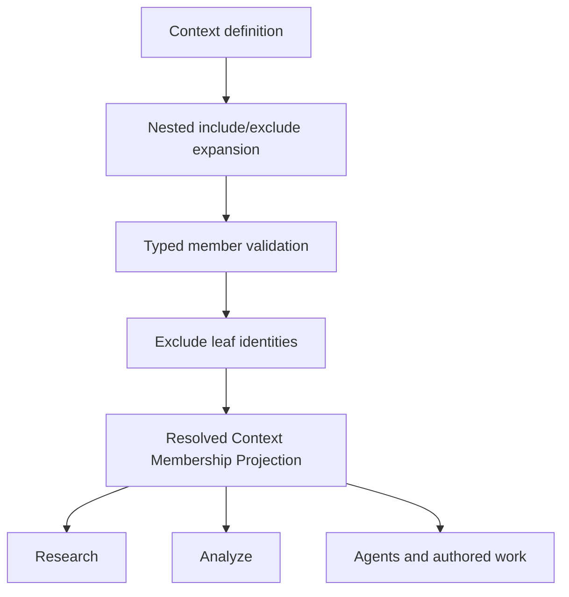

# Capability — Context

Context owns named, composable scopes used by Research, Analyze, Agents, and authored work. It supports project-scoped Contexts with concrete memberships and a Context Library built on reusable versioned definitions. Selected Sources, Evidence, structured data, and editable Resources retain their capability owners.

## Purpose and boundary

A Context answers: **which bounded body of project material should this operation consider?**

Project Contexts are named set expressions with `include` and `exclude` memberships. Members may be:

- Source;
- Evidence;
- Document, Slides, or Spreadsheet Resource;
- structured table;
- structured variable;
- another project Context.

Exclusions win after nested expansion. Context resolution returns typed leaves with provenance paths and explicit partitions.

The Context Library stores reusable, versioned context definitions and binding slots. Materializing a library Context creates an independent project Context by binding project-specific slots to typed project objects.

Context owns project definitions, membership, nesting, resolution rules, typed library-version payloads, binding slots, and a rebuildable resolution projection. The shared Library Kernel owns library asset identity, version envelopes, lifecycle, lineage, and materialization receipts. Member capabilities own content; Platform and consumer capabilities own inference, retrieval, and embeddings.

## Runtime placement

```plain text
apps/backend/src/3-capabilities/context/
  domain/
    model.ts
    operations.ts
  application/
    resolver.ts
    service.ts
    libraryParticipant.ts
  ports/
    repository.ts
    memberReaders.ts
  persistence/
    migrations.ts
    sqliteContextRepository.ts
  projections/
    resolvedMembership.ts
  index.ts

apps/backend/src/4-job-wiring/context/
  registerContextEndpointMappings.ts
  contextJobFactories.ts
  contextMemberAdapters.ts
```

Context is composed into the backend and Platform Database. The frontend Context panel renders the authoritative Context APIs and their read projections.

## Public operations

### Project Contexts

- `context.create`, `get`, `list`, `revise`, `archive`, `restore`;
- `context.add-member`, `remove-member`, `move-member`;
- `context.resolve`;
- `context.duplicate`.

### Context Library

- `context-library.create`, `get`, `list`, `publish-version`;
- `context-library.add-binding-slot`, `remove-binding-slot`;
- `context-library.materialize-into-project`;
- `context-library.archive`, `restore`.

The `whole_project` virtual Context resolves from current project-member reader ports. Library definitions use explicit typed members and binding slots.

## Request-to-job mapping

| Request | Queue | Response |
|---|---|---|
| project/library create, revise, membership, archive/restore | `serial` | `inline` |
| library materialization | `serial` | `inline` for bounded definitions |
| get/list | `concurrent` | `inline` |
| resolve | `concurrent` | `inline` |
| resolve with deferred response requested | `concurrent` | `deferred` |

Definitions and materialization batches have admission bounds. Resolution is read-only even when it refreshes its derived cache. Cache publication uses the definition hash and is safe under concurrent execution.

## Aggregate and revision model

A project Context is one mutable aggregate. Its head metadata and current member rows advance together under `expectedRevision + submissionId`; each accepted mutation appends an immutable change set with inverse operations.

A library Context uses the shared Library Kernel envelope. Context prepares an immutable typed definition payload and binding-slot set; the Kernel writes the matching version envelope and advances the library head in the same transaction. Materialization pins one exact library version in the Kernel receipt, then Context creates an ordinary project Context with its own ID and revision history. Library identity, lifecycle, version envelopes, lineage, and generic receipts remain Kernel-owned.

## Core TypeScript model

```typescript
interface Scope {
  userId: string;
  projectId: string;
}

type ContextLeafRef =
  | { kind: "source"; sourceId: string }
  | { kind: "evidence"; evidenceId: string }
  | {
      kind: "resource";
      resourceKind: "document" | "slides" | "spreadsheet";
      resourceId: string;
    }
  | { kind: "structured_table"; tableId: string }
  | { kind: "structured_variable"; variableId: string };

type ContextMemberTarget =
  | ContextLeafRef
  | { kind: "context"; contextId: string };

type LibraryContextMember = {
  memberId: string;
  operation: "include" | "exclude";
  target: ContextLeafRef | { kind: "binding_slot"; slotId: string };
  ordinal: number;
};

interface ContextMember {
  memberId: string;
  operation: "include" | "exclude";
  target: ContextMemberTarget;
  ordinal: number;
}

interface ProjectContext {
  contextId: string;
  userId: string;
  projectId: string;
  revision: number;
  name: string;
  description: string;
  lifecycle: "active" | "archived";
  definitionHash: string;
  members: readonly ContextMember[];
  createdAt: string;
  updatedAt: string;
}

type ContextOperation =
  | { kind: "set_name"; name: string }
  | { kind: "set_description"; description: string }
  | { kind: "set_lifecycle"; lifecycle: ProjectContext["lifecycle"] }
  | { kind: "add_member"; member: ContextMember }
  | { kind: "remove_member"; memberId: string }
  | { kind: "move_member"; memberId: string; beforeMemberId: string | null };

interface ContextLibraryPayload {
  schemaVersion: 1;
  definition: {
    members: readonly LibraryContextMember[];
  };
  bindingSlots: readonly {
    slotId: string;
    name: string;
    description: string;
    acceptedKinds: readonly ContextLeafRef["kind"][];
    required: boolean;
    ordinal: number;
  }[];
}

interface ResolveContextRequest {
  scope: Scope;
  contextIds: readonly string[];
  projectionPolicyVersion: string;
}
```

## Canonical tables

```sql
CREATE TABLE project_contexts (
  context_id TEXT PRIMARY KEY,
  user_id TEXT NOT NULL,
  project_id TEXT NOT NULL,
  revision INTEGER NOT NULL CHECK (revision >= 1),
  name TEXT NOT NULL,
  description TEXT NOT NULL DEFAULT '',
  lifecycle TEXT NOT NULL CHECK (lifecycle IN ('active', 'archived')),
  definition_hash TEXT NOT NULL,
  created_at TEXT NOT NULL,
  updated_at TEXT NOT NULL,
  UNIQUE (user_id, project_id, context_id)
);

CREATE TABLE project_context_members (
  member_id TEXT PRIMARY KEY,
  user_id TEXT NOT NULL,
  project_id TEXT NOT NULL,
  context_id TEXT NOT NULL,
  set_operation TEXT NOT NULL CHECK (set_operation IN ('include', 'exclude')),
  member_kind TEXT NOT NULL CHECK (member_kind IN ('source', 'evidence', 'resource', 'structured_table', 'structured_variable', 'context')),
  target_id TEXT NOT NULL,
  resource_kind TEXT NOT NULL DEFAULT ''
    CHECK (resource_kind IN ('', 'document', 'slides', 'spreadsheet')),
  ordinal INTEGER NOT NULL,
  created_at TEXT NOT NULL,
  CHECK (
    (member_kind = 'resource' AND resource_kind <> '')
    OR (member_kind <> 'resource' AND resource_kind = '')
  ),
  UNIQUE (user_id, project_id, context_id, member_id),
  FOREIGN KEY (user_id, project_id, context_id)
    REFERENCES project_contexts(user_id, project_id, context_id)
);

CREATE TABLE context_change_sets (
  change_set_id TEXT PRIMARY KEY,
  user_id TEXT NOT NULL,
  project_id TEXT NOT NULL,
  context_id TEXT NOT NULL,
  revision INTEGER NOT NULL,
  base_revision INTEGER NOT NULL,
  submission_id TEXT NOT NULL,
  operations_json TEXT NOT NULL,
  inverse_json TEXT NOT NULL,
  accepted_at TEXT NOT NULL,
  FOREIGN KEY (user_id, project_id, context_id)
    REFERENCES project_contexts(user_id, project_id, context_id)
);

CREATE TABLE context_library_version_payloads (
  user_id TEXT NOT NULL,
  project_id TEXT NOT NULL,
  asset_id TEXT NOT NULL,
  version INTEGER NOT NULL,
  definition_hash TEXT NOT NULL,
  definition_json TEXT NOT NULL,
  created_at TEXT NOT NULL,
  PRIMARY KEY (user_id, project_id, asset_id, version),
  FOREIGN KEY (user_id, project_id, asset_id, version)
    REFERENCES library_asset_versions(user_id, project_id, asset_id, version)
);

CREATE TABLE context_library_binding_slots (
  slot_id TEXT PRIMARY KEY,
  user_id TEXT NOT NULL,
  project_id TEXT NOT NULL,
  asset_id TEXT NOT NULL,
  version INTEGER NOT NULL,
  name TEXT NOT NULL,
  description TEXT NOT NULL DEFAULT '',
  accepted_kinds_json TEXT NOT NULL,
  required INTEGER NOT NULL CHECK (required IN (0, 1)),
  ordinal INTEGER NOT NULL,
  UNIQUE (user_id, project_id, asset_id, version, slot_id),
  FOREIGN KEY (user_id, project_id, asset_id, version)
    REFERENCES context_library_version_payloads(
      user_id, project_id, asset_id, version
    )
);

CREATE TABLE context_materialization_results (
  materialization_id TEXT PRIMARY KEY,
  user_id TEXT NOT NULL,
  project_id TEXT NOT NULL,
  project_context_id TEXT NOT NULL,
  bindings_json TEXT NOT NULL,
  created_at TEXT NOT NULL,
  FOREIGN KEY (user_id, project_id, materialization_id)
    REFERENCES library_materializations(user_id, project_id, id),
  FOREIGN KEY (user_id, project_id, project_context_id)
    REFERENCES project_contexts(user_id, project_id, context_id)
);

CREATE TABLE context_resolved_members (
  user_id TEXT NOT NULL,
  project_id TEXT NOT NULL,
  context_id TEXT NOT NULL,
  definition_hash TEXT NOT NULL,
  leaf_kind TEXT NOT NULL,
  leaf_id TEXT NOT NULL,
  resource_kind TEXT NOT NULL DEFAULT ''
    CHECK (resource_kind IN ('', 'document', 'slides', 'spreadsheet')),
  provenance_json TEXT NOT NULL,
  ordinal INTEGER NOT NULL,
  CHECK (
    (leaf_kind = 'resource' AND resource_kind <> '')
    OR (leaf_kind <> 'resource' AND resource_kind = '')
  ),
  PRIMARY KEY (
    user_id, project_id, context_id, definition_hash,
    leaf_kind, resource_kind, leaf_id
  ),
  FOREIGN KEY (user_id, project_id, context_id)
    REFERENCES project_contexts(user_id, project_id, context_id)
);
```

Exact indexes:

```sql
CREATE INDEX project_contexts_project_name
  ON project_contexts(user_id, project_id, lifecycle, name, context_id);

CREATE UNIQUE INDEX project_context_members_identity
  ON project_context_members(
    user_id, project_id, context_id, set_operation,
    member_kind, resource_kind, target_id
  );

CREATE INDEX project_context_members_order
  ON project_context_members(user_id, project_id, context_id, set_operation, ordinal, member_id);

CREATE INDEX project_context_nested_reverse
  ON project_context_members(user_id, project_id, member_kind, target_id, context_id)
  WHERE member_kind = 'context';

CREATE UNIQUE INDEX context_change_sets_revision
  ON context_change_sets(user_id, project_id, context_id, revision);

CREATE UNIQUE INDEX context_change_sets_submission
  ON context_change_sets(user_id, project_id, context_id, submission_id);

CREATE UNIQUE INDEX context_library_version_payloads_hash
  ON context_library_version_payloads(
    user_id, project_id, asset_id, definition_hash
  );

CREATE INDEX context_library_slots_order
  ON context_library_binding_slots(
    user_id, project_id, asset_id, version, ordinal, slot_id
  );

CREATE INDEX context_materializations_project
  ON context_materialization_results(
    user_id, project_id, project_context_id,
    created_at DESC, materialization_id
  );

CREATE INDEX context_resolved_members_leaf
  ON context_resolved_members(
    user_id, project_id, leaf_kind, resource_kind, leaf_id, context_id
  );
```

Every Context child repeats `user_id + project_id` and uses that same scope in its parent key and foreign key. Native Resource identity is the pair `(resource_kind, target_id)`. Typed Context Library payload rows share the Library Kernel envelope scope; materialized Project Contexts use the destination Project scope recorded by the Kernel receipt.

## Rebuildable derived projection

`context_resolved_members` is the named **Resolved Context Membership Projection**. It is rebuilt from the current Context definition and member readers. `definition_hash` distinguishes the current output from prior generations. The projection accelerates filtering and reverse “used in Context” lookup; the project Context and member rows remain canonical.

Resolution returns separate typed partitions so each consumer receives the appropriate representation:

```typescript
interface ResolvedContext {
  sources: SourceRef[];
  evidence: EvidenceRef[];
  resources: Array<{ kind: "document" | "slides" | "spreadsheet"; id: string }>;
  structuredTables: StructuredTableRef[];
  structuredVariables: StructuredVariableRef[];
  provenance: ResolutionPath[];
  definitionHash: string;
}
```

## Dependencies and narrow ports

Composition supplies bounded existence and summary readers from Sources, Evidence, Document, Slides, Spreadsheet, and Structured Data.

Consumers use:

```typescript
interface ContextResolver {
  resolve(scope: Scope, contextIds: string[]): Promise<ResolvedContext>;
}
```

Research uses the Source/Evidence/Resource partitions. Analyze uses structured tables/variables and may use Evidence. Agents and authored work can use all partitions according to their own operation. Context calls neither web retrieval nor platform intelligence.

**Knowledge admission law:** Context can select native Resources and structured or analytic objects for direct consumption. Native Document, Slides, or Spreadsheet content reaches Knowledge through an exact Sources `native_resource` Source Version. Structured Data and Analysis reach Knowledge through a Source Version or admitted canonical Evidence.

## Key flow



## Invariants

1. Project Context members belong to the same `userId + projectId`.
2. Nested project Context graphs are acyclic.
3. Includes expand first; Excludes subtract canonical leaf identities afterward.
4. Resolution is deterministic and keeps provenance paths.
5. A Context stores typed references; member bodies and embeddings remain with their owning capabilities.
6. Library and project Contexts have independent IDs and histories.
7. Materialization pins one library version and produces a copy.
8. Library definitions represent project-specific material through binding slots.
9. Current member rows, Context head, definition hash, and change set commit atomically.
10. Resource membership and resolved-leaf identity always preserve `document | slides | spreadsheet`.
11. `whole_project` is virtual; library versions use explicit members and binding slots.

## Acceptance criteria

- Nested includes resolve once with stable provenance.
- An excluded leaf is absent regardless of how many included paths reached it.
- Cycles are rejected before publication.
- Changing a definition invalidates the old resolved projection by hash.
- Research can restrict Knowledge/Sources to a selected Context.
- Analyze receives typed structured members partitioned from prose members.
- Materializing a library Context creates an independent project Context.

## References

- [Implementation — User Context Library](https://app.notion.com/p/3acb6410e502814e928ae1f10eac6f75)
- [Product — Icarus Complete Product Definition](https://app.notion.com/p/3aeb6410e502810ba9c0c26442d5255a)
- [Design — Multi-Lattice Ingestion Architecture](https://app.notion.com/p/3acb6410e50281bf8f16ec589da555d3)
- [Model — Workspace Capability & Runtime Contract](https://app.notion.com/p/3acb6410e50281ddaa6dca8f6e1802fb)
