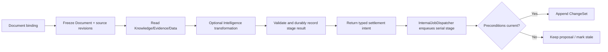

# Document Capability Reference

## Purpose

Document is one of the three native Resource capabilities. It owns Document identity, structured content, styles, bindings, provenance, Base state, append-only ChangeSets, revision history, and exact snapshot projections. Workspace composes Document summaries with Slides and Spreadsheet summaries through typed read adapters. Consumers create and mutate Documents through the Document command contract.

## Bottom line

Document owns a full editable knowledge-work document. Its canonical hierarchy is:

```plain text
Document
  ├─ Header / Footer regions
  ├─ Body Rows
  │   └─ Blocks
  │       └─ Atoms
  ├─ Marks over Atom ranges
  ├─ semantic Style Registry
  └─ print and page-flow settings
```

Stable IDs, typed operations, Base + append-only ChangeSets, revision compare-and-swap, and deterministic replay form the core runtime. The semantic Document model is canonical; pages, browser editor nodes, and rendered pixels are projections derived from versioned layout inputs.

Live content emerges from Document-owned bindings. A Block or Atom may reference Knowledge, Evidence, an Answer, Structured Data, Analysis, Formula, or another Resource. Document stores the target binding, accepted source version, last-good display, staleness state, and provenance. A rebuildable reverse dependency index accelerates refresh. Knowledge explicitly feeds generated and refreshable Document content through an injected read port.

Document runs inside the Icarus backend and uses the shared request, job, queue, database, intelligence, and observability platform contracts.

## Authority and integration boundaries

- Document is authoritative for Document identity and lifecycle; Rows, Blocks, Atoms, Marks, embedded tables, semantic styles, print and page-flow state; content bindings; accepted and last-good display; Document provenance; ChangeSets; stable anchors; and render and source-snapshot projections.
- Knowledge, Evidence, Questions, Structured Data, Analysis, Formula, Media, and other native Resources expose versioned read contracts that Document uses to resolve bindings.
- Platform Intelligence supplies generation behind an injected interface. Research owns web retrieval and admission into Sources and Evidence.
- Collaboration owns comments and activity while storing typed Document target addresses. Workspace owns tabs and project navigation. Templates owns reusable definitions. Import/Export owns file codecs.
- Frontend editor state remains a client concern; the backend semantic model is the shared source of truth.

`documents` is the Resource identity table for this family. Workspace lists Documents through a read adapter alongside Slides and Spreadsheets.

## Runtime placement

```plain text
apps/backend/src/
  3-capabilities/
    document/
      domain/
        model.ts
        rich-content.ts
        styles.ts
        bindings.ts
        operations.ts
        apply.ts
        errors.ts
      application/
        service.ts
        history.ts
        render.ts
        source-snapshot.ts
      ports/
        documentRepository.ts
        contentReaders.ts
      persistence/
        migrations.ts
        sqliteDocumentRepository.ts
      index.ts
      tests/

  4-job-wiring/
    document/
      registerDocumentEndpointMappings.ts
      createDocumentJobs.ts
    internal/
      InternalJobDispatcher.ts

  0-platform/
    database/       shared connection and transaction interface only
    intelligence/   shared Intelligence interface/provider
    observability/  shared Logger
```

Document owns its SQL and repository adapter. `persistence/sqliteDocumentRepository.ts` consumes the generic `0-platform/database` connection and transaction contract. Platform supplies database mechanics while Document defines its schema and queries.

Job wiring owns endpoint registration, queue choice, and HTTP response mode. Capability code exposes transport-neutral application contracts.

## Canonical aggregate

```typescript
interface Document {
  id: string;
  userId: string;
  projectId: string;
  title: string;
  lifecycle: "active" | "archived" | "trashed";
  revision: number;
  baseSeq: number;
  createdAt: string;
  updatedAt: string;
}

interface DocumentBase {
  representationVersion: "document/v1";
  styles: StyleRegistry;
  print: PrintSettings;
  header: DocumentRegion;
  footer: DocumentRegion;
  body: DocumentRegion;
}

interface DocumentRegion {
  rows: DocumentRow[];
}

interface DocumentRow {
  id: string;
  rank: string;
  blocks: DocumentBlock[];
  layout: RowLayout;
  flow: RowFlow;
}

interface DocumentBlock {
  id: string;
  rank: string;
  kind:
    | "paragraph"
    | "heading"
    | "bulleted-list"
    | "numbered-list"
    | "checklist"
    | "quote"
    | "code"
    | "callout"
    | "divider"
    | "table"
    | "image"
    | "embed"
    | "chart"
    | "metric"
    | "prompt";
  style: BlockStyleRef;
  data: DocumentBlockData;
  atoms: DocumentAtom[];
  marks: DocumentMark[];
  binding?: ContentBinding;
}
```

Rows are horizontal composition units. Multiple Blocks in one Row retain stable proportions/tracks and gaps. Movement never changes identity.

### Atoms and Marks

```typescript
type DocumentAtom =
  | { id: string; kind: "text"; text: string }
  | { id: string; kind: "formula"; binding: FormulaAtomBinding }
  | { id: string; kind: "reference"; binding: ContentBinding };

interface DocumentMark {
  id: string;
  kind: "bold" | "italic" | "underline" | "strike" | "code" | "link";
  start: { atomId: string; byteOffset: number };
  end: { atomId: string; byteOffset: number };
  href?: string;
}
```

Offsets are UTF-8 byte offsets on rune boundaries. Links require a safe `href`. Marks never store editor selection coordinates.

### Styles and layout

The `StyleRegistry` is semantic canonical state:

- stable Style IDs and names;
- applicable Block kinds;
- typography, spacing, appearance, and controlled overrides;
- document defaults and a versioned semantic style vocabulary.

Header and Footer reuse normal Document Rows/Blocks/Atoms. Page size, margins, orientation, explicit breaks, keep-with-next, and keep-together are canonical. Derived pagination uses those inputs plus a versioned layout policy.

### Content bindings and provenance

```typescript
type ContentSourceRef =
  | { kind: "knowledge-query"; queryId: string; contextIds: string[] }
  | { kind: "evidence"; evidenceId: string }
  | { kind: "question-answer"; questionId: string; answerId: string }
  | { kind: "structured-binding"; bindingId: string }
  | { kind: "analysis-result"; analysisId: string; resultId: string; outputId: string }
  | { kind: "formula-result"; expression: string; inputManifestDigest: string }
  | { kind: "resource-target"; resourceKind: "document" | "slides" | "spreadsheet"; resourceId: string; targetId: string };

interface ContentBinding {
  id: string;
  source: ContentSourceRef;
  updatePolicy: "pinned" | "manual-refresh" | "auto-refresh";
  acceptedSourceVersion?: string;
  sourceDigest?: string;
  displayRevision: number;
  state: "current" | "stale" | "refreshing" | "failed";
  generationToken?: string;
  lastGoodDisplay?: DocumentFragment;
  provenance: ProvenanceLink[];
}
```

The binding lives in the owning Block/Atom. Provenance is stamped when an operation accepts content. `document_dependency_index` is only a rebuildable reverse lookup.

## Revision and ChangeSets

```typescript
interface DocumentSubmission {
  submissionId: string;
  expectedRevision: number;
  operations: DocumentOperation[];
}

interface DocumentChangeSet {
  id: string;
  documentId: string;
  userId: string;
  projectId: string;
  submissionId: string;
  submissionHash: string;
  priorRevision: number;
  revision: number;
  seq: number;
  authorId: string;
  createdAt: string;
  operations: DocumentOperation[];
  inverseOperations: DocumentOperation[];
  footprint: DocumentFootprint;
  undoOf?: string;
  redoOf?: string;
  delegation?: { agentRunId: string; proposalId?: string };
}
```

Base represents content through `baseSeq`; reads replay ChangeSets through `revision`. Rebase advances `baseSeq` without changing the logical revision.

Submission behavior:

1. canonicalize and hash the complete submission;
2. return the original ChangeSet for an identical retry;
3. reject reuse of a submission ID with different content;
4. require exact revision unless retained semantic footprints prove safe rebase;
5. apply operations purely to a copy, validate, and generate inverses;
6. append ChangeSet and advance revision atomically.

Undo/redo append explicit compensating operations at the current head. They never suppress prior rows during replay.

## Typed operations

Operation families include:

- Document: rename, lifecycle, print settings.
- Styles: create/update/delete/replace usages/apply style.
- Rows: insert, move, remove, resize tracks, set flow.
- Blocks: insert, move, remove, replace typed payload, set attributes.
- Text: insert/splice/delete/replace Atom text, split/join Blocks.
- Marks: add/update/remove.
- Tables: insert/move/delete rows/columns, set cell content, merge/unmerge.
- Media: set exact file/snapshot reference, crop/fit, alt/decorative state.
- Formula: set expression, request evaluation, apply accepted result.
- Prompt/live content: set binding, request refresh, apply result/proposal, detach to static.
- Provenance: attach accepted source lineage only as part of the operation that admits content.

Every mutation uses this typed operation vocabulary. Agent-proposed edits carry the same operations as direct user submissions and remain inspectable before acceptance.

## Request contracts

| Request type | Semantics | Result |
|---|---|---|
| `documents.create.v1` | Idempotent command | Create a blank Document or materialize a validated recipe |
| `documents.get.v1`, `documents.load.v1`, `documents.list.v1` | Query | Return a summary or an exact Base-plus-tail projection |
| `documents.submit.v1` | Idempotent command | Validate typed operations and append one ChangeSet |
| `documents.undo.v1`, `documents.redo.v1` | Idempotent command | Append an explicit compensating ChangeSet |
| `documents.history.list.v1` | Query | Return bounded ChangeSet history |
| `documents.refresh.request.v1` | Idempotent command | Freeze target and source revisions and create a refresh request |
| `documents.refresh.status.v1` | Query | Return request, proposal, completion, or failure state |
| `documents.render.v1` | Query | Return semantic, display, Markdown, or print projection |
| `documents.source-snapshot.v1` | Query | Return an exact-head native-Resource snapshot package for Sources |
| `documents.validate-anchor.v1` | Query | Validate or rebase an external or comment anchor |
| `documents.duplicate.v1` | Idempotent command | Create a new Document with fresh descendant IDs from an exact head |

Import/Export consumes exact Document projections and submits creation or mutation through the public Document command contract.

## Queues and response choices

| Work | Queue | Response |
|---|---|---|
| Get, list, load, history, render, source snapshot | Concurrent | Inline |
| Create, submit, undo, redo, lifecycle, duplicate | Serial | Inline |
| Accept refresh or prompt-generation request | Serial | Deferred job receipt plus concurrent-stage intent |
| Knowledge-backed generation, transformation, or broad Formula evaluation | Concurrent | Internal stage result |
| Apply generated result or proposal | Serial settlement stage dispatched by `InternalJobDispatcher` | Internal stage result |
| Rebase Base | Serial compaction stage dispatched by `InternalJobDispatcher` | Internal stage result |

A serial request stage freezes the Document revision, binding display revision, source versions, and generation token, persists the refresh request, and returns a concurrent-stage intent. The concurrent stage durably records its result and returns a typed `document.refresh.settle` intent to job wiring. The composition-owned `4-job-wiring/internal/InternalJobDispatcher` enqueues that intent as a new serial stage after the concurrent stage has finished. Settlement applies when those preconditions match; otherwise the result remains a reviewable proposal or is marked stale. Last-good display remains available across failures.

Every stage has a deterministic idempotency key. A concurrent job completes after recording its durable result and returning the next intent. Job wiring translates plain capability stage intents into jobs.

The wiring-owned contract is:

```typescript
interface InternalJobDispatcher {
  dispatch(intent: InternalStageIntent): Promise<{ jobId: string }>;
}
```

`dispatch` resolves after enqueue. Document returns a plain `NextStageIntent`; composition owns the dispatcher.

## Persistence and SQL indexes

```sql
CREATE TABLE documents (
  id          TEXT PRIMARY KEY,
  user_id     TEXT NOT NULL,
  project_id  TEXT NOT NULL,
  title       TEXT NOT NULL,
  lifecycle   TEXT NOT NULL,
  revision    INTEGER NOT NULL DEFAULT 0,
  base_seq    INTEGER NOT NULL DEFAULT 0,
  base_json   BLOB NOT NULL,
  created_at  TEXT NOT NULL,
  updated_at  TEXT NOT NULL,
  UNIQUE (user_id, project_id, id)
);
CREATE INDEX documents_project_updated
  ON documents(user_id, project_id, lifecycle, updated_at DESC, id);

CREATE TABLE document_change_sets (
  id                TEXT PRIMARY KEY,
  document_id       TEXT NOT NULL,
  user_id           TEXT NOT NULL,
  project_id        TEXT NOT NULL,
  submission_id     TEXT NOT NULL,
  submission_hash   TEXT NOT NULL,
  prior_revision    INTEGER NOT NULL,
  revision          INTEGER NOT NULL,
  seq               INTEGER NOT NULL,
  author_id         TEXT NOT NULL,
  operations_json   BLOB NOT NULL,
  inverse_ops_json  BLOB NOT NULL,
  footprint_json    BLOB NOT NULL,
  undo_of           TEXT,
  redo_of           TEXT,
  delegation_json   BLOB,
  created_at        TEXT NOT NULL,
  UNIQUE (document_id, seq),
  UNIQUE (document_id, submission_id),
  FOREIGN KEY (user_id, project_id, document_id)
    REFERENCES documents(user_id, project_id, id) ON DELETE CASCADE
);
CREATE INDEX document_changes_project_recent
  ON document_change_sets(user_id, project_id, created_at DESC, id);

CREATE TABLE document_refresh_requests (
  id                       TEXT PRIMARY KEY,
  document_id              TEXT NOT NULL,
  user_id                  TEXT NOT NULL,
  project_id               TEXT NOT NULL,
  target_id                TEXT NOT NULL,
  idempotency_key          TEXT NOT NULL,
  request_hash             TEXT NOT NULL,
  source_revision          TEXT NOT NULL,
  document_revision        INTEGER NOT NULL,
  target_display_revision  INTEGER NOT NULL,
  generation_token         TEXT NOT NULL,
  state                    TEXT NOT NULL,
  proposal_json            BLOB,
  failure_json             BLOB,
  created_at               TEXT NOT NULL,
  updated_at               TEXT NOT NULL,
  UNIQUE (document_id, idempotency_key),
  FOREIGN KEY (user_id, project_id, document_id)
    REFERENCES documents(user_id, project_id, id) ON DELETE CASCADE
);
CREATE INDEX document_refresh_state
  ON document_refresh_requests(user_id, project_id, state, updated_at DESC, id);
```

`base_json` stores one bounded, versioned semantic Base atomically. Document owns the SQL adapter and migrations. Windowed loading can introduce normalized Base rows and Blocks behind the same aggregate and repository contract.

## Rebuildable derived indexes and caches

A derived index is disposable and reconstructible:

- `document_dependency_index`: upstream source/binding → Document target;
- outline and heading index;
- style-usage index;
- plain-text/search extraction;
- pagination/layout cache keyed by exact head and layout policy;
- render cache keyed by head, dependency manifest, options, and renderer version;
- native-resource Source snapshot digest/cache.

Canonical bindings and provenance remain in Base and ChangeSets. Sources requests `documents.source-snapshot.v1` and creates an immutable `native_resource` Source Version for the exact Document head; Knowledge indexes that Source Version. Local indexes and the downstream lattice are rebuildable from canonical records.

## Dependencies and platform use

Document consumes narrow ports:

- `KnowledgeReader` for grounded lattice retrieval and exact citations during refresh/generation;
- `EvidenceReader` and `QuestionAnswerReader` for exact canonical objects;
- `StructuredDataReader` and `AnalysisResultReader` for exact typed values;
- `FormulaEngine` for pure evaluation;
- `ExactResourceReader` for explicit cross-Resource references;
- `FileSnapshotReader` for exact media versions;
- `Intelligence` from `0-platform/intelligence` for generation/proposed edits.

Research captures web material into Sources and Evidence, and Knowledge projects admitted material for grounded Document generation.

Document provides:

- exact snapshot and stable-target readers;
- Resource summary adapter;
- exact native-resource snapshot packages for Sources;
- anchor validation;
- template materialization/export projections.

## Refresh flow



## Governing invariants

1. Document owns its Resource identity and table family.
2. Every canonical mutation is one typed ChangeSet under revision CAS.
3. Rows, Blocks, Atoms, Marks, styles, and table children have stable non-reused IDs.
4. Pages and browser editor nodes are projections.
5. Binding and provenance state is owned by the target Document.
6. Knowledge can directly feed refresh/generation through a read port.
7. Last-good visible content remains available across refresh failure.
8. Generated results apply only when their frozen preconditions match current state.
9. Formula errors travel as diagnostics alongside the last valid display value.
10. AI and humans submit the same operation vocabulary.
11. Canonical Base and ChangeSets retain content, lineage, and dependencies independently of derived indexes.
12. Platform Intelligence owns provider selection; Research owns web retrieval.

## Conformance scenarios

1. Create, load, and list Documents within a project.
2. Edit paragraphs/headings with stable Rows, Blocks, Atoms, and Marks.
3. Apply semantic styles and derive an outline.
4. Append/replay ChangeSets; prove idempotency, conflict, undo, redo, and rebase.
5. Bind one paragraph to a Knowledge query or Question Answer.
6. Refresh it through Knowledge + Intelligence and preserve citations/provenance.
7. Change the source, mark the target stale, and accept a safe refresh.
8. Ask Sources to create a `native_resource` Source Version from the exact Document head, then show Knowledge indexing that Source Version.

## Acceptance criteria

- Canonical snapshots round-trip byte-equivalently after replay/rebase.
- Identical retries return the original ChangeSet; divergent reuse conflicts.
- Moved content preserves IDs and anchors.
- Invalid Mark spans, style references, or typed Block payloads reject atomically.
- Undo/redo are explicit linear compensation.
- A refresh begun before a human edit cannot overwrite that edit.
- Knowledge-backed output records exact evidence/source lineage.
- Removing derived indexes changes only performance.
- Workspace lists and opens the Document through its family adapter.
- Document SQL is owned under `3-capabilities/document`, while `0-platform/database` remains generic.
- Capability code imports neither Fastify nor provider SDKs nor another capability’s service implementation.

## References

- [Product — Icarus Complete Product Definition](https://app.notion.com/p/3aeb6410e502810ba9c0c26442d5255a)
- [Architecture — Icarus Runtime Foundation & Repository Boundaries](https://app.notion.com/p/3adb6410e50281e09d83ed36daacf8d8)
- [Model — Icarus Request, Job & Dual-Queue Runtime](https://app.notion.com/p/3adb6410e50281c498f4d7f6a621eba2)
- [Taurus Omega — Document Backend Alignment Gaps](https://app.notion.com/p/3a6b6410e50281728606cb2a2b2b75a5)
- [Taurus Omega — Document Editor Outcome Checklist](https://app.notion.com/p/3a5b6410e50281d58042cde7c2b7e516)
- [Taurus Omega — Formula–Sheet Alignment Contract](https://app.notion.com/p/3a6b6410e50281d98794f33a35b90139)
- [Export — Document to DOCX](https://app.notion.com/p/3acb6410e5028134aedfe63676d5418c)
- [Export — Document to PDF](https://app.notion.com/p/3acb6410e502817fbde1f33e76f61b82)
