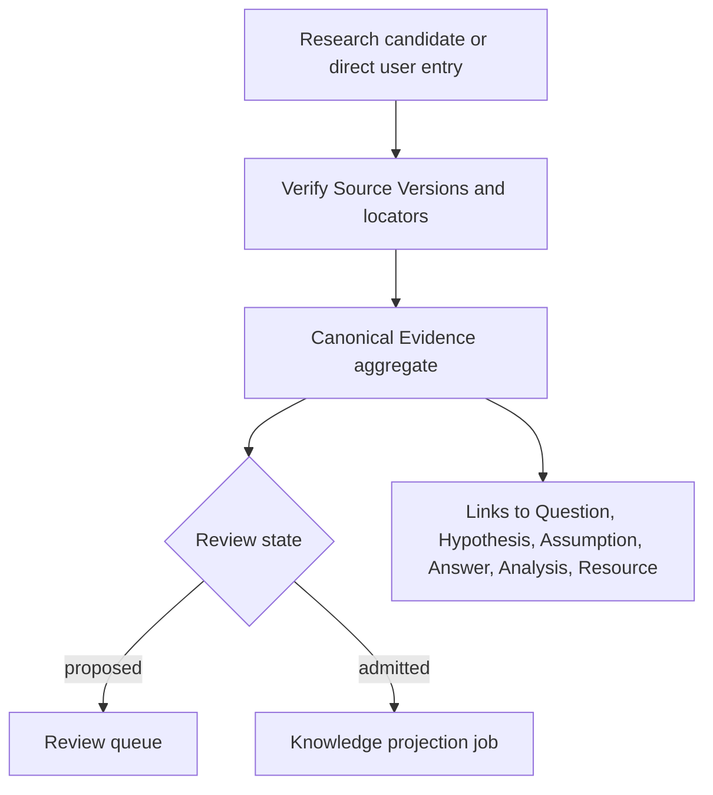

# Capability — Evidence

Evidence is canonical, reviewable, source-grounded project knowledge. It stores bounded assertions with exact provenance and review history. Admitted Evidence is projected into the Knowledge lattice while Evidence remains canonical.

## Purpose and boundary

Evidence lets a project retain a bounded assertion or quotation from research together with the exact basis needed to review it.

An Evidence record contains:

- a concise statement;
- an explicit evidence kind;
- one or more immutable source citations;
- polarity and links to the Questions, Hypotheses, Assumptions, Answers, Analyses, or Resources it bears on;
- confidence and review state;
- revision and review history.

Evidence kinds:

| Kind | Meaning |
|---|---|
| `quotation` | A bounded exact quotation from a Source Version. |
| `observation` | A faithful observation directly supported by cited source material. |
| `calculation` | A result derived from version-pinned structured inputs and a recorded method. |
| `inference` | A labeled conclusion drawn from cited material. |

Evidence owns those canonical records, citations, links, and admission history. Research owns candidate material before admission. Sources owns immutable origin content. Questions owns Questions, Hypotheses, Assumptions, and Answers. Knowledge owns the retrieval projection.

Knowledge contribution types are Source Versions, admitted Evidence, and literal Media OCR. Structured Data and Analysis may be consumed to calculate or support Evidence. Native editor material used as grounding is pinned through a Sources `native_resource` Source Version.

## Runtime placement

```plain text
apps/backend/src/3-capabilities/evidence/
  domain/
    model.ts
    operations.ts
    validation.ts
    reducer.ts
  application/
    service.ts
  ports/
    repository.ts
    sourceReaders.ts
    targetReaders.ts
  persistence/
    migrations/
      001-evidence.ts
    sqliteEvidenceRepository.ts
  index.ts

apps/backend/src/4-job-wiring/evidence/
  registerEvidenceEndpointMappings.ts
  evidenceJobFactories.ts
  evidenceProjectionHook.ts
```

Evidence is composed into the backend and SQLite transaction boundary. Evidence owns its repository port, migrations, and `SqliteEvidenceRepository`; `1-init` instantiates that adapter with the Platform Database and injects it. `evidenceProjectionHook.ts` schedules a Knowledge projection after commit through a narrow composition-supplied port.

## Public operations

| Operation | Effect |
|---|---|
| `evidence.create` | Creates source-grounded Evidence directly. |
| `evidence.admit-from-research` | Validates a Research candidate and creates canonical Evidence. |
| `evidence.get` / `list` | Reads canonical Evidence and filters by target/source/review state. |
| `evidence.revise` | Revises statement, kind, confidence, citations, or links under CAS. |
| `evidence.admit` | Moves a proposed record to `admitted`. |
| `evidence.reject` | Records a rejected review decision. |
| `evidence.deprecate` | Keeps historical Evidence but removes it from current admitted retrieval. |
| `evidence.link` / `unlink` | Adds or removes a typed relationship to an inquiry or output. |
| `evidence.undo` / `redo` | Compensates the current eligible Evidence mutation. |

Review state is `proposed | admitted | rejected | deprecated`. Rejection and deprecation require rationale. A direct user “Add to knowledge base” action may create the record already admitted, while an AI-suggested batch normally enters `proposed`.

Relationships are `supports | refutes | qualifies | contextualizes | derived_from | used_by`. A link target uses a closed kind plus stable ID; native Resources use the explicit kinds `document | slides | spreadsheet`. Repositories validate target kinds and stable identifiers.

## Request-to-job mapping

| Request | Queue | Response | Reason |
|---|---|---|---|
| create/admit/revise/review/link/undo/redo | `serial` | `inline` | Canonical, ordered state mutations with exact Source validation. |
| get/list | `concurrent` | `inline` | Independent reads. |
| bulk admit | `serial` | `inline` for bounded batches | One transaction either admits the validated bounded batch or nothing. |

Source quotation verification is performed inside the serial job before commit through bounded exact-read I/O. Knowledge projection is a follow-up concurrent job created by composition after an admitted head commits. Canonical Evidence commits independently from the rebuildable projection.

## Aggregate and change-set model

An Evidence aggregate is the current Evidence row plus its current Citation and Link sets. A mutation supplies `expectedRevision` and `submissionId`, then a pure reducer produces the complete next aggregate and inverse operations.

In one transaction:

1. the service validates every Source Version and locator through `SourceSnapshotReader`;
2. exact quotations are checked byte-for-byte and hashed;
3. target references are validated through narrow readers;
4. the aggregate head, current citation/link rows, immutable change set, and review event commit;
5. after commit, job wiring requests Knowledge reprojection when admission eligibility changed.

Undo restores the prior aggregate state and appends a compensation change set. Review events and historical citation values remain retained.

## Core TypeScript model

```typescript
interface Scope {
  userId: string;
  projectId: string;
}

type EvidenceKind = "quotation" | "observation" | "calculation" | "inference";
type EvidenceReviewState = "proposed" | "admitted" | "rejected" | "deprecated";

type SourceLocator =
  | { kind: "text"; start: number; end: number }
  | { kind: "page"; page: number; start?: number; end?: number }
  | {
      kind: "image_region";
      x: number;
      y: number;
      width: number;
      height: number;
    }
  | { kind: "native_node"; resourceRevision: number; nodeId: string };

interface CalculationMethod {
  expression: string;
  structuredInputs: readonly {
    tableId: string;
    revision: number;
    range: string;
  }[];
}

interface EvidenceCitation {
  citationId: string;
  sourceId: string;
  sourceVersionId: string;
  locator: SourceLocator;
  exactQuote: string | null;
  quoteHash: string | null;
  role: "grounds" | "derives" | "method_input";
  ordinal: number;
}

type EvidenceTargetRef =
  | { kind: "question"; id: string }
  | { kind: "hypothesis"; id: string }
  | { kind: "assumption"; id: string }
  | { kind: "answer"; id: string }
  | { kind: "analysis"; id: string }
  | { kind: "document"; id: string }
  | { kind: "slides"; id: string }
  | { kind: "spreadsheet"; id: string }
  | { kind: "evidence"; id: string };

interface EvidenceLink {
  linkId: string;
  target: EvidenceTargetRef;
  relationship:
    | "supports"
    | "refutes"
    | "qualifies"
    | "contextualizes"
    | "derived_from"
    | "used_by";
}

interface EvidenceAggregate {
  evidenceId: string;
  userId: string;
  projectId: string;
  revision: number;
  statement: string;
  evidenceKind: EvidenceKind;
  confidence: number | null;
  reviewState: EvidenceReviewState;
  method: CalculationMethod | null;
  citations: readonly EvidenceCitation[];
  links: readonly EvidenceLink[];
  createdBy: string;
  admittedAt: string | null;
  createdAt: string;
  updatedAt: string;
}

type EvidenceOperation =
  | { kind: "set_statement"; statement: string }
  | { kind: "set_kind"; evidenceKind: EvidenceKind }
  | { kind: "set_confidence"; confidence: number | null }
  | { kind: "set_review_state"; state: EvidenceReviewState; rationale: string }
  | { kind: "add_citation"; citation: EvidenceCitation }
  | { kind: "remove_citation"; citationId: string }
  | { kind: "add_link"; link: EvidenceLink }
  | { kind: "remove_link"; linkId: string };

interface MutateEvidenceRequest {
  scope: Scope;
  evidenceId: string;
  expectedRevision: number;
  submissionId: string;
  operations: readonly EvidenceOperation[];
}
```

## Canonical tables

```sql
CREATE TABLE evidence (
  evidence_id TEXT PRIMARY KEY,
  user_id TEXT NOT NULL,
  project_id TEXT NOT NULL,
  revision INTEGER NOT NULL CHECK (revision >= 1),
  statement TEXT NOT NULL,
  evidence_kind TEXT NOT NULL CHECK (evidence_kind IN ('quotation', 'observation', 'calculation', 'inference')),
  confidence REAL CHECK (
    confidence IS NULL OR (confidence >= 0.0 AND confidence <= 1.0)
  ),
  review_state TEXT NOT NULL CHECK (review_state IN ('proposed', 'admitted', 'rejected', 'deprecated')),
  method_json TEXT,
  created_by TEXT NOT NULL,
  admitted_at TEXT,
  created_at TEXT NOT NULL,
  updated_at TEXT NOT NULL,
  UNIQUE (user_id, project_id, evidence_id)
);

CREATE TABLE evidence_citations (
  citation_id TEXT PRIMARY KEY,
  user_id TEXT NOT NULL,
  project_id TEXT NOT NULL,
  evidence_id TEXT NOT NULL,
  source_id TEXT NOT NULL,
  source_version_id TEXT NOT NULL,
  locator_json TEXT NOT NULL,
  exact_quote TEXT,
  quote_hash TEXT,
  citation_role TEXT NOT NULL CHECK (citation_role IN ('grounds', 'derives', 'method_input')),
  ordinal INTEGER NOT NULL,
  UNIQUE (user_id, project_id, evidence_id, citation_id),
  FOREIGN KEY (user_id, project_id, evidence_id)
    REFERENCES evidence(user_id, project_id, evidence_id)
);

CREATE TABLE evidence_links (
  link_id TEXT PRIMARY KEY,
  user_id TEXT NOT NULL,
  project_id TEXT NOT NULL,
  evidence_id TEXT NOT NULL,
  target_kind TEXT NOT NULL CHECK (
    target_kind IN (
      'question', 'hypothesis', 'assumption', 'answer', 'analysis',
      'document', 'slides', 'spreadsheet', 'evidence'
    )
  ),
  target_id TEXT NOT NULL,
  relationship TEXT NOT NULL CHECK (relationship IN ('supports', 'refutes', 'qualifies', 'contextualizes', 'derived_from', 'used_by')),
  created_at TEXT NOT NULL,
  FOREIGN KEY (user_id, project_id, evidence_id)
    REFERENCES evidence(user_id, project_id, evidence_id)
);

CREATE TABLE evidence_review_events (
  review_event_id TEXT PRIMARY KEY,
  user_id TEXT NOT NULL,
  project_id TEXT NOT NULL,
  evidence_id TEXT NOT NULL,
  from_state TEXT,
  to_state TEXT NOT NULL,
  actor_id TEXT NOT NULL,
  research_run_id TEXT,
  research_candidate_id TEXT,
  rationale TEXT NOT NULL DEFAULT '',
  occurred_at TEXT NOT NULL,
  FOREIGN KEY (user_id, project_id, evidence_id)
    REFERENCES evidence(user_id, project_id, evidence_id)
);

CREATE TABLE evidence_change_sets (
  change_set_id TEXT PRIMARY KEY,
  user_id TEXT NOT NULL,
  project_id TEXT NOT NULL,
  evidence_id TEXT NOT NULL,
  revision INTEGER NOT NULL,
  base_revision INTEGER NOT NULL,
  submission_id TEXT NOT NULL,
  operations_json TEXT NOT NULL,
  inverse_json TEXT NOT NULL,
  compensation_kind TEXT CHECK (compensation_kind IN ('undo', 'redo')),
  compensates_change_set_id TEXT,
  accepted_at TEXT NOT NULL,
  UNIQUE (user_id, project_id, evidence_id, change_set_id),
  FOREIGN KEY (user_id, project_id, evidence_id)
    REFERENCES evidence(user_id, project_id, evidence_id),
  FOREIGN KEY (
    user_id, project_id, evidence_id, compensates_change_set_id
  ) REFERENCES evidence_change_sets(
    user_id, project_id, evidence_id, change_set_id
  )
);
```

Exact indexes:

```sql
CREATE INDEX evidence_project_review_updated
  ON evidence(user_id, project_id, review_state, updated_at DESC, evidence_id);

CREATE INDEX evidence_project_kind
  ON evidence(user_id, project_id, evidence_kind, updated_at DESC, evidence_id);

CREATE INDEX evidence_citations_evidence_order
  ON evidence_citations(user_id, project_id, evidence_id, ordinal, citation_id);

CREATE INDEX evidence_citations_source_version
  ON evidence_citations(user_id, project_id, source_id, source_version_id, evidence_id);

CREATE UNIQUE INDEX evidence_citations_identity
  ON evidence_citations(user_id, project_id, evidence_id, source_version_id, locator_json, citation_role);

CREATE INDEX evidence_links_target
  ON evidence_links(user_id, project_id, target_kind, target_id, relationship, evidence_id);

CREATE UNIQUE INDEX evidence_links_identity
  ON evidence_links(user_id, project_id, evidence_id, target_kind, target_id, relationship);

CREATE INDEX evidence_review_events_history
  ON evidence_review_events(user_id, project_id, evidence_id, occurred_at, review_event_id);

CREATE INDEX evidence_review_events_research_candidate
  ON evidence_review_events(user_id, project_id, research_run_id, research_candidate_id)
  WHERE research_candidate_id IS NOT NULL;

CREATE UNIQUE INDEX evidence_change_sets_revision
  ON evidence_change_sets(user_id, project_id, evidence_id, revision);

CREATE UNIQUE INDEX evidence_change_sets_submission
  ON evidence_change_sets(user_id, project_id, evidence_id, submission_id);

CREATE INDEX evidence_change_sets_compensation
  ON evidence_change_sets(user_id, project_id, evidence_id, compensates_change_set_id)
  WHERE compensates_change_set_id IS NOT NULL;
```

Every Evidence-owned child repeats `user_id + project_id + evidence_id` and references the same composite aggregate key. Source, Question, Hypothesis, Assumption, Answer, Analysis, and native-Resource targets are typed cross-capability references validated through ports. The closed native target kinds preserve editor identity in link uniqueness and reverse lookup.

## Derived projections

The **Evidence Review Projection** is rebuilt from canonical Evidence, review events, citations, and links for review queues and target-centric lists. The **Admitted Evidence Text Projection** is owned by Knowledge and is completely rebuildable from:

- admitted Evidence statement and kind;
- Evidence revision;
- current citations and links;
- exact Source Version locators.

Evidence exposes a snapshot reader; Knowledge stores the projection. SQLite B-tree indexes above are relational query indexes, while the Knowledge text representation is a rebuildable product projection.

## Dependencies and narrow ports

Evidence consumes:

```typescript
interface SourceSnapshotReader {
  getVersion(scope: Scope, sourceVersionId: string): Promise<SourceVersionMetadata>;
  readExact(scope: Scope, sourceVersionId: string, locator: SourceLocator): Promise<ExactSourceSlice>;
}

interface EvidenceTargetReader {
  exists(scope: Scope, target: EvidenceTargetRef): Promise<boolean>;
}

interface ResearchCandidateReader {
  getEvidenceCandidate(scope: Scope, runId: string, candidateId: string): Promise<EvidenceCandidate>;
}
```

Structured calculations consume a `StructuredSnapshotReader` to verify version-pinned inputs. Evidence exposes:

```typescript
interface AdmittedEvidenceReader {
  getProjectionSnapshot(scope: Scope, evidenceId: string, revision?: number): Promise<EvidenceProjectionSnapshot>;
  listAdmitted(scope: Scope, cursor?: string): Promise<EvidenceProjectionSnapshot[]>;
}
```

Web material enters Evidence through a Source Version. Model-generated interpretation is labeled as `inference` and carries cited grounding.

## Key flow



## Invariants

1. Canonical Evidence has at least one valid grounding citation.
2. Every citation pins an immutable Source Version and locator.
3. A quotation's stored text and hash match the exact cited Source slice.
4. Observation, calculation, and inference are labeled; none masquerades as a quote.
5. Evidence links preserve target ownership and the native Resource subtype `document | slides | spreadsheet`.
6. Evidence authority begins when an Evidence operation commits; Research candidates retain candidate status.
7. Only `admitted` Evidence is eligible for the current Knowledge projection.
8. Rejected/deprecated Evidence remains readable for history but is removed from current retrieval on refresh.
9. Head, citation/link sets, review event, and change set commit atomically.
10. Knowledge projection failures preserve canonical Evidence for retry.
11. Structured or analytic results become Knowledge-eligible only through explicit Source promotion or admitted Evidence.
12. Grounding consists of immutable Source Version citations and verified locators.

## Acceptance criteria

- A valid exact quotation can be admitted and reopened at its Source locator.
- A mismatched quote or nonexistent Source Version fails before any Evidence row commits.
- One Evidence record can support one Hypothesis and refute another through separate links.
- A Research candidate preserves its original payload after canonical Evidence evolves.
- Admission causes the Evidence to become Knowledge-projectable; deprecation removes it from the next generation.
- Duplicate submissions are idempotent and stale revisions conflict.
- Evidence can be read entirely from canonical tables; lattice data is rebuildable.

## References

- [Product — Icarus Complete Product Definition](https://app.notion.com/p/3aeb6410e502810ba9c0c26442d5255a)
- [Architecture — Icarus Ideal Backend Runtime, Capabilities & Data Map](https://app.notion.com/p/3aeb6410e50281e1b73dd94e49d2d5d4)
- [Design — Text Lattice Ingestion Pipeline](https://app.notion.com/p/3acb6410e50281d19635f051bb5ee6ad)
- [Design — Multi-Lattice Ingestion Architecture](https://app.notion.com/p/3acb6410e50281bf8f16ec589da555d3)
