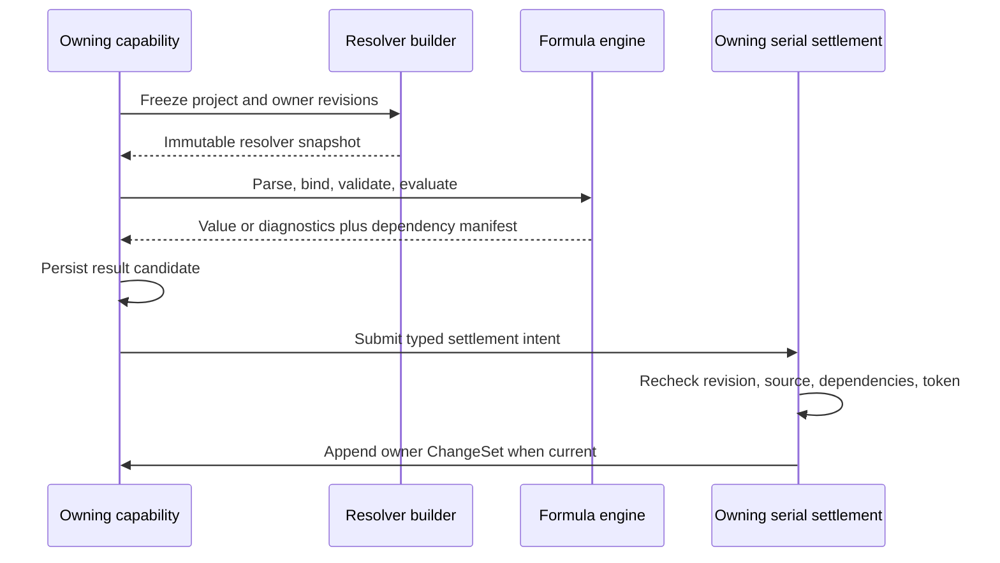

# Formula Capability Reference

Formula is Icarus's deterministic expression language and evaluation engine. It defines the value algebra, grammar, abstract syntax tree, name-resolution contract, dependency output, built-in functions, limits, and diagnostics used by Structured Data, Spreadsheet, Analysis, Document, and Slides.

Formula is a pure capability. An evaluation is completely determined by:

```text
language version
+ normalized expression
+ immutable resolver snapshot
+ deterministic evaluation limits
= typed value or stable diagnostics
```

Authored expressions, stable bindings, dependency graphs, accepted results, revisions, and ChangeSets belong to the capability that owns the expression. This keeps the evaluator reusable and makes every persisted result traceable to an exact source revision and resolver snapshot.

## Authority and integration boundaries

| Concern | Authority |
| --- | --- |
| Grammar, AST, value kinds, operators, built-ins, evaluation, limits, and diagnostics | Formula |
| Project tables, variables, and names | Structured Data |
| Cell formulas, A1 binding, recalculation, and accepted cell values | Spreadsheet |
| Calculated fields, scenarios, and accepted analytical results | Analysis |
| Expressions and live bindings embedded in authored resources | The owning Document, Slides, or Spreadsheet capability |
| Model-assisted expression proposals | The calling capability through the Platform Intelligence interface |
| Source, dependency, result, and revision persistence | The capability that owns the expression |

Formula receives immutable values and stable references through typed ports. It returns immutable values, observed dependencies, and diagnostics. Those contracts are the only coupling required between Formula and its consumers.

## Repository placement

```text
apps/backend/src/
  3-capabilities/
    built-in/
      formula/
        value.ts
        table.ts
        rational.ts
        tokens.ts
        lexer.ts
        ast.ts
        parser.ts
        binder.ts
        resolver.ts
        dependencies.ts
        evaluator.ts
        builtins.ts
        limits.ts
        diagnostics.ts
        wire.ts
        index.ts
        tests/

  4-job-wiring/
    formula/
      registerFormulaEndpointMappings.ts
      createFormulaJobs.ts
```

The engine is an in-process TypeScript library under `3-capabilities`. HTTP request mapping and queue selection remain under `4-job-wiring`. Browser-safe request, value, span, and diagnostic DTOs may be re-exported through `packages/shared`.

## Language version

Every expression and evaluation names an explicit language version:

```typescript
type FormulaLanguageVersion = "formula/v1";

interface FormulaExpression {
  languageVersion: FormulaLanguageVersion;
  source: string;
  sourceDigest: string;
  root: FormulaNode;
}
```

The version fixes lexical rules, precedence, built-in semantics, value encoding, indexing behavior, limits interpretation, and diagnostic codes. A future language change introduces a new version rather than silently changing the meaning of persisted source.

## Value algebra

Formula has exactly eight value kinds:

```typescript
type FormulaValue =
  | NullValue
  | NumberValue
  | TextValue
  | LogicValue
  | ListValue
  | RecordValue
  | TableValue
  | FunctionValue;

interface NullValue {
  kind: "null";
}

interface NumberValue {
  kind: "number";
  value: CanonicalRational;
}

interface TextValue {
  kind: "text";
  value: string;
}

interface LogicValue {
  kind: "logic";
  value: boolean;
}

interface ListValue {
  kind: "list";
  table: FormulaTable;
}

interface RecordValue {
  kind: "record";
  table: FormulaTable;
}

interface TableValue {
  kind: "table";
  table: FormulaTable;
}

interface FunctionValue {
  kind: "function";
  function: FormulaFunction;
}
```

There is no separate object kind. A keyed object is a `record`. A sequence is a `list`. A relation is a `table`. Evaluation failures are `FormulaDiagnostic` values returned by the evaluation result envelope; they never enter the value algebra.

### Exact numbers

Canonical numbers are exact reduced rationals:

```typescript
interface CanonicalRational {
  numerator: string;   // signed base-10 integer
  denominator: string; // positive base-10 integer
}
```

The denominator is always positive. Numerator and denominator share no common factor. Zero is encoded as `{ numerator: "0", denominator: "1" }`. Runtime arithmetic uses `bigint` or an equivalently exact representation.

Examples:

```text
0.1 + 0.2  => 0.3
1 / 8      => 0.125
1 / 3      => 1/3
2 / 4      => 1/2
```

Canonical numeric storage and wire encoding use strings. JavaScript binary floating-point values are adapters' display inputs or outputs, not canonical Formula numbers.

### One recursive rectangular carrier

`list`, `record`, and `table` share one immutable rectangular carrier:

```typescript
interface FormulaTable {
  fields: readonly string[];
  rows: readonly (readonly FormulaValue[])[];
}
```

The carrier obeys these rules:

1. Field names are unique, exact, case-sensitive identifier strings.
2. Every row has exactly `fields.length` cells.
3. Field order and row order are significant and stable.
4. Every cell is a `FormulaValue`, including another list, record, table, or function.
5. Construction recursively validates and freezes or defensively copies all values.

The three structured kinds apply shape constraints:

| Kind | Carrier shape | Meaning |
| --- | --- | --- |
| `list` | Exactly one field named `value`; zero or more rows | Ordered sequence of the cells in the `value` field |
| `record` | Exactly one row; zero or more fields | Ordered keyed value |
| `table` | Zero or more fields; zero or more rows | Ordered rectangular relation |

Because cells are recursive, a table column may contain records, lists, or tables. Rectangularity constrains the outer carrier only. For example, a `projects` table may have a `milestones` column whose individual cells contain nested tables.

### Equality and ordering

Equality is strict and recursive:

- kinds must match;
- rationals compare mathematically after canonical reduction;
- text compares by exact Unicode scalar sequence;
- logic compares by Boolean value;
- structured values compare exact field strings, field order, row order, and cells recursively;
- function equality is admitted only for the same built-in function identity or the same normalized lambda identity and captured immutable environment digest.

Ordering is defined for numbers and text. Comparing incompatible kinds returns `type_error`. Formula performs no implicit text/number/logic coercion.

### Function values

```typescript
type FormulaFunction =
  | {
      kind: "builtin";
      name: string;
      implementationVersion: string;
    }
  | {
      kind: "lambda";
      parameters: readonly string[];
      body: FormulaNode;
      normalizedSource: string;
      capturedBindings: readonly CapturedLexicalBinding[];
      identityDigest: string;
    };
```

Functions are first-class runtime values. Persisted consumer state stores function source and stable captured references rather than an opaque executable closure. Arbitrary wire JSON cannot instantiate a function value.

## Canonical wire encoding

Wire values use tagged JSON:

```typescript
type FormulaWireValue =
  | { kind: "null" }
  | {
      kind: "number";
      numerator: string;
      denominator: string;
    }
  | { kind: "text"; value: string }
  | { kind: "logic"; value: boolean }
  | {
      kind: "list" | "record" | "table";
      fields: string[];
      rows: FormulaWireValue[][];
    };
```

Function values use a separate trusted runtime representation. An API returning a function renders a bounded inspection descriptor containing its kind, parameters, and identity digest.

## Lexical and grammar contract

Source is UTF-8. Tokens and AST nodes carry half-open UTF-8 byte spans:

```typescript
interface SourceSpan {
  startByte: number;
  endByte: number;
}
```

The core `formula/v1` grammar is:

```ebnf
expression         ::= lambda
lambda             ::= ("LAMBDA" | "FUNCTION") "(" parameters "," expression ")"
                     | logical_or
parameters         ::= identifier ("," identifier)*
logical_or         ::= logical_and ("||" logical_and)*
logical_and        ::= equality ("&&" equality)*
equality           ::= comparison (("=" | "!=") comparison)*
comparison         ::= additive (("<" | "<=" | ">" | ">=") additive)*
additive           ::= multiplicative (("+" | "-") multiplicative)*
multiplicative     ::= unary (("*" | "/" | "%") unary)*
unary              ::= ("-" | "+" | "!") unary | power
power              ::= postfix ("^" unary)?
postfix            ::= primary postfix_part*
postfix_part       ::= call
                     | "." identifier
                     | ".{" set_body "}"
                     | "[" index_or_slice "]"
                     | "!"
                     | "?"
call               ::= "(" arguments? ")"
arguments          ::= expression ("," expression)*
index_or_slice     ::= expression
                     | slice_bound? ":" slice_bound?
slice_bound        ::= signed_integer
set_body           ::= field_projection | condition_query
field_projection   ::= identifier ("," identifier)*
condition_query    ::= condition_term ("," condition_term)*
condition_term     ::= condition_or
condition_or       ::= condition_xor ("||" condition_xor)*
condition_xor      ::= condition_and ("^" condition_and)*
condition_and      ::= condition_unary ("&&" condition_unary)*
condition_unary    ::= "!" condition_unary
                     | "(" condition_term ")"
                     | field_condition
field_condition    ::= identifier condition_operator additive
condition_operator ::= "=" | "!=" | "<" | "<=" | ">" | ">="
primary            ::= literal
                     | identifier
                     | list_literal
                     | record_literal
                     | "(" expression ")"
list_literal       ::= "[" arguments? "]"
record_literal     ::= "{" record_fields? "}"
record_fields      ::= identifier ":" expression
                     ("," identifier ":" expression)*
```

The parser consumes the entire source. Global expression precedence runs from postfix operations through right-associative arithmetic power `^`, prefix unary, multiplicative, additive, comparison, equality, `&&`, and finally `||`. Power binds more tightly than prefix unary. Prefix `!` is logical negation and postfix `!` is exact-one promotion; their position makes the meaning unambiguous. Within dot-curly predicates, `^` is logical XOR between condition nodes. Parentheses distinguish predicate XOR operands, while a predicate's right-hand additive expression retains ordinary arithmetic power semantics.

## Abstract syntax tree

The parser produces a closed discriminated union:

```typescript
type FormulaNode =
  | LiteralNode
  | NameNode
  | ListNode
  | RecordNode
  | UnaryNode
  | BinaryNode
  | CallNode
  | LambdaNode
  | FieldAccessNode
  | IndexNode
  | SliceNode
  | SetOperationNode
  | CardinalityPromotionNode;

interface NodeBase {
  id: string;
  span: SourceSpan;
}

interface NameNode extends NodeBase {
  type: "name";
  name: string;
  binding?: BoundFormulaReference;
}

interface FieldAccessNode extends NodeBase {
  type: "field-access";
  target: FormulaNode;
  fieldName: string;
}

interface IndexNode extends NodeBase {
  type: "index";
  target: FormulaNode;
  index: FormulaNode;
}

interface SliceNode extends NodeBase {
  type: "slice";
  target: FormulaNode;
  start?: number;
  end?: number;
}

interface SetOperationNode extends NodeBase {
  type: "set-operation";
  target: FormulaNode;
  body:
    | {
        kind: "field-projection";
        fields: string[];
      }
    | {
        kind: "condition-query";
        condition: FormulaConditionNode;
      };
}

type FormulaConditionNode =
  | {
      type: "field-condition";
      field: string;
      operator: "=" | "!=" | "<" | "<=" | ">" | ">=";
      value: FormulaNode;
      span: SourceSpan;
    }
  | {
      type: "condition-not";
      condition: FormulaConditionNode;
      span: SourceSpan;
    }
  | {
      type: "condition-composition";
      operator: "and" | "or" | "xor";
      conditions: FormulaConditionNode[];
      span: SourceSpan;
    };

interface CardinalityPromotionNode extends NodeBase {
  type: "cardinality-promotion";
  target: FormulaNode;
  mode: "exactly-one" | "zero-or-one";
}
```

Binding enriches `NameNode` instances with stable references while preserving the original source and span.

## Name resolution

Formula binds authored names against an immutable resolver snapshot:

```typescript
interface ProjectScope {
  userId: string;
  projectId: string;
}

type BoundFormulaReference =
  | { kind: "binding"; bindingId: string }
  | {
      kind: "spreadsheet-cell";
      spreadsheetId: string;
      cellId: string;
    }
  | {
      kind: "spreadsheet-range";
      spreadsheetId: string;
      startRowId: string;
      startColumnId: string;
      endRowId: string;
      endColumnId: string;
    }
  | {
      kind: "resource-value";
      resourceKind: "document" | "slides" | "spreadsheet";
      resourceId: string;
      targetId: string;
    }
  | {
      kind: "analysis-result";
      analysisId: string;
      resultId: string;
      outputName: string;
    };

interface ResolvedFormulaBinding {
  reference: BoundFormulaReference;
  displayName: string;
  normalizedLookupKey: string;
  value: FormulaValue;
  ownerRevision: number | string;
  valueDigest: string;
}

interface FormulaResolverSnapshot {
  id: string;
  scope: ProjectScope;
  bindings: ReadonlyMap<string, ResolvedFormulaBinding>;
  snapshotDigest: string;
  createdFrom: readonly ResolverSourceRevision[];
}
```

Resolution order is:

1. lambda parameters and captured lexical bindings;
2. the current set-operation row's fields;
3. the supplied resolver snapshot;
4. built-in function names in call position.

Within a set operation, row fields are therefore field-first relative to project bindings. A row field named `revenue` resolves before a project binding with the same display name. Bound ASTs retain the resolved stable identity so a later rename does not silently retarget the expression.

The resolver snapshot is a frozen value. Resolution may gather values through I/O before evaluation begins, but evaluation itself receives the complete admitted snapshot.

## Structured access and query semantics

### Field access

Field access uses `value.field`:

| Target | Result |
| --- | --- |
| Record | The cell under `field` |
| Table | A list containing the selected field for every row |

An absent field returns `unknown_field`. Table column access is set-based and preserves row order:

```text
people.name
=> ["Ada", "Lin", "Grace"]
```

### Positional indexing

Indexing uses `value[index]`. Indexes are integers and are one-based:

- `1` selects the first position;
- `2` selects the second position;
- `-1` selects the last position;
- `-2` selects the second-to-last position;
- `0` returns `invalid_index`.

For a collection of length `N`, a negative index `i` resolves to `N + i + 1`. The resolved position must be in `[1, N]`; otherwise evaluation returns `index_out_of_range`.

| Target | Indexed position | Result |
| --- | --- | --- |
| List | Row | The row's `value` cell |
| Table | Row | A record with the table's fields and selected row |

Examples:

```text
[10, 20, 30][1]   => 10
[10, 20, 30][-1]  => 30
people[-1]         => the final row as a record
```

Record values use named field access. Applying positional indexing to a record returns `type_error`.

### Half-open slicing

Slicing uses `value[start:end]`. It is one-based, order-preserving, and half-open: the start position is included and the end position is excluded.

Boundary normalization for a collection of length `N` is:

1. omitted start becomes `1`;
2. omitted end becomes `N + 1`;
3. a positive boundary remains one-based;
4. a negative boundary `b` becomes `N + b + 1`;
5. normalized boundaries are clamped to `[1, N + 1]`;
6. zero is an invalid explicit boundary;
7. an end at or before the start produces an empty result.

Examples for `[10, 20, 30, 40, 50]`:

```text
values[1:3]    => [10, 20]
values[2:]     => [20, 30, 40, 50]
values[:-1]    => [10, 20, 30, 40]
values[-3:-1]  => [30, 40]
values[-1:]    => [50]
values[20:30]  => []
```

Slicing a list returns a list and slicing a table returns a table containing the selected rows. Applying a slice to a record returns `type_error`. Slice steps are outside `formula/v1`; composition expresses additional transformations explicitly.

### Dot-curly set operations

`target.{...}` has exactly two forms over a record or table: field projection and Boolean condition query.

#### Field projection

A comma-separated list of bare field names selects fields:

```text
people.{name, department, score}
```

Projection preserves the target kind: record input returns a record, and table input returns a table. Output fields follow the requested projection order; table row order, cell values, and nested cell structure are preserved. A single field over a table produces a one-column table:

```text
people.{name}
```

#### Boolean condition query

A condition query evaluates against every row and returns a table containing the rows for which the condition is true. A record is treated as a one-row input and therefore yields a zero-row or one-row table:

```text
people.{department = "Research"}
```

Equality uses a single `=`. A field condition has the form:

```text
field operator expression
```

The admitted operators are `=`, `!=`, `<`, `<=`, `>`, and `>=`. The left operand is one bare field identifier resolved from the current row. Names in the right-hand additive expression also use field-first resolution before the supplied project resolver.

Conditions compose with:

| Syntax | Meaning |
| --- | --- |
| `!condition` | Logical NOT |
| `left && right` | Logical AND |
| `left ^ right` | Logical XOR |
| `left || right` | Logical OR |
| `condition, condition` | Outer condition-list AND |

Precedence inside a condition is prefix `!`, then `&&`, then `^`, then `||`. The outer comma separates complete condition terms and combines them with AND.

```text
people.{
  department = "Research" || department = "Engineering",
  active = true,
  !(status = "archived"),
  (priority = "high") ^ (score >= threshold ^ 2)
}
```

The final term uses predicate XOR between two parenthesized conditions. The `threshold ^ 2` expression on the right side of the second leaf uses ordinary right-associative arithmetic power.

Projection and query operations compose from left to right:

```text
people
  .{department = "Research", active = true}
  .{name, score}
  .{score >= 80}
```

The first operation filters the source table, the second projects fields, and the third filters the projected table. A dot-curly body is classified syntactically: a list of field references is a projection; a list containing field conditions is a condition query. Mixing bare projected fields and conditions in one body returns `parse_error`.

Every intermediate table counts against row, cell, step, and output limits.

### Cardinality promotion

Postfix `!` promotes a table that contains exactly one row:

| Target | Cardinality one result |
| --- | --- |
| Table | The single row as a record |
| Record | The same record |

Zero items or more than one item returns `cardinality_error`.

Postfix `?` promotes a table that contains zero or one row:

| Cardinality | Result |
| --- | --- |
| Zero | `null` |
| One | The single row as a record |
| More than one | `cardinality_error` |

Applied to a record, both `!` and `?` return that record unchanged. Applying either operator to another kind returns `type_error`.

This makes exact lookup intent explicit:

```text
people.{id = target_id}!
```

The expression returns one person record only when the predicate matches exactly one row.

```text
people.{external_id = candidate_id}?
```

The expression returns `null` for no match, a record for one match, and `cardinality_error` for an ambiguous match.

### Postfix composition

Field access, indexing, slicing, set operations, calls, and cardinality promotion share postfix precedence and compose left to right:

```text
departments
  .{name = "Research"}!
  .members
  .{active = true}
  .{name}
  [-3:]
```

This:

1. filters departments;
2. requires exactly one department;
3. reads its nested `members` table;
4. filters active members;
5. projects the `name` column as a one-column table;
6. returns the final three rows.

## Structured constructors and dimensions

### `TABLE`

`TABLE` accepts either variadic records or one list whose elements are records:

```text
TABLE(
  {id: 1, name: "Ada"},
  {id: 2, name: "Lin"}
)

TABLE([
  {id: 1, name: "Ada"},
  {id: 2, name: "Lin"}
])
```

The first record establishes output field order. Every later record must contain the same exact, case-sensitive field set; its values are realigned to the first record's order. Each record becomes one table row, and nested structured field values remain intact. A list containing another value kind or records with a different field set returns `invalid_table`.

`TABLE()` and `TABLE([])` produce the canonical zero-row, zero-column table.

### `ROWS`

`ROWS(value)` returns the exact integer row dimension of any Formula value. Lists, records, and tables use their carrier row count. Scalars and functions have conceptual shape `1 × 1`:

```text
ROWS([10, 20, 30])                => 3
ROWS({name: "Ada", score: 100})   => 1
ROWS(TABLE({id: 1}, {id: 2}))     => 2
ROWS(42)                           => 1
```

### `COLUMNS`

`COLUMNS(value)` returns the exact integer field dimension of any Formula value. Lists have one field, records and tables use their carrier field count, and scalars and functions have conceptual shape `1 × 1`:

```text
COLUMNS([10, 20, 30])               => 1
COLUMNS({name: "Ada", score: 100})  => 2
COLUMNS(TABLE({id: 1, name: "Ada"})) => 2
COLUMNS(42)                           => 1
```

Both results are canonical rational numbers with denominator `1`.

## Operators and built-ins

### Operators

| Category | Operators | Semantics |
| --- | --- | --- |
| Arithmetic | `+`, `-`, `*`, `/`, `%`, `^` | Exact rational arithmetic with right-associative power |
| Unary | `+`, `-` | Exact rational identity or negation |
| Logic | `!`, `&&`, `||` | NOT, AND, and OR; AND and OR short-circuit |
| Equality | `=`, `!=` | Strict recursive equality |
| Comparison | `<`, `<=`, `>`, `>=` | Compatible numbers or text |
| Postfix | `.field`, `.{...}`, `[i]`, `[a:b]`, `!`, `?` | Structured access, query, and promotion |

Within a dot-curly condition query, `^` joins condition nodes as logical XOR. Within ordinary expressions, including a condition leaf's right-hand additive expression, `^` is arithmetic power.

`IF(condition, whenTrue, whenFalse)` evaluates only the selected branch.

### Core built-ins

| Built-in | Contract |
| --- | --- |
| `IF(condition, whenTrue, whenFalse)` | Lazy conditional |
| `SUM(values...)` | Exact sum of numbers or flattened list/table numeric cells |
| `PRODUCT(values...)` | Exact product |
| `MIN(values...)`, `MAX(values...)` | Minimum or maximum compatible values |
| `AVG(values...)`, `AVERAGE(values...)` | Exact arithmetic mean |
| `COUNT(value)` | Number of list elements, record fields, or table rows |
| `ABS(number)` | Absolute exact number |
| `MOD(a, b)` | Exact integer-compatible remainder |
| `POWER(a, b)`, `POW(a, b)` | Bounded exact exponentiation for admitted exponents |
| `ROUND(number, places?)` | Exact decimal rounding under the versioned rounding rule |
| `FLOOR(number)`, `CEIL(number)`, `CEILING(number)` | Exact integral bounds |
| `TABLE(records...)`, `TABLE(recordList)` | Construct a table from records |
| `ROWS(value)` | Exact integer row dimension |
| `COLUMNS(value)` | Exact integer field dimension |
| `LAMBDA(parameters..., expression)` | Lexically scoped function |
| `FUNCTION(parameters..., expression)` | Alias of `LAMBDA` |

Aggregate functions preserve deterministic row order for traversal and return `type_error` when admitted cells contain incompatible kinds. Function aliases compile to the same built-in identity.

## Dependency and resolver contract

Formula distinguishes symbolic dependencies discovered from source from stable dependencies observed during binding and evaluation:

```typescript
interface SymbolicDependency {
  name: string;
  span: SourceSpan;
}

interface ObservedDependency {
  reference: BoundFormulaReference;
  ownerRevision: number | string;
  valueDigest: string;
  access:
    | { kind: "value" }
    | { kind: "field"; fieldName: string }
    | { kind: "index"; index: number }
    | { kind: "slice"; start?: number; end?: number }
    | { kind: "set-operation"; expressionDigest: string };
}

interface FormulaDependencyResult {
  symbolic: SymbolicDependency[];
  bound: BoundFormulaReference[];
  observed?: ObservedDependency[];
  dependencyDigest: string;
}
```

Parsing returns symbolic names. Binding resolves those names to stable identities. Evaluation reports the exact references and owner revisions actually observed, including lazy-branch behavior. Consumers use that manifest to construct reverse dependency projections and to verify result freshness before acceptance.

Spreadsheet converts authored A1 and range syntax into stable row, column, cell, and range identities before Formula binding. Formula therefore evaluates stable references even when authored source retains familiar A1 text for display.

## Public operations

```typescript
interface ParseFormulaRequest {
  source: string;
  languageVersion: FormulaLanguageVersion;
  limits?: Partial<FormulaLimits>;
}

interface ValidateFormulaRequest {
  expression: FormulaExpression;
  declarations: FormulaDeclarations;
  expectedKind?: FormulaValue["kind"];
  limits?: Partial<FormulaLimits>;
}

interface EvaluateFormulaRequest {
  expression: FormulaExpression;
  resolver: FormulaResolverSnapshot;
  limits?: Partial<FormulaLimits>;
}

interface FormulaEvaluation {
  value: FormulaValue;
  observedDependencies: ObservedDependency[];
  dependencyDigest: string;
  evaluationDigest: string;
  languageVersion: FormulaLanguageVersion;
  evaluatorVersion: string;
  steps: number;
}

type FormulaResult<T> =
  | { ok: true; value: T }
  | { ok: false; diagnostics: FormulaDiagnostic[] };
```

| Request type | Result |
| --- | --- |
| `formula.parse.v1` | Versioned AST and source digest, or syntax diagnostics |
| `formula.validate.v1` | Type, shape, binding, arity, and limit validation |
| `formula.dependencies.v1` | Symbolic, bound, or observed dependency manifest |
| `formula.evaluate.v1` | Typed value, observed dependencies, and evaluation digest |
| `formula.explain.v1` | Bounded public evaluation trace based on AST operations and dependencies |

The in-process `FormulaEngine` exposes the same contracts:

```typescript
export interface FormulaEngine {
  parse(request: ParseFormulaRequest): FormulaResult<FormulaExpression>;
  validate(
    request: ValidateFormulaRequest,
  ): FormulaResult<FormulaValidation>;
  dependencies(
    request: FormulaDependencyRequest,
  ): FormulaResult<FormulaDependencyResult>;
  evaluate(
    request: EvaluateFormulaRequest,
  ): FormulaResult<FormulaEvaluation>;
  explain(
    request: ExplainFormulaRequest,
  ): FormulaResult<FormulaExplanation>;
}
```

## Request-to-job mapping

Formula endpoint jobs are bounded concurrent inline work:

| Request | Queue | Response | Job result |
| --- | --- | --- | --- |
| Parse | Concurrent | Inline | AST or diagnostics |
| Validate | Concurrent | Inline | Validation report |
| Extract dependencies | Concurrent | Inline | Dependency manifest |
| Evaluate | Concurrent | Inline | Value or diagnostics |
| Explain | Concurrent | Inline | Bounded public explanation |

```typescript
const formulaJobFactories: EndpointJobFactoryMap = {
  "formula.parse.v1": createConcurrentInlineJob(handleParse),
  "formula.validate.v1": createConcurrentInlineJob(handleValidate),
  "formula.dependencies.v1": createConcurrentInlineJob(handleDependencies),
  "formula.evaluate.v1": createConcurrentInlineJob(handleEvaluate),
  "formula.explain.v1": createConcurrentInlineJob(handleExplain),
};
```

Long-running recalculation belongs to the consumer. The consumer freezes inputs, performs bounded Formula evaluations on the concurrent path, persists the result candidate, and emits a typed intent for a later serial result-application job.

## Consumer-owned persistence and ChangeSets

Formula's migration set is empty because its canonical artifact is a versioned implementation, not project state. Consumers persist Formula-bearing state in their own capability tables:

```typescript
interface OwnedFormulaSource {
  ownerKind: "spreadsheet-cell" | "analysis-field" | "document-binding" | "slide-binding";
  ownerId: string;
  userId: string;
  projectId: string;
  source: string;
  languageVersion: FormulaLanguageVersion;
  sourceDigest: string;
  boundReferences: BoundFormulaReference[];
  bindingDigest: string;
  sourceRevision: number;
}

interface OwnedFormulaResult {
  ownerId: string;
  sourceRevision: number;
  resolverSnapshotDigest: string;
  dependencyDigest: string;
  evaluationDigest: string;
  evaluatorVersion: string;
  value: FormulaValue;
  diagnostics: FormulaDiagnostic[];
  generationToken: string;
}
```

The owning capability records source edits as ordinary typed operations in its Base and ChangeSet model. Result acceptance uses compare-and-swap across:

1. owner revision;
2. formula source revision or digest;
3. resolver snapshot and dependency versions;
4. generation token;
5. evaluator and language versions.

An accepted result is appended through the owner's serial ChangeSet path. A stale result remains an inspectable compute attempt or is discarded according to the owner's retention policy. Reverse dependency rows, compiled ASTs, dirty closures, and evaluation caches are consumer-owned rebuildable projections.

The recommended cache keys are:

```text
AST cache
  languageVersion + sourceDigest + parserPolicyVersion

evaluation cache
  AST digest
  + resolverSnapshotDigest
  + limitsVersion
  + evaluatorVersion
```

Cache entries are immutable and bounded. Cache eviction changes performance while preserving evaluation semantics.

## Limits

```typescript
interface FormulaLimits {
  maxSourceBytes: number;
  maxTokens: number;
  maxNodes: number;
  maxDepth: number;
  maxSteps: number;
  maxCallDepth: number;
  maxFields: number;
  maxRows: number;
  maxCells: number;
  maxOutputBytes: number;
  maxIntegerBits: number;
  maxPowerMagnitude: number;
  maxRoundingPlaces: number;
}
```

Limits apply during parsing, binding, construction, query materialization, function calls, arithmetic, and wire serialization. Identical inputs and limit versions stop at the same boundary.

## Diagnostics

```typescript
type FormulaDiagnosticCode =
  | "parse_error"
  | "unknown_identifier"
  | "unknown_function"
  | "wrong_arity"
  | "type_error"
  | "divide_by_zero"
  | "numeric_error"
  | "invalid_index"
  | "index_out_of_range"
  | "unknown_field"
  | "invalid_table"
  | "cardinality_error"
  | "cycle_error"
  | "limit_exceeded"
  | "unsupported_version"
  | "stale_binding"
  | "invalid_resolver_snapshot";

interface FormulaDiagnostic {
  code: FormulaDiagnosticCode;
  message: string;
  span?: SourceSpan;
  path?: string[];
  details?: Readonly<Record<string, string | number | boolean>>;
}
```

Messages are human-readable. Codes, spans, and details are stable machine contracts. Diagnostics remain separate from `FormulaValue`, allowing consumers to preserve a last-good value while showing the current failure.

## Evaluation flow



## Evaluation algorithm

For each request the engine:

1. validates language and limit versions;
2. parses the entire UTF-8 source into a spanned AST;
3. binds symbolic names to stable immutable references;
4. validates operator, arity, kind, and structured-shape requirements;
5. evaluates with lexical scopes and deterministic step accounting;
6. records references actually observed;
7. validates the recursively structured output;
8. computes dependency and evaluation digests;
9. returns either one typed value or stable diagnostics.

## Governing invariants

1. Formula evaluation is a pure function of language version, expression, resolver snapshot, and limits.
2. The value algebra contains exactly null, number, text, logic, list, record, table, and function.
3. Lists, records, and tables use the same recursive immutable rectangular carrier.
4. Every structured cell may itself contain a structured value.
5. Canonical numbers are exact reduced rationals.
6. Diagnostics remain outside the value algebra.
7. Positive indexes are one-based, negative indexes address from the end, and zero is invalid.
8. Slices are one-based, half-open, boundary-clamped, and order-preserving.
9. Formula table fields are ordered, exact, case-sensitive strings.
10. Dot-curly operations are field projections or Boolean condition queries with field-first row resolution.
11. Condition equality uses `=`, condition composition uses comma/`&&`/`^`/`||`, and prefix `!` negates.
12. Postfix `!` admits exactly one table row and postfix `?` admits zero or one; both preserve records.
13. Bound names retain stable reference identities through display-name changes.
14. Observed dependency manifests include exact owner revisions and value digests.
15. Consumers own source, dependency, result, ChangeSet, and revision persistence.
16. Lazy branches record only dependencies they actually observe.
17. Cache hits and misses return byte-equivalent public results.

## Acceptance criteria

- All eight value kinds round-trip through trusted canonical encoding where the kind is persistable.
- Nested list, record, and table cells preserve their complete recursive shape.
- `0.1 + 0.2` evaluates exactly to `0.3`.
- Equivalent reduced rationals compare equal.
- `values[1]`, `values[-1]`, `values[1:3]`, `values[:-1]`, and `values[-3:-1]` follow the specified one-based rules.
- Record field access is name-based; table indexing returns a record.
- Record indexing and slicing return `type_error`.
- Table field access returns a list and preserves row order.
- Dot-curly field lists preserve record/table kind and project exact fields in requested order.
- Dot-curly condition queries filter rows using `=`, `!=`, comparisons, prefix `!`, comma, `&&`, `^`, and `||`.
- Global `^` is right-associative arithmetic power; condition-level `^` is predicate XOR.
- `table.{ predicate }!` returns a record only for exact cardinality one.
- `table.{ predicate }?` returns null, one record, or `cardinality_error` according to cardinality.
- Postfix `!` and `?` return a record unchanged and reject other value kinds.
- `TABLE` accepts variadic records or one list of records, uses the first record's order, and realigns later records with the same field set.
- `TABLE()` and `TABLE([])` return a canonical zero-by-zero table.
- `ROWS` and `COLUMNS` return exact integer dimensions for every Formula value, including conceptual one-by-one scalar and function shapes.
- Field-first row resolution is stable when a project binding shares a field name.
- Malformed source, trailing input, unsupported versions, and exceeded limits fail with stable diagnostics.
- Identical source, resolver snapshot, limits, and evaluator version produce byte-equivalent results and dependency manifests.
- Consumer result settlement rejects a changed source, owner revision, dependency version, or generation token.
- Formula's capability migration set remains empty; durable expression state is visible in the owning capability's Base and ChangeSets.

## References

- [Product — Icarus Complete Product Definition](https://app.notion.com/p/3aeb6410e502810ba9c0c26442d5255a)
- [Architecture — Icarus Runtime Foundation & Repository Boundaries](https://app.notion.com/p/3adb6410e50281e09d83ed36daacf8d8)
- [Model — Icarus Request, Job & Dual-Queue Runtime](https://app.notion.com/p/3adb6410e50281c498f4d7f6a621eba2)
- [Taurus Omega — Formula Capability](https://app.notion.com/p/3a6b6410e50281aa9805c90b89c8c5f5)
- [Taurus Omega — Formula Evaluation & Query Semantics](https://app.notion.com/p/3a6b6410e5028148a0bffc4ea9cabad0)
- [Taurus Omega — Formula Value & Table Model](https://app.notion.com/p/3a6b6410e50281d3aff6cb92f54476cd)
- [Taurus Omega — Formula Name Manager](https://app.notion.com/p/3a6b6410e50281299d19d09f40660dae)
- [Taurus Omega — Formula–Sheet Alignment Contract](https://app.notion.com/p/3a6b6410e50281d98794f33a35b90139)
