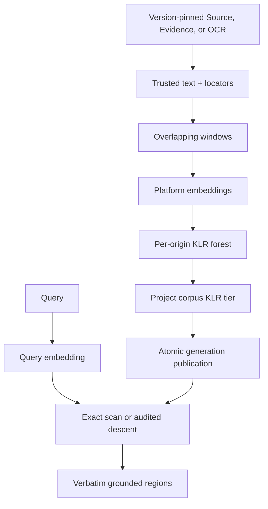

# Capability — Knowledge

Knowledge owns the rebuildable Text retrieval lattice over eligible Source Versions, admitted Evidence, and literal OCR text. It embeds and retrieves exact grounded spans. Questions owns Answers, Sources and Evidence retain canonical authority, Research coordinates web investigation, and provider routing lives behind Platform Intelligence.

## What “derived index” means here

In this capability:

- **Canonical truth:** immutable Source Versions and canonical Evidence.
- **Rebuildable Knowledge projection:** translated text, windows, embeddings, lattice nodes, memberships, and active corpus generations.
- **SQL indexes:** ordinary SQLite B-tree indexes used to find those rows efficiently.

The Knowledge lattice is the principal derived projection. Canonical Source Versions, Evidence, citations, Questions, and Answers are sufficient to rebuild it.

`knowledge_level_indexes` are persisted KLR traversal records: ordered IDs for a lattice level and generation. `CREATE INDEX` statements are relational query indexes.

## Purpose and boundary

Knowledge answers grounded retrieval queries:

```plain text
query → query embedding → lattice/exact retrieval → verbatim regions + stable locators
```

Knowledge owns:

- deterministic translation outputs admitted to the Text lattice;
- sentence-aware overlapping windows;
- embedding vectors and exact vector-space identity;
- per-origin KLR forests;
- the project corpus KLR tier;
- active projection and corpus generation pointers;
- exact-scan and directed-descent retrieval;
- projection/build attempts, usage, and diagnostics.

Sources and editor capabilities own original bytes and editable Resource revisions. Evidence owns canonical review state. Media owns generated descriptors and the Media lattice. Structured Data owns table descriptors. Research and Questions own investigation and Answer state. Platform Intelligence owns provider credentials and model routes; Platform Web Retrieval owns external retrieval.

Literal OCR text enters with OCR provenance and image-region locators. Generated image descriptions remain in the Media Descriptor Projection.

**Closed admission law:** Knowledge origins are `(1)` an immutable Source Version, `(2)` an admitted Evidence revision, and `(3)` a literal Media OCR result. Native Document, Slides, and Spreadsheet content is exposed by its editor and registered by Sources as a typed `native_resource` Source Version. Structured Data and Analysis material enters through a Source Version or an admitted grounded Evidence record.

## Runtime placement

```plain text
apps/backend/src/3-capabilities/knowledge/
  domain/
    model.ts
    windowing.ts
    lattice.ts
    retrieval.ts
  application/
    translators.ts
    service.ts
  ports/
    repository.ts
    originReaders.ts
    embedder.ts
  persistence/
    migrations/
      001-knowledge.ts
    sqliteKnowledgeRepository.ts
  index.ts

apps/backend/src/4-job-wiring/knowledge/
  registerKnowledgeEndpointMappings.ts
  knowledgeJobFactories.ts
  knowledgeSourceAdapters.ts
```

Knowledge is composed into the backend. KLR geometry is pure TypeScript. Knowledge owns its repository port, migrations, and `SqliteKnowledgeRepository`; `1-init` constructs the adapter with the Platform Database and injects it. Embedding calls use `apps/backend/src/0-platform/intelligence` through the `Embedder` port. Lattice execution is abstracted behind a bounded executor port so in-process and worker-backed implementations preserve the capability contract.

## Public operations

| Operation | Effect |
|---|---|
| `knowledge.project-source` | Translates one immutable Source Version and atomically publishes its new Text projection plus a coherent corpus generation. |
| `knowledge.project-evidence` | Projects one admitted Evidence revision. |
| `knowledge.project-ocr` | Projects literal OCR text supplied by Media. |
| `knowledge.remove-origin` | Removes an origin projection and publishes a corpus from the remaining active origins. |
| `knowledge.rebuild-project` | Recreates all eligible projections and the corpus using an explicit projector/policy/vector identity. |
| `knowledge.search` | Returns exact grounded regions and locators. |
| `knowledge.status` | Reports projection heads, failures, active vector identity, and active corpus generation. |
| `knowledge.inspect-projection` | Returns projection metadata, origin locators, and diagnostics. |

Source, Evidence, and Media publication hooks schedule these operations after eligible canonical state changes.

## Request-to-job mapping

| Request | Queue | Response | Reason |
|---|---|---|---|
| project source/evidence/OCR | `concurrent` | `deferred` | Translation, embedding, and lattice construction are bounded independent work. |
| remove origin | `concurrent` | `deferred` | Requires a coherent corpus rebuild. |
| rebuild project | `concurrent` | `deferred` | Expensive derived rebuild; overflow waits in the concurrent FIFO. |
| search | `concurrent` | `inline` | Independent query embedding and read traversal. |
| status/inspect | `concurrent` | `inline` | Read-only. |

Derived jobs build off-transaction, then use a short compare-and-swap SQLite transaction to publish one complete generation. Concurrent builders preserve corpus coherence: a stale builder retries against the new head or finishes as superseded.

## Projection and generation model

Knowledge uses immutable generations and atomic head pointers:

1. Read and pin an exact Source/Evidence/OCR revision.
2. Produce one complete trusted text snapshot plus locators.
3. Split it into overlapping windows.
4. Reuse embeddings for byte-identical windows when vector identity matches.
5. Embed changed windows through the platform `Embedder`.
6. Validate cardinality, provider, model, dimensions, finite values, and normalization.
7. Build the per-origin KLR forest.
8. Build a candidate project corpus tier from every active origin frontier.
9. In one transaction, confirm input heads, insert the immutable generation, and move active projection/corpus pointers.
10. A failed step retains the prior coherent heads.

A build key is:

```plain text
origin kind + origin ID + origin revision/hash
+ translator version + window policy version
+ resolved embedding provider/model/dimensions
+ KLR policy version
```

An identical completed build key reuses the completed generation and embeddings.

## Core TypeScript model

```typescript
interface Scope {
  userId: string;
  projectId: string;
}

type OriginLocator =
  | { kind: "source_text"; sourceVersionId: string; start: number; end: number }
  | { kind: "source_page"; sourceVersionId: string; page: number }
  | { kind: "evidence"; evidenceId: string; revision: number }
  | {
      kind: "media_ocr_region";
      ocrResultId: string;
      x: number;
      y: number;
      width: number;
      height: number;
    };

type KnowledgeOriginRef =
  | { kind: "source"; sourceVersionId: string; revision: string; hash: string }
  | { kind: "evidence"; evidenceId: string; revision: number; hash: string }
  | { kind: "media_ocr"; ocrResultId: string; revision: string; hash: string };

interface KnowledgeProjectionHead {
  projectionId: string;
  userId: string;
  projectId: string;
  origin: KnowledgeOriginRef;
  currentGenerationId: string | null;
  desiredOriginRevision: string;
  status: "pending" | "building" | "ready" | "failed" | "superseded";
  updatedAt: string;
}

interface KnowledgeWindow {
  windowId: string;
  projectionId: string;
  generationId: string;
  ordinal: number;
  range: { start: number; end: number };
  text: string;
  textHash: string;
  locators: readonly OriginLocator[];
  vectorId: string;
}

interface LatticeNode {
  nodeId: string;
  tier: "origin" | "corpus";
  level: number;
  centroidVectorId: string;
  members: readonly (
    | { kind: "window"; windowId: string }
    | { kind: "node"; nodeId: string }
  )[];
  cohesion: number;
}

interface KnowledgeBuildIdentity {
  translatorVersion: string;
  windowPolicyVersion: string;
  latticePolicyVersion: string;
  embedding: {
    provider: string;
    model: string;
    dimensions: number;
  };
}

interface KnowledgeSearchRequest {
  scope: Scope;
  query: string;
  originKinds?: readonly KnowledgeOriginRef["kind"][];
  sourceVersionIds?: readonly string[];
  limit: number;
  minimumScore?: number;
  mode: "exact_scan" | "directed_descent";
}

interface KnowledgeMatch {
  score: number;
  origin: KnowledgeOriginRef;
  text: string;
  range: { start: number; end: number };
  locators: readonly OriginLocator[];
  auditPath: readonly string[];
}

interface KnowledgeSearcher {
  search(request: KnowledgeSearchRequest): Promise<readonly KnowledgeMatch[]>;
}
```

## KLR model

Windowing is sentence-aware, targets approximately 4,000 runes, and carries approximately 400 trailing runes across boundaries. Every window records half-open offsets and stable origin locators.

At each KLR level:

1. validate and unit-normalize vectors;
2. compute the bounded full pairwise cosine matrix;
3. choose a level-relative threshold with a configured floor;
4. form the threshold graph;
5. find bounded maximal cliques of size at least two;
6. create one normalized centroid node per clique;
7. allow overlapping membership, producing a DAG;
8. carry artifacts outside every clique upward as orphans;
9. stop at the first level where the clique set is empty.

An origin ends as a forest of roots and orphans. The corpus tier applies the same rule to the union of origin frontiers.

Exact scan is the recall oracle and default search mode. Directed descent is enabled with an exact-scan audit that measures missed relevant windows.

## Capability tables

All tables below persist the rebuildable Knowledge projection. Source Versions and admitted Evidence remain canonical with their owning capabilities; literal OCR remains a pinned Media projection admitted through the OCR reader port.

```sql
CREATE TABLE knowledge_projection_heads (
  projection_id TEXT PRIMARY KEY,
  user_id TEXT NOT NULL,
  project_id TEXT NOT NULL,
  origin_kind TEXT NOT NULL CHECK (origin_kind IN ('source', 'evidence', 'media_ocr')),
  origin_id TEXT NOT NULL,
  current_generation_id TEXT,
  desired_origin_revision TEXT NOT NULL,
  status TEXT NOT NULL CHECK (
    status IN ('pending', 'building', 'ready', 'failed', 'superseded')
  ),
  updated_at TEXT NOT NULL,
  UNIQUE (user_id, project_id, projection_id),
  FOREIGN KEY (user_id, project_id, projection_id, current_generation_id)
    REFERENCES knowledge_projection_generations(
      user_id, project_id, projection_id, generation_id
    )
);

CREATE TABLE knowledge_projection_generations (
  generation_id TEXT PRIMARY KEY,
  user_id TEXT NOT NULL,
  project_id TEXT NOT NULL,
  projection_id TEXT NOT NULL,
  origin_revision TEXT NOT NULL,
  origin_hash TEXT NOT NULL,
  translator_version TEXT NOT NULL,
  window_policy_version TEXT NOT NULL,
  lattice_policy_version TEXT NOT NULL,
  provider TEXT NOT NULL,
  model TEXT NOT NULL,
  dimensions INTEGER NOT NULL,
  text_bytes INTEGER NOT NULL,
  window_count INTEGER NOT NULL,
  created_at TEXT NOT NULL,
  UNIQUE (user_id, project_id, projection_id, generation_id),
  FOREIGN KEY (user_id, project_id, projection_id)
    REFERENCES knowledge_projection_heads(user_id, project_id, projection_id)
);

CREATE TABLE knowledge_project_heads (
  user_id TEXT NOT NULL,
  project_id TEXT NOT NULL,
  current_corpus_generation_id TEXT,
  revision INTEGER NOT NULL CHECK (revision >= 1),
  updated_at TEXT NOT NULL,
  PRIMARY KEY (user_id, project_id),
  FOREIGN KEY (user_id, project_id, current_corpus_generation_id)
    REFERENCES knowledge_corpus_generations(
      user_id, project_id, corpus_generation_id
    )
);

CREATE TABLE knowledge_corpus_generations (
  corpus_generation_id TEXT PRIMARY KEY,
  user_id TEXT NOT NULL,
  project_id TEXT NOT NULL,
  base_head_revision INTEGER NOT NULL,
  provider TEXT NOT NULL,
  model TEXT NOT NULL,
  dimensions INTEGER NOT NULL,
  lattice_policy_version TEXT NOT NULL,
  created_at TEXT NOT NULL,
  UNIQUE (user_id, project_id, corpus_generation_id)
);

CREATE TABLE knowledge_corpus_members (
  user_id TEXT NOT NULL,
  project_id TEXT NOT NULL,
  corpus_generation_id TEXT NOT NULL,
  projection_id TEXT NOT NULL,
  projection_generation_id TEXT NOT NULL,
  PRIMARY KEY (user_id, project_id, corpus_generation_id, projection_id),
  FOREIGN KEY (user_id, project_id, corpus_generation_id)
    REFERENCES knowledge_corpus_generations(
      user_id, project_id, corpus_generation_id
    ),
  FOREIGN KEY (user_id, project_id, projection_id)
    REFERENCES knowledge_projection_heads(user_id, project_id, projection_id),
  FOREIGN KEY (
    user_id, project_id, projection_id, projection_generation_id
  ) REFERENCES knowledge_projection_generations(
    user_id, project_id, projection_id, generation_id
  )
);

CREATE TABLE knowledge_vectors (
  vector_id TEXT PRIMARY KEY,
  user_id TEXT NOT NULL,
  project_id TEXT NOT NULL,
  provider TEXT NOT NULL,
  model TEXT NOT NULL,
  dimensions INTEGER NOT NULL,
  content_hash TEXT NOT NULL,
  vector_blob BLOB NOT NULL,
  created_at TEXT NOT NULL,
  UNIQUE (user_id, project_id, vector_id)
);

CREATE TABLE knowledge_windows (
  window_id TEXT PRIMARY KEY,
  user_id TEXT NOT NULL,
  project_id TEXT NOT NULL,
  projection_id TEXT NOT NULL,
  generation_id TEXT NOT NULL,
  ordinal INTEGER NOT NULL,
  start_offset INTEGER NOT NULL,
  end_offset INTEGER NOT NULL,
  text TEXT NOT NULL,
  text_hash TEXT NOT NULL,
  locators_json TEXT NOT NULL,
  vector_id TEXT NOT NULL,
  UNIQUE (user_id, project_id, projection_id, generation_id, window_id),
  FOREIGN KEY (user_id, project_id, projection_id, generation_id)
    REFERENCES knowledge_projection_generations(
      user_id, project_id, projection_id, generation_id
    ),
  FOREIGN KEY (user_id, project_id, vector_id)
    REFERENCES knowledge_vectors(user_id, project_id, vector_id)
);

CREATE TABLE knowledge_lattice_nodes (
  node_id TEXT PRIMARY KEY,
  user_id TEXT NOT NULL,
  project_id TEXT NOT NULL,
  corpus_generation_id TEXT NOT NULL,
  projection_id TEXT,
  projection_generation_id TEXT,
  tier TEXT NOT NULL CHECK (tier IN ('origin', 'corpus')),
  level INTEGER NOT NULL,
  centroid_vector_id TEXT NOT NULL,
  member_count INTEGER NOT NULL,
  cohesion REAL NOT NULL,
  CHECK (
    (
      tier = 'origin'
      AND projection_id IS NOT NULL
      AND projection_generation_id IS NOT NULL
    )
    OR (
      tier = 'corpus'
      AND projection_id IS NULL
      AND projection_generation_id IS NULL
    )
  ),
  UNIQUE (user_id, project_id, corpus_generation_id, node_id),
  FOREIGN KEY (user_id, project_id, corpus_generation_id)
    REFERENCES knowledge_corpus_generations(
      user_id, project_id, corpus_generation_id
    ),
  FOREIGN KEY (
    user_id, project_id, projection_id, projection_generation_id
  ) REFERENCES knowledge_projection_generations(
    user_id, project_id, projection_id, generation_id
  ),
  FOREIGN KEY (user_id, project_id, centroid_vector_id)
    REFERENCES knowledge_vectors(user_id, project_id, vector_id)
);

CREATE TABLE knowledge_lattice_memberships (
  membership_id TEXT PRIMARY KEY,
  user_id TEXT NOT NULL,
  project_id TEXT NOT NULL,
  corpus_generation_id TEXT NOT NULL,
  parent_node_id TEXT NOT NULL,
  member_kind TEXT NOT NULL CHECK (member_kind IN ('window', 'node')),
  member_id TEXT NOT NULL,
  ordinal INTEGER NOT NULL,
  FOREIGN KEY (user_id, project_id, corpus_generation_id)
    REFERENCES knowledge_corpus_generations(
      user_id, project_id, corpus_generation_id
    ),
  FOREIGN KEY (
    user_id, project_id, corpus_generation_id, parent_node_id
  ) REFERENCES knowledge_lattice_nodes(
    user_id, project_id, corpus_generation_id, node_id
  )
);

CREATE TABLE knowledge_level_indexes (
  user_id TEXT NOT NULL,
  project_id TEXT NOT NULL,
  corpus_generation_id TEXT NOT NULL,
  tier TEXT NOT NULL CHECK (tier IN ('origin', 'corpus')),
  projection_generation_id TEXT NOT NULL DEFAULT '',
  level INTEGER NOT NULL,
  ordinal INTEGER NOT NULL,
  artifact_kind TEXT NOT NULL CHECK (artifact_kind IN ('window', 'node')),
  artifact_id TEXT NOT NULL,
  CHECK (
    (tier = 'origin' AND projection_generation_id <> '')
    OR (tier = 'corpus' AND projection_generation_id = '')
  ),
  PRIMARY KEY (
    user_id, project_id, corpus_generation_id,
    tier, projection_generation_id, level, ordinal
  ),
  FOREIGN KEY (user_id, project_id, corpus_generation_id)
    REFERENCES knowledge_corpus_generations(
      user_id, project_id, corpus_generation_id
    )
);

CREATE TABLE knowledge_build_attempts (
  attempt_id TEXT PRIMARY KEY,
  user_id TEXT NOT NULL,
  project_id TEXT NOT NULL,
  projection_id TEXT,
  requested_origin_revision TEXT,
  build_key TEXT NOT NULL,
  status TEXT NOT NULL CHECK (
    status IN ('queued', 'building', 'completed', 'failed', 'superseded')
  ),
  usage_json TEXT NOT NULL DEFAULT '{}',
  diagnostic_json TEXT,
  started_at TEXT NOT NULL,
  completed_at TEXT,
  FOREIGN KEY (user_id, project_id, projection_id)
    REFERENCES knowledge_projection_heads(user_id, project_id, projection_id)
);
```

## Exact SQL indexes

```sql
CREATE UNIQUE INDEX knowledge_projection_heads_origin
  ON knowledge_projection_heads(user_id, project_id, origin_kind, origin_id);

CREATE UNIQUE INDEX knowledge_projection_generation_build
  ON knowledge_projection_generations(
    user_id, project_id, projection_id, origin_revision,
    origin_hash,
    translator_version, window_policy_version, lattice_policy_version,
    provider, model, dimensions
  );

CREATE INDEX knowledge_projection_generations_recent
  ON knowledge_projection_generations(user_id, project_id, projection_id, created_at DESC, generation_id);

CREATE INDEX knowledge_corpus_members_projection
  ON knowledge_corpus_members(user_id, project_id, projection_id, corpus_generation_id);

CREATE UNIQUE INDEX knowledge_vectors_identity_hash
  ON knowledge_vectors(user_id, project_id, provider, model, dimensions, content_hash);

CREATE UNIQUE INDEX knowledge_windows_generation_ordinal
  ON knowledge_windows(user_id, project_id, generation_id, ordinal);

CREATE INDEX knowledge_windows_projection_hash
  ON knowledge_windows(user_id, project_id, projection_id, text_hash, window_id);

CREATE INDEX knowledge_lattice_nodes_level
  ON knowledge_lattice_nodes(user_id, project_id, corpus_generation_id, tier, level DESC, node_id);

CREATE INDEX knowledge_lattice_nodes_projection
  ON knowledge_lattice_nodes(user_id, project_id, projection_generation_id, level, node_id)
  WHERE projection_generation_id IS NOT NULL;

CREATE UNIQUE INDEX knowledge_lattice_memberships_identity
  ON knowledge_lattice_memberships(user_id, project_id, corpus_generation_id, parent_node_id, member_kind, member_id);

CREATE INDEX knowledge_lattice_memberships_parent
  ON knowledge_lattice_memberships(user_id, project_id, corpus_generation_id, parent_node_id, ordinal, membership_id);

CREATE INDEX knowledge_lattice_memberships_member
  ON knowledge_lattice_memberships(user_id, project_id, corpus_generation_id, member_kind, member_id, parent_node_id);

CREATE INDEX knowledge_level_indexes_lookup
  ON knowledge_level_indexes(user_id, project_id, corpus_generation_id, tier, level DESC, ordinal);

CREATE UNIQUE INDEX knowledge_build_attempts_key
  ON knowledge_build_attempts(user_id, project_id, build_key);

CREATE INDEX knowledge_build_attempts_status
  ON knowledge_build_attempts(user_id, project_id, status, started_at, attempt_id);
```

Every Knowledge-owned child repeats `user_id + project_id` and references a composite parent key carrying the same scope. The repository validates polymorphic lattice membership (`window | node`), while SQL enforces corpus and parent-node ownership. Source, Evidence, and Media OCR origin IDs remain typed cross-capability references validated through their ports.

SQLite vector scoring executes in bounded application code. Vector lookup stays behind the repository port so storage adapters preserve the same retrieval contract.

## Dependencies and narrow ports

```typescript
interface KnowledgeOriginReader {
  readSourceProjection(scope: Scope, sourceVersionId: string): Promise<ProjectedText>;
  readEvidenceProjection(scope: Scope, evidenceId: string, revision: number): Promise<ProjectedText>;
  readOcrProjection(scope: Scope, ocrResultId: string): Promise<ProjectedText>;
}

interface Embedder {
  embed(input: { purpose: "knowledge.index" | "knowledge.query"; texts: string[]; signal: AbortSignal }): Promise<EmbeddedBatch>;
}
```

Source, Evidence, and Media adapters live in job wiring and composition. `Embedder` is implemented under `0-platform/intelligence`. Research and Agents consume the `KnowledgeSearcher` port.

Research invokes Platform Web Retrieval, Sources captures the exact page, and Knowledge projects eligible text.

Origin readers implement the closed admission law. Native editor content arrives through Sources' `native_resource` adapter; structured or analytic material arrives through a Source Version or admitted Evidence.

## Key flows



## Invariants

1. Every projection pins one canonical origin revision/hash.
2. Retrieval returns exact stored text regions and stable origin locators.
3. Vector comparisons require equal provider, model, and dimension identities.
4. Provider batches have exact cardinality and finite, nonzero vectors.
5. KLR construction is bounded by pool, pairwise-memory, level, clique-search, and cancellation limits.
6. One artifact may have multiple parents; the lattice is a DAG.
7. Orphans are preserved and origin projections may form a forest.
8. Active projection and corpus generations are always coherent.
9. Failed or superseded builds leave the prior heads readable.
10. The Text lattice contains Source Version text, admitted Evidence text, and literal Media OCR.
11. Native editor revisions enter as Sources-owned `native_resource` Source Versions.
12. Structured Data and Analysis material enters through Source Version or admitted Evidence origins.
13. Literal OCR is labeled and cites image regions.
14. Removing origin eligibility publishes a new generation while preserving the owning capability's input.

## Acceptance criteria

- Reprojecting unchanged text with the same build key reuses embeddings and generations.
- Changing one bounded region reuses all byte-identical window vectors.
- A failed embedding or lattice build leaves the active generation unchanged.
- Search returns verbatim Source/Evidence text with resolvable locators.
- Query vector identity mismatch fails closed.
- Overlapping cliques create multiple parents and unique content can remain an orphan.
- Removing or deprecating an origin publishes a corpus whose active membership excludes it.
- Rebuilding every Knowledge table from Source Versions, admitted Evidence, and Media OCR reproduces a usable corpus.

## References

- [Design — Text Lattice Ingestion Pipeline](https://app.notion.com/p/3acb6410e50281d19635f051bb5ee6ad)
- [Design — Multi-Lattice Ingestion Architecture](https://app.notion.com/p/3acb6410e50281bf8f16ec589da555d3)
- [Architecture — Icarus Ideal Backend Runtime, Capabilities & Data Map](https://app.notion.com/p/3aeb6410e50281e1b73dd94e49d2d5d4)
- [Architecture — Taurus Layered Application Model](https://app.notion.com/p/3acb6410e502812bb4e0ff2c91ff753f)
