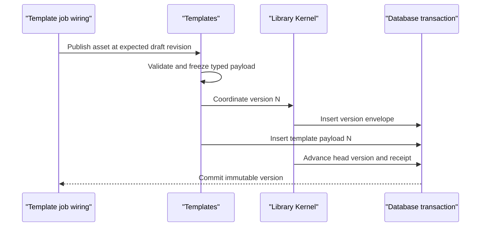
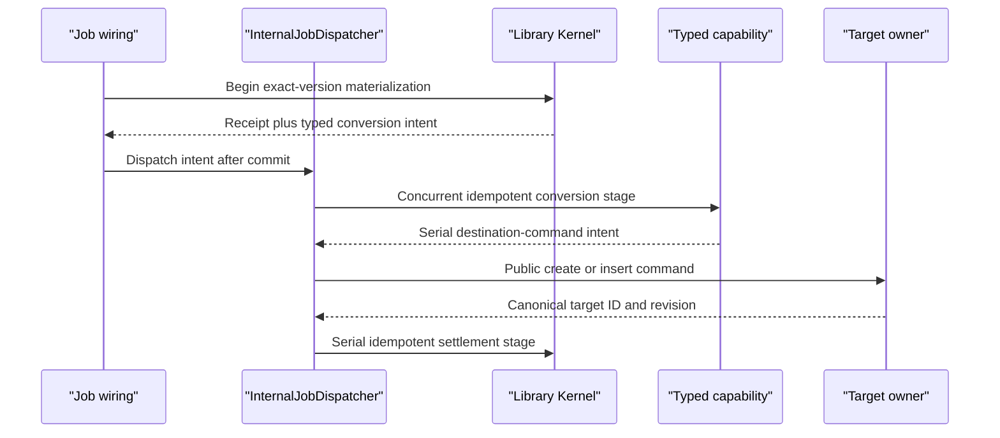

# Library Kernel Reference

## Purpose

The Library Kernel is the shared envelope beneath Contexts, Templates, and Personalities. It owns stable asset identity, explicit user and project scope, metadata revision, immutable version identity, lineage, and materialization receipts. Each typed library owns its payload schema, validation, and behavior.

## Bottom line

A library asset answers:

- What kind of reusable asset is this?
- Which user and project scope contains it?
- What is its current display metadata and lifecycle?
- What immutable versions exist, and which is the current head?
- Where did it come from?
- Which exact version was materialized, where, and with what result?

The typed capability answers everything about the payload. The Kernel coordinates envelopes and receipts while Context, Templates, and Personalities validate and store their typed version bodies. Every request and canonical record carries explicit `userId` and `projectId` scope so concurrent work in several projects remains unambiguous.

## Runtime placement

The Library Kernel runs inside the Fastify backend and uses the database interface constructed under `0-platform`.

```plain text
apps/backend/src/
  0-platform/
    database/                         connection, transaction, migration runner
  3-capabilities/
    library-kernel/
      domain/
        asset.ts
        version.ts
        materialization.ts
        events.ts
      application/
        libraryKernel.ts
        metadataReducer.ts
        versionCoordinator.ts
        materializationCoordinator.ts
      ports/
        libraryRepository.ts
        typedPayloadParticipant.ts
      persistence/
        migrations.ts
        sqliteLibraryRepository.ts
      projections/
        assetCatalog.ts
        usageSummary.ts
      index.ts
```

`4-job-wiring/context`, `4-job-wiring/templates`, and `4-job-wiring/personalities` call the Kernel as an internal transactional participant while mapping their typed request contracts to Jobs. Multi-stage work is handed to the composition-owned `4-job-wiring/internal/InternalJobDispatcher`; the Kernel returns or durably records typed stage intents. `2-transport` remains the HTTP transport.

Typed payload capabilities participate through narrow transactional callbacks. For example, Template validates and writes `template_version_payloads`; the Library Kernel writes the matching version envelope and advances `headVersion` in the same database transaction.

## Authority and integration boundaries

### Kernel authority

- `LibraryAssetId`, asset kind, `userId`, `projectId`, name, description, lifecycle, and timestamps.
- Metadata revision and append-only metadata ChangeSets.
- Immutable version number, schema marker, payload digest, creator, and creation time.
- The head-version pointer.
- Exact source lineage expressed as typed IDs, revisions, and digests.
- Generic materialization request identity, state, exact source version, destination address, warnings, and result receipt.
- Idempotency for metadata changes, publish coordination, and materialization.
- Rebuildable catalog and usage projections.

### Typed library and destination authority

- Context owns members, inclusion and exclusion rules, source snapshots, and Context resolution.
- Templates owns slots, drafts, editor operations, previews, and Resource-kind conversion.
- Personalities owns behavior definitions, defaults, and task-ready snapshots.
- Destination capabilities own every project object created through materialization.
- Agents, Automation, Collaboration, Import/Export, Knowledge, Platform Intelligence, and Web Retrieval retain their own domain state.
- Context, Templates, and Personalities reuse this envelope, lifecycle vocabulary, lineage model, and materialization receipt.

## Aggregate and contracts

```typescript
export type LibraryAssetKind = "context" | "template" | "personality";
export type LibraryLifecycle = "active" | "trashed";

export interface LibraryAsset {
  id: string;
  userId: string;
  projectId: string;
  kind: LibraryAssetKind;
  name: string;
  description: string;
  lifecycle: LibraryLifecycle;
  revision: number;
  headVersion: number;
  createdAt: string;
  updatedAt: string;
  trashedAt?: string;
}

export interface LibraryVersionEnvelope {
  assetId: string;
  userId: string;
  projectId: string;
  version: number;
  payloadSchema: string;
  payloadDigest: string;
  publishRequestId: string;
  publishRequestDigest: string;
  createdByUserId: string;
  createdAt: string;
}

export interface MaterializationTarget {
  userId: string;
  projectId: string;
  kind: "project_context" | "resource" | "project_personality";
  targetId?: string;
  mode: "create" | "insert" | "copy";
}

export interface PublishLibraryVersion {
  userId: string;
  projectId: string;
  assetId: string;
  expectedHeadVersion: number;
  clientRequestId: string;
  requestDigest: string;
  createdByUserId: string;
}

export interface LibraryMaterialization {
  id: string;
  userId: string;
  projectId: string;
  assetId: string;
  sourceVersion: number;
  target: MaterializationTarget;
  state: "requested" | "running" | "succeeded" | "failed" | "canceled";
  destinationId?: string;
  warnings: string[];
  createdAt: string;
  updatedAt: string;
}
```

`headVersion = 0` means the typed capability has a draft but no published version. A version becomes visible only after its typed payload and version envelope commit together. Published version rows are immutable.

The Library Kernel exposes four public ports:

```typescript
interface LibraryAssetCommands {
  create(command: CreateLibraryAsset): Promise<LibraryAsset>;
  applyMetadata(command: ApplyLibraryMetadataChange): Promise<LibraryAsset>;
}

interface LibraryAssetReader {
  get(userId: string, projectId: string, assetId: string): Promise<LibraryAsset>;
  list(query: LibraryAssetQuery): Promise<LibraryAssetPage>;
  getVersion(
    userId: string,
    projectId: string,
    assetId: string,
    version: number
  ): Promise<LibraryVersionEnvelope>;
}

interface LibraryVersionCoordinator {
  publish<T>(
    command: PublishLibraryVersion,
    participant: TypedPayloadParticipant<T>
  ): Promise<LibraryVersionEnvelope>;
}

interface LibraryMaterializationCoordinator {
  begin(command: BeginMaterialization): Promise<LibraryMaterialization>;
  settle(command: SettleMaterialization): Promise<LibraryMaterialization>;
}
```

`TypedPayloadParticipant` validates the asset kind, prepares a typed immutable payload, writes it inside the supplied transaction, and returns its digest. The Kernel coordinates the envelope from that digest while the typed capability retains the payload body.

## Operations and job classification

The queue below is the queue of the typed Context, Template, or Personality request that invokes the Kernel.

| Request or internal operation | Queue | Response | Effect |
|---|---|---|---|
| `library.asset.create` | Serial | Inline `201` | Commit canonical identity and metadata |
| `library.asset.change-metadata` | Serial | Inline | Commit a revision-checked metadata ChangeSet |
| `library.asset.get`, `library.asset.list`, `library.version.get` | Concurrent | Inline | Read scoped envelope or immutable version metadata |
| `library.version.publish` | Serial | Inline | Commit typed payload, envelope, head pointer, and receipt atomically |
| `library.materialization.begin` | Serial | Inline receipt or deferred `202` | Create durable operation identity |
| `library.materialization.convert` | Concurrent | Deferred internal result | Let the typed capability produce a destination plan |
| `library.materialization.settle` | Serial | Internal stage result | Publish the destination receipt or failure exactly once |

The scheduler gives every Job one queue. Materialization is a short serial `begin`, an optional typed concurrent conversion stage, and a short serial `settle`.

### Internal stage-dispatch law

- The committing capability returns a typed `InternalStageIntent` only after its state and stage receipt are durable.
- `InternalJobDispatcher` under `4-job-wiring/internal` translates that intent into a Job and enqueues it.
- Every intent has a deterministic `stageKey`, queue, payload digest, and owning aggregate ID.
- Replaying the same stage key and digest returns the recorded result; the same stage key with another digest is `idempotency_mismatch`.
- A stage returns its next intent to composition after its own durable result commits.
- Job wiring owns Scheduler invocation and each Job completes independently.

## Revision, ChangeSet, and event model

Library metadata is a small mutable aggregate. Every accepted metadata mutation:

1. names `expectedRevision` and `clientRequestId`;
2. validates a typed operation;
3. appends one `library_asset_changesets` row with forward and inverse operations;
4. folds the operation into `library_assets`;
5. increments `revision`;
6. returns a `LibraryAssetChanged` fact after commit.

The metadata ChangeSet stores a canonical request digest. Replaying the same scoped `clientRequestId` and digest returns the original result; divergent reuse returns `idempotency_mismatch`.

Asset creation uses the same rule before an asset ID exists: a scoped creation receipt maps `clientRequestId` and request digest to the created asset and original response.

Version publication appends immutable version `N + 1` and advances the head under `expectedHeadVersion`. `(assetId, clientRequestId)` plus `requestDigest` makes publication replay-safe: an identical retry returns the original envelope and a divergent digest returns `idempotency_mismatch`. The typed payload capability may use its own draft ChangeSets before publication.

Materializations are durable state machines:

```plain text
requested → running → succeeded
                    ↘ failed
                    ↘ canceled
```

Transitions append `library_materialization_events`. A repeated `clientRequestId` with the same request digest returns the original receipt; the same ID with a different digest fails with `idempotency_mismatch`.

Each multi-stage transition also claims one `library_materialization_stages` record. Pending stages can be rediscovered after restart and re-emitted to `InternalJobDispatcher`.

Committed operations return typed facts:

- `LibraryAssetChanged`
- `LibraryVersionPublished`
- `LibraryMaterializationStarted`
- `LibraryMaterializationSettled`

Job wiring may pass those committed facts to Collaboration’s activity recorder. The facts carry safe IDs, revisions, kinds, and digests while typed payload bodies stay in capability-owned storage.

## Capability-owned tables

```sql
CREATE TABLE library_assets (
  id TEXT PRIMARY KEY,
  user_id TEXT NOT NULL,
  project_id TEXT NOT NULL,
  kind TEXT NOT NULL CHECK (kind IN ('context','template','personality')),
  name TEXT NOT NULL,
  description TEXT NOT NULL DEFAULT '',
  lifecycle TEXT NOT NULL CHECK (lifecycle IN ('active','trashed')),
  revision INTEGER NOT NULL,
  head_version INTEGER NOT NULL DEFAULT 0,
  created_at TEXT NOT NULL,
  updated_at TEXT NOT NULL,
  trashed_at TEXT,
  UNIQUE (user_id, project_id, id)
);

CREATE TABLE library_asset_changesets (
  id TEXT PRIMARY KEY,
  asset_id TEXT NOT NULL,
  user_id TEXT NOT NULL,
  project_id TEXT NOT NULL,
  seq INTEGER NOT NULL,
  author_user_id TEXT NOT NULL,
  client_request_id TEXT NOT NULL,
  request_digest TEXT NOT NULL,
  expected_revision INTEGER NOT NULL,
  operations_json TEXT NOT NULL,
  inverse_json TEXT NOT NULL,
  created_at TEXT NOT NULL,
  UNIQUE (asset_id, seq),
  UNIQUE (user_id, project_id, client_request_id),
  FOREIGN KEY (user_id, project_id, asset_id)
    REFERENCES library_assets(user_id, project_id, id)
);

CREATE TABLE library_asset_creation_receipts (
  user_id TEXT NOT NULL,
  project_id TEXT NOT NULL,
  client_request_id TEXT NOT NULL,
  request_digest TEXT NOT NULL,
  asset_id TEXT NOT NULL,
  response_json TEXT NOT NULL,
  created_at TEXT NOT NULL,
  PRIMARY KEY (user_id, project_id, client_request_id),
  UNIQUE (user_id, project_id, asset_id),
  FOREIGN KEY (user_id, project_id, asset_id)
    REFERENCES library_assets(user_id, project_id, id)
);

CREATE TABLE library_asset_versions (
  asset_id TEXT NOT NULL,
  user_id TEXT NOT NULL,
  project_id TEXT NOT NULL,
  version INTEGER NOT NULL,
  payload_schema TEXT NOT NULL,
  payload_digest TEXT NOT NULL,
  publish_request_id TEXT NOT NULL,
  publish_request_digest TEXT NOT NULL,
  created_by_user_id TEXT NOT NULL,
  created_at TEXT NOT NULL,
  PRIMARY KEY (asset_id, version),
  UNIQUE (user_id, project_id, asset_id, version),
  UNIQUE (user_id, project_id, asset_id, publish_request_id),
  FOREIGN KEY (user_id, project_id, asset_id)
    REFERENCES library_assets(user_id, project_id, id)
);

CREATE TABLE library_asset_lineage (
  id TEXT PRIMARY KEY,
  asset_id TEXT NOT NULL,
  user_id TEXT NOT NULL,
  project_id TEXT NOT NULL,
  relation TEXT NOT NULL,
  source_kind TEXT NOT NULL,
  source_id TEXT NOT NULL,
  source_revision TEXT NOT NULL,
  source_digest TEXT NOT NULL,
  created_by_user_id TEXT NOT NULL,
  created_at TEXT NOT NULL,
  FOREIGN KEY (user_id, project_id, asset_id)
    REFERENCES library_assets(user_id, project_id, id)
);

CREATE TABLE library_materializations (
  id TEXT PRIMARY KEY,
  user_id TEXT NOT NULL,
  project_id TEXT NOT NULL,
  asset_id TEXT NOT NULL,
  source_version INTEGER NOT NULL,
  destination_kind TEXT NOT NULL,
  destination_mode TEXT NOT NULL,
  destination_id TEXT,
  state TEXT NOT NULL,
  client_request_id TEXT NOT NULL,
  request_digest TEXT NOT NULL,
  warnings_json TEXT NOT NULL DEFAULT '[]',
  result_json TEXT,
  error_code TEXT,
  created_at TEXT NOT NULL,
  updated_at TEXT NOT NULL,
  completed_at TEXT,
  UNIQUE (user_id, project_id, client_request_id),
  UNIQUE (user_id, project_id, id),
  FOREIGN KEY (user_id, project_id, asset_id, source_version)
    REFERENCES library_asset_versions(user_id, project_id, asset_id, version)
);

CREATE TABLE library_materialization_events (
  materialization_id TEXT NOT NULL,
  user_id TEXT NOT NULL,
  project_id TEXT NOT NULL,
  seq INTEGER NOT NULL,
  state TEXT NOT NULL,
  detail_json TEXT NOT NULL,
  created_at TEXT NOT NULL,
  PRIMARY KEY (materialization_id, seq),
  FOREIGN KEY (user_id, project_id, materialization_id)
    REFERENCES library_materializations(user_id, project_id, id)
);

CREATE TABLE library_materialization_stages (
  materialization_id TEXT NOT NULL,
  user_id TEXT NOT NULL,
  project_id TEXT NOT NULL,
  stage_key TEXT NOT NULL,
  stage_kind TEXT NOT NULL,
  queue_type TEXT NOT NULL CHECK (queue_type IN ('serial','concurrent')),
  request_digest TEXT NOT NULL,
  state TEXT NOT NULL,
  result_json TEXT,
  error_code TEXT,
  created_at TEXT NOT NULL,
  updated_at TEXT NOT NULL,
  PRIMARY KEY (materialization_id, stage_key),
  FOREIGN KEY (user_id, project_id, materialization_id)
    REFERENCES library_materializations(user_id, project_id, id)
);
```

Typed payload tables are owned by Context, Templates, and Personalities and expose `(user_id, project_id, asset_id, version)` as a scoped unique key. `destination_id` is a polymorphic cross-capability address validated through the destination capability’s typed result. Library records use lifecycle state and retained history.

## SQL indexes

```sql
CREATE INDEX library_assets_project_kind_updated
  ON library_assets(user_id, project_id, kind, updated_at DESC, id DESC);

CREATE INDEX library_assets_project_lifecycle_name
  ON library_assets(user_id, project_id, lifecycle, name COLLATE NOCASE, id);

CREATE INDEX library_asset_changesets_tail
  ON library_asset_changesets(user_id, project_id, asset_id, seq DESC);

CREATE INDEX library_asset_creation_receipts_asset
  ON library_asset_creation_receipts(user_id, project_id, asset_id);

CREATE INDEX library_lineage_source
  ON library_asset_lineage(user_id, project_id, source_kind, source_id, source_revision);

CREATE INDEX library_materializations_project_updated
  ON library_materializations(user_id, project_id, updated_at DESC, id DESC);

CREATE INDEX library_materializations_asset_version
  ON library_materializations(user_id, project_id, asset_id, source_version, created_at DESC);

CREATE INDEX library_materializations_state_updated
  ON library_materializations(user_id, project_id, state, updated_at, id);

CREATE INDEX library_materialization_stages_pending
  ON library_materialization_stages(
    state, queue_type, updated_at, user_id, project_id, materialization_id
  );
```

These ordinary database indexes accelerate scoped queries and can be recreated from table definitions.

## Named rebuildable projections

Rebuildable projections are data optimized for reading that can be regenerated from canonical records. This distinguishes them from ordinary SQL indexes.

### `library_asset_catalog`

A list-row projection derived from `library_assets`, the head `library_asset_versions` envelope, and a typed capability’s safe summary port. It contains name, kind, lifecycle, head version, payload schema, safe typed summary, and updated time. It may be a SQL view first and a table later.

### `library_asset_usage_summary`

A projection derived from successful `library_materializations`, grouped by asset, version, project, and destination kind. It powers “used in,” recent use, and materialization counts and can be regenerated from canonical history.

Both projections are read-optimized views; canonical envelopes, typed payloads, and receipts remain authoritative.

## Dependencies and ports

### Required platform ports

- `Database` and transaction boundary from `0-platform/database`.
- `Clock`, ID factory, and request digest utility from `0-utils`.
- Structured logger from `0-platform/observability`.

### Required capability participants

- Context, Templates, and Personalities implement `TypedPayloadParticipant`.
- Target capabilities perform their own materialization writes and return typed result IDs.

### Provided ports

- Asset metadata commands and readers.
- Immutable version-envelope reader.
- Transactional version coordinator.
- Materialization receipt/state coordinator.
- Safe catalog and usage projection readers.

`1-init` supplies typed capability participants during composition, preserving dependency inversion.

## Intelligence and web use

Typed capabilities use Platform Intelligence and Web Retrieval through their own ports. Kernel operations are deterministic metadata, version, lineage, and receipt operations.

## Principal flows

### Publish a Template version



### Materialize a published asset



## Invariants

- Every asset has exactly one typed kind and one user owner.
- A typed payload exists for every published version envelope.
- A published version never changes.
- `headVersion` advances monotonically and only to an existing typed version.
- Typed payload bodies remain in their owning capability tables.
- Metadata writes use revision CAS; publish uses expected head and typed draft revision.
- A materialization pins one exact source version.
- A successful materialization names the canonical destination ID returned by the destination capability.
- Retrying an operation returns the existing version or materialized target.
- Every multi-stage action is composition-dispatched and idempotent by aggregate, stage key, and digest.
- Job wiring owns Scheduler invocation.
- Trashing a library asset preserves already materialized project objects.
- Every query receives explicit user and project scope.

## Conformance scenarios

1. Create, list, read, rename, trash, restore, publish, and materialize assets within an explicit user/project scope.
2. Retry metadata, publication, and materialization requests with identical and divergent digests.
3. Publish Context, Template, and Personality payloads through the same participant contract.
4. Rebuild `library_asset_catalog` and `library_asset_usage_summary` from canonical envelopes, typed payload summaries, and receipts.

## Acceptance criteria

- [ ] Context, Templates, and Personalities use the same asset envelope.
- [ ] The Kernel can publish a version through a typed participant without decoding its payload.
- [ ] A failed typed payload write rolls back the version envelope and head update.
- [ ] Metadata CAS rejects a stale revision without overwriting the current asset.
- [ ] Published versions are immutable and monotonically numbered.
- [ ] A duplicate materialization request returns the original receipt and destination.
- [ ] Replaying any materialization stage returns its recorded result, while a changed digest fails.
- [ ] The catalog and usage projections can be deleted and rebuilt from canonical tables.
- [ ] Composition supplies typed payload participants, and those capabilities use Platform Intelligence and Web Retrieval through their own ports.
- [ ] Job wiring owns Scheduler invocation and queued stage dispatch.
- [ ] All canonical rows and queries are explicitly scoped by user and project.

## References

- [Product — Icarus Complete Product Definition](https://app.notion.com/p/3aeb6410e502810ba9c0c26442d5255a)
- [Model — Icarus Request, Job & Dual-Queue Runtime](https://app.notion.com/p/3adb6410e50281c498f4d7f6a621eba2)
- [Architecture — Icarus Runtime Foundation & Repository Boundaries](https://app.notion.com/p/3adb6410e50281e09d83ed36daacf8d8)
- [Implementation — User Context Library](https://app.notion.com/p/3acb6410e502814e928ae1f10eac6f75)
- [Implementation — User Template Library](https://app.notion.com/p/3acb6410e50281d4a4d8ee542f91d595)
- [Implementation — User Agents & Personality Library](https://app.notion.com/p/3acb6410e50281229fe9eec53047607c)
