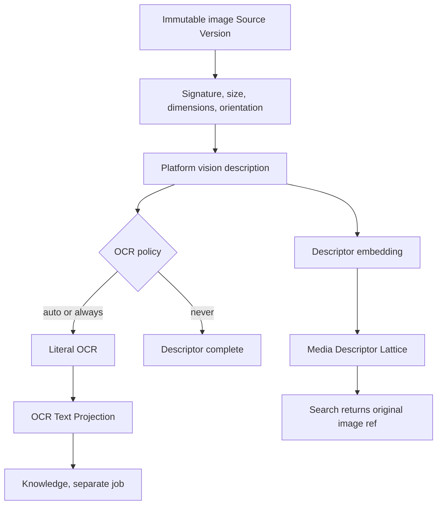

# Capability — Media

Media makes still images discoverable through a separately owned descriptor lattice while returning the original Source image. Generated descriptions are labeled interpretation. Literal OCR is exposed to Knowledge as a distinct, source-pinned text projection. Provider and model mechanics remain behind Platform Intelligence interfaces.

## Purpose and boundary

Media finds useful images, charts, diagrams, screenshots, and photographs from visual meaning, including material with sparse machine-readable text.

```plain text
generated descriptor → helps Icarus find the image
original Source image → is what the user or agent actually opens
literal OCR text      → may separately enter Knowledge
```

The image contract supports PNG, JPEG, and WebP still images.

Media owns:

- admission state for image Source Versions;
- deterministic image metadata and derived Media artifact references;
- generated descriptors, structured tags, confidence, and provider provenance;
- descriptor embeddings and a separately persisted Media lattice;
- OCR policy, attempts, literal OCR results, and image-region locators;
- Media search, inspect, and open projections.

Sources owns original bytes and Source versioning. Knowledge owns Text windows and the Text lattice. Evidence owns canonical grounded assertions. Structured Data owns chart data. Platform Intelligence owns model credentials, route selection, and provider SDKs.

Media OCR is the Media output admitted directly to Knowledge. Generated descriptors and the Media lattice remain Media projections. Native editor images arrive as image Source Versions, and Structured Data or Analysis material enters Knowledge through a Source Version or admitted Evidence.

## Runtime placement

```plain text
apps/backend/src/3-capabilities/media/
  domain/
    model.ts
    policy.ts
    descriptor.ts
    ocr.ts
    lattice.ts
  application/
    service.ts
  ports/
    repository.ts
    sourceReader.ts
    vision.ts
  persistence/
    migrations/
      001-media.ts
    sqliteMediaRepository.ts
  index.ts

apps/backend/src/4-job-wiring/media/
  registerMediaEndpointMappings.ts
  mediaJobFactories.ts
  mediaSourceAdapters.ts
  mediaOcrProjectionAdapter.ts
```

Media is composed into the backend and uses the bounded concurrent pool for image and provider work. Media owns its repository port, migrations, and `SqliteMediaRepository`; `1-init` constructs the adapter with the Platform Database and injects it. Shared content-agnostic lattice geometry lives under `apps/backend/src/0-utils/lattice`; Media owns its entries and communicates with Knowledge through an OCR projection port.

## Public operations

| Operation | Effect |
|---|---|
| `media.ingest-source` | Validates an image Source Version, describes it, embeds its descriptor, publishes a Media generation, and evaluates OCR policy. |
| `media.refresh-source` | Reuses or rebuilds only branches whose content/policy/model identity changed. |
| `media.retry-description` | Starts a new descriptor attempt against the same immutable Source bytes. |
| `media.retry-ocr` | Starts a new OCR attempt under an explicit policy/model route. |
| `media.search` | Searches descriptor entries and returns typed Media matches. |
| `media.inspect` | Returns descriptor, provenance, source/parent location, and OCR status. |
| `media.open` | Returns an exact reference to the original Source image, optionally focused to a region. |
| `media.set-project-policy` | Revises default OCR mode and bounded image/model limits. |
| `media.status` | Lists active, partial, failed, or stale projections. |
| `media.remove-source` | Removes the image projection from a new Media corpus generation. |

The frontend can expose per-source OCR override `never | auto | always`. `auto` is the default.

## Request-to-job mapping

| Request | Queue | Response | Reason |
|---|---|---|---|
| ingest, refresh, retry description/OCR, remove source | `concurrent` | `deferred` | Image decoding, model calls, embeddings, and lattice builds use bounded concurrent capacity. |
| search/open/inspect/status | `concurrent` | `inline` | Independent reads plus at most one bounded query embedding. |
| set project policy | `serial` | `inline` | Small canonical preference mutation with revision/CAS. |

One ingest job may complete `partial`: descriptor publication can succeed while OCR fails. The Media result remains searchable; OCR diagnostics remain explicit.

## Policy revision and derived-generation model

Media contains one small canonical aggregate: project Media policy.

```typescript
interface Scope {
  userId: string;
  projectId: string;
}

interface InferenceIdentity {
  provider: string;
  model: string;
  promptVersion: string;
}

interface VectorIdentity {
  provider: string;
  model: string;
  dimensions: number;
}

type MediaParentRef =
  | { kind: "source"; sourceId: string }
  | {
      kind: "native_resource";
      resourceKind: "document" | "slides" | "spreadsheet";
      resourceId: string;
      revision: number;
    };

interface SourceImageRef {
  sourceVersionId: string;
  region?: { x: number; y: number; width: number; height: number };
}

interface MediaProjectPolicy {
  userId: string;
  projectId: string;
  revision: number;
  ocrMode: "never" | "auto" | "always";
  ocrLikelihoodThreshold: number;
  maxImageBytes: number;
  maxImagePixels: number;
  maxOcrTextBytes: number;
}

interface MediaArtifact {
  mediaArtifactId: string;
  userId: string;
  projectId: string;
  sourceId: string;
  sourceVersionId: string;
  sourceHash: string;
  format: "png" | "jpeg" | "webp";
  width: number;
  height: number;
  byteSize: number;
  orientationTransform: readonly number[];
  parentRefs: readonly MediaParentRef[];
}

interface MediaProjectionGeneration {
  generationId: string;
  projectionId: string;
  sourceHash: string;
  descriptorIdentity: InferenceIdentity;
  embeddingIdentity: VectorIdentity;
  ocrIdentity: InferenceIdentity;
  descriptor: MediaDescriptor;
  ocr: OcrResult | null;
  createdAt: string;
}

interface OcrRegion {
  textStart: number;
  textEnd: number;
  bounds: { x: number; y: number; width: number; height: number };
  confidence: number;
}

interface OcrResult {
  status: "skipped" | "completed" | "failed";
  text: string | null;
  textHash: string | null;
  regions: readonly OcrRegion[];
  language: string | null;
  confidence: number | null;
}

interface MediaSearchRequest {
  scope: Scope;
  query: string;
  tags?: Readonly<Record<string, readonly string[]>>;
  mediaKinds?: readonly MediaDescriptor["mediaKind"][];
  limit: number;
  mode: "exact_scan" | "directed_descent";
}

interface MediaMatch {
  mediaArtifactId: string;
  sourceVersionId: string;
  descriptor: MediaDescriptor;
  score: number;
  originalImageRef: SourceImageRef;
}
```

Policy edits use `expectedRevision`, `submissionId`, resolved heads, immutable change sets, and exact inverses.

All descriptors, OCR results, vectors, and lattice rows are rebuildable derived projections. They use immutable generations and atomic head publication instead of undo:

```plain text
source hash
+ descriptor policy/prompt version + resolved vision model
+ descriptor embedding provider/model/dimensions
+ OCR policy/prompt version + resolved OCR model
```

An identical build key is reused. A new Source version or changed relevant identity creates a new generation; prior coherent generations remain readable until publication.

## Descriptor and OCR contracts

The description call returns bounded structured output:

```typescript
interface MediaDescriptor {
  name: string;
  summary: string;
  mediaKind: "photo" | "chart" | "diagram" | "screenshot" | "illustration" | "other";
  subjects: Array<{ kind: string; name: string }>;
  setting: string;
  purpose: string;
  composition: string[];
  tags: Array<{ namespace: string; value: string }>;
  visibleText: {
    likelihood: number;
    ocrRecommended: boolean;
    reason: string;
  };
  confidence: number;
}
```

The descriptor is generated interpretation. It describes visible entities and likely purpose for Media retrieval.

OCR instructions are narrower:

> Transcribe only literal visible text in reading order and return its image regions. Preserve ambiguity, truncation, spelling, and low-confidence spans exactly as observed.

OCR output includes exact text offsets, normalized image bounds, confidence, and provider/prompt provenance. Knowledge receives the OCR result through `OcrProjectionReader`; descriptors remain in Media.

## Capability tables

The policy tables are canonical. Every other `media_*` table is a rebuildable capability-owned projection.

```sql
CREATE TABLE media_project_policies (
  user_id TEXT NOT NULL,
  project_id TEXT NOT NULL,
  revision INTEGER NOT NULL CHECK (revision >= 1),
  ocr_mode TEXT NOT NULL CHECK (ocr_mode IN ('never', 'auto', 'always')),
  ocr_likelihood_threshold REAL NOT NULL CHECK (
    ocr_likelihood_threshold >= 0.0 AND ocr_likelihood_threshold <= 1.0
  ),
  max_image_bytes INTEGER NOT NULL CHECK (max_image_bytes > 0),
  max_image_pixels INTEGER NOT NULL CHECK (max_image_pixels > 0),
  max_ocr_text_bytes INTEGER NOT NULL CHECK (max_ocr_text_bytes > 0),
  updated_at TEXT NOT NULL,
  PRIMARY KEY (user_id, project_id)
);

CREATE TABLE media_policy_change_sets (
  change_set_id TEXT PRIMARY KEY,
  user_id TEXT NOT NULL,
  project_id TEXT NOT NULL,
  revision INTEGER NOT NULL,
  base_revision INTEGER NOT NULL,
  submission_id TEXT NOT NULL,
  operations_json TEXT NOT NULL,
  inverse_json TEXT NOT NULL,
  accepted_at TEXT NOT NULL,
  FOREIGN KEY (user_id, project_id)
    REFERENCES media_project_policies(user_id, project_id)
);

CREATE TABLE media_artifacts (
  media_artifact_id TEXT PRIMARY KEY,
  user_id TEXT NOT NULL,
  project_id TEXT NOT NULL,
  source_id TEXT NOT NULL,
  source_version_id TEXT NOT NULL,
  source_hash TEXT NOT NULL,
  format TEXT NOT NULL CHECK (format IN ('png', 'jpeg', 'webp')),
  width INTEGER NOT NULL,
  height INTEGER NOT NULL,
  byte_size INTEGER NOT NULL,
  orientation_transform_json TEXT NOT NULL,
  parent_refs_json TEXT NOT NULL DEFAULT '[]',
  created_at TEXT NOT NULL,
  UNIQUE (user_id, project_id, media_artifact_id)
);

CREATE TABLE media_projection_heads (
  projection_id TEXT PRIMARY KEY,
  user_id TEXT NOT NULL,
  project_id TEXT NOT NULL,
  media_artifact_id TEXT NOT NULL,
  current_generation_id TEXT,
  status TEXT NOT NULL CHECK (
    status IN (
      'pending', 'building', 'active', 'partial',
      'failed', 'stale', 'superseded'
    )
  ),
  updated_at TEXT NOT NULL,
  UNIQUE (user_id, project_id, projection_id),
  UNIQUE (user_id, project_id, projection_id, media_artifact_id),
  FOREIGN KEY (user_id, project_id, media_artifact_id)
    REFERENCES media_artifacts(user_id, project_id, media_artifact_id),
  FOREIGN KEY (user_id, project_id, projection_id, current_generation_id)
    REFERENCES media_projection_generations(
      user_id, project_id, projection_id, generation_id
    )
);

CREATE TABLE media_projection_generations (
  generation_id TEXT PRIMARY KEY,
  user_id TEXT NOT NULL,
  project_id TEXT NOT NULL,
  projection_id TEXT NOT NULL,
  source_hash TEXT NOT NULL,
  descriptor_policy_version TEXT NOT NULL,
  descriptor_prompt_version TEXT NOT NULL,
  descriptor_provider TEXT NOT NULL,
  descriptor_model TEXT NOT NULL,
  embedding_provider TEXT NOT NULL,
  embedding_model TEXT NOT NULL,
  embedding_dimensions INTEGER NOT NULL,
  ocr_policy_version TEXT NOT NULL,
  ocr_prompt_version TEXT NOT NULL,
  ocr_provider TEXT NOT NULL,
  ocr_model TEXT NOT NULL,
  created_at TEXT NOT NULL,
  UNIQUE (user_id, project_id, projection_id, generation_id),
  FOREIGN KEY (user_id, project_id, projection_id)
    REFERENCES media_projection_heads(user_id, project_id, projection_id)
);

CREATE TABLE media_descriptors (
  descriptor_id TEXT PRIMARY KEY,
  user_id TEXT NOT NULL,
  project_id TEXT NOT NULL,
  projection_id TEXT NOT NULL,
  generation_id TEXT NOT NULL,
  name TEXT NOT NULL,
  summary TEXT NOT NULL,
  media_kind TEXT NOT NULL CHECK (
    media_kind IN (
      'photo', 'chart', 'diagram', 'screenshot',
      'illustration', 'other'
    )
  ),
  descriptor_json TEXT NOT NULL,
  confidence REAL NOT NULL CHECK (confidence >= 0.0 AND confidence <= 1.0),
  visible_text_likelihood REAL NOT NULL CHECK (
    visible_text_likelihood >= 0.0 AND visible_text_likelihood <= 1.0
  ),
  ocr_recommended INTEGER NOT NULL CHECK (ocr_recommended IN (0, 1)),
  descriptor_hash TEXT NOT NULL,
  created_at TEXT NOT NULL,
  UNIQUE (
    user_id, project_id, projection_id, generation_id, descriptor_id
  ),
  UNIQUE (user_id, project_id, descriptor_id),
  FOREIGN KEY (user_id, project_id, projection_id, generation_id)
    REFERENCES media_projection_generations(
      user_id, project_id, projection_id, generation_id
    )
);

CREATE TABLE media_tags (
  tag_id TEXT PRIMARY KEY,
  user_id TEXT NOT NULL,
  project_id TEXT NOT NULL,
  descriptor_id TEXT NOT NULL,
  namespace TEXT NOT NULL,
  value TEXT NOT NULL,
  FOREIGN KEY (user_id, project_id, descriptor_id)
    REFERENCES media_descriptors(user_id, project_id, descriptor_id)
);

CREATE TABLE media_ocr_results (
  ocr_result_id TEXT PRIMARY KEY,
  user_id TEXT NOT NULL,
  project_id TEXT NOT NULL,
  media_artifact_id TEXT NOT NULL,
  projection_id TEXT NOT NULL,
  generation_id TEXT NOT NULL,
  status TEXT NOT NULL CHECK (status IN ('skipped', 'completed', 'failed')),
  text TEXT,
  text_hash TEXT,
  regions_json TEXT,
  language TEXT,
  confidence REAL CHECK (
    confidence IS NULL OR (confidence >= 0.0 AND confidence <= 1.0)
  ),
  provider TEXT,
  model TEXT,
  prompt_version TEXT,
  created_at TEXT NOT NULL,
  FOREIGN KEY (user_id, project_id, media_artifact_id)
    REFERENCES media_artifacts(user_id, project_id, media_artifact_id),
  FOREIGN KEY (user_id, project_id, projection_id, generation_id)
    REFERENCES media_projection_generations(
      user_id, project_id, projection_id, generation_id
    ),
  FOREIGN KEY (
    user_id, project_id, projection_id, media_artifact_id
  ) REFERENCES media_projection_heads(
    user_id, project_id, projection_id, media_artifact_id
  )
);

CREATE TABLE media_vectors (
  vector_id TEXT PRIMARY KEY,
  user_id TEXT NOT NULL,
  project_id TEXT NOT NULL,
  provider TEXT NOT NULL,
  model TEXT NOT NULL,
  dimensions INTEGER NOT NULL,
  content_hash TEXT NOT NULL,
  vector_blob BLOB NOT NULL,
  created_at TEXT NOT NULL,
  UNIQUE (user_id, project_id, vector_id)
);

CREATE TABLE media_corpus_heads (
  user_id TEXT NOT NULL,
  project_id TEXT NOT NULL,
  current_corpus_generation_id TEXT,
  revision INTEGER NOT NULL CHECK (revision >= 1),
  updated_at TEXT NOT NULL,
  PRIMARY KEY (user_id, project_id),
  FOREIGN KEY (user_id, project_id, current_corpus_generation_id)
    REFERENCES media_corpus_generations(
      user_id, project_id, corpus_generation_id
    )
);

CREATE TABLE media_corpus_generations (
  corpus_generation_id TEXT PRIMARY KEY,
  user_id TEXT NOT NULL,
  project_id TEXT NOT NULL,
  base_head_revision INTEGER NOT NULL,
  embedding_provider TEXT NOT NULL,
  embedding_model TEXT NOT NULL,
  embedding_dimensions INTEGER NOT NULL,
  lattice_policy_version TEXT NOT NULL,
  created_at TEXT NOT NULL,
  UNIQUE (user_id, project_id, corpus_generation_id)
);

CREATE TABLE media_corpus_members (
  user_id TEXT NOT NULL,
  project_id TEXT NOT NULL,
  corpus_generation_id TEXT NOT NULL,
  projection_id TEXT NOT NULL,
  projection_generation_id TEXT NOT NULL,
  descriptor_id TEXT NOT NULL,
  vector_id TEXT NOT NULL,
  PRIMARY KEY (user_id, project_id, corpus_generation_id, projection_id),
  FOREIGN KEY (user_id, project_id, corpus_generation_id)
    REFERENCES media_corpus_generations(
      user_id, project_id, corpus_generation_id
    ),
  FOREIGN KEY (user_id, project_id, projection_id)
    REFERENCES media_projection_heads(user_id, project_id, projection_id),
  FOREIGN KEY (
    user_id, project_id, projection_id, projection_generation_id
  ) REFERENCES media_projection_generations(
    user_id, project_id, projection_id, generation_id
  ),
  FOREIGN KEY (
    user_id, project_id, projection_id,
    projection_generation_id, descriptor_id
  ) REFERENCES media_descriptors(
    user_id, project_id, projection_id, generation_id, descriptor_id
  ),
  FOREIGN KEY (user_id, project_id, vector_id)
    REFERENCES media_vectors(user_id, project_id, vector_id)
);

CREATE TABLE media_lattice_nodes (
  node_id TEXT PRIMARY KEY,
  user_id TEXT NOT NULL,
  project_id TEXT NOT NULL,
  corpus_generation_id TEXT NOT NULL,
  level INTEGER NOT NULL,
  centroid_vector_id TEXT NOT NULL,
  member_count INTEGER NOT NULL,
  cohesion REAL NOT NULL,
  UNIQUE (user_id, project_id, corpus_generation_id, node_id),
  FOREIGN KEY (user_id, project_id, corpus_generation_id)
    REFERENCES media_corpus_generations(
      user_id, project_id, corpus_generation_id
    ),
  FOREIGN KEY (user_id, project_id, centroid_vector_id)
    REFERENCES media_vectors(user_id, project_id, vector_id)
);

CREATE TABLE media_lattice_memberships (
  membership_id TEXT PRIMARY KEY,
  user_id TEXT NOT NULL,
  project_id TEXT NOT NULL,
  corpus_generation_id TEXT NOT NULL,
  parent_node_id TEXT NOT NULL,
  member_kind TEXT NOT NULL CHECK (member_kind IN ('descriptor', 'node')),
  member_id TEXT NOT NULL,
  ordinal INTEGER NOT NULL,
  FOREIGN KEY (user_id, project_id, corpus_generation_id)
    REFERENCES media_corpus_generations(
      user_id, project_id, corpus_generation_id
    ),
  FOREIGN KEY (
    user_id, project_id, corpus_generation_id, parent_node_id
  ) REFERENCES media_lattice_nodes(
    user_id, project_id, corpus_generation_id, node_id
  )
);

CREATE TABLE media_level_indexes (
  user_id TEXT NOT NULL,
  project_id TEXT NOT NULL,
  corpus_generation_id TEXT NOT NULL,
  level INTEGER NOT NULL,
  ordinal INTEGER NOT NULL,
  artifact_kind TEXT NOT NULL CHECK (artifact_kind IN ('descriptor', 'node')),
  artifact_id TEXT NOT NULL,
  PRIMARY KEY (
    user_id, project_id, corpus_generation_id, level, ordinal
  ),
  FOREIGN KEY (user_id, project_id, corpus_generation_id)
    REFERENCES media_corpus_generations(
      user_id, project_id, corpus_generation_id
    )
);

CREATE TABLE media_build_attempts (
  attempt_id TEXT PRIMARY KEY,
  user_id TEXT NOT NULL,
  project_id TEXT NOT NULL,
  projection_id TEXT,
  build_key TEXT NOT NULL,
  branch TEXT NOT NULL CHECK (branch IN ('descriptor', 'ocr', 'publication')),
  status TEXT NOT NULL CHECK (
    status IN ('queued', 'running', 'completed', 'failed', 'superseded')
  ),
  usage_json TEXT NOT NULL DEFAULT '{}',
  diagnostic_json TEXT,
  started_at TEXT NOT NULL,
  completed_at TEXT,
  FOREIGN KEY (user_id, project_id, projection_id)
    REFERENCES media_projection_heads(user_id, project_id, projection_id)
);
```

## Exact SQL indexes

```sql
CREATE UNIQUE INDEX media_policy_change_sets_revision
  ON media_policy_change_sets(user_id, project_id, revision);

CREATE UNIQUE INDEX media_policy_change_sets_submission
  ON media_policy_change_sets(user_id, project_id, submission_id);

CREATE UNIQUE INDEX media_artifacts_source_version
  ON media_artifacts(user_id, project_id, source_version_id);

CREATE INDEX media_artifacts_source
  ON media_artifacts(user_id, project_id, source_id, created_at DESC, media_artifact_id);

CREATE UNIQUE INDEX media_projection_heads_artifact
  ON media_projection_heads(user_id, project_id, media_artifact_id);

CREATE UNIQUE INDEX media_projection_generations_build
  ON media_projection_generations(
    user_id, project_id, projection_id, source_hash,
    descriptor_policy_version, descriptor_prompt_version,
    descriptor_provider, descriptor_model,
    embedding_provider, embedding_model, embedding_dimensions,
    ocr_policy_version, ocr_prompt_version, ocr_provider, ocr_model
  );

CREATE UNIQUE INDEX media_descriptors_generation
  ON media_descriptors(user_id, project_id, generation_id);

CREATE UNIQUE INDEX media_tags_identity
  ON media_tags(user_id, project_id, descriptor_id, namespace, value);

CREATE INDEX media_tags_lookup
  ON media_tags(user_id, project_id, namespace, value, descriptor_id);

CREATE INDEX media_ocr_results_artifact_recent
  ON media_ocr_results(user_id, project_id, media_artifact_id, created_at DESC, ocr_result_id);

CREATE UNIQUE INDEX media_vectors_identity_hash
  ON media_vectors(user_id, project_id, provider, model, dimensions, content_hash);

CREATE INDEX media_corpus_members_projection
  ON media_corpus_members(user_id, project_id, projection_id, corpus_generation_id);

CREATE INDEX media_lattice_nodes_level
  ON media_lattice_nodes(user_id, project_id, corpus_generation_id, level DESC, node_id);

CREATE UNIQUE INDEX media_lattice_memberships_identity
  ON media_lattice_memberships(user_id, project_id, corpus_generation_id, parent_node_id, member_kind, member_id);

CREATE INDEX media_lattice_memberships_parent
  ON media_lattice_memberships(user_id, project_id, corpus_generation_id, parent_node_id, ordinal, membership_id);

CREATE INDEX media_lattice_memberships_member
  ON media_lattice_memberships(user_id, project_id, corpus_generation_id, member_kind, member_id, parent_node_id);

CREATE INDEX media_level_indexes_lookup
  ON media_level_indexes(user_id, project_id, corpus_generation_id, level DESC, ordinal);

CREATE UNIQUE INDEX media_build_attempts_key_branch
  ON media_build_attempts(user_id, project_id, build_key, branch);

CREATE INDEX media_build_attempts_status
  ON media_build_attempts(user_id, project_id, status, started_at, attempt_id);
```

Every Media-owned child repeats `user_id + project_id` and references a composite parent key with the same scope. Descriptor and OCR rows also carry `projection_id + generation_id`, preventing a child from attaching to a generation from another image. Polymorphic lattice membership (`descriptor | node`) is repository-validated, while corpus and parent-node ownership are enforced in SQL.

## Rebuildable derived projections

The named derived projections are:

1. **Media Descriptor Projection** — structured descriptor, tags, provenance, and one descriptor embedding per admitted image generation.
2. **Media Descriptor Lattice** — KLR nodes, memberships, and level records over descriptor embeddings.
3. **OCR Text Projection** — literal OCR text and image-region locators exposed to Knowledge.

All three can be rebuilt from an immutable Source image plus pinned policy/model identities. Only `media_project_policies` and its change sets are canonical user state.

## Dependencies and narrow ports

Media consumes:

```typescript
interface ImageSourceReader {
  getImage(scope: Scope, sourceVersionId: string): Promise<ImageSnapshot>;
}

interface VisionInference {
  describeImage(input: DescribeImageInput): Promise<TypedInference<MediaDescriptor>>;
  transcribeImage(input: OcrImageInput): Promise<TypedInference<OcrResult>>;
}

interface MediaEmbedder {
  embedDescriptors(input: string[]): Promise<EmbeddedBatch>;
  embedQuery(input: string): Promise<EmbeddedVector>;
}
```

`VisionInference` and `MediaEmbedder` are Platform Intelligence interfaces. Concrete provider implementations and credentials live under `0-platform/intelligence`.

Media exposes `MediaSearcher`, `MediaReader`, and `OcrProjectionReader`. Knowledge consumes OCR through job-wiring adapters; Research searches Media directly. Image bytes arrive through Sources.

The `OcrProjectionReader` is the Media-to-Knowledge admission port. Descriptors remain Media retrieval artifacts. Structured Data and Analysis use Source Version or admitted Evidence paths for Knowledge admission.

## Key flow



## Invariants

1. Every Media artifact pins one immutable image Source Version.
2. Search indexes generated descriptor text; open returns the original image.
3. Generated descriptions remain labeled Media interpretation.
4. OCR contains literal visible text only and retains image-region locators.
5. Media and Knowledge table families, vectors, corpus generations, and retrieval calls remain separate.
6. Vector comparisons require equal provider, model, and dimension identities.
7. The description result's visible-text assessment drives `auto`.
8. Descriptor success and OCR failure is explicit partial success.
9. Invalid signatures, excessive bytes/pixels, or malformed images fail before provider submission.
10. Duplicate uses of one Source Version reuse one Media artifact/generation.
11. Failed rebuilds leave the prior corpus readable.
12. Literal OCR crosses from Media into Knowledge with source and image-region provenance.
13. Logs contain bounded operational metadata and exclude image bytes, OCR bodies, provider payloads, and signed material.

## Acceptance criteria

- An image becomes searchable by generated descriptor and opens the original Source image.
- The UI and API label the descriptor as generated interpretation.
- `never`, `auto`, and `always` produce distinct, testable OCR outcomes.
- OCR text, when present, is projectable into Knowledge and opens the exact image region.
- Media search loads Media descriptor generations; Knowledge search loads Text generations.
- Re-ingesting unchanged image, policy, and model identity reuses the existing generation.
- Changing OCR policy reruns only the OCR branch when the descriptor branch remains valid.
- Rebuilding all derived Media tables from Sources reproduces searchable media.

## References

- [Model — Media Capability & Descriptor Lattice](https://app.notion.com/p/3acb6410e50281dfa3abd6a5ed892917)
- [Design — Multi-Lattice Ingestion Architecture](https://app.notion.com/p/3acb6410e50281bf8f16ec589da555d3)
- [Design — Text Lattice Ingestion Pipeline](https://app.notion.com/p/3acb6410e50281d19635f051bb5ee6ad)
- [Architecture — Icarus Ideal Backend Runtime, Capabilities & Data Map](https://app.notion.com/p/3aeb6410e50281e1b73dd94e49d2d5d4)
