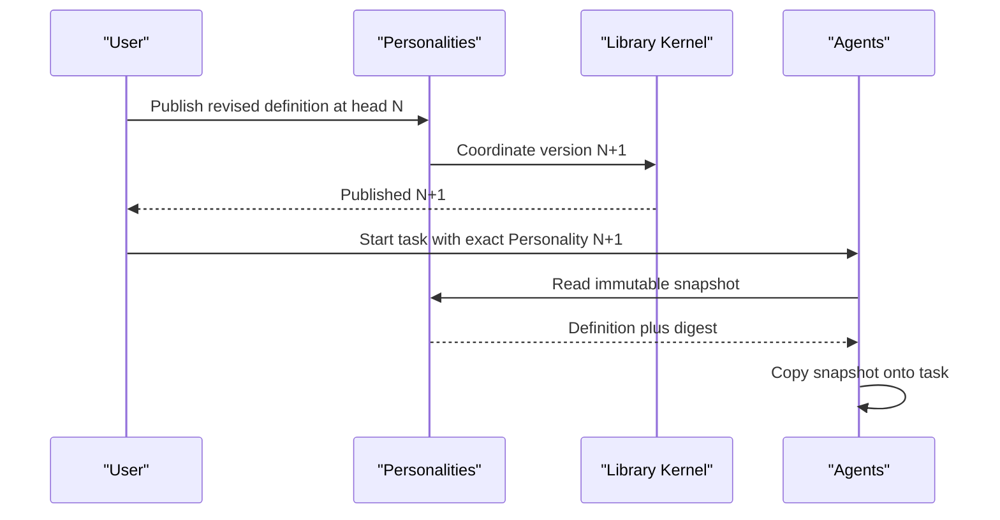

# Personalities Capability Reference

## Purpose

Personalities owns the typed, versioned behavior definitions used by Agents. The Library Kernel owns the reusable asset, version, lineage, and materialization envelope. Agents own tasks, runs, provider interaction, and execution.

## Bottom line

A Personality is a project-scoped, versioned behavior profile. Its payload says how an Agent should focus, behave, verify, and present work. Editing a Personality creates an immutable new version; starting an Agent pins and copies one exact version so later edits preserve work already underway.

The model distinguishes a reusable library Personality, an independent materialized copy, and the immutable snapshot pinned on an Agent task. One typed version model is used for both library and materialized definitions.

## Runtime placement

Personalities runs inside the Icarus backend.

```plain text
apps/backend/src/
  3-capabilities/
    personalities/
      domain/
        definition.ts
        projectPersonality.ts
        events.ts
      application/
        personalityService.ts
        projectCopyService.ts
        snapshotService.ts
      ports/
        libraryKernel.ts
        contextReferenceReader.ts
        repository.ts
      persistence/
        migrations.ts
        sqlitePersonalityRepository.ts
      projections/
        catalogSummary.ts
        taskUsageSummary.ts
      index.ts
  4-job-wiring/
    personalities/
      registerPersonalityEndpointMappings.ts
      createPersonalityJobs.ts
```

The public request surface is typed to Personalities. Library Kernel operations participate internally in the same transaction.

## Authority and integration boundaries

Personalities owns:

- the Personality definition schema and validation;
- immutable library Personality payloads;
- each project’s exact default Personality pointer;
- optional project-local Personality copies, versions, and source lineage;
- creation of immutable Agent-ready snapshots;
- Personality-specific safe list summaries.

Integrated authority:

- Library Kernel owns scoped asset identity, display metadata, lifecycle, generic version envelopes, lineage, and materialization receipts.
- Context owns referenced Context payloads and exact Context versions.
- Agents owns tasks, runs, tool policy, provider prompts, results, and task exchange.
- Question, Evidence, Analysis, Document, Slides, and Spreadsheet own their mutations.
- Platform Intelligence is injected into Agents; Research owns web retrieval.

## Definition and snapshot

```typescript
export interface PersonalityDefinition {
  focus: string;
  behavioralGuidance: string;
  outputPreferences: string;
  defaultVerification: string;
  contextReferences: string[];
}

export interface PersonalitySnapshot {
  userId: string;
  projectId: string;
  sourceKind: "library" | "project";
  sourceId: string;
  sourceVersion: number;
  name: string;
  definition: PersonalityDefinition;
  definitionDigest: string;
}

export interface PublishPersonalityRequest {
  userId: string;
  projectId: string;
  assetId: string;
  expectedHeadVersion: number;
  clientRequestId: string;
  definition: PersonalityDefinition;
}

export interface ProjectPersonality {
  id: string;
  userId: string;
  projectId: string;
  name: string;
  headVersion: number;
  source?: { assetId: string; version: number; digest: string };
  createdAt: string;
  updatedAt: string;
}

export interface ProjectPersonalityDefault {
  userId: string;
  projectId: string;
  revision: number;
  source: {
    kind: "library" | "project";
    id: string;
    version: number;
    digest: string;
  };
  updatedAt: string;
}
```

`contextReferences` names reusable behavioral background. Agent context assembly combines those exact references with the separately versioned project work context for a task.

The materialized copy is an independent snapshot of an exact library version. It carries lineage and project-specific edits append project Personality versions. Agent creation can pin either an exact library version or an exact materialized version.

## Operations and job classification

| Request type | Queue | Response |
|---|---|---|
| `personalities.create.v1` | Serial | Inline `201` |
| `personalities.revise.v1` | Serial | Inline |
| `personalities.get.v1`, `personalities.list.v1`, `personalities.version.get.v1` | Concurrent | Inline |
| `personalities.default.set.v1` | Serial | Inline |
| `personalities.materialize.v1` | Serial | Inline |
| `personalities.project.revise.v1` | Serial | Inline |
| `personalities.snapshot.get.v1` | Concurrent | Internal inline |

Writes are short canonical mutations. Exact-version reads and snapshot creation use the concurrent path.

## Revision and event model

Personality content is small and replaced as a whole. Immutable versions are clearer than granular payload ChangeSets:

1. a revise command names `expectedHeadVersion` and `clientRequestId`;
2. the complete definition is normalized and validated;
3. its digest is calculated;
4. Library Kernel creates version `N + 1`;
5. `personality_version_payloads` is written in the same transaction.

Library metadata edits use Library Kernel ChangeSets. Project copies use the same immutable-version rule with `expectedHeadVersion`, request ID, and request digest. Default changes use revision CAS and an append-only change log. Agent tasks pin a full immutable snapshot at task creation.

Events are `PersonalityVersionPublished`, `ProjectPersonalityMaterialized`, `ProjectPersonalityVersionPublished`, and `ProjectDefaultPersonalityChanged`. Events contain IDs, versions, and digests; behavioral text remains in version payload storage.

## Capability-owned tables

```sql
CREATE TABLE personality_version_payloads (
  asset_id TEXT NOT NULL,
  user_id TEXT NOT NULL,
  project_id TEXT NOT NULL,
  version INTEGER NOT NULL,
  definition_json TEXT NOT NULL,
  definition_digest TEXT NOT NULL,
  created_at TEXT NOT NULL,
  PRIMARY KEY (asset_id, version),
  UNIQUE (user_id, project_id, asset_id, version),
  FOREIGN KEY (user_id, project_id, asset_id, version)
    REFERENCES library_asset_versions(user_id, project_id, asset_id, version)
);

CREATE TABLE project_personality_defaults (
  user_id TEXT NOT NULL,
  project_id TEXT NOT NULL,
  revision INTEGER NOT NULL,
  source_kind TEXT NOT NULL CHECK (source_kind IN ('library','project')),
  source_id TEXT NOT NULL,
  source_version INTEGER NOT NULL,
  source_digest TEXT NOT NULL,
  updated_at TEXT NOT NULL,
  PRIMARY KEY (user_id, project_id)
);

CREATE TABLE project_personality_default_changes (
  user_id TEXT NOT NULL,
  project_id TEXT NOT NULL,
  seq INTEGER NOT NULL,
  actor_user_id TEXT NOT NULL,
  client_request_id TEXT NOT NULL,
  request_digest TEXT NOT NULL,
  expected_revision INTEGER NOT NULL,
  prior_source_json TEXT,
  source_json TEXT NOT NULL,
  created_at TEXT NOT NULL,
  PRIMARY KEY (user_id, project_id, seq),
  UNIQUE (user_id, project_id, client_request_id)
);

CREATE TABLE project_personalities (
  id TEXT PRIMARY KEY,
  user_id TEXT NOT NULL,
  project_id TEXT NOT NULL,
  name TEXT NOT NULL,
  description TEXT NOT NULL DEFAULT '',
  head_version INTEGER NOT NULL,
  source_asset_id TEXT,
  source_asset_version INTEGER,
  source_digest TEXT,
  created_at TEXT NOT NULL,
  updated_at TEXT NOT NULL,
  UNIQUE (user_id, project_id, id)
);

CREATE TABLE project_personality_versions (
  project_personality_id TEXT NOT NULL,
  user_id TEXT NOT NULL,
  project_id TEXT NOT NULL,
  version INTEGER NOT NULL,
  definition_json TEXT NOT NULL,
  definition_digest TEXT NOT NULL,
  created_by_user_id TEXT NOT NULL,
  client_request_id TEXT NOT NULL,
  request_digest TEXT NOT NULL,
  created_at TEXT NOT NULL,
  PRIMARY KEY (project_personality_id, version),
  UNIQUE (user_id, project_id, project_personality_id, client_request_id),
  FOREIGN KEY (user_id, project_id, project_personality_id)
    REFERENCES project_personalities(user_id, project_id, id)
);
```

Generic materialization identity and idempotency remain in Library Kernel tables.

`project_personality_defaults` stores a typed exact-version reference. The application validates a `library` reference through `personality_version_payloads` and a `project` reference through `project_personality_versions` in the same transaction that appends `project_personality_default_changes`.

## SQL indexes

```sql
CREATE INDEX personality_versions_digest
  ON personality_version_payloads(user_id, project_id, definition_digest);

CREATE INDEX project_personalities_project_updated
  ON project_personalities(user_id, project_id, updated_at DESC, id DESC);

CREATE INDEX project_personalities_source
  ON project_personalities(user_id, project_id, source_asset_id, source_asset_version);

CREATE INDEX project_personality_versions_head
  ON project_personality_versions(
    user_id, project_id, project_personality_id, version DESC
  );

CREATE INDEX project_personality_default_changes_recent
  ON project_personality_default_changes(user_id, project_id, seq DESC);
```

## Named rebuildable projections

- `personality_catalog_summary`: safe Library list fields plus focus/output summaries derived from the head typed payload.
- `personality_task_usage`: task count and recent task state grouped by the exact Personality asset/project-copy version found in Agent snapshots.

These are rebuildable read models, distinct from SQL indexes. Agents remains authoritative for task usage; Personalities consumes its summary port.

## Dependencies and ports

Required:

- Library Kernel asset/version/materialization coordinator.
- Context reference reader for validating referenced Context IDs.
- Database, IDs, clock, digest, and logger.

Provided:

- exact library and project Personality readers;
- create/revise/default commands;
- `PersonalitySnapshotReader` for Agents;
- safe catalog summary provider.

Agents depends on the snapshot reader. The optional task-usage projection is composed through a narrow Agent read port.

## Intelligence and web use

Personalities stores deterministic behavior definitions. `0-platform/intelligence` is injected into Agents. An AI-assisted edit is an Agent proposal that becomes a normal confirmed revise command.

## Principal flow



## Invariants

- Every library Personality payload matches an asset of kind `personality`.
- Every visible Personality has an immutable version.
- Definitions are normalized, bounded, and content-addressed.
- Project default points to an exact version.
- A project copy is independent and records exact source lineage.
- A task snapshot is immutable after task creation.
- Agents owns Intelligence and editor command orchestration; Research owns web retrieval.
- Personality events and logs contain safe identifiers, versions, and digests.

## Conformance scenarios

1. Create, list, read, revise, and set a project default Personality.
2. Resolve a configured “General” Personality as the project default.
3. Materialize or reuse an exact-digest copy when starting an Agent.
4. Snapshot the exact definition onto the task.

## Acceptance criteria

- [ ] Publishing writes the Library version envelope and typed definition atomically.
- [ ] A stale head version returns a conflict and leaves version state atomic.
- [ ] Changing a Personality preserves existing task snapshots.
- [ ] Snapshot resolution uses the requested exact source version and digest.
- [ ] Default resolution is deterministic.
- [ ] Project copies preserve lineage and remain independent.
- [ ] Rebuildable summaries can be deleted and regenerated.
- [ ] Agent execution, providers, Research, and editors interact through typed ports.

## References

- [Product — Icarus Complete Product Definition](https://app.notion.com/p/3aeb6410e502810ba9c0c26442d5255a)
- [Model — Icarus Request, Job & Dual-Queue Runtime](https://app.notion.com/p/3adb6410e50281c498f4d7f6a621eba2)
- [Implementation — User Agents & Personality Library](https://app.notion.com/p/3acb6410e50281229fe9eec53047607c)
- [Implementation — User Context Library](https://app.notion.com/p/3acb6410e502814e928ae1f10eac6f75)
- [Operation Legion — Agents, Personas, Memory, and Automation](https://app.notion.com/p/394b6410e502814994ceece646403c79)
