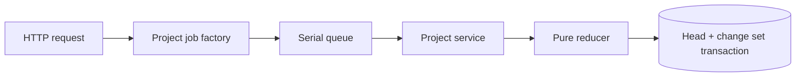

# Capability — Project

Project is the durable scope root for project identity, descriptive metadata, lifecycle, preferences, and revision history. Every operation carries `userId` and `projectId`; every Project-owned row persists that scope explicitly.

## Purpose and boundary

Project answers one question: **which durable project is this request about, and what is the current descriptive state of that project?**

Project owns:

- the stable `projectId`;
- the `userId + projectId` scope;
- name, description, status, and bounded project preferences;
- project aggregate revision;
- immutable Project change sets and idempotent submissions.

Workspace state, Questions, Contexts, Sources, Evidence, Research, Knowledge, editable Resources, and Automation remain independently authoritative capabilities. Each capability carries the Project scope while retaining its own tables, operations, and revisions.

Knowledge admission is closed to immutable Source Versions, admitted Evidence, and literal Media OCR. Project metadata remains descriptive scope state.

## Runtime placement

```plain text
apps/backend/src/3-capabilities/project/
  domain/
    model.ts
    operations.ts
    reducer.ts
  application/
    service.ts
  ports/
    repository.ts
  persistence/
    migrations/
      001-project.ts
    sqliteProjectRepository.ts
  index.ts

apps/backend/src/4-job-wiring/project/
  registerProjectEndpointMappings.ts
  projectJobFactories.ts
```

Project is composed into the Fastify backend. The `ProjectRepository` interface belongs to `ports/repository.ts`; the concrete SQLite implementation and migrations belong to Project's `persistence/` directory. `1-init` obtains the Platform Database handle, constructs `SqliteProjectRepository`, and injects it together with clock and ID ports.

## Public operations

| Operation | Result |
|---|---|
| `project.create` | Creates the initial resolved project aggregate at revision 1. |
| `project.get` | Returns a project by `userId + projectId`. |
| `project.list` | Lists projects within `userId`, filtered by lifecycle and cursor. |
| `project.revise` | Applies a closed batch of metadata operations with compare-and-swap. |
| `project.archive` | Changes lifecycle to `archived` while retaining the project aggregate and history. |
| `project.restore` | Returns an archived project to `active`. |

Supported revision operations are `set_name`, `set_description`, `set_status`, and `set_preferences`. Preferences use a versioned, bounded JSON envelope; queryable domain settings use typed capability-owned fields.

## Request-to-job mapping

| Request | Queue | Response | Reason |
|---|---|---|---|
| create, revise, archive, restore | `serial` | `inline` | Canonical mutations execute in accepted order. |
| get, list | `concurrent` | `inline` | Independent database reads can share the bounded pool. |

The route validates transport input and produces a request envelope. `projectJobFactories.ts` captures the Project service method and assigns the queue. All Project operations complete inline.

## Aggregate and change-set model

The canonical head is a fully resolved aggregate:

```typescript
interface Project {
  projectId: string;
  userId: string;
  revision: number;
  name: string;
  description: string;
  status: "active" | "archived";
  preferences: {
    schemaVersion: 1;
    data: Record<string, unknown>;
  };
  createdAt: string;
  updatedAt: string;
}

type ProjectOperation =
  | { kind: "set_name"; name: string }
  | { kind: "set_description"; description: string }
  | { kind: "set_status"; status: "active" | "archived" }
  | {
      kind: "set_preferences";
      preferences: Project["preferences"];
    };

interface ReviseProjectRequest {
  scope: { userId: string; projectId: string };
  expectedRevision: number;
  submissionId: string;
  operations: readonly ProjectOperation[];
}

type ReviseProjectResult =
  | { kind: "accepted"; project: Project; changeSetId: string }
  | { kind: "idempotent_replay"; project: Project; changeSetId: string }
  | { kind: "revision_conflict"; expected: number; actual: number };

interface ProjectRepository {
  create(input: {
    project: Project;
    submissionId: string;
    initialOperations: readonly ProjectOperation[];
  }): Promise<Project>;
  get(scope: { userId: string; projectId: string }): Promise<Project | null>;
  list(input: {
    userId: string;
    status?: Project["status"];
    cursor?: string;
    limit: number;
  }): Promise<{ items: Project[]; nextCursor?: string }>;
  revise(input: ReviseProjectRequest): Promise<ReviseProjectResult>;
}
```

Every mutation supplies `expectedRevision` and `submissionId`. In one transaction the repository:

1. returns the previously committed result for an identical submission retry;
2. rejects a stale expected revision;
3. applies the closed operation batch through a pure reducer;
4. validates the complete next aggregate;
5. writes the resolved head at `revision + 1`;
6. appends an immutable change set containing operations and their inverse.

Inverse operations make every accepted metadata and lifecycle change compensable. Archive and restore use the same revision protocol.

## Canonical tables

```sql
CREATE TABLE projects (
  project_id TEXT PRIMARY KEY,
  user_id TEXT NOT NULL,
  revision INTEGER NOT NULL CHECK (revision >= 1),
  name TEXT NOT NULL,
  description TEXT NOT NULL DEFAULT '',
  status TEXT NOT NULL CHECK (status IN ('active', 'archived')),
  preferences_schema_version INTEGER NOT NULL DEFAULT 1,
  preferences_json TEXT NOT NULL DEFAULT '{}',
  created_at TEXT NOT NULL,
  updated_at TEXT NOT NULL,
  UNIQUE (user_id, project_id)
);

CREATE TABLE project_change_sets (
  change_set_id TEXT PRIMARY KEY,
  user_id TEXT NOT NULL,
  project_id TEXT NOT NULL,
  revision INTEGER NOT NULL,
  base_revision INTEGER NOT NULL,
  submission_id TEXT NOT NULL,
  operations_json TEXT NOT NULL,
  inverse_json TEXT NOT NULL,
  author_kind TEXT NOT NULL CHECK (author_kind IN ('user', 'system')),
  accepted_at TEXT NOT NULL,
  FOREIGN KEY (user_id, project_id)
    REFERENCES projects(user_id, project_id)
);
```

Exact indexes:

```sql
CREATE INDEX projects_user_status_updated
  ON projects(user_id, status, updated_at DESC, project_id);

CREATE UNIQUE INDEX project_change_sets_project_revision
  ON project_change_sets(user_id, project_id, revision);

CREATE UNIQUE INDEX project_change_sets_submission
  ON project_change_sets(user_id, project_id, submission_id);

CREATE INDEX project_change_sets_history
  ON project_change_sets(user_id, project_id, revision DESC, change_set_id);
```

Project is the scope root: `project_id` is globally opaque, while `(user_id, project_id)` is the enforced scope key. Every Project-owned child repeats both columns and references that composite key. Downstream capabilities apply the same scoping law inside their own table families through capability-owned persistence.

The JSON preferences envelope is canonical and bounded. Queryable domain state belongs in typed columns or in the capability that owns that state.

## Derived projections

The **Project List Projection** is a rebuildable read projection over canonical `projects` rows using `projects_user_status_updated`. It provides deterministic lifecycle filtering, cursor pagination, and bounded case-insensitive name filtering. Canonical Project state remains sufficient to recreate it.

## Operation semantics

### Create

`project.create` receives a server-assigned `projectId`, validated scope, bounded initial metadata, and a `submissionId`. Creation writes revision `1` and the initial change set in one transaction. A repeated submission with the same digest returns the committed Project. Reuse of the same submission identifier with a different digest returns `idempotency_mismatch`.

### Read and list

`project.get` resolves the exact composite scope and returns the current aggregate revision. `project.list` uses keyset pagination over `(updated_at DESC, project_id)` so inserts and updates have deterministic cursor behavior. Lifecycle and name filters are explicit request fields and part of the cursor digest.

### Revise

`project.revise` accepts a non-empty ordered operation array. The reducer applies operations in array order, validates the fully resolved candidate, computes exact inverses, and emits the next aggregate. Multiple operations in one request advance the Project by one revision because they represent one accepted user intent.

### Archive and restore

Archive and restore are typed lifecycle revisions. The Project remains addressable by exact ID at every lifecycle state. List queries include lifecycle explicitly, and downstream capability rows retain their `project_id` scope. Restoration creates a new revision and records the prior archived state in the inverse.

### Committed fact

After the transaction commits, Project emits a narrow fact for composition:

```typescript
interface ProjectChanged {
  kind: "project.changed";
  userId: string;
  projectId: string;
  revision: number;
  changeSetId: string;
  changedFields: readonly ("name" | "description" | "status" | "preferences")[];
  acceptedAt: string;
}
```

Workspace and activity projections may consume this fact. The fact contains identity and revision metadata rather than a second mutable copy of Project state.

## Concurrency and collaboration behavior

The serial queue establishes accepted order inside a backend process. Revision compare-and-swap establishes correctness across concurrent clients and across backend processes sharing the same database. The repository updates the head with a predicate equivalent to:

```sql
UPDATE projects
SET revision = :next_revision,
    name = :name,
    description = :description,
    status = :status,
    preferences_json = :preferences_json,
    updated_at = :updated_at
WHERE user_id = :user_id
  AND project_id = :project_id
  AND revision = :expected_revision;
```

An affected-row count of zero triggers an idempotency lookup followed by a typed revision conflict. Clients then reload the current Project, preserve the user's uncommitted intent, and resubmit against the new revision. This protocol supports collaborative mutation while keeping the canonical head and history coherent.

## Dependencies and ports

Project depends only on:

- `ProjectRepository`;
- `Clock`;
- `IdGenerator`.

Other capabilities may depend on the narrow read port:

```typescript
interface ProjectReader {
  getProject(scope: { userId: string; projectId: string }): Promise<ProjectSnapshot>;
}
```

The port confirms project identity and lifecycle. Project uses the Platform Database, clock, and ID generator interfaces.

## Key flow



## Invariants

1. `projectId` and `userId` come from the validated request scope.
2. Project name is non-empty and bounded; description and preferences are bounded.
3. Revision increases by exactly one for each accepted mutation.
4. A `submissionId` has one stable result within a project.
5. A stale `expectedRevision` returns a typed conflict and preserves the current head.
6. The resolved head and its change set commit atomically.
7. Archive retains downstream capability data and Project history.
8. Project depends on Platform interfaces and exposes a narrow `ProjectReader` to feature capabilities.

## Acceptance criteria

- Creating a project returns revision 1 and persists its `userId` and `projectId`.
- Two mutations submitted against the same revision produce one success and one typed revision conflict.
- Repeating a committed `submissionId` returns the original result at the same revision.
- Project list ordering is deterministic.
- Archive and restore each append a change set and preserve all project data.
- Project composition exposes narrow ports while preserving capability-local persistence.

## References

- [Architecture — Icarus Ideal Backend Runtime, Capabilities & Data Map](https://app.notion.com/p/3aeb6410e50281e1b73dd94e49d2d5d4)
- [Architecture — Icarus Runtime Foundation & Repository Boundaries](https://app.notion.com/p/3adb6410e50281e09d83ed36daacf8d8)
- [Architecture — Taurus Layered Application Model](https://app.notion.com/p/3acb6410e502812bb4e0ff2c91ff753f)
