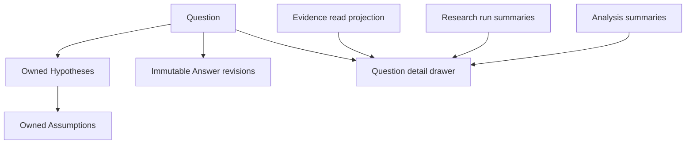

# Capability — Questions

Questions is the canonical inquiry capability. A Question aggregate owns its Hypotheses, the Assumptions under each Hypothesis, and immutable Answer revisions. Research owns investigation runs and candidates; Evidence owns source-grounded assertions and citations.

## Purpose and boundary

Questions preserves what the project is trying to learn and how the current answer developed over time.

It owns:

- Question identity, wording, description, status, priority, tags, and revision;
- Hypotheses contained by exactly one Question;
- Assumptions contained by exactly one Hypothesis;
- immutable Answer revisions and the Question's current-answer pointer;
- Question change sets, inverses, and idempotent submissions.

Research plans and runs, Sources, Evidence bodies and citations, Knowledge projections, Analyses, charts, and authored Resources retain their capability owners. Questions assembles a read projection from narrow Evidence, Research, and Analysis ports for the Overview drawer while keeping the canonical Question aggregate focused.

A Question Answer or conclusion becomes Knowledge-eligible through admission as canonical Evidence. Knowledge otherwise receives Source Versions, admitted Evidence, and literal Media OCR.

## Runtime placement

```plain text
apps/backend/src/3-capabilities/questions/
  domain/
    model.ts
    operations.ts
    reducer.ts
  application/
    service.ts
    detailProjection.ts
  ports/
    repository.ts
    detailReaders.ts
  persistence/
    migrations/
      001-questions.ts
    sqliteQuestionsRepository.ts
  index.ts

apps/backend/src/4-job-wiring/questions/
  registerQuestionEndpointMappings.ts
  questionJobFactories.ts
```

Questions is composed into the backend. The repository interface is a Questions port; Questions owns its migrations and `SqliteQuestionsRepository`. `1-init` instantiates that adapter with the Platform Database and injects it. SQLite transactions cover a single Question aggregate per mutation.

## Public operations

| Operation | Effect |
|---|---|
| `questions.create` | Creates a Question at revision 1. |
| `questions.get` | Reads canonical Question state. |
| `questions.get-detail` | Assembles the drawer projection from current Question state and narrow read ports. |
| `questions.list` | Lists/filter Questions for Overview. |
| `questions.revise` | Applies metadata operations. |
| `questions.add-hypothesis` | Adds a Hypothesis owned by the Question. |
| `questions.revise-hypothesis` | Changes statement, status, confidence, or order. |
| `questions.remove-hypothesis` | Removes it from the current head; history retains the inverse. |
| `questions.add-assumption` / `revise-assumption` / `remove-assumption` | Mutates assumptions inside a Hypothesis. |
| `questions.publish-answer` | Appends an immutable Answer revision and advances `currentAnswerId`. |
| `questions.set-current-answer` | Moves the pointer to an existing Answer revision, including undo. |
| `questions.archive` / `restore` | Changes lifecycle while retaining history. |
| `questions.undo` / `redo` | Applies a compensating Question change set. |

Question status begins with `open | investigating | answered | archived`. Hypothesis status begins with `proposed | testing | supported | weakened | rejected`. Assumption status begins with `untested | testing | held | failed`.

## Request-to-job mapping

| Request | Queue | Response |
|---|---|---|
| create, revise, hypothesis/assumption mutations, publish answer, archive/restore, undo/redo | `serial` | `inline` |
| get, list | `concurrent` | `inline` |
| get-detail | `concurrent` | `inline` |

Research produces an Answer candidate. Canonical acceptance occurs through a serial `questions.publish-answer` request with its own expected revision.

## Aggregate and revision model

Question, Hypothesis, and Assumption current rows form one aggregate. Every child mutation advances the parent Question revision and appends one Question change set.

```typescript
interface Scope {
  userId: string;
  projectId: string;
}

type QuestionStatus = "open" | "investigating" | "answered" | "archived";
type HypothesisStatus =
  | "proposed"
  | "testing"
  | "supported"
  | "weakened"
  | "rejected";

interface Hypothesis {
  hypothesisId: string;
  statement: string;
  status: HypothesisStatus;
  confidence: number | null;
  ordinal: number;
  assumptions: Assumption[];
}

interface QuestionAggregate {
  questionId: string;
  userId: string;
  projectId: string;
  revision: number;
  text: string;
  description: string;
  status: QuestionStatus;
  priority: number;
  tags: string[];
  currentAnswerId: string | null;
  hypotheses: Hypothesis[];
}

interface Assumption {
  assumptionId: string;
  statement: string;
  status: "untested" | "testing" | "held" | "failed";
  testMethod: string;
  ordinal: number;
}

type HypothesisPatch = Partial<
  Pick<Hypothesis, "statement" | "status" | "confidence" | "ordinal">
>;

type AssumptionPatch = Partial<
  Pick<Assumption, "statement" | "status" | "testMethod" | "ordinal">
>;

interface AnswerBasisSnapshot {
  evidence: readonly { evidenceId: string; revision: number }[];
  researchRuns: readonly { runId: string; revision: number }[];
  analyses: readonly { analysisId: string; revision: number }[];
}

interface QuestionAnswer {
  answerId: string;
  questionId: string;
  answerRevision: number;
  body: string;
  confidence: number | null;
  caveats: readonly string[];
  basisSnapshot: AnswerBasisSnapshot;
  createdBy: string;
  createdAt: string;
}

interface EvidenceSummary {
  evidenceId: string;
  revision: number;
  statement: string;
  reviewState: "proposed" | "admitted" | "rejected" | "deprecated";
  relationships: readonly string[];
}

interface ResearchRunSummary {
  runId: string;
  mode: "question" | "hypothesis" | "discovery";
  status: string;
  updatedAt: string;
}

interface AnalysisSummary {
  analysisId: string;
  revision: number;
  title: string;
  updatedAt: string;
}

type QuestionOperation =
  | { kind: "set_text"; text: string }
  | { kind: "set_description"; description: string }
  | { kind: "set_status"; status: QuestionStatus }
  | { kind: "set_priority"; priority: number }
  | { kind: "set_tags"; tags: readonly string[] }
  | { kind: "add_hypothesis"; hypothesis: Hypothesis }
  | { kind: "revise_hypothesis"; hypothesisId: string; patch: HypothesisPatch }
  | { kind: "remove_hypothesis"; hypothesisId: string }
  | { kind: "add_assumption"; hypothesisId: string; assumption: Assumption }
  | {
      kind: "revise_assumption";
      hypothesisId: string;
      assumptionId: string;
      patch: AssumptionPatch;
    }
  | { kind: "remove_assumption"; hypothesisId: string; assumptionId: string }
  | { kind: "set_current_answer"; answerId: string | null };

interface PublishAnswerRequest {
  scope: Scope;
  questionId: string;
  expectedRevision: number;
  submissionId: string;
  answer: {
    body: string;
    confidence: number | null;
    caveats: readonly string[];
    basisSnapshot: AnswerBasisSnapshot;
  };
}

interface QuestionDetailProjection {
  question: QuestionAggregate;
  currentAnswer: QuestionAnswer | null;
  answerHistory: readonly QuestionAnswer[];
  evidence: readonly EvidenceSummary[];
  researchRuns: readonly ResearchRunSummary[];
  analyses: readonly AnalysisSummary[];
}
```

`questions.revise` carries `expectedRevision` and `submissionId`. The pure reducer validates the complete aggregate and emits an exact inverse. Publishing an answer inserts a new immutable `question_answers` row and advances the current-answer pointer in the aggregate. Undoing publication restores the prior pointer while retaining every Answer revision.

## Canonical tables

```sql
CREATE TABLE questions (
  question_id TEXT PRIMARY KEY,
  user_id TEXT NOT NULL,
  project_id TEXT NOT NULL,
  revision INTEGER NOT NULL CHECK (revision >= 1),
  text TEXT NOT NULL,
  description TEXT NOT NULL DEFAULT '',
  status TEXT NOT NULL CHECK (
    status IN ('open', 'investigating', 'answered', 'archived')
  ),
  priority INTEGER NOT NULL DEFAULT 0,
  tags_json TEXT NOT NULL DEFAULT '[]',
  current_answer_id TEXT,
  created_at TEXT NOT NULL,
  updated_at TEXT NOT NULL,
  UNIQUE (user_id, project_id, question_id),
  FOREIGN KEY (user_id, project_id, question_id, current_answer_id)
    REFERENCES question_answers(
      user_id, project_id, question_id, answer_id
    )
);

CREATE TABLE question_hypotheses (
  hypothesis_id TEXT PRIMARY KEY,
  user_id TEXT NOT NULL,
  project_id TEXT NOT NULL,
  question_id TEXT NOT NULL,
  statement TEXT NOT NULL,
  status TEXT NOT NULL CHECK (
    status IN ('proposed', 'testing', 'supported', 'weakened', 'rejected')
  ),
  confidence REAL CHECK (
    confidence IS NULL OR (confidence >= 0.0 AND confidence <= 1.0)
  ),
  ordinal INTEGER NOT NULL,
  created_at TEXT NOT NULL,
  updated_at TEXT NOT NULL,
  UNIQUE (user_id, project_id, question_id, hypothesis_id),
  FOREIGN KEY (user_id, project_id, question_id)
    REFERENCES questions(user_id, project_id, question_id)
);

CREATE TABLE hypothesis_assumptions (
  assumption_id TEXT PRIMARY KEY,
  user_id TEXT NOT NULL,
  project_id TEXT NOT NULL,
  question_id TEXT NOT NULL,
  hypothesis_id TEXT NOT NULL,
  statement TEXT NOT NULL,
  status TEXT NOT NULL CHECK (
    status IN ('untested', 'testing', 'held', 'failed')
  ),
  test_method TEXT NOT NULL DEFAULT '',
  ordinal INTEGER NOT NULL,
  created_at TEXT NOT NULL,
  updated_at TEXT NOT NULL,
  UNIQUE (user_id, project_id, question_id, hypothesis_id, assumption_id),
  FOREIGN KEY (user_id, project_id, question_id, hypothesis_id)
    REFERENCES question_hypotheses(user_id, project_id, question_id, hypothesis_id)
);

CREATE TABLE question_answers (
  answer_id TEXT PRIMARY KEY,
  user_id TEXT NOT NULL,
  project_id TEXT NOT NULL,
  question_id TEXT NOT NULL,
  answer_revision INTEGER NOT NULL,
  body TEXT NOT NULL,
  confidence REAL CHECK (
    confidence IS NULL OR (confidence >= 0.0 AND confidence <= 1.0)
  ),
  caveats_json TEXT NOT NULL DEFAULT '[]',
  basis_snapshot_json TEXT NOT NULL,
  created_by TEXT NOT NULL,
  created_at TEXT NOT NULL,
  UNIQUE (user_id, project_id, question_id, answer_id),
  FOREIGN KEY (user_id, project_id, question_id)
    REFERENCES questions(user_id, project_id, question_id)
);

CREATE TABLE question_change_sets (
  change_set_id TEXT PRIMARY KEY,
  user_id TEXT NOT NULL,
  project_id TEXT NOT NULL,
  question_id TEXT NOT NULL,
  revision INTEGER NOT NULL,
  base_revision INTEGER NOT NULL,
  submission_id TEXT NOT NULL,
  operations_json TEXT NOT NULL,
  inverse_json TEXT NOT NULL,
  compensation_kind TEXT CHECK (compensation_kind IN ('undo', 'redo')),
  compensates_change_set_id TEXT,
  accepted_at TEXT NOT NULL,
  UNIQUE (user_id, project_id, question_id, change_set_id),
  FOREIGN KEY (user_id, project_id, question_id)
    REFERENCES questions(user_id, project_id, question_id),
  FOREIGN KEY (
    user_id, project_id, question_id, compensates_change_set_id
  ) REFERENCES question_change_sets(
    user_id, project_id, question_id, change_set_id
  )
);
```

Exact indexes:

```sql
CREATE INDEX questions_overview
  ON questions(user_id, project_id, status, priority DESC, updated_at DESC, question_id);

CREATE INDEX questions_project_updated
  ON questions(user_id, project_id, updated_at DESC, question_id);

CREATE INDEX question_hypotheses_order
  ON question_hypotheses(user_id, project_id, question_id, ordinal, hypothesis_id);

CREATE INDEX question_hypotheses_status
  ON question_hypotheses(user_id, project_id, question_id, status, hypothesis_id);

CREATE INDEX hypothesis_assumptions_order
  ON hypothesis_assumptions(user_id, project_id, hypothesis_id, ordinal, assumption_id);

CREATE UNIQUE INDEX question_answers_revision
  ON question_answers(user_id, project_id, question_id, answer_revision);

CREATE INDEX question_answers_latest
  ON question_answers(user_id, project_id, question_id, answer_revision DESC, answer_id);

CREATE UNIQUE INDEX question_change_sets_revision
  ON question_change_sets(user_id, project_id, question_id, revision);

CREATE UNIQUE INDEX question_change_sets_submission
  ON question_change_sets(user_id, project_id, question_id, submission_id);

CREATE INDEX question_change_sets_compensation
  ON question_change_sets(user_id, project_id, question_id, compensates_change_set_id)
  WHERE compensates_change_set_id IS NOT NULL;
```

Every Question-owned child repeats the owning `user_id + project_id` and references a composite parent key that includes the full containment path. Composite keys bind Hypotheses to their Question and Assumptions to their Hypothesis. External Evidence, Research, and Analysis references use typed ports.

## Derived projections

`questions.get-detail` builds the named **Question Detail Projection**. It combines:

- canonical Question/Hypothesis/Assumption/Answer state;
- Evidence summaries linked to the Question, its Hypotheses or Assumptions, or the current Answer;
- Research run summaries;
- related Analysis summaries.

The projection is rebuildable from canonical Questions state and its narrow read ports.

## Dependencies and narrow ports

```typescript
interface QuestionEvidenceReader {
  listForTargets(scope: Scope, targets: InquiryTargetRef[]): Promise<EvidenceSummary[]>;
}

interface QuestionResearchReader {
  listRuns(scope: Scope, questionId: string): Promise<ResearchRunSummary[]>;
}

interface QuestionAnalysisReader {
  listAnalyses(scope: Scope, questionId: string): Promise<AnalysisSummary[]>;
}
```

Questions uses the Platform Database, clock, and ID generator. Research reads version-pinned inquiry state through `QuestionReader`; canonical mutations enter through Questions commands.

## Key flow



## Invariants

1. Every Hypothesis belongs to exactly one Question.
2. Every Assumption belongs to one Hypothesis and repeats its Question scope.
3. Child mutations advance the owning Question revision.
4. Answer revisions are immutable and unique within a Question.
5. The current answer pointer either resolves to that Question or is null.
6. Research run history remains Research-owned and appears through the detail projection.
7. Evidence authority is represented by Evidence-owned links and versioned basis snapshots.
8. `expectedRevision` and `submissionId` govern every mutation.
9. Removing a child from the current head preserves the immutable change history needed for compensation.

## Acceptance criteria

- Creating a Hypothesis through a Question mutation advances only that Question.
- Every Hypothesis resolves through a valid owning Question.
- Publishing an Answer preserves the previous Answer and updates the head atomically.
- Undoing answer publication restores the pointer and retains every Answer revision.
- The detail projection shows linked Evidence and Research through typed read ports.
- Question and Hypothesis Research modes resolve the correct Question-owned objects; Discovery mode can propose a new Question candidate.

## References

- [Product — Icarus Complete Product Definition](https://app.notion.com/p/3aeb6410e502810ba9c0c26442d5255a)
- [Architecture — Icarus Ideal Backend Runtime, Capabilities & Data Map](https://app.notion.com/p/3aeb6410e50281e1b73dd94e49d2d5d4)
- [Overview — Taurus Product Doctrine & Interview Ledger](https://app.notion.com/p/3abb6410e50281198209dbff65b8d42b)
