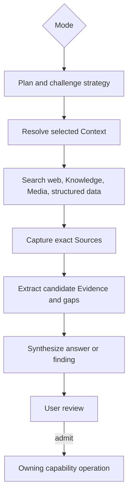

# Capability — Research

Research is the durable investigation runtime behind the permanent Research screen. It supports exactly three modes—Question, Hypothesis, and Discovery—and owns research attempts, plans, execution records, candidates, and synthesis.

## Purpose and boundary

Research turns an inquiry into a traceable investigation:

```plain text
frame → decompose → plan → retrieve → inspect → extract → challenge → synthesize → review
```

It owns:

- Research Runs and their version-pinned input scope;
- plans, steps, queries, retrieved result references, and run events;
- candidate Hypotheses, Assumptions, Evidence, gaps, and Answers;
- run synthesis, diagnostics, usage, and completion state.

Authority is distributed through explicit integration boundaries:

- Questions owns Questions, Hypotheses, Assumptions, and Answer revisions;
- Sources owns captured websites, uploaded files, and immutable native-Resource snapshots;
- Evidence owns admitted source-grounded assertions and citations;
- Knowledge and Media own their retrieval projections;
- Platform Intelligence and Web Retrieval provide injected model and retrieval interfaces.

Candidate admission calls the owning capability. Research records the accepted canonical object reference on the candidate.

**Knowledge admission law:** Research can consume Structured Data and Analysis results while testing an inquiry. Knowledge accepts Source Versions, admitted Evidence, and literal Media OCR. Native editor content enters retrieval through a Sources `native_resource` Source Version; a structured or analytic result enters through a captured Source Version or admitted Evidence.

## Three modes

| Mode | Input | Required behavior |
|---|---|---|
| `question` | Existing `questionId` or free-form question text | Clarify the question, propose competing Hypotheses and Assumptions, gather supporting and disconfirming material, identify gaps, and produce an Answer candidate. |
| `hypothesis` | Existing Question-owned `hypothesisId` or free-form hypothesis | Prefer attempts to invalidate or qualify the Hypothesis; test its Assumptions; recommend a Question to own a free-form Hypothesis. |
| `discovery` | Topic, entity, market, event, or bounded objective | Find and organize useful material from an open frame; propose Questions and Evidence candidates. |

An existing `hypothesisId` always resolves through its owning Question. A free-form hypothesis remains a Research candidate until accepted into a Question.

## Runtime placement

```plain text
apps/backend/src/3-capabilities/research/
  domain/
    model.ts
    modes.ts
  application/
    planner.ts
    orchestrator.ts
    service.ts
  ports/
    repository.ts
    inquiryReaders.ts
    retrievalPorts.ts
  persistence/
    migrations/
      001-research.ts
    sqliteResearchRepository.ts
  index.ts

apps/backend/src/4-job-wiring/research/
  registerResearchEndpointMappings.ts
  researchJobFactories.ts
  researchPorts.ts
```

Research is composed into the backend and uses the bounded concurrent pool. Research owns its repository port, migrations, and `SqliteResearchRepository`; `1-init` instantiates the adapter with the Platform Database and injects it. Run state, step attempts, candidates, and events are durable in SQLite. Polling reads the durable Run projection. Startup recovery marks an interrupted active attempt and makes explicit retry available.

## Public operations

| Operation | Effect |
|---|---|
| `research.start-question` | Starts Question mode from a Question snapshot or free-form question. |
| `research.start-hypothesis` | Starts Hypothesis mode from an owned Hypothesis snapshot or free-form hypothesis. |
| `research.start-discovery` | Starts Discovery mode. |
| `research.get-run` | Returns run state, steps, candidates, and synthesis. |
| `research.list-runs` | Lists runs by project, mode, Question, Hypothesis, or status. |
| `research.cancel-run` | Requests cooperative cancellation. |
| `research.retry-run` | Starts a new attempt pinned to the prior input, with explicit policy/model versions. |
| `research.review-candidate` | Records `accepted`, `rejected`, or `deferred` and the canonical object created elsewhere. |

Candidate admission uses separate operations such as `questions.add-hypothesis`, `questions.publish-answer`, and `evidence.admit-from-research`.

## Request-to-job mapping

| Request | Queue | Response | Reason |
|---|---|---|---|
| start Question/Hypothesis/Discovery | `concurrent` | `deferred` | Retrieval and model calls occupy a bounded pool slot; overflow waits in the concurrent FIFO queue. |
| get/list | `concurrent` | `inline` | Read-only, independently executable. |
| cancel | `serial` | `inline` | Canonical run-state mutation and cancellation request. |
| review candidate | `serial` | `inline` | Small canonical state transition. |
| retry | `concurrent` | `deferred` | Creates a new run attempt linked to the prior run. |

When a concurrent slot begins a start job, it creates the Run, returns `202 + runId`, and continues the orchestration through the current deferred-work contract. Queue selection remains capability-owned.

## Run state and revision model

Research is a process record and uses:

- a monotonic `revision` on `research_runs`;
- an append-only `research_run_events` stream;
- compare-and-swap state transitions;
- immutable step attempts and candidate records.

Each accepted transition increments the Run revision and appends one event in the same transaction. Retrying creates a new Run linked by `retry_of_run_id`. Cancellation retains completed steps and moves the Run through a terminal transition.

## Core TypeScript model

```typescript
interface Scope {
  userId: string;
  projectId: string;
}

interface ResolvedContextSnapshot {
  contextIds: readonly string[];
  definitionHashes: readonly string[];
  sources: readonly { sourceVersionId: string }[];
  evidence: readonly { evidenceId: string; revision: number }[];
  resources: readonly {
    kind: "document" | "slides" | "spreadsheet";
    id: string;
    revision: number;
  }[];
  structuredInputs: readonly { kind: "table" | "variable"; id: string; revision: number }[];
}

interface ResolvedIntelligenceRoute {
  purpose: string;
  strength: "low" | "medium" | "high";
  speed: "low" | "medium" | "high";
  provider: string;
  model: string;
  effort?: string;
}

interface ResearchPlan {
  objective: string;
  questions: readonly string[];
  searchChannels: readonly ("web" | "knowledge" | "media" | "structured_data")[];
  steps: readonly {
    sequence: number;
    kind: ResearchStep["kind"];
    purpose: string;
  }[];
}

interface ResearchSynthesis {
  answer: string | null;
  findings: readonly string[];
  disconfirmingFindings: readonly string[];
  unresolvedGaps: readonly string[];
  candidateIds: readonly string[];
}

interface ResearchDiagnostic {
  code: string;
  message: string;
  retryable: boolean;
}

type ResearchMode = "question" | "hypothesis" | "discovery";
type ResearchStatus =
  | "queued"
  | "planning"
  | "retrieving"
  | "extracting"
  | "challenging"
  | "synthesizing"
  | "awaiting_review"
  | "completed"
  | "cancelled"
  | "failed"
  | "interrupted";

type ResearchSubject =
  | {
      mode: "question";
      questionId?: string;
      questionRevision?: number;
      questionText: string;
    }
  | {
      mode: "hypothesis";
      questionId?: string;
      questionRevision?: number;
      hypothesisId?: string;
      hypothesisStatement: string;
    }
  | {
      mode: "discovery";
      topic: string;
      objective: string;
    };

interface ResearchRun {
  runId: string;
  userId: string;
  projectId: string;
  revision: number;
  mode: ResearchMode;
  subject: ResearchSubject;
  objective: string;
  contextSnapshot: ResolvedContextSnapshot;
  policyVersion: string;
  intelligenceRoutes: readonly ResolvedIntelligenceRoute[];
  status: ResearchStatus;
  plan: ResearchPlan | null;
  synthesis: ResearchSynthesis | null;
  retryOfRunId: string | null;
  cancelRequested: boolean;
  createdAt: string;
  updatedAt: string;
}

interface ResearchStep {
  stepId: string;
  runId: string;
  sequence: number;
  attempt: number;
  kind:
    | "frame"
    | "decompose"
    | "plan"
    | "retrieve"
    | "inspect"
    | "extract"
    | "challenge"
    | "synthesize";
  status: "queued" | "running" | "completed" | "failed" | "cancelled";
  input: unknown;
  output?: unknown;
  diagnostic?: ResearchDiagnostic;
}

interface QuestionCandidatePayload {
  text: string;
  description: string;
}

interface HypothesisCandidatePayload {
  statement: string;
  recommendedQuestionId?: string;
  assumptions: readonly string[];
}

interface AssumptionCandidatePayload {
  statement: string;
  hypothesisId?: string;
  proposedTest: string;
}

interface EvidenceCandidatePayload {
  statement: string;
  evidenceKind: "quotation" | "observation" | "calculation" | "inference";
  citations: readonly {
    sourceVersionId: string;
    locator: unknown;
    exactQuote?: string;
  }[];
}

interface AnswerCandidatePayload {
  questionId?: string;
  body: string;
  caveats: readonly string[];
  basisCandidateIds: readonly string[];
}

interface GapCandidatePayload {
  description: string;
  missingInputs: readonly string[];
}

type ResearchCandidate =
  | Candidate<"question", QuestionCandidatePayload>
  | Candidate<"hypothesis", HypothesisCandidatePayload>
  | Candidate<"assumption", AssumptionCandidatePayload>
  | Candidate<"evidence", EvidenceCandidatePayload>
  | Candidate<"answer", AnswerCandidatePayload>
  | Candidate<"gap", GapCandidatePayload>;

interface Candidate<K extends string, P> {
  candidateId: string;
  runId: string;
  kind: K;
  payload: P;
  confidence: number | null;
  reviewState: "unreviewed" | "accepted" | "rejected" | "deferred";
  admittedObject?: {
    kind: "question" | "hypothesis" | "assumption" | "evidence" | "answer";
    id: string;
  };
}

interface StartResearchRequest {
  scope: Scope;
  subject: ResearchSubject;
  contextIds: readonly string[];
  policyVersion: string;
  submissionId: string;
}

interface ReviewResearchCandidateRequest {
  scope: Scope;
  runId: string;
  candidateId: string;
  expectedRunRevision: number;
  submissionId: string;
  decision: "accepted" | "rejected" | "deferred";
  admittedObject?: Candidate<string, unknown>["admittedObject"];
}
```

At Run creation, Research resolves each required Intelligence cast and stores the resulting purpose, strength, speed, provider, model, and effort in `intelligenceRoutes`. A retry stores its own declared policy and route snapshot while retaining the prior Run for comparison.

## Canonical tables

```sql
CREATE TABLE research_runs (
  run_id TEXT PRIMARY KEY,
  user_id TEXT NOT NULL,
  project_id TEXT NOT NULL,
  revision INTEGER NOT NULL CHECK (revision >= 1),
  mode TEXT NOT NULL CHECK (mode IN ('question', 'hypothesis', 'discovery')),
  question_id TEXT,
  hypothesis_id TEXT,
  objective TEXT NOT NULL,
  subject_snapshot_json TEXT NOT NULL,
  context_snapshot_json TEXT NOT NULL,
  policy_version TEXT NOT NULL,
  intelligence_routes_json TEXT NOT NULL,
  submission_id TEXT NOT NULL,
  request_digest TEXT NOT NULL,
  status TEXT NOT NULL CHECK (
    status IN (
      'queued', 'planning', 'retrieving', 'extracting',
      'challenging', 'synthesizing', 'awaiting_review',
      'completed', 'cancelled', 'failed', 'interrupted'
    )
  ),
  plan_json TEXT,
  synthesis_json TEXT,
  retry_of_run_id TEXT,
  cancel_requested INTEGER NOT NULL DEFAULT 0,
  started_at TEXT,
  completed_at TEXT,
  created_at TEXT NOT NULL,
  updated_at TEXT NOT NULL,
  UNIQUE (user_id, project_id, run_id),
  FOREIGN KEY (user_id, project_id, retry_of_run_id)
    REFERENCES research_runs(user_id, project_id, run_id)
);

CREATE TABLE research_steps (
  step_id TEXT PRIMARY KEY,
  user_id TEXT NOT NULL,
  project_id TEXT NOT NULL,
  run_id TEXT NOT NULL,
  sequence INTEGER NOT NULL,
  attempt INTEGER NOT NULL DEFAULT 1,
  kind TEXT NOT NULL CHECK (
    kind IN (
      'frame', 'decompose', 'plan', 'retrieve', 'inspect',
      'extract', 'challenge', 'synthesize'
    )
  ),
  status TEXT NOT NULL CHECK (
    status IN ('queued', 'running', 'completed', 'failed', 'cancelled')
  ),
  input_json TEXT NOT NULL,
  output_json TEXT,
  diagnostic_json TEXT,
  started_at TEXT,
  completed_at TEXT,
  UNIQUE (user_id, project_id, run_id, step_id),
  FOREIGN KEY (user_id, project_id, run_id)
    REFERENCES research_runs(user_id, project_id, run_id)
);

CREATE TABLE research_queries (
  query_id TEXT PRIMARY KEY,
  user_id TEXT NOT NULL,
  project_id TEXT NOT NULL,
  run_id TEXT NOT NULL,
  step_id TEXT NOT NULL,
  channel TEXT NOT NULL CHECK (channel IN ('web', 'knowledge', 'media', 'structured_data')),
  query_text TEXT NOT NULL,
  filters_json TEXT NOT NULL DEFAULT '{}',
  created_at TEXT NOT NULL,
  UNIQUE (user_id, project_id, run_id, query_id),
  FOREIGN KEY (user_id, project_id, run_id)
    REFERENCES research_runs(user_id, project_id, run_id),
  FOREIGN KEY (user_id, project_id, run_id, step_id)
    REFERENCES research_steps(user_id, project_id, run_id, step_id)
);

CREATE TABLE research_results (
  result_id TEXT PRIMARY KEY,
  user_id TEXT NOT NULL,
  project_id TEXT NOT NULL,
  run_id TEXT NOT NULL,
  query_id TEXT NOT NULL,
  source_id TEXT,
  source_version_id TEXT,
  origin_kind TEXT NOT NULL CHECK (
    origin_kind IN (
      'web_result', 'source_version', 'knowledge_match',
      'media_match', 'structured_result'
    )
  ),
  origin_ref_json TEXT NOT NULL,
  rank INTEGER NOT NULL,
  result_summary TEXT NOT NULL,
  extraction_status TEXT NOT NULL CHECK (
    extraction_status IN ('pending', 'extracted', 'skipped', 'failed')
  ),
  created_at TEXT NOT NULL,
  FOREIGN KEY (user_id, project_id, run_id)
    REFERENCES research_runs(user_id, project_id, run_id),
  FOREIGN KEY (user_id, project_id, run_id, query_id)
    REFERENCES research_queries(user_id, project_id, run_id, query_id)
);

CREATE TABLE research_candidates (
  candidate_id TEXT PRIMARY KEY,
  user_id TEXT NOT NULL,
  project_id TEXT NOT NULL,
  run_id TEXT NOT NULL,
  kind TEXT NOT NULL CHECK (kind IN ('question', 'hypothesis', 'assumption', 'evidence', 'answer', 'gap')),
  payload_json TEXT NOT NULL,
  confidence REAL CHECK (
    confidence IS NULL OR (confidence >= 0.0 AND confidence <= 1.0)
  ),
  review_state TEXT NOT NULL DEFAULT 'unreviewed' CHECK (
    review_state IN ('unreviewed', 'accepted', 'rejected', 'deferred')
  ),
  admitted_object_kind TEXT,
  admitted_object_id TEXT,
  created_at TEXT NOT NULL,
  reviewed_at TEXT,
  FOREIGN KEY (user_id, project_id, run_id)
    REFERENCES research_runs(user_id, project_id, run_id)
);

CREATE TABLE research_run_events (
  event_id TEXT PRIMARY KEY,
  user_id TEXT NOT NULL,
  project_id TEXT NOT NULL,
  run_id TEXT NOT NULL,
  revision INTEGER NOT NULL,
  submission_id TEXT NOT NULL,
  event_type TEXT NOT NULL,
  payload_json TEXT NOT NULL,
  occurred_at TEXT NOT NULL,
  FOREIGN KEY (user_id, project_id, run_id)
    REFERENCES research_runs(user_id, project_id, run_id)
);
```

Exact indexes:

```sql
CREATE INDEX research_runs_project_recent
  ON research_runs(user_id, project_id, created_at DESC, run_id);

CREATE UNIQUE INDEX research_runs_submission
  ON research_runs(user_id, project_id, submission_id);

CREATE INDEX research_runs_question_recent
  ON research_runs(user_id, project_id, question_id, created_at DESC, run_id)
  WHERE question_id IS NOT NULL;

CREATE INDEX research_runs_hypothesis_recent
  ON research_runs(user_id, project_id, hypothesis_id, created_at DESC, run_id)
  WHERE hypothesis_id IS NOT NULL;

CREATE INDEX research_runs_status
  ON research_runs(user_id, project_id, status, updated_at, run_id);

CREATE UNIQUE INDEX research_steps_sequence_attempt
  ON research_steps(user_id, project_id, run_id, sequence, attempt);

CREATE INDEX research_queries_run_channel
  ON research_queries(user_id, project_id, run_id, channel, created_at, query_id);

CREATE INDEX research_results_query_rank
  ON research_results(user_id, project_id, query_id, rank, result_id);

CREATE INDEX research_results_source_version
  ON research_results(user_id, project_id, source_id, source_version_id, result_id)
  WHERE source_id IS NOT NULL;

CREATE INDEX research_candidates_run_review
  ON research_candidates(user_id, project_id, run_id, review_state, kind, candidate_id);

CREATE UNIQUE INDEX research_run_events_revision
  ON research_run_events(user_id, project_id, run_id, revision);

CREATE UNIQUE INDEX research_run_events_submission
  ON research_run_events(user_id, project_id, run_id, submission_id);
```

Every Research-owned child repeats `user_id + project_id + run_id` and references that composite Run identity. Steps and Queries extend the key with their containing IDs, binding each Query to a Step from the same Run. Question, Hypothesis, Source, Evidence, Context, and structured-data IDs are cross-capability typed references validated through ports.

## Derived projections

The **Run Timeline Projection** is rebuilt at read time from `research_run_events`, steps, queries, results, and candidates. The **Research Review Projection** groups unreviewed candidates by Run, mode, kind, and confidence. Provider result caches belong behind Platform adapters.

## Dependencies and narrow ports

Research receives these interfaces through composition:

```typescript
interface InquiryReader {
  getQuestionSnapshot(scope: Scope, questionId: string): Promise<QuestionSnapshot>;
  getHypothesisSnapshot(scope: Scope, hypothesisId: string): Promise<HypothesisSnapshot>;
}

interface ContextResolver {
  resolve(scope: Scope, contextIds: string[]): Promise<ResolvedContext>;
}

interface KnowledgeSearcher { search(request: KnowledgeSearch): Promise<KnowledgeMatches>; }
interface MediaSearcher { search(request: MediaSearch): Promise<MediaMatches>; }
interface StructuredDataReader { query(request: StructuredQuery): Promise<StructuredResult>; }
interface SourceCapturePort { captureWebResult(request: WebCaptureRequest): Promise<SourceVersionRef>; }
```

Two infrastructure interfaces live under `apps/backend/src/0-platform`:

- `web-retrieval`: web search and page retrieval;
- `intelligence`: inference/reasoning calls and provider/model routing.

They are Platform seams injected at composition time.

## Key flow



## Invariants

1. Every Run has exactly one mode.
2. An existing Hypothesis always resolves to its owning Question.
3. Run inputs pin Question/Hypothesis revisions, Context resolution, policy version, and every resolved Intelligence route.
4. Web findings are captured as Source versions before they can ground Evidence candidates.
5. Hypothesis mode records explicit disconfirmation attempts.
6. Candidates acquire canonical authority through the owning capability's admission operation.
7. Retrying creates a new Run; history is append-only.
8. Run state transitions are monotonic, CAS-protected, and event-backed.
9. Model credentials and provider-specific transport payloads remain Platform-owned.
10. Durable investigation state is represented by Runs, Steps, Results, Events, Candidates, and Synthesis.

## Acceptance criteria

- Starting more runs than the pool limit leaves the overflow in the concurrent queue.
- Question mode proposes Hypotheses/Assumptions and an Answer candidate.
- Hypothesis mode shows at least one explicit attempt to refute or qualify the Hypothesis.
- Discovery mode can start from an open topic and propose a Question.
- Every web-grounded Evidence candidate names an immutable Source version and locator.
- Cancel leaves completed steps readable and reaches a terminal state.
- A candidate becomes canonical only through the owning capability's operation.

## References

- [Product — Icarus Complete Product Definition](https://app.notion.com/p/3aeb6410e502810ba9c0c26442d5255a)
- [Architecture — Icarus Ideal Backend Runtime, Capabilities & Data Map](https://app.notion.com/p/3aeb6410e50281e1b73dd94e49d2d5d4)
- [Model — Icarus Request, Job & Dual-Queue Runtime](https://app.notion.com/p/3adb6410e50281c498f4d7f6a621eba2)
- [Overview — Taurus Product Doctrine & Interview Ledger](https://app.notion.com/p/3abb6410e50281198209dbff65b8d42b)
