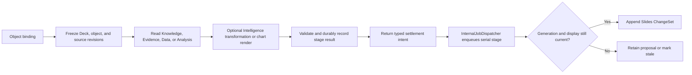

# Slides Capability Reference

## Purpose

Slides is one of the three native Resource capabilities. Its aggregate is a Deck containing Sections, unnamed stable-ID Slides, typed VisualObjects, and per-Slide Notes. Slides owns Deck identity, bindings, provenance, Base state, append-only ChangeSets, revision history, rendering inputs, and exact snapshot projections.

## Bottom line

Slides is a full presentation authoring model whose distinctive primitive is a positioned `VisualObject` on a Slide canvas:

```plain text
Deck
  ├─ Theme and LayoutTemplates
  ├─ Sections
  └─ Slides
      ├─ Notes
      └─ VisualObjects
          └─ Rich text / typed object payload
```

Slides use stable IDs as mutation identity. Sections have names. Ordinals such as “slide 7” are revision-specific projections. Each Slide has one lightweight Notes rich-text block.

The Deck uses Base + append-only ChangeSets + revision compare-and-swap. Rendering, thumbnails, resolved styles, reverse dependency lookup, and native-resource Source snapshot caches are derived.

Live charts, evidence, answers, variables, and Knowledge-backed text are Slides-owned bindings on objects or atoms. Knowledge feeds presentation content directly through a read port.

Slides runs inside the Icarus backend and uses the shared request, job, queue, database, intelligence, and observability platform contracts.

## Authority and integration boundaries

- Slides is authoritative for Deck identity and lifecycle; canvas and theme; Sections, Slides, Notes, LayoutTemplates, VisualObjects, rich content, authored styles, object bindings, accepted and last-good generated content, provenance, ChangeSets, snapshots, and stable anchors.
- Knowledge, Evidence, Questions, Structured Data, Analysis, Formula, Media, and other native Resources expose exact versioned read contracts used by Slides bindings.
- Platform Intelligence supplies generation through an injected interface. Research owns web retrieval and admission. Collaboration owns comments and activity. Workspace owns navigation. Templates owns reusable definitions. Import/Export owns PPTX and PDF codecs.
- Frontend editor state projects and edits the backend semantic model through typed operations.

Analysis owns a saved Analysis chart. Slides owns a chart object placed on a Slide. That object may bind to an Analysis result/spec, Structured Data, or a literal table and records its own presentation and refresh state.

## Runtime placement

```plain text
apps/backend/src/
  3-capabilities/
    slides/
      domain/
        model.ts
        geometry.ts
        rich-content.ts
        objects.ts
        themes.ts
        bindings.ts
        operations.ts
        apply.ts
        errors.ts
      application/
        service.ts
        render.ts
        source-snapshot.ts
      ports/
        slidesRepository.ts
        contentReaders.ts
      persistence/
        migrations.ts
        sqliteSlidesRepository.ts
      index.ts
      tests/

  4-job-wiring/
    slides/
      registerSlidesEndpointMappings.ts
      createSlidesJobs.ts
    internal/
      InternalJobDispatcher.ts

  0-platform/
    database/       generic connection/transaction interface
    intelligence/   shared Intelligence interface/provider
    observability/  shared Logger
```

Slides owns `persistence/sqliteSlidesRepository.ts`, migrations, and SQL. Platform supplies only generic database mechanics. Job wiring owns endpoint registration, queue selection, and response mode.

## Canonical aggregate

```typescript
interface Deck {
  id: string;
  userId: string;
  projectId: string;
  title: string;
  lifecycle: "active" | "archived" | "trashed";
  revision: number;
  baseSeq: number;
  createdAt: string;
  updatedAt: string;
}

interface DeckBase {
  representationVersion: "slides/v1";
  canvas: { widthEmu: number; heightEmu: number };
  theme: DeckTheme;
  layoutTemplates: LayoutTemplate[];
  sections: SlideSection[];
  slides: Slide[];
}

interface SlideSection {
  id: string;
  name: string;
  rank: string;
}

interface Slide {
  id: string;
  sectionId?: string; // absent = Unsectioned projection
  rank: string;
  layoutTemplateId?: string;
  hidden: boolean;
  background?: SlideBackground;
  objects: VisualObject[];
  notes: SlideNotes;
}
```

The default 16:9 canvas is `12_192_000 × 6_858_000` EMU. Geometry uses integers for deterministic Office interoperability.

`Unsectioned` is a UI projection, not a persisted synthetic Section. Moving a Slide changes `sectionId` and rank but never Slide ID. Deleting a non-empty Section requires an explicit destination for its Slides.

### VisualObjects

```typescript
interface VisualObject {
  id: string;
  kind:
    | "text"
    | "shape"
    | "line"
    | "image"
    | "table"
    | "chart"
    | "equation"
    | "embed"
    | "group";
  parentGroupId?: string;
  rank: string;
  frame: { xEmu: number; yEmu: number; widthEmu: number; heightEmu: number };
  transform: {
    rotationMicroDegrees: number;
    flipHorizontal: boolean;
    flipVertical: boolean;
  };
  style: ObjectStyle;
  templateBinding?: TemplateSlotBinding;
  locked: boolean;
  hidden: boolean;
  data: VisualObjectData;
  binding?: SlidesContentBinding;
}
```

The tagged union is closed and versioned. Object kind must match exactly one typed payload. Groups are acyclic; each child has at most one parent. Geometry remains Slide-relative so grouping does not change visible placement.

Text uses Slides-owned Blocks/Runs/Atoms/Marks mirroring Document wire semantics without importing the Document domain. Notes reuse that rich-text vocabulary and remain Slide-owned.

### Templates and styles

LayoutTemplates define named slots and default objects. Materialized Slide objects retain normal stable IDs. An explicit override mask distinguishes inherited fields from authored overrides.

Style resolution:

1. Deck theme defaults;
2. LayoutTemplate/slot defaults;
3. Slide override;
4. VisualObject style;
5. rich-text Block/Run/Atom override.

Resolved style is derived. Canonical state stores authored values and masks.

The user Template Library may publish or materialize exact Deck/Slide template versions. Materialization mints fresh Deck, Section, Slide, Object, rich-content, and binding IDs and then enters normal Slides history.

### Bindings and provenance

```typescript
type SlidesSourceRef =
  | { kind: "knowledge-query"; queryId: string; contextIds: string[] }
  | { kind: "evidence"; evidenceId: string }
  | { kind: "question-answer"; questionId: string; answerId: string }
  | { kind: "structured-binding"; bindingId: string }
  | { kind: "analysis-result"; analysisId: string; resultId: string; outputId: string }
  | { kind: "spreadsheet-range"; spreadsheetId: string; range: StableRangeRef }
  | { kind: "resource-target"; resourceKind: "document" | "slides" | "spreadsheet"; resourceId: string; targetId: string };

interface SlidesContentBinding {
  id: string;
  source: SlidesSourceRef;
  updatePolicy: "pinned" | "manual-refresh" | "auto-refresh";
  acceptedSourceVersion?: string;
  sourceDigest?: string;
  displayRevision: number;
  generationToken?: string;
  state: "current" | "stale" | "refreshing" | "failed";
  lastGoodContent?: VisualObjectData;
  provenance: ProvenanceLink[];
}
```

Bindings live on the Slides target. A concurrent refresh cannot replace a user-edited object unless object, display, source, and generation revisions still match. Otherwise it creates a proposal.

## ChangeSet model

```typescript
interface SlidesSubmission {
  submissionId: string;
  expectedRevision: number;
  operations: SlidesOperation[];
}

interface SlidesChangeSet {
  id: string;
  deckId: string;
  userId: string;
  projectId: string;
  submissionId: string;
  submissionHash: string;
  priorRevision: number;
  revision: number;
  seq: number;
  authorId: string;
  createdAt: string;
  operations: SlidesOperation[];
  inverseOperations: SlidesOperation[];
  footprint: SlidesFootprint;
  undoOf?: string;
  redoOf?: string;
  delegation?: { agentRunId: string; proposalId?: string };
}
```

Base is resolved through `baseSeq`; ChangeSets replay to `revision`. Rebase advances only `baseSeq`. Identical submission retries return the original ChangeSet. Divergent reuse conflicts. Stale operations are accepted only with retained proof of semantic disjointness.

Undo/redo append explicit compensation; no ChangeSet is disabled during replay.

## Typed operations

- Deck: rename, lifecycle, canvas, theme.
- Sections: create, rename, move, delete with explicit rehome target.
- LayoutTemplates: create/update/delete, bind/detach object slot.
- Slides: insert, duplicate, move, hide/show, set template, set background, delete.
- Objects: create, duplicate, update typed data, move/resize/transform, reorder, group/ungroup, lock/hide, delete.
- Rich content: insert/move/remove Block/Run/Atom, splice text, apply/remove Mark.
- Notes: replace/splice/style Notes.
- Tables: insert/move/delete rows/columns, edit cells, merge/unmerge.
- Bindings: bind source, request refresh, apply result/proposal, pin/unpin, detach to static.
- Derived media: apply exact chart/embed/image/thumbnail snapshot only under matching generation and target revisions.

Slide ordering and Section membership provide presentation labels; Slide identity remains its stable ID.

AI and Agent work produces ordinary proposed operations. Those operations enter canonical state through the same serial submission path after user acceptance or configured Automation execution.

## Request contracts

| Request type | Semantics | Result |
|---|---|---|
| `slides.create.v1` | Idempotent command | Create a blank Deck or materialize a validated template recipe |
| `slides.list.v1`, `slides.get.v1`, `slides.load.v1` | Query | List Resource summaries or load an exact Base-plus-tail projection |
| `slides.submit.v1` | Idempotent command | Validate operations and append one ChangeSet |
| `slides.undo.v1`, `slides.redo.v1` | Idempotent command | Append an explicit compensating ChangeSet |
| `slides.history.list.v1` | Query | Return bounded ChangeSet history |
| `slides.refresh.request.v1` | Idempotent command | Freeze target and source revisions and create a refresh request |
| `slides.render.v1` | Query | Return a bounded canonical render scene |
| `slides.thumbnails.request.v1` | Idempotent execution request | Create an exact-revision thumbnail request |
| `slides.source-snapshot.v1` | Query | Return an exact-head native-Resource snapshot package for Sources |
| `slides.duplicate.v1` | Idempotent command | Mint fresh identities from an exact Deck head |

Import/Export owns PPTX/PDF translation and consumes/produces validated Slides snapshots or operation recipes.

## Queues and response choices

| Work | Queue | Response |
|---|---|---|
| List, get, load, history, bounded render, source snapshot | Concurrent | Inline |
| Create, submit, undo, redo, duplicate, lifecycle | Serial | Inline |
| Accept refresh, thumbnail, or render request | Serial | Deferred job receipt plus concurrent-stage intent |
| Knowledge/model transformation, chart rendering, thumbnails, image normalization | Concurrent | Internal stage result |
| Apply generated or rendered result | Serial settlement stage dispatched by `InternalJobDispatcher` | Internal stage result |
| Rebase Base | Serial compaction stage dispatched by `InternalJobDispatcher` | Internal stage result |

A serial request stage freezes the Deck revision, target display revision, source manifest, and generation token and returns a concurrent-stage intent. Each asynchronous result carries those values. The capability durably records the result and returns a typed settlement intent. The composition-owned `4-job-wiring/internal/InternalJobDispatcher` converts that intent into a new serial stage; settlement rechecks all four preconditions.

Stages use deterministic idempotency keys. A running concurrent stage records its result and returns a follow-on intent. Job wiring enqueues follow-on stages.

```typescript
interface InternalJobDispatcher {
  dispatch(intent: InternalStageIntent): Promise<{ jobId: string }>;
}
```

This wiring-owned `dispatch` resolves after enqueue. Slides returns a plain `NextStageIntent`; composition owns the dispatcher.

## Persistence and SQL indexes

```sql
CREATE TABLE slide_decks (
  id          TEXT PRIMARY KEY,
  user_id     TEXT NOT NULL,
  project_id  TEXT NOT NULL,
  title       TEXT NOT NULL,
  lifecycle   TEXT NOT NULL,
  revision    INTEGER NOT NULL DEFAULT 0,
  base_seq    INTEGER NOT NULL DEFAULT 0,
  base_json   BLOB NOT NULL,
  created_at  TEXT NOT NULL,
  updated_at  TEXT NOT NULL,
  UNIQUE (user_id, project_id, id)
);
CREATE INDEX slide_decks_project_updated
  ON slide_decks(user_id, project_id, lifecycle, updated_at DESC, id);

CREATE TABLE slide_change_sets (
  id                TEXT PRIMARY KEY,
  deck_id           TEXT NOT NULL,
  user_id           TEXT NOT NULL,
  project_id        TEXT NOT NULL,
  submission_id     TEXT NOT NULL,
  submission_hash   TEXT NOT NULL,
  prior_revision    INTEGER NOT NULL,
  revision          INTEGER NOT NULL,
  seq               INTEGER NOT NULL,
  author_id         TEXT NOT NULL,
  operations_json   BLOB NOT NULL,
  inverse_ops_json  BLOB NOT NULL,
  footprint_json    BLOB NOT NULL,
  undo_of           TEXT,
  redo_of           TEXT,
  delegation_json   BLOB,
  created_at        TEXT NOT NULL,
  UNIQUE (deck_id, seq),
  UNIQUE (deck_id, submission_id),
  FOREIGN KEY (user_id, project_id, deck_id)
    REFERENCES slide_decks(user_id, project_id, id) ON DELETE CASCADE
);
CREATE INDEX slide_changes_project_recent
  ON slide_change_sets(user_id, project_id, created_at DESC, id);

CREATE TABLE slide_generation_requests (
  id                       TEXT PRIMARY KEY,
  deck_id                  TEXT NOT NULL,
  user_id                  TEXT NOT NULL,
  project_id               TEXT NOT NULL,
  target_id                TEXT NOT NULL,
  idempotency_key          TEXT NOT NULL,
  request_hash             TEXT NOT NULL,
  deck_revision            INTEGER NOT NULL,
  target_display_revision  INTEGER NOT NULL,
  generation_token         TEXT NOT NULL,
  source_manifest_json     BLOB NOT NULL,
  state                    TEXT NOT NULL,
  result_json              BLOB,
  failure_json             BLOB,
  created_at               TEXT NOT NULL,
  updated_at               TEXT NOT NULL,
  UNIQUE (deck_id, idempotency_key),
  FOREIGN KEY (user_id, project_id, deck_id)
    REFERENCES slide_decks(user_id, project_id, id) ON DELETE CASCADE
);
CREATE INDEX slide_generation_state
  ON slide_generation_requests(user_id, project_id, state, updated_at DESC, id);
```

`base_json` stores one bounded, versioned Deck Base atomically. Slides owns this SQL. Partial Slide loading can introduce normalized Section, Slide, and VisualObject storage behind the same aggregate contract.

## Rebuildable derived indexes and caches

- object-by-ID and slide-by-ID lookup maps;
- reverse dependency index from source/Analysis/Evidence/Knowledge binding to object;
- resolved style/template cache;
- hit-test/spatial index;
- thumbnail and render-scene cache;
- extracted plain text/outline and native-resource Source snapshot hashes.

Canonical binding and provenance remain in Base and ChangeSets. Sources requests `slides.source-snapshot.v1` and creates an immutable `native_resource` Source Version for the exact Deck head; Knowledge indexes that Source Version. Derived rows can be rebuilt from canonical Deck and ChangeSet records.

## Dependencies and platform use

Slides consumes narrow exact readers for Knowledge, Evidence, Question Answers, Structured Data, Analysis results, Spreadsheet ranges, Formula, files/media, and template versions. It uses the injected Intelligence platform only to generate or revise proposed content.

Research admits web-derived material through Sources and Evidence; Knowledge projects grounded material for Slides generation and refresh.

Slides provides Resource summaries, exact Deck/Slide/Object snapshots, stable anchors, native-resource snapshot packages for Sources, and export/template projections.

## Refresh and insertion flow



## Governing invariants

1. Deck owns its native Resource identity.
2. Slides are unnamed stable-ID entities.
3. Sections are named; Unsectioned is a projection.
4. VisualObject kind matches exactly one typed payload.
5. Geometry is bounded integer EMU.
6. Groups are acyclic and every child has at most one parent.
7. Notes are Slide-owned rich content.
8. Bindings and provenance are stored by Slides.
9. Knowledge can feed bound/generated Slides content.
10. Generation and rendering results apply only when their frozen preconditions match current state.
11. Humans, Agents, and automations use the same typed operation path.
12. Derived indexes/renderings are disposable.

## Conformance scenarios

1. Create a 16:9 Deck.
2. Create Sections and unnamed Slides with stable IDs.
3. Add title/text, shape, image, table, chart, and group objects.
4. Edit Notes and rich text.
5. Apply a LayoutTemplate and override one slot.
6. Replay ChangeSets and prove conflict, idempotency, undo/redo, and rebase.
7. Bind one text object to a Question Answer/Knowledge query and one chart to an Analysis result.
8. Refresh safely and render a deterministic preview/thumbnail.

## Acceptance criteria

- Move/reorder preserves Slide/Object identities.
- Section deletion requires an explicit destination for contained Slides.
- Every mutation addresses a Slide by stable ID.
- Invalid geometry, group cycles, template bindings, or typed payloads reject atomically.
- A concurrent edit fences stale generated content.
- Notes persist without rewriting unrelated objects.
- Knowledge/Analysis bindings retain exact lineage and last-good display.
- Deleting all caches leaves the Deck and replay intact.
- Workspace lists and opens Slides through its family adapter.
- Slides owns SQL; Platform remains generic.
- Slides imports neither Fastify nor provider SDKs nor another capability’s service implementation.

## References

- [Product — Icarus Complete Product Definition](https://app.notion.com/p/3aeb6410e502810ba9c0c26442d5255a)
- [Architecture — Icarus Runtime Foundation & Repository Boundaries](https://app.notion.com/p/3adb6410e50281e09d83ed36daacf8d8)
- [Model — Icarus Request, Job & Dual-Queue Runtime](https://app.notion.com/p/3adb6410e50281c498f4d7f6a621eba2)
- [Model — Slides Capability & Runtime Contract](https://app.notion.com/p/3abb6410e50281df8762c162e9a6eb13)
- [Taurus Omega — Deck Data Model](https://app.notion.com/p/3a5b6410e50281cf9c47ea916a10241d)
- [Interface — Slides Editor Context Panel Lenses](https://app.notion.com/p/3acb6410e50281ae9244e2f9a57f579f)
- [Interface — Slides Editor Inspector Panel Lenses](https://app.notion.com/p/3acb6410e50281a7a32dd1c2551a7851)
- [Export — Slides to PPTX](https://app.notion.com/p/3acb6410e5028156bee8c6cca9f2ab87)
