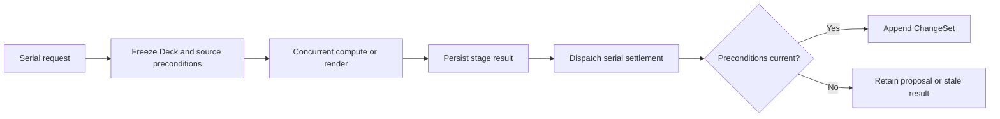

# Capability — Icarus Slides Runtime Model

> Mirrored from [Notion](https://app.notion.com/p/3aeb6410e502818da1ccd93c096fe243).

## Summary / Concept
<callout icon="🧭" color="blue_bg">
	**Build position:** Resources 3 of 4. Slides follows Document so it can reuse the established rich-content, Formula-value, source-snapshot, and revision conventions while retaining a presentation-specific aggregate.
</callout>
### Prerequisites
#### Required before implementation
- Request-to-job mapping, the serial queue, the bounded concurrent worker pool, database transactions, logging, and internal-stage dispatch.
- Platform Formula: value algebra, parsing, binding, evaluation, dependency manifests, limits, and diagnostics.
- The Data resolver adapter that freezes declarations and exact values into immutable Formula resolver snapshots.
- The native-editor rich-content contract: stable Block and Atom IDs, text atoms, Formula atoms, reference atoms, and typed marks. Slides owns the content stored in a Deck and does not call another editor capability to mutate it.
- Stable file and Media references for image Shapes.
- Stores are configuration-scoped. Scope is not carried in domain objects, requests, operations, or tables. ChangeSets receive configured attribution.
#### Downstream seams
Slides provides Workspace summaries; stable Deck, Section, Slide, Shape, Notes, and rich-content anchors; exact-revision snapshots for Sources, Knowledge, Templates, and Import/Export; public command ports for Agents and Automation; and PPTX/PDF snapshot and recipe ports.
Knowledge, Context, Questions, Evidence, Data, Analysis, Spreadsheet, Media, and Intelligence are consumed through narrow injected ports. Their concrete services are not imported into the Slides domain.
### Concept and authority
Slides owns one closed presentation aggregate:
```plain text
Deck
├── canvas, theme, and layouts
├── Sections keyed by stable ID
└── Slides keyed by stable ID
    ├── Notes
    └── Shapes keyed by stable ID
```
Slides is authoritative for Deck identity and lifecycle, rank-based ordering, sections, slide backgrounds, integer EMU geometry, Notes, Shapes, rich content, authored presentation, bindings, accepted generated content, provenance, Base state, ChangeSets, undo/redo, and exact snapshots.
A Slide is addressed by stable ID. Its displayed ordinal is a projection of rank at one Deck revision. A Shape belongs to exactly one Slide. Notes belong directly to their Slide and are not represented as hidden Shapes.
### Repository placement
```plain text
apps/backend/src/
  3-capabilities/
    slides/
      domain/
        model.ts
        geometry.ts
        richContent.ts
        shapes.ts
        operations.ts
        apply.ts
        invariants.ts
        errors.ts
      application/
        slidesService.ts
        renderScene.ts
        refresh.ts
        snapshots.ts
      ports/
        slidesRepository.ts
        contentReaders.ts
        generationPort.ts
      persistence/
        migrations.ts
        sqliteSlidesRepository.ts
      index.ts
      tests/

  1-init/
    create/
      slides.ts

  4-job-wiring/
    slides/
      registerSlidesEndpointMappings.ts
      createSlidesJobs.ts
    internal/
      InternalJobDispatcher.ts
```
`3-capabilities/slides` owns domain behavior, persistence, and the application service. `1-init/create/slides.ts` constructs the configuration-scoped store and injects ports. `4-job-wiring/slides` maps normalized HTTP requests to jobs, queue choice, response mode, and follow-on stages.
## Types & Interfaces
### Canonical aggregate
```typescript
type Emu = number;

interface Deck {
  id: string;
  title: string;
  lifecycle: "active" | "archived" | "trashed";
  revision: number;
  baseSeq: number;
  createdAt: string;
  updatedAt: string;
  base: DeckBase;
}

interface DeckBase {
  canvas: { widthEmu: Emu; heightEmu: Emu };
  theme: DeckTheme;
  layouts: Record<string, SlideLayout>;
  sections: Record<string, DeckSection>;
  slides: Record<string, Slide>;
}

interface DeckSection {
  id: string;
  name: string;
  rank: string;
}

interface Slide {
  id: string;
  sectionId?: string;
  rank: string;
  layoutId?: string;
  hidden: boolean;
  background?: SlideBackground;
  shapes: Record<string, Shape>;
  notes: SlideNotes;
}

interface SlideNotes {
  blocks: Record<string, RichTextBlock>;
}
```
Rank is the only canonical ordering scheme. Sections order by `(rank, id)`; Slides order by `(sectionId, rank, id)`; Shapes order by `(parentGroupId, rank, id)`; rich-content Blocks and Atoms follow the same rule. Maps and normalized rows provide identity membership. Array position never carries canonical order.
The default 16:9 canvas is `12_192_000 × 6_858_000` EMU. Coordinates, dimensions, rotation, crop, line width, and padding use bounded integers. Floating-point screen coordinates are editor projections.
`Unsectioned` is a read projection for Slides without `sectionId`. Deleting a non-empty Section requires an explicit destination Section or an explicit move to the unsectioned projection.
### Closed Shape union
```typescript
interface ShapeBase {
  id: string;
  rank: string;
  parentGroupId?: string;
  frame: {
    xEmu: Emu;
    yEmu: Emu;
    widthEmu: Emu;
    heightEmu: Emu;
  };
  transform: {
    rotationMicroDegrees: number;
    flipHorizontal: boolean;
    flipVertical: boolean;
  };
  locked: boolean;
  hidden: boolean;
  style: ShapeStyle;
  binding?: SlidesContentBinding;
}

type Shape =
  | (ShapeBase & { kind: "text"; data: TextShapeData })
  | (ShapeBase & { kind: "geometry"; data: GeometryShapeData })
  | (ShapeBase & { kind: "line"; data: LineShapeData })
  | (ShapeBase & { kind: "image"; data: ImageShapeData })
  | (ShapeBase & { kind: "table"; data: TableShapeData })
  | (ShapeBase & { kind: "chart"; data: ChartShapeData })
  | (ShapeBase & { kind: "group"; data: GroupShapeData });

interface TextShapeData {
  blocks: Record<string, RichTextBlock>;
  verticalAlignment: "top" | "middle" | "bottom";
  overflow: "clip" | "shrink-text" | "expand-height";
}

interface ImageShapeData {
  fileId: string;
  crop?: {
    leftMillionths: number;
    topMillionths: number;
    rightMillionths: number;
    bottomMillionths: number;
  };
  altText?: string;
}

interface GroupShapeData {
  style?: GroupStyle;
}
```
The union is closed: `kind` matches exactly one payload. Group membership is represented by each child's `parentGroupId`; children are ordered by rank, not by a child array. Groups cannot cross Slides, each Shape has at most one parent, and the group graph is acyclic. Frames remain Slide-relative, so grouping never rewrites visible child geometry.
Tables use stable row, column, and cell IDs. Charts store a typed chart specification, local presentation, and either literal data or an exact upstream binding. Browser selection, guides, handles, drag state, zoom, and viewport state are not canonical Deck data.
### Rich content, Formula atoms, and Notes
```typescript
type FormulaWireValue = import("#formula").FormulaWireValue;

interface RichTextBlock {
  id: string;
  kind: "paragraph" | "heading" | "list-item";
  rank: string;
  atoms: Record<string, RichTextAtom>;
  style: BlockStyle;
}

type RichTextAtom =
  | {
      id: string;
      rank: string;
      kind: "text";
      text: string;
      marks: Record<string, TextMark>;
    }
  | {
      id: string;
      rank: string;
      kind: "formula";
      source: string;
      acceptedValue?: FormulaWireValue;
      lastGoodValue?: FormulaWireValue;
      sourceRevision: number;
      dependencyDigest?: string;
      diagnostic?: FormulaDiagnostic;
      marks: Record<string, TextMark>;
    }
  | {
      id: string;
      rank: string;
      kind: "reference";
      reference: SlidesSourceRef;
      displayText: string;
      marks: Record<string, TextMark>;
    };
```
Text Shapes and Notes use the same vocabulary. Notes remain independently addressable and can change without rewriting unrelated Shapes.
Formula supplies expression semantics and the shared persistent wire codec. Slides owns authored source, stable bindings, accepted and last-good display values, diagnostics, provenance, and the ChangeSets that alter them. A function-valued result at any depth becomes Formula's typed `NON_SERIALIZABLE_VALUE` diagnostic and is never written into a Shape or Notes payload.
### Bindings and provenance
```typescript
type SlidesSourceRef =
  | { kind: "knowledge-query"; queryId: string; contextIds: string[] }
  | { kind: "evidence"; evidenceId: string; evidenceRevision: number }
  | { kind: "question-answer"; questionId: string; answerRevision: number }
  | { kind: "name"; nameId: string; bindingRevision: number }
  | { kind: "analysis-result"; analysisId: string; resultId: string }
  | {
      kind: "spreadsheet-range";
      spreadsheetId: string;
      range: StableSpreadsheetRange;
      spreadsheetRevision: number;
    }
  | {
      kind: "resource-target";
      resourceKind: "document" | "slides" | "spreadsheet";
      resourceId: string;
      targetId: string;
      resourceRevision: number;
    };

interface SlidesContentBinding {
  id: string;
  source: SlidesSourceRef;
  updatePolicy: "pinned" | "manual-refresh" | "auto-refresh";
  acceptedSourceRevision?: string;
  sourceDigest?: string;
  displayRevision: number;
  generationToken?: string;
  state: "current" | "stale" | "refreshing" | "failed";
  lastGoodData?: Shape["data"];
  provenance: ProvenanceLink[];
}
```
A binding belongs to its target Shape or Atom. Refresh freezes Deck revision, target display revision, source manifest, and generation token. A result can replace canonical content only when every frozen precondition still matches. Otherwise it is retained as a proposal or marked stale.
### Capability ports
```typescript
interface SlidesRepository {
  list(): Promise<DeckSummary[]>;
  create(input: CreateDeck): Promise<Deck>;
  load(deckId: string, revision?: number): Promise<Deck>;
  append(input: AppendSlidesChangeSet): Promise<SlidesChangeSet>;
  listHistory(deckId: string, cursor?: string): Promise<SlidesChangeSetSummary[]>;
  createStageRequest(input: CreateSlidesStageRequest): Promise<SlidesStageRequest>;
  settleStage(input: SettleSlidesStage): Promise<SlidesChangeSet | SlidesProposal>;
  compact(input: CompactSlidesBase): Promise<void>;
}

interface SlidesCommands {
  create(input: CreateDeckRequest): Promise<Deck>;
  submit(deckId: string, submission: SlidesSubmission): Promise<SlidesChangeSet>;
  undo(deckId: string, input: UndoSlidesRequest): Promise<SlidesChangeSet>;
  redo(deckId: string, input: RedoSlidesRequest): Promise<SlidesChangeSet>;
  requestRefresh(input: RequestSlidesRefresh): Promise<SlidesStageIntent>;
}

interface SlidesSnapshots {
  readDeck(deckId: string, revision?: number): Promise<DeckSnapshot>;
  readTarget(
    deckId: string,
    targetId: string,
    revision?: number,
  ): Promise<SlidesTargetSnapshot>;
  renderScene(deckId: string, revision?: number): Promise<SlidesRenderScene>;
}
```
## Runtime Objects
### Construction
```typescript
const repository = createSlidesRepositoryFromRuntimeConfig(config, database);
const slides = createSlidesCapability({
  repository,
  formula,
  dataResolver,
  knowledge,
  context,
  analysis,
  spreadsheet,
  media,
  intelligence,
  logger,
  attribution: createRuntimeAttribution(config),
});
```
Project scope and attribution are bound from top-level configuration during initialization. They do not enter Deck values, request payloads, operations, or SQL rows.
### Aggregate runtime
A loaded Deck is reconstructed from its compacted Base plus the contiguous ChangeSet tail. The application service exposes commands and exact snapshot readers; the pure reducer applies operations and validates the complete aggregate. Formula results cross the persistence boundary only as `FormulaWireValue`.
## Change Operations
### Operations
```typescript
type SlidesOperation =
  | { type: "rename-deck"; title: string }
  | { type: "set-lifecycle"; lifecycle: Deck["lifecycle"] }
  | { type: "set-canvas"; widthEmu: Emu; heightEmu: Emu }
  | { type: "set-theme"; theme: DeckTheme }
  | { type: "create-section"; section: DeckSection }
  | { type: "rename-section"; sectionId: string; name: string }
  | { type: "move-section"; sectionId: string; rank: string }
  | {
      type: "delete-section";
      sectionId: string;
      destinationSectionId?: string;
    }
  | { type: "create-slide"; slide: Slide }
  | { type: "duplicate-slide"; slideId: string; newSlideId: string; rank: string }
  | {
      type: "move-slide";
      slideId: string;
      sectionId?: string;
      rank: string;
    }
  | { type: "set-slide-layout"; slideId: string; layoutId?: string }
  | { type: "set-slide-background"; slideId: string; background?: SlideBackground }
  | { type: "set-slide-hidden"; slideId: string; hidden: boolean }
  | { type: "delete-slide"; slideId: string }
  | { type: "create-shape"; slideId: string; shape: Shape }
  | { type: "update-shape"; slideId: string; shapeId: string; patch: ShapePatch }
  | {
      type: "move-shape";
      slideId: string;
      shapeId: string;
      rank: string;
      parentGroupId?: string;
    }
  | {
      type: "set-shape-frame";
      slideId: string;
      shapeId: string;
      frame: ShapeBase["frame"];
    }
  | { type: "delete-shape"; slideId: string; shapeId: string }
  | { type: "apply-rich-text"; target: RichTextTarget; edits: RichTextEdit[] }
  | { type: "replace-notes"; slideId: string; notes: SlideNotes }
  | { type: "set-binding"; target: SlidesBindingTarget; binding?: SlidesContentBinding }
  | { type: "apply-refresh-result"; requestId: string; result: SlidesRefreshResult };
```
Creation, duplication, grouping, table edits, and template materialization supply every new stable ID and rank in their operation recipes. The reducer validates the complete resulting Deck before accepting any operation.
### Base, revisions, and ChangeSets
```typescript
interface SlidesSubmission {
  requestId: string;
  requestDigest: string;
  expectedRevision: number;
  operations: SlidesOperation[];
}

interface SlidesChangeSet {
  id: string;
  deckId: string;
  requestId: string;
  requestDigest: string;
  priorRevision: number;
  revision: number;
  seq: number;
  attributionId: string;
  createdAt: string;
  operations: SlidesOperation[];
  inverseOperations: SlidesOperation[];
  footprint: {
    sectionIds: string[];
    slideIds: string[];
    shapeIds: string[];
    noteSlideIds: string[];
    structural: boolean;
  };
  undoOf?: string;
  redoOf?: string;
}
```
Head state is normalized Base through `baseSeq` plus the ordered ChangeSet tail. Submission is atomic:
1. Load the Deck and tail in a transaction.
2. Return the recorded ChangeSet for an identical `(deckId, requestId, requestDigest)` retry.
3. Reject request-ID reuse with a different digest.
4. Require `expectedRevision`, except where retained footprints prove semantic disjointness.
5. Apply operations in memory.
6. Validate the complete Deck.
7. Derive inverse operations and the mutation footprint.
8. Append one ChangeSet and advance revision with compare-and-swap.
Undo and redo append compensating ChangeSets. Accepted ChangeSets are never disabled or rewritten. Compaction folds a contiguous prefix into Base tables and advances `baseSeq` without changing logical revision.
## Endpoints
<table fit-page-width="true" header-row="true">
<tr>
<td>Method and path</td>
<td>Job</td>
<td>Queue</td>
<td>Response</td>
</tr>
<tr>
<td>`GET /slides`</td>
<td>`slides.list`</td>
<td>Concurrent</td>
<td>Inline summaries</td>
</tr>
<tr>
<td>`POST /slides`</td>
<td>`slides.create`</td>
<td>Serial</td>
<td>Created Deck</td>
</tr>
<tr>
<td>`GET /slides/:deckId`</td>
<td>`slides.get`</td>
<td>Concurrent</td>
<td>Exact projection</td>
</tr>
<tr>
<td>`GET /slides/:deckId/history`</td>
<td>`slides.history.list`</td>
<td>Concurrent</td>
<td>Bounded history</td>
</tr>
<tr>
<td>`POST /slides/:deckId/changes`</td>
<td>`slides.submit`</td>
<td>Serial</td>
<td>ChangeSet or conflict</td>
</tr>
<tr>
<td>`POST /slides/:deckId/undo`</td>
<td>`slides.undo`</td>
<td>Serial</td>
<td>Compensating ChangeSet</td>
</tr>
<tr>
<td>`POST /slides/:deckId/redo`</td>
<td>`slides.redo`</td>
<td>Serial</td>
<td>Compensating ChangeSet</td>
</tr>
<tr>
<td>`POST /slides/:deckId/refreshes`</td>
<td>`slides.refresh.request`</td>
<td>Serial</td>
<td>Durable receipt</td>
</tr>
<tr>
<td>`POST /slides/:deckId/renders`</td>
<td>`slides.render.request`</td>
<td>Serial</td>
<td>Durable receipt</td>
</tr>
<tr>
<td>`GET /slides/:deckId/snapshot`</td>
<td>`slides.snapshot.get`</td>
<td>Concurrent</td>
<td>Exact snapshot</td>
</tr>
</table>
Queue selection is fixed by endpoint mapping before the capability-specific payload is decoded.
## Jobs
<table fit-page-width="true" header-row="true">
<tr>
<td>Endpoint or intent</td>
<td>Job</td>
<td>Queue</td>
<td>Response mode</td>
<td>Change operations emitted</td>
<td>Calls or durable writes</td>
</tr>
<tr>
<td>Create Deck</td>
<td>`slides.create`</td>
<td>Serial</td>
<td>Inline Deck</td>
<td>Creates Base revision 0</td>
<td>Slides repository and Activity contribution</td>
</tr>
<tr>
<td>Submit authored edits</td>
<td>`slides.submit`</td>
<td>Serial</td>
<td>Inline ChangeSet</td>
<td>Submitted `SlidesOperation[]`</td>
<td>Reducer, invariant validation, inverse derivation, repository CAS</td>
</tr>
<tr>
<td>Undo or redo</td>
<td>`slides.undo` / `slides.redo`</td>
<td>Serial</td>
<td>Inline compensating ChangeSet</td>
<td>Stored inverse or forward compensation</td>
<td>Retained history and repository CAS</td>
</tr>
<tr>
<td>List, get, history, or snapshot</td>
<td>Read jobs</td>
<td>Concurrent</td>
<td>Inline read result</td>
<td>None</td>
<td>Slides repository and rebuildable projections</td>
</tr>
<tr>
<td>Refresh admission</td>
<td>`slides.refresh.request`</td>
<td>Serial</td>
<td>Durable receipt</td>
<td>None</td>
<td>Freezes Deck, target, source manifest, and generation token; emits compute intent</td>
</tr>
<tr>
<td>Refresh compute</td>
<td>`slides.refresh.compute`</td>
<td>Concurrent</td>
<td>Persisted result plus settle intent</td>
<td>None</td>
<td>Injected Knowledge, Context, Data, Analysis, Spreadsheet, Media, or Intelligence ports</td>
</tr>
<tr>
<td>Refresh settlement</td>
<td>`slides.refresh.settle`</td>
<td>Serial</td>
<td>ChangeSet or retained proposal</td>
<td>`apply-refresh-result` when all frozen preconditions match</td>
<td>Slides repository CAS and Activity contribution</td>
</tr>
<tr>
<td>Render admission and compute</td>
<td>`slides.render.request` → `slides.render.compute`</td>
<td>Serial → concurrent</td>
<td>Receipt, then persisted render result</td>
<td>None</td>
<td>Exact Deck snapshot and render provider</td>
</tr>
<tr>
<td>Render settlement</td>
<td>`slides.render.settle`</td>
<td>Serial</td>
<td>Settled render status</td>
<td>None unless an accepted rendered artifact is explicitly bound through a Slides operation</td>
<td>Stage request store</td>
</tr>
<tr>
<td>Compaction</td>
<td>`slides.compact`</td>
<td>Serial</td>
<td>Inline completion</td>
<td>None</td>
<td>Base replacement and retained-tail pruning</td>
</tr>
</table>
Refresh, generation, chart rendering, and thumbnails use explicit stages:

```typescript
interface SlidesStageIntent {
  type:
    | "slides.refresh.compute"
    | "slides.refresh.settle"
    | "slides.render.compute"
    | "slides.render.settle"
    | "slides.compact";
  requestId: string;
  deckId: string;
  idempotencyKey: string;
}
```
The capability returns plain intents. `InternalJobDispatcher` enqueues them. A running job never changes queues.
## SQL Tables
### Logical schema and indexes
```sql
CREATE TABLE slides_decks (
  id          TEXT PRIMARY KEY,
  title       TEXT NOT NULL,
  lifecycle   TEXT NOT NULL,
  revision    INTEGER NOT NULL,
  base_seq    INTEGER NOT NULL,
  base_meta   BLOB NOT NULL,
  created_at  TEXT NOT NULL,
  updated_at  TEXT NOT NULL
);

CREATE TABLE slides_base_sections (
  deck_id     TEXT NOT NULL,
  section_id  TEXT NOT NULL,
  rank        TEXT NOT NULL,
  name        TEXT NOT NULL,
  PRIMARY KEY (deck_id, section_id),
  FOREIGN KEY (deck_id) REFERENCES slides_decks(id) ON DELETE CASCADE
);

CREATE TABLE slides_base_slides (
  deck_id       TEXT NOT NULL,
  slide_id      TEXT NOT NULL,
  section_id    TEXT,
  rank          TEXT NOT NULL,
  layout_id     TEXT,
  hidden        INTEGER NOT NULL,
  background    BLOB,
  PRIMARY KEY (deck_id, slide_id),
  FOREIGN KEY (deck_id) REFERENCES slides_decks(id) ON DELETE CASCADE
);

CREATE TABLE slides_base_shapes (
  deck_id         TEXT NOT NULL,
  slide_id        TEXT NOT NULL,
  shape_id        TEXT NOT NULL,
  parent_shape_id TEXT,
  rank            TEXT NOT NULL,
  kind            TEXT NOT NULL,
  frame           BLOB NOT NULL,
  transform       BLOB NOT NULL,
  style           BLOB NOT NULL,
  payload         BLOB NOT NULL,
  binding         BLOB,
  PRIMARY KEY (deck_id, shape_id),
  FOREIGN KEY (deck_id, slide_id)
    REFERENCES slides_base_slides(deck_id, slide_id) ON DELETE CASCADE
);

CREATE TABLE slides_base_notes (
  deck_id     TEXT NOT NULL,
  slide_id    TEXT NOT NULL,
  notes       BLOB NOT NULL,
  PRIMARY KEY (deck_id, slide_id),
  FOREIGN KEY (deck_id, slide_id)
    REFERENCES slides_base_slides(deck_id, slide_id) ON DELETE CASCADE
);

CREATE TABLE slides_change_sets (
  id                 TEXT PRIMARY KEY,
  deck_id            TEXT NOT NULL,
  request_id         TEXT NOT NULL,
  request_digest     TEXT NOT NULL,
  prior_revision     INTEGER NOT NULL,
  revision           INTEGER NOT NULL,
  seq                INTEGER NOT NULL,
  attribution_id     TEXT NOT NULL,
  operations         BLOB NOT NULL,
  inverse_operations BLOB NOT NULL,
  footprint          BLOB NOT NULL,
  undo_of             TEXT,
  redo_of             TEXT,
  created_at          TEXT NOT NULL,
  UNIQUE (deck_id, seq),
  UNIQUE (deck_id, request_id),
  FOREIGN KEY (deck_id) REFERENCES slides_decks(id) ON DELETE CASCADE
);

CREATE TABLE slides_stage_requests (
  id                       TEXT PRIMARY KEY,
  deck_id                  TEXT NOT NULL,
  target_id                TEXT,
  kind                     TEXT NOT NULL,
  request_digest           TEXT NOT NULL,
  deck_revision            INTEGER NOT NULL,
  target_display_revision  INTEGER,
  source_manifest          BLOB,
  generation_token         TEXT,
  state                    TEXT NOT NULL,
  result                   BLOB,
  failure                  BLOB,
  created_at               TEXT NOT NULL,
  updated_at               TEXT NOT NULL,
  UNIQUE (deck_id, kind, request_digest),
  FOREIGN KEY (deck_id) REFERENCES slides_decks(id) ON DELETE CASCADE
);
```
Required indexes:
```sql
CREATE INDEX slides_decks_updated
  ON slides_decks(lifecycle, updated_at DESC, id);
CREATE INDEX slides_sections_order
  ON slides_base_sections(deck_id, rank, section_id);
CREATE INDEX slides_slides_order
  ON slides_base_slides(deck_id, section_id, rank, slide_id);
CREATE INDEX slides_shapes_order
  ON slides_base_shapes(deck_id, slide_id, parent_shape_id, rank, shape_id);
CREATE INDEX slides_changes_replay
  ON slides_change_sets(deck_id, seq);
CREATE INDEX slides_changes_recent
  ON slides_change_sets(deck_id, created_at DESC, id);
CREATE INDEX slides_stages_pending
  ON slides_stage_requests(state, updated_at, id);
```
`base_meta` contains canvas, theme, layouts, and Base bookkeeping. Base component tables represent the same compacted sequence and are replaced atomically.
Rebuildable projections include ID lookup maps, reverse binding dependencies, resolved theme/layout styles, spatial hit-test indexes, extracted text, render scenes, thumbnails, and Source snapshot hashes. Authored content, accepted `FormulaWireValue` values, bindings, provenance, Base, and ChangeSets are canonical.
## Appendices
### Governing invariants
1. Deck is the aggregate root and owns its Sections, Slides, Shapes, Notes, layouts, bindings, and authored presentation.
2. Deck, Section, Slide, Shape, Block, and Atom IDs are stable.
3. Rank plus ID is the only ordering rule.
4. Every Shape belongs to exactly one Slide and matches one closed payload.
5. Geometry is bounded integer EMU.
6. Group graphs are acyclic and cannot cross Slides.
7. Notes are Slide-owned rich content.
8. Every mutation appends one atomic ChangeSet of typed operations.
9. Undo and redo append compensation.
10. Concurrent results settle through a new serial job and cannot overwrite newer authored content.
11. Upstream capabilities own their facts; Slides owns accepted presentation.
12. Derived indexes and renderings are disposable.
13. Slides SQL and migrations stay inside the capability.
14. The domain imports neither the web server nor provider SDKs.
### Acceptance criteria
- Moving or reordering Sections, Slides, Shapes, Blocks, and Atoms preserves IDs and changes only rank or membership.
- Invalid geometry, payload tags, group cycles, table structure, bindings, or references reject the whole submission.
- Notes can change without rewriting unrelated Shapes.
- Formula and generated content retain last-good display after failure.
- A stale asynchronous result cannot replace a newer target.
- Replay, retry idempotency, conflict detection, undo, redo, and compaction are deterministic.
- Exact Deck snapshots can be rendered, indexed, exported, templated, and addressed by stable target ID.
- Deleting every rebuildable projection leaves the Deck and history intact.
