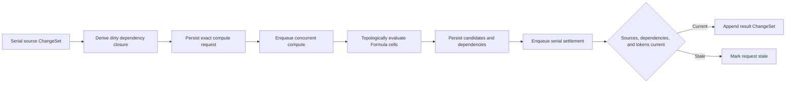

# Spreadsheet Capability Reference

Spreadsheet is one of Icarus's native editable resource capabilities. One Spreadsheet is one sparse grid with stable rows, stable columns, sparse canonical cells, grid rules, overlays, and an append-only revision history.

```text
Spreadsheet
  ├─ stable Rows
  ├─ stable Columns
  ├─ sparse Cells
  ├─ Formula and prompt sources
  ├─ accepted and last-good values
  ├─ grid presentation and rules
  ├─ chart and image overlays
  └─ Base and ChangeSets
```

A1 notation is an authored coordinate projection over one exact Spreadsheet revision. Durable operations, dependencies, and range references use stable Row, Column, and Cell IDs so inserts, moves, and concurrent edits preserve identity.

Every Spreadsheet, operation, compute request, and snapshot carries `userId` and `projectId`.

## Authority and integration boundaries

| Concern | Authority |
| --- | --- |
| Spreadsheet resource identity, axes, cells, sources, accepted values, presentation, rules, overlays, provenance, Base, ChangeSets, and revision | Spreadsheet |
| Formula grammar, value algebra, evaluation, limits, and diagnostics | Formula |
| Project tables, variables, names, and named Spreadsheet-range bindings | Structured Data |
| Saved analysis workspaces and immutable analytical results | Analysis |
| Grounded contextual retrieval for prompt cells and bound content | Knowledge, Evidence, Context, and Questions |
| Model execution and provider selection | Platform Intelligence |
| File conversion codecs and external format receipts | Import/Export |
| Spreadsheet SQL, repository adapter, and migrations | Spreadsheet |

Spreadsheet persists stable references and accepted results. Upstream capabilities remain authoritative for referenced project data, knowledge, and analytical results.

## Repository placement

```text
apps/backend/src/
  3-capabilities/
    built-in/
      spreadsheet/
        domain/
          model.ts
          values.ts
          axes.ts
          addressing.ts
          formulas.ts
          spills.ts
          rules.ts
          overlays.ts
          operations.ts
          footprints.ts
          apply.ts
          errors.ts
        application/
          service.ts
          windows.ts
          recalculation.ts
          refresh.ts
          snapshots.ts
        ports/
          spreadsheetRepository.ts
          structuredDataResolver.ts
          knowledgeReader.ts
          analysisResultReader.ts
        persistence/
          migrations.ts
          sqliteSpreadsheetRepository.ts
        index.ts
        tests/

  4-job-wiring/
    spreadsheet/
      registerSpreadsheetEndpointMappings.ts
      createSpreadsheetJobs.ts
```

The capability owns domain behavior and SQL under `3-capabilities`. Job wiring converts normalized requests to jobs, assigns queues and response modes, and dispatches internal compute and settlement stages. Platform Database supplies generic connection and transaction primitives.

## Aggregate and Base

```typescript
interface ProjectScope {
  userId: string;
  projectId: string;
}

interface Spreadsheet {
  id: string;
  userId: string;
  projectId: string;
  title: string;
  lifecycle: "active" | "archived" | "trashed";
  revision: number;
  baseSeq: number;
  createdAt: string;
  updatedAt: string;
}

interface SpreadsheetBase {
  representationVersion: "spreadsheet/v1";
  rows: SpreadsheetRow[];
  columns: SpreadsheetColumn[];
  cells: SpreadsheetCell[];
  overlays: SpreadsheetOverlay[];
  rules: SpreadsheetRule[];
  freeze: FreezePane;
  defaults: CellPresentation;
  calculation: CalculationPolicy;
}

interface SpreadsheetRow {
  id: string;
  rank: string;
  heightPx: number;
  hidden: boolean;
}

interface SpreadsheetColumn {
  id: string;
  rank: string;
  widthPx: number;
  hidden: boolean;
}
```

Rows and columns are ordered by `(rank, id)`. Insert and move operations address neighboring stable IDs. Array indexes and A1 labels are calculated views.

The cell set is sparse. An absent cell resolves to the default empty presentation and canonical null value. A cell becomes canonical when it contains a source, accepted value, presentation override, validation state, provenance, or a stable dependency target.

## Cell model

```typescript
interface SpreadsheetCell {
  id: string;
  rowId: string;
  columnId: string;
  source: SpreadsheetCellSource;
  acceptedValue: DataValue;
  lastGoodValue?: DataValue;
  computation: CellComputationState;
  display: CellDisplay;
  presentation: CellPresentation;
  provenance: ProvenanceLink[];
  valueRevision: number;
  displayRevision: number;
  sourceRevision: number;
}

type SpreadsheetCellSource =
  | {
      kind: "literal";
      value: DataValue;
    }
  | {
      kind: "formula";
      formula: SpreadsheetFormulaBinding;
    }
  | {
      kind: "prompt";
      prompt: SpreadsheetPromptBinding;
    }
  | {
      kind: "content-binding";
      binding: SpreadsheetContentBinding;
    };

interface CellComputationState {
  state: "ready" | "dirty" | "queued" | "evaluating" | "error";
  generationToken: string;
  dependencyDigest?: string;
  diagnostic?: FormulaDiagnostic | ContentDiagnostic;
  acceptedAtRevision?: number;
}
```

`DataValue` is Formula's persistable recursive value algebra: null, number, text, logic, list, record, or table. Exact rationals retain canonical numerator and denominator strings. Nested lists, records, and tables remain valid cell values.

A Formula or prompt failure updates the diagnostic and computation state while preserving `lastGoodValue`. Result settlement advances `acceptedValue` only when source revision, dependencies, generation token, and Spreadsheet revision remain eligible.

## Formula source and stable binding

```typescript
interface SpreadsheetFormulaBinding {
  authoredSource: string;
  languageVersion: "formula/v1";
  authoredSourceDigest: string;
  boundSource: string;
  boundReferences: SpreadsheetBoundReference[];
  bindingDigest: string;
  observedDependencies: ObservedDependency[];
  dependencyDigest?: string;
}

type SpreadsheetBoundReference =
  | {
      kind: "cell";
      spreadsheetId: string;
      cellId: string;
      authoredToken: string;
      addressing: CellAddressingMode;
    }
  | {
      kind: "range";
      spreadsheetId: string;
      start: StableCellRef;
      end: StableCellRef;
      authoredToken: string;
      addressing: RangeAddressingMode;
    }
  | {
      kind: "project-binding";
      bindingId: string;
      authoredName: string;
    };

interface StableCellRef {
  rowId: string;
  columnId: string;
}

interface StableRangeRef {
  start: StableCellRef;
  end: StableCellRef;
}
```

The Spreadsheet binder performs these steps:

1. freezes the exact Spreadsheet revision and current row/column order;
2. parses A1 and range tokens, including relative and absolute anchors;
3. resolves tokens to stable row, column, cell, and range references;
4. resolves project-visible names through an immutable Structured Data binding snapshot;
5. produces Formula source containing stable resolver symbols;
6. records authored tokens and stable identities together;
7. calls Formula parse, bind, validate, and evaluate.

```text
=B7 * revenue_growth
  ↓ Spreadsheet address and name binder
=__cell_7f2 * __binding_a91
  + stable CellID and BindingID manifest
  ↓ Formula
typed value or diagnostics + observed dependencies
```

Copy and fill operations first transform authored relative A1 references against source and destination coordinates, then bind the transformed source at the current revision. Absolute row and column anchors retain their intended targets.

## A1 projection

```typescript
interface A1Projection {
  spreadsheetId: string;
  revision: number;
  rowOrderDigest: string;
  columnOrderDigest: string;
  byA1: ReadonlyMap<string, StableCellRef>;
  byStableRef: ReadonlyMap<string, string>;
}
```

A1 reads and writes carry or return the exact Spreadsheet revision used for projection. If a revision changes before a mutation settles, the command either rebinds from explicit authored intent under its conflict policy or returns a revision conflict.

## Structured Formula values and spills

Formula values have conceptual rectangular shapes:

| Value kind | Shape |
| --- | --- |
| Scalar or null | `1 × 1` |
| List | `N × 1` |
| Record | `1 × fields` |
| Table | `rows × fields` |

The anchor cell stores the complete structured value. A `SpillProjection` maps the value's carrier over stable grid coordinates:

```typescript
interface SpillProjection {
  anchorCellId: string;
  sourceRevision: number;
  valueDigest: string;
  start: StableCellRef;
  rowIds: string[];
  columnIds: string[];
  cells: Array<{
    target: StableCellRef;
    valuePath: { row: number; column: number };
  }>;
  state: "ready" | "blocked" | "out-of-bounds";
  blockers: StableCellRef[];
}
```

Projected spill cells are derived read views of the anchor's structured value. Canonical occupied cells block a spill and produce a diagnostic. `materialize-spill` converts the projected rectangle into literal canonical cells through one ChangeSet.

Formula function values are runtime values; cell result admission requires a persistable `DataValue`.

## Prompt and content bindings

```typescript
interface SpreadsheetPromptBinding {
  instruction: string;
  purpose: "spreadsheet-cell-generation";
  contextIds: string[];
  evidenceIds: string[];
  inputRefs: SpreadsheetContentRef[];
  outputType?: DataType;
  refreshPolicy: ContentRefreshPolicy;
}

interface SpreadsheetContentBinding {
  source: SpreadsheetContentRef;
  acceptedVersion: ExactContentVersionRef;
  refreshPolicy: ContentRefreshPolicy;
  dependencyManifest: ContentDependencyRef[];
  generationToken: string;
}

type SpreadsheetContentRef =
  | { kind: "knowledge-item"; knowledgeId: string }
  | { kind: "evidence"; evidenceId: string }
  | { kind: "question-answer"; questionId: string; answerRevision: number }
  | { kind: "structured-value"; bindingId: string }
  | {
      kind: "analysis-result";
      analysisId: string;
      resultId: string;
      outputName: string;
    }
  | {
      kind: "resource-value";
      resourceKind: "document" | "slides" | "spreadsheet";
      resourceId: string;
      targetId: string;
    };
```

Prompt execution calls Platform Intelligence with a purpose label and exact selected context. The candidate result includes provider receipt, evidence references, dependency versions, generation token, and typed output. Serial settlement validates the candidate before admitting it as cell state.

Web-derived content arrives through grounded Research, Sources, Evidence, or Knowledge references, preserving exact source lineage in cell provenance.

## Cell display and presentation

```typescript
interface CellDisplay {
  format:
    | "general"
    | "number"
    | "currency"
    | "percent"
    | "date"
    | "time"
    | "datetime"
    | "duration"
    | "text";
  locale?: string;
  currency?: string;
  decimalPlaces?: number;
  datePattern?: string;
  textOverflow: "clip" | "wrap" | "overflow";
}

interface CellPresentation {
  fontFamily?: string;
  fontSize?: number;
  bold?: boolean;
  italic?: boolean;
  underline?: boolean;
  textColor?: string;
  fillColor?: string;
  horizontalAlign?: "left" | "center" | "right";
  verticalAlign?: "top" | "middle" | "bottom";
  borders?: CellBorders;
}
```

Canonical values remain independent from locale rendering. Display adapters format exact values at a requested locale without changing the stored value.

## Validation and conditional presentation rules

```typescript
type SpreadsheetRule =
  | {
      id: string;
      kind: "validation";
      target: StableRangeRef;
      condition: SpreadsheetValidationCondition;
      behavior: "reject" | "warn";
      message?: string;
    }
  | {
      id: string;
      kind: "conditional-presentation";
      target: StableRangeRef;
      condition: SpreadsheetFormulaBinding;
      presentation: CellPresentation;
      rank: string;
    };
```

Rules use stable ranges and versioned conditions. Validation executes during serial mutation against the candidate post-operation state. Conditional presentation is a rebuildable projection over canonical values and rules.

## Overlays

Charts and images are grid-anchored canvas objects:

```typescript
interface SpreadsheetOverlay {
  id: string;
  kind: "chart" | "image";
  bounds: {
    start: StableCellRef;
    end: StableCellRef;
    startOffsetPx: Point;
    endOffsetPx: Point;
  };
  rank: string;
  presentation: OverlayPresentation;
  data: SpreadsheetChartData | SpreadsheetImageData;
  binding?: SpreadsheetContentBinding;
}

interface SpreadsheetChartData {
  chartVersion: "chart/v1";
  chartSpec: ChartSpec;
  source:
    | { kind: "spreadsheet-range"; range: StableRangeRef }
    | {
        kind: "analysis-result";
        analysisId: string;
        resultId: string;
        outputName: string;
      };
}
```

Overlays use stable grid anchors and pixel offsets. They remain independent of cell occupancy and spill projection. A chart can consume an exact Spreadsheet range or immutable Analysis result while Spreadsheet owns placement and local presentation.

## Named ranges

Structured Data owns project-visible names. A named Spreadsheet range is represented by a Structured Data `DataBinding` targeting:

```typescript
interface SpreadsheetRangeBindingTarget {
  kind: "spreadsheet-range";
  spreadsheetId: string;
  start: StableCellRef;
  end: StableCellRef;
  pinnedRevision?: number;
}
```

Spreadsheet validates and reads the stable range. Structured Data maintains lookup name uniqueness, rename history, and binding identity.

## Base, revisions, and ChangeSets

```typescript
interface SpreadsheetSubmission {
  submissionId: string;
  expectedRevision: number;
  operations: SpreadsheetOperation[];
}

interface SpreadsheetChangeSet {
  id: string;
  spreadsheetId: string;
  userId: string;
  projectId: string;
  submissionId: string;
  submissionHash: string;
  priorRevision: number;
  revision: number;
  seq: number;
  authorId: string;
  createdAt: string;
  operations: SpreadsheetOperation[];
  inverseOperations: SpreadsheetOperation[];
  footprint: SpreadsheetFootprint;
  undoOf?: string;
  redoOf?: string;
}

interface SpreadsheetFootprint {
  metadata: boolean;
  rowIds: string[];
  columnIds: string[];
  cellIds: string[];
  ranges: StableRangeRef[];
  ruleIds: string[];
  overlayIds: string[];
  structuralRows: boolean;
  structuralColumns: boolean;
}
```

Every accepted submission:

1. canonicalizes operations and computes `submissionHash`;
2. returns the original ChangeSet for an identical submission retry;
3. compares `expectedRevision` with the aggregate head;
4. applies a retained stale edit when semantic footprints prove its stable targets remain disjoint;
5. applies operations to an immutable candidate state;
6. validates axes, cells, sources, references, spills, rules, and overlays;
7. computes inverse operations and a complete footprint;
8. appends one ChangeSet and advances revision atomically.

Cell edits to distinct stable cells may commute. Row or column structural changes conflict with stale coordinate-dependent commands unless those commands already bind to stable targets and remain valid. Deleting an axis conflicts with edits and references on that axis.

Undo and redo append compensating ChangeSets. Base compaction folds a contiguous ChangeSet prefix into normalized Base tables and advances `baseSeq` under compare-and-swap while preserving logical revision.

## Typed operation vocabulary

```typescript
type SpreadsheetOperation =
  | { type: "rename-spreadsheet"; title: string }
  | { type: "set-lifecycle"; lifecycle: Spreadsheet["lifecycle"] }
  | {
      type: "set-calculation-policy";
      policy: CalculationPolicy;
    }
  | { type: "set-freeze-pane"; freeze: FreezePane }
  | {
      type: "insert-rows";
      afterRowId?: string;
      rows: NewSpreadsheetRow[];
    }
  | { type: "delete-rows"; rowIds: string[] }
  | {
      type: "move-rows";
      rowIds: string[];
      afterRowId?: string;
    }
  | {
      type: "resize-rows";
      rows: Array<{ rowId: string; heightPx: number }>;
    }
  | {
      type: "set-row-hidden";
      rowIds: string[];
      hidden: boolean;
    }
  | {
      type: "insert-columns";
      afterColumnId?: string;
      columns: NewSpreadsheetColumn[];
    }
  | { type: "delete-columns"; columnIds: string[] }
  | {
      type: "move-columns";
      columnIds: string[];
      afterColumnId?: string;
    }
  | {
      type: "resize-columns";
      columns: Array<{ columnId: string; widthPx: number }>;
    }
  | {
      type: "set-column-hidden";
      columnIds: string[];
      hidden: boolean;
    }
  | {
      type: "set-cell-literal";
      target: StableCellRef;
      value: DataValue;
    }
  | {
      type: "set-cell-formula";
      target: StableCellRef;
      source: string;
      languageVersion: "formula/v1";
    }
  | {
      type: "set-cell-prompt";
      target: StableCellRef;
      prompt: SpreadsheetPromptBinding;
    }
  | {
      type: "set-cell-content-binding";
      target: StableCellRef;
      binding: SpreadsheetContentBinding;
    }
  | { type: "clear-cells"; targets: StableCellRef[] }
  | {
      type: "paste-range";
      anchor: StableCellRef;
      payload: SpreadsheetPastePayload;
    }
  | {
      type: "fill-range";
      source: StableRangeRef;
      destination: StableRangeRef;
    }
  | {
      type: "set-range-presentation";
      target: StableRangeRef;
      patch: CellPresentationPatch;
    }
  | {
      type: "materialize-spill";
      anchorCellId: string;
      expectedValueDigest: string;
    }
  | { type: "create-rule"; rule: SpreadsheetRule }
  | {
      type: "update-rule";
      ruleId: string;
      patch: SpreadsheetRulePatch;
    }
  | { type: "delete-rule"; ruleId: string }
  | { type: "create-overlay"; overlay: SpreadsheetOverlay }
  | {
      type: "update-overlay";
      overlayId: string;
      patch: SpreadsheetOverlayPatch;
    }
  | { type: "delete-overlay"; overlayId: string }
  | {
      type: "apply-compute-results";
      requestId: string;
      generationToken: string;
      results: CellComputeCandidate[];
    }
  | {
      type: "apply-import-recipe";
      importReceiptId: string;
      recipe: SpreadsheetOperation[];
    };
```

Bulk paste, fill, and import recipes are bounded, typed operations. Formula, prompt, and content candidates enter canonical state only through `apply-compute-results` after serial freshness checks.

## Compute requests

```typescript
interface SpreadsheetComputeRequest {
  id: string;
  userId: string;
  projectId: string;
  spreadsheetId: string;
  kind: "recalculate" | "refresh-content";
  idempotencyKey: string;
  requestHash: string;
  spreadsheetRevision: number;
  targetCellIds: string[];
  sourceManifest: CellSourceManifest[];
  dependencyManifest: ExactDependencyRef[];
  dependencyDigest: string;
  generationToken: string;
  state:
    | "queued"
    | "running"
    | "candidate-ready"
    | "ready"
    | "failed"
    | "interrupted"
    | "stale";
  createdAt: string;
  updatedAt: string;
}

interface CellComputeCandidate {
  cellId: string;
  sourceRevision: number;
  value?: DataValue;
  diagnostic?: FormulaDiagnostic | ContentDiagnostic;
  observedDependencies: ExactDependencyRef[];
  dependencyDigest: string;
  valueDigest?: string;
  provenance: ProvenanceLink[];
}
```

Recalculation freezes the dirty dependency closure at one Spreadsheet revision. The compute stage topologically orders Formula cells, identifies cycles, evaluates ready components against immutable snapshots, and persists candidate results. Independent components may share the concurrent worker pool under configured bounds.

Serial settlement rechecks:

- Spreadsheet revision eligibility;
- cell identity and source revision;
- stable reference and dependency versions;
- dependency digest;
- generation token;
- Formula or Intelligence implementation receipt;
- spill eligibility.

Eligible results enter one `apply-compute-results` ChangeSet. Stale candidates retain their compute request status and leave current cells unchanged.

## Public request types

```typescript
interface CreateSpreadsheetRequest {
  scope: ProjectScope;
  requestId: string;
  title: string;
}

interface SubmitSpreadsheetRequest {
  scope: ProjectScope;
  spreadsheetId: string;
  submission: SpreadsheetSubmission;
}

interface SpreadsheetWindowReadRequest {
  scope: ProjectScope;
  spreadsheetId: string;
  atRevision?: number;
  start: StableCellRef;
  end: StableCellRef;
  includeDerivedSpills: boolean;
}

interface RequestSpreadsheetRecalculation {
  scope: ProjectScope;
  spreadsheetId: string;
  idempotencyKey: string;
  expectedRevision: number;
  targetCellIds?: string[];
}
```

| Request type | Kind | Result |
| --- | --- | --- |
| `spreadsheets.create.v1` | Idempotent command | Sparse-grid resource at revision zero |
| `spreadsheets.list.v1` | Query | Project Spreadsheet summaries |
| `spreadsheets.get.v1` | Query | Metadata and exact revision |
| `spreadsheets.window.read.v1` | Query | Bounded stable range window |
| `spreadsheets.submit.v1` | Idempotent command | Accepted ChangeSet or typed conflict |
| `spreadsheets.undo.v1` | Idempotent command | Compensating ChangeSet |
| `spreadsheets.redo.v1` | Idempotent command | Compensating ChangeSet |
| `spreadsheets.history.list.v1` | Query | Bounded ChangeSet summaries |
| `spreadsheets.recalculate.request.v1` | Idempotent command | Compute request and frozen closure |
| `spreadsheets.refresh.request.v1` | Idempotent command | Content-refresh request |
| `spreadsheets.compute.get.v1` | Query | Compute state, results, and diagnostics |
| `spreadsheets.snapshot.v1` | Query | Exact grid snapshot |
| `spreadsheets.source-snapshot.v1` | Query | Exact native-resource snapshot for Sources |

## Request-to-job mapping

| Work | Queue | Response |
| --- | --- | --- |
| List, get, window, history, compute status, and snapshot reads | Concurrent | Inline |
| Create, submit, undo, redo, and lifecycle commands | Serial | Inline |
| Create recalculation or refresh request | Serial | Inline |
| Evaluate Formula closure or generate content | Concurrent internal stage | Internal |
| Apply compute candidate results | Serial internal stage | Internal |
| Compact Base | Serial internal stage | Internal |

```typescript
const spreadsheetJobFactories: EndpointJobFactoryMap = {
  "spreadsheets.list.v1": createConcurrentInlineJob(listSpreadsheets),
  "spreadsheets.get.v1": createConcurrentInlineJob(getSpreadsheet),
  "spreadsheets.window.read.v1":
    createConcurrentInlineJob(readWindow),
  "spreadsheets.submit.v1": createSerialInlineJob(submitSpreadsheet),
  "spreadsheets.undo.v1": createSerialInlineJob(undoSpreadsheet),
  "spreadsheets.redo.v1": createSerialInlineJob(redoSpreadsheet),
  "spreadsheets.recalculate.request.v1":
    createSerialInlineJob(requestRecalculation),
  "spreadsheets.refresh.request.v1":
    createSerialInlineJob(requestRefresh),
};
```

A serial request stage persists the compute request and a typed next-stage intent, then releases the serial queue. Job wiring enqueues concurrent compute. Compute persists candidates and emits a serial settlement intent after releasing its concurrent slot.

```typescript
interface SpreadsheetStageIntent {
  requestType:
    | "spreadsheet.compute.run.v1"
    | "spreadsheet.compute.settle.v1"
    | "spreadsheet.base.compact.v1";
  idempotencyKey: string;
  userId: string;
  projectId: string;
  payload: unknown;
}
```

Every stage has a deterministic idempotency key.

## Persistence

### Spreadsheet and normalized Base

```sql
CREATE TABLE spreadsheets (
  id              TEXT PRIMARY KEY,
  user_id         TEXT NOT NULL,
  project_id      TEXT NOT NULL,
  title           TEXT NOT NULL,
  lifecycle       TEXT NOT NULL,
  revision        INTEGER NOT NULL DEFAULT 0,
  base_seq        INTEGER NOT NULL DEFAULT 0,
  base_meta_json  BLOB NOT NULL,
  created_at      TEXT NOT NULL,
  updated_at      TEXT NOT NULL,
  UNIQUE (user_id, project_id, id)
);

CREATE INDEX spreadsheets_project_updated
  ON spreadsheets(
    project_id, lifecycle, updated_at DESC, id
  );

CREATE TABLE spreadsheet_base_rows (
  spreadsheet_id  TEXT NOT NULL,
  user_id         TEXT NOT NULL,
  project_id      TEXT NOT NULL,
  id              TEXT NOT NULL,
  rank            TEXT NOT NULL,
  height_px       INTEGER NOT NULL,
  hidden          INTEGER NOT NULL,
  PRIMARY KEY (spreadsheet_id, id),
  UNIQUE (user_id, project_id, spreadsheet_id, id),
  FOREIGN KEY (user_id, project_id, spreadsheet_id)
    REFERENCES spreadsheets(user_id, project_id, id)
    ON DELETE CASCADE
);

CREATE INDEX spreadsheet_rows_rank
  ON spreadsheet_base_rows(
    spreadsheet_id, rank, id
  );

CREATE TABLE spreadsheet_base_columns (
  spreadsheet_id  TEXT NOT NULL,
  user_id         TEXT NOT NULL,
  project_id      TEXT NOT NULL,
  id              TEXT NOT NULL,
  rank            TEXT NOT NULL,
  width_px        INTEGER NOT NULL,
  hidden          INTEGER NOT NULL,
  PRIMARY KEY (spreadsheet_id, id),
  UNIQUE (user_id, project_id, spreadsheet_id, id),
  FOREIGN KEY (user_id, project_id, spreadsheet_id)
    REFERENCES spreadsheets(user_id, project_id, id)
    ON DELETE CASCADE
);

CREATE INDEX spreadsheet_columns_rank
  ON spreadsheet_base_columns(
    spreadsheet_id, rank, id
  );

CREATE TABLE spreadsheet_base_cells (
  spreadsheet_id   TEXT NOT NULL,
  user_id           TEXT NOT NULL,
  project_id        TEXT NOT NULL,
  id                TEXT NOT NULL,
  row_id            TEXT NOT NULL,
  column_id         TEXT NOT NULL,
  cell_json         BLOB NOT NULL,
  source_revision   INTEGER NOT NULL,
  value_revision    INTEGER NOT NULL,
  display_revision  INTEGER NOT NULL,
  PRIMARY KEY (spreadsheet_id, id),
  UNIQUE (spreadsheet_id, row_id, column_id),
  UNIQUE (user_id, project_id, spreadsheet_id, id),
  FOREIGN KEY (
    user_id, project_id, spreadsheet_id, row_id
  ) REFERENCES spreadsheet_base_rows(
    user_id, project_id, spreadsheet_id, id
  ) ON DELETE CASCADE,
  FOREIGN KEY (
    user_id, project_id, spreadsheet_id, column_id
  ) REFERENCES spreadsheet_base_columns(
    user_id, project_id, spreadsheet_id, id
  ) ON DELETE CASCADE
);

CREATE INDEX spreadsheet_cells_row
  ON spreadsheet_base_cells(
    spreadsheet_id, row_id, column_id
  );

CREATE INDEX spreadsheet_cells_column
  ON spreadsheet_base_cells(
    spreadsheet_id, column_id, row_id
  );

CREATE TABLE spreadsheet_base_overlays (
  spreadsheet_id  TEXT NOT NULL,
  user_id         TEXT NOT NULL,
  project_id      TEXT NOT NULL,
  id              TEXT NOT NULL,
  rank            TEXT NOT NULL,
  overlay_json    BLOB NOT NULL,
  PRIMARY KEY (spreadsheet_id, id),
  FOREIGN KEY (user_id, project_id, spreadsheet_id)
    REFERENCES spreadsheets(user_id, project_id, id)
    ON DELETE CASCADE
);
```

`base_meta_json` stores Base rules, freeze state, defaults, and calculation policy through `baseSeq`. Rows, columns, cells, and overlays are normalized for window reads and sparse mutation.

### ChangeSets and compute stages

```sql
CREATE TABLE spreadsheet_change_sets (
  id                TEXT PRIMARY KEY,
  spreadsheet_id    TEXT NOT NULL,
  user_id            TEXT NOT NULL,
  project_id         TEXT NOT NULL,
  submission_id     TEXT NOT NULL,
  submission_hash   TEXT NOT NULL,
  prior_revision    INTEGER NOT NULL,
  revision          INTEGER NOT NULL,
  seq                INTEGER NOT NULL,
  author_id          TEXT NOT NULL,
  operations_json   BLOB NOT NULL,
  inverse_ops_json  BLOB NOT NULL,
  footprint_json    BLOB NOT NULL,
  undo_of           TEXT,
  redo_of           TEXT,
  created_at        TEXT NOT NULL,
  UNIQUE (spreadsheet_id, seq),
  UNIQUE (spreadsheet_id, submission_id),
  FOREIGN KEY (user_id, project_id, spreadsheet_id)
    REFERENCES spreadsheets(user_id, project_id, id)
    ON DELETE CASCADE
);

CREATE INDEX spreadsheet_changes_project_recent
  ON spreadsheet_change_sets(
    project_id, created_at DESC, id
  );

CREATE TABLE spreadsheet_compute_requests (
  id                       TEXT PRIMARY KEY,
  spreadsheet_id           TEXT NOT NULL,
  user_id                   TEXT NOT NULL,
  project_id                TEXT NOT NULL,
  kind                      TEXT NOT NULL,
  idempotency_key           TEXT NOT NULL,
  request_hash              TEXT NOT NULL,
  spreadsheet_revision      INTEGER NOT NULL,
  target_cell_ids_json      BLOB NOT NULL,
  source_manifest_json      BLOB NOT NULL,
  dependency_manifest_json  BLOB NOT NULL,
  dependency_digest         TEXT NOT NULL,
  generation_token          TEXT NOT NULL,
  state                     TEXT NOT NULL,
  failure_json              BLOB,
  created_at                TEXT NOT NULL,
  updated_at                TEXT NOT NULL,
  UNIQUE (spreadsheet_id, idempotency_key),
  UNIQUE (user_id, project_id, id),
  FOREIGN KEY (user_id, project_id, spreadsheet_id)
    REFERENCES spreadsheets(user_id, project_id, id)
    ON DELETE CASCADE
);

CREATE INDEX spreadsheet_compute_project_state
  ON spreadsheet_compute_requests(
    project_id, state, updated_at DESC, id
  );

CREATE TABLE spreadsheet_compute_candidates (
  request_id        TEXT NOT NULL,
  cell_id           TEXT NOT NULL,
  user_id           TEXT NOT NULL,
  project_id        TEXT NOT NULL,
  source_revision   INTEGER NOT NULL,
  candidate_json    BLOB NOT NULL,
  dependency_digest TEXT NOT NULL,
  value_digest      TEXT,
  created_at        TEXT NOT NULL,
  PRIMARY KEY (request_id, cell_id),
  FOREIGN KEY (user_id, project_id, request_id)
    REFERENCES spreadsheet_compute_requests(
      user_id, project_id, id
    ) ON DELETE CASCADE
);

CREATE INDEX spreadsheet_candidates_project
  ON spreadsheet_compute_candidates(
    project_id, request_id, cell_id
  );

CREATE TABLE spreadsheet_stage_results (
  request_id         TEXT NOT NULL,
  user_id            TEXT NOT NULL,
  project_id         TEXT NOT NULL,
  stage              TEXT NOT NULL,
  idempotency_key    TEXT NOT NULL,
  output_json        BLOB NOT NULL,
  next_intent_json   BLOB,
  created_at         TEXT NOT NULL,
  PRIMARY KEY (request_id, stage),
  UNIQUE (idempotency_key)
);

CREATE INDEX spreadsheet_stages_project
  ON spreadsheet_stage_results(
    project_id, stage, created_at, request_id
  );
```

## SQL indexes and rebuildable projections

Canonical SQL indexes accelerate project lists, row/column order, window reads, ChangeSet replay, and compute status. Rebuildable projections include:

- A1-to-stable-ID and stable-ID-to-A1 maps keyed by exact revision;
- reverse dependency edges and dirty closures;
- cycle-analysis results;
- spill projections;
- resolved cell display and conditional-presentation caches;
- chart scenes and thumbnails;
- viewport window caches;
- source-snapshot and data-profile hashes.

Formula source, stable dependency manifests, accepted and last-good values, bindings, provenance, rules, and overlay specifications remain canonical in Base and ChangeSets. Projection rebuilds use exact revisions and policy versions.

## Capability ports

```typescript
interface StructuredDataResolver {
  resolveBindings(input: {
    scope: ProjectScope;
    bindingIds?: string[];
    names?: string[];
    atRevision?: number;
  }): Promise<StructuredResolverSnapshot>;
}

interface SpreadsheetKnowledgeReader {
  readGroundedContext(input: {
    scope: ProjectScope;
    contextIds: string[];
    evidenceIds: string[];
    inputRefs: SpreadsheetContentRef[];
  }): Promise<GroundedContext>;
}

interface AnalysisResultReader {
  readExactOutput(input: {
    scope: ProjectScope;
    analysisId: string;
    resultId: string;
    outputName: string;
  }): Promise<AnalysisOutput>;
}

interface SpreadsheetRepository {
  create(
    input: CreateStoredSpreadsheet,
  ): Promise<Spreadsheet>;
  load(
    scope: ProjectScope,
    spreadsheetId: string,
    atRevision?: number,
  ): Promise<StoredSpreadsheet>;
  readWindow(
    input: StoredSpreadsheetWindowRequest,
  ): Promise<SpreadsheetWindow>;
  appendChangeSet(
    input: AppendSpreadsheetChangeSet,
  ): Promise<SpreadsheetChangeSet>;
  createComputeRequest(
    input: CreateSpreadsheetComputeRequest,
  ): Promise<SpreadsheetComputeRequest>;
  settleCompute(
    input: SettleSpreadsheetCompute,
  ): Promise<SpreadsheetChangeSet | undefined>;
  replaceBase(
    input: ReplaceSpreadsheetBase,
  ): Promise<void>;
}
```

Formula is injected as a pure engine. Platform Intelligence is injected for prompt generation under the `spreadsheet-cell-generation` purpose. Cross-capability readers return exact-version DTOs assembled through application wiring.

## Recalculation flow



## Governing invariants

1. One Spreadsheet identity represents one sparse grid.
2. Every Spreadsheet object is scoped by `userId` and `projectId`.
3. Stable Row, Column, and Cell IDs survive movement and display-coordinate changes.
4. A1 notation is bound against an exact revision before durable evaluation or mutation.
5. Project names and named ranges resolve through stable Structured Data binding IDs.
6. Cell values use Formula's recursive persistable value algebra and exact rationals.
7. Formula owns evaluation semantics; Spreadsheet owns cell source, dependency state, and accepted results.
8. Spill projections derive from the anchor's structured value and exact axis state.
9. Overlays retain stable grid anchors independently of cell occupancy.
10. Canonical mutations are typed operations in one append-only Spreadsheet ChangeSet.
11. Compute result settlement validates source revisions, dependency versions, digests, and generation tokens.
12. Prompt and bound content retain exact source versions and provenance.
13. Base compaction preserves logical revision and replay equivalence.
14. Rebuildable projections can be recreated from Base, ChangeSets, and compute manifests.
15. Spreadsheet SQL and migrations remain colocated with the capability.

## Acceptance criteria

- Multiple projects create and query independent Spreadsheet resources.
- Each Spreadsheet reloads as one sparse grid with stable Row, Column, and Cell IDs.
- Row and column insertion or movement preserves bound Formula targets.
- A1 reads and writes identify the exact projection revision.
- Relative and absolute A1 references transform correctly during copy and fill.
- Project names resolve through stable Structured Data Binding IDs.
- Scalar and nested list, record, and table cell values round-trip through persistence.
- Formula query, indexing, slicing, and cardinality behavior matches the Formula capability contract.
- Formula diagnostics preserve last-good values.
- List, record, and table results create correct spill dimensions.
- Occupied canonical cells block spills and materialization creates one atomic ChangeSet.
- Distinct stable-cell edits can commute while conflicting edits return revision footprints.
- Undo and redo append compensation and preserve deterministic replay.
- Dirty-closure computation detects cycles and records stable diagnostics.
- Stale compute candidates cannot replace newer sources or dependencies.
- Prompt cells record exact context, provider receipt, provenance, and generation token.
- Chart overlays preserve stable range or Analysis-result references through movement.
- Window reads include the exact Base and ChangeSet-tail state for their requested revision.
- Deleting derived address, dependency, spill, display, and chart caches preserves canonical Spreadsheet state and history.

## References

- [Product — Icarus Complete Product Definition](https://app.notion.com/p/3aeb6410e502810ba9c0c26442d5255a)
- [Architecture — Icarus Runtime Foundation & Repository Boundaries](https://app.notion.com/p/3adb6410e50281e09d83ed36daacf8d8)
- [Model — Icarus Request, Job & Dual-Queue Runtime](https://app.notion.com/p/3adb6410e50281c498f4d7f6a621eba2)
- [Model — Spreadsheet Capability & Runtime Contract](https://app.notion.com/p/3abb6410e5028179a844c0af77b21ffe)
- [Taurus Omega — Sheet Data Model](https://app.notion.com/p/3a5b6410e50281aabf00f442eee9b7de)
- [Taurus Omega — Formula–Sheet Alignment Contract](https://app.notion.com/p/3a6b6410e50281d98794f33a35b90139)
- [Taurus Omega — Formula Evaluation & Query Semantics](https://app.notion.com/p/3a6b6410e5028148a0bffc4ea9cabad0)
- [Import — XLSX to Spreadsheet](https://app.notion.com/p/3acb6410e5028182b958fcd202736a6c)
