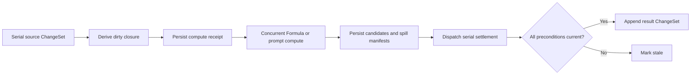

# Capability — Icarus Spreadsheet Runtime Model

> Mirrored from [Notion](https://app.notion.com/p/3aeb6410e5028123a37fc069f8014ce7).

## Summary / Concept
<callout icon="🧭" color="blue_bg">
	**Build position:** Resources 4 of 4. Spreadsheet follows Knowledge, Document, and Slides and completes the editable Resource set with one structured, sparse grid per resource.
</callout>
### Prerequisites
#### Required before implementation
- Request-to-job mapping, the serial queue, the bounded concurrent worker pool, database transactions, logging, and internal-stage dispatch.
- Platform Formula: recursive scalar, list, record, and table values; parsing; binding; evaluation; dependency manifests; limits; and diagnostics.
- The Data resolver adapter that produces immutable Formula resolver snapshots. Spreadsheet owns named-range targets and exposes their stable identities through a narrow value-reader seam consumed by that adapter.
- Stores are configuration-scoped. Scope is not carried in domain objects, requests, operations, or tables. ChangeSets receive configured attribution.
#### Downstream seams
Spreadsheet provides Workspace summaries; stable cell, range, overlay, and rule anchors; exact-revision snapshots for Sources, Knowledge, Templates, Import/Export, Analysis, Document, and Slides; stable range readers for Formula and Data; public command ports for Agents and Automation; and XLSX/PDF snapshot and recipe ports.
Knowledge, Context, Analysis, Media, and Intelligence are consumed through narrow injected ports. They do not own Spreadsheet mutation or accepted cell values.
### Concept and authority
One Spreadsheet resource is exactly one sparse grid:
```plain text
Spreadsheet
├── stable Rows
├── stable Columns
├── sparse Cells
├── named Ranges
├── accepted Spill manifests
├── validation and conditional-format Rules
├── chart and image Overlays
├── freeze and default presentation
└── calculation policy, Base, and ChangeSets
```
Spreadsheet is authoritative for resource identity, row and column order, sparse cells, authored literals, formulas and prompts, stable Formula bindings, accepted and last-good values, named ranges, spill manifests, structural transforms, presentation, rules, overlays, provenance, Base state, ChangeSets, undo/redo, recalculation, and exact snapshots.
A1 notation is an authored projection over one exact Spreadsheet revision. Canonical operations and durable dependencies address stable Row, Column, Cell, and Range IDs.
### Repository placement
```plain text
apps/backend/src/
  3-capabilities/
    spreadsheet/
      domain/
        model.ts
        values.ts
        axes.ts
        ranges.ts
        addressing.ts
        formulas.ts
        dependencies.ts
        recalculation.ts
        spills.ts
        rules.ts
        overlays.ts
        operations.ts
        transforms.ts
        apply.ts
        invariants.ts
        errors.ts
      application/
        spreadsheetService.ts
        windowReads.ts
        recalculation.ts
        snapshots.ts
      ports/
        spreadsheetRepository.ts
        nameResolver.ts
        contextReader.ts
      persistence/
        migrations.ts
        sqliteSpreadsheetRepository.ts
      index.ts
      tests/

  1-init/
    create/
      spreadsheet.ts

  4-job-wiring/
    spreadsheet/
      registerSpreadsheetEndpointMappings.ts
      createSpreadsheetJobs.ts
    internal/
      InternalJobDispatcher.ts
```
`3-capabilities/spreadsheet` owns the aggregate, operations, transforms, recalculation orchestration, persistence, and application service. `1-init/create/spreadsheet.ts` constructs the configuration-scoped store and injects ports. `4-job-wiring/spreadsheet` maps normalized requests to jobs and owns queue choice, response mode, and follow-on dispatch.
## Types & Interfaces
### Canonical aggregate
```typescript
interface Spreadsheet {
  id: string;
  title: string;
  lifecycle: "active" | "archived" | "trashed";
  revision: number;
  baseSeq: number;
  createdAt: string;
  updatedAt: string;
  base: SpreadsheetBase;
}

interface SpreadsheetBase {
  rows: Record<string, SpreadsheetRow>;
  columns: Record<string, SpreadsheetColumn>;
  cells: Record<string, SpreadsheetCell>;
  namedRanges: Record<string, SpreadsheetNamedRange>;
  spills: Record<string, SpreadsheetSpill>;
  rules: Record<string, SpreadsheetRule>;
  overlays: Record<string, SpreadsheetOverlay>;
  freeze: FreezePane;
  defaults: CellPresentation;
  calculation: CalculationPolicy;
}

interface SpreadsheetRow {
  id: string;
  rank: string;
  heightPx: number;
  hidden: boolean;
}

interface SpreadsheetColumn {
  id: string;
  rank: string;
  widthPx: number;
  hidden: boolean;
}
```
Rows and Columns order by `(rank, id)`. Ordinals and column letters are calculated views. Insertion and movement address neighboring stable IDs and assign rank. Array position never carries canonical axis order.
The cell set is sparse. An absent cell resolves to the default presentation and canonical null value. A Cell is stored when it has a source, accepted or last-good value, presentation override, validation state, provenance, or stable dependency identity.
### Cells and Formula values
```typescript
type FormulaWireValue = import("#formula").FormulaWireValue;

interface SpreadsheetCell {
  id: string;
  rowId: string;
  columnId: string;
  source: SpreadsheetCellSource;
  acceptedValue: FormulaWireValue;
  lastGoodValue?: FormulaWireValue;
  computation: CellComputationState;
  display: CellDisplay;
  presentation: CellPresentation;
  provenance: ProvenanceLink[];
  sourceRevision: number;
  valueRevision: number;
  displayRevision: number;
}

type SpreadsheetCellSource =
  | { kind: "literal"; value: FormulaWireValue }
  | { kind: "formula"; formula: SpreadsheetFormulaBinding }
  | { kind: "prompt"; prompt: SpreadsheetPromptBinding };

interface CellComputationState {
  state: "ready" | "dirty" | "queued" | "evaluating" | "error";
  generationToken: string;
  dependencyDigest?: string;
  diagnostic?: FormulaDiagnostic | PromptDiagnostic;
  acceptedAtRevision?: number;
}
```
Spreadsheet imports Formula's shared wire algebra directly. Exact numbers remain reduced rationals encoded with decimal-string numerator and denominator; list, record, and table values use Formula's recursive rectangular carrier.
A Cell holds any persistent Formula wire value without automatically expanding it. Nested list, record, and table values remain nested values. If evaluation returns executable function state, the Formula wire codec returns a typed non-serializable diagnostic, Spreadsheet preserves `lastGoodValue`, and no candidate value is accepted. Any failed Formula or prompt evaluation follows the same last-good-value rule.
### Stable cells, ranges, and A1 projection
```typescript
interface StableCellRef {
  rowId: string;
  columnId: string;
}

interface StableRangeRef {
  start: StableCellRef;
  end: StableCellRef;
}

interface SpreadsheetNamedRange {
  id: string;
  nameId: string;
  range: StableRangeRef;
  createdAtRevision: number;
}

interface AuthoredCellAddress {
  columnToken: string;
  rowToken: string;
  columnMode: "relative" | "absolute";
  rowMode: "relative" | "absolute";
}

type SpreadsheetBoundReference =
  | {
      kind: "cell";
      target: StableCellRef;
      authoredToken: string;
      addressing: AuthoredCellAddress;
    }
  | {
      kind: "range";
      target: StableRangeRef;
      authoredToken: string;
      startAddressing: AuthoredCellAddress;
      endAddressing: AuthoredCellAddress;
    }
  | {
      kind: "name";
      nameId: string;
      bindingRevision: number;
      authoredToken: string;
    };
```
A Range is inclusive and evaluated using row and column rank at the requested revision. Durable state never stores only `A1:B7`.
Cells retain stable IDs while ordinary lookup uses `(rowId, columnId)`. Moving an axis preserves cells attached to its identity. Deleting an axis produces explicit broken references for affected bindings; it never silently retargets a neighboring cell.
A1 reads return the exact projection revision. An A1 mutation supplies the revision against which it was interpreted; a changed revision returns a conflict unless the request explicitly asks to rebind its authored intent.
### Formula and prompt sources
```typescript
interface SpreadsheetFormulaBinding {
  authoredSource: string;
  authoredSourceDigest: string;
  boundSource: string;
  boundReferences: SpreadsheetBoundReference[];
  bindingDigest: string;
  observedDependencies: ObservedDependency[];
  dependencyDigest?: string;
  projection: CellProjection;
}

interface SpreadsheetPromptBinding {
  prompt: string;
  inputRefs: SpreadsheetPromptInput[];
  contextIds: string[];
  modelPurpose: string;
  updatePolicy: "manual" | "on-input-change";
  projection: CellProjection;
}

type CellProjection =
  | { kind: "value" }
  | {
      kind: "spill";
      orientation: "rows" | "columns" | "table";
    };
```
Binding freezes the exact Spreadsheet revision and axis order, parses A1 tokens, resolves them to stable references, resolves names through one immutable Data name-resolution snapshot, validates the bound expression with Formula, and stores authored and stable representations together.
Formula owns syntax, value algebra, query semantics, and evaluation. Spreadsheet owns A1 display, stable binding, relative and absolute copy behavior, dependency persistence, dirty closure, accepted values, diagnostics, and recalculation.
### Explicit spill semantics
Structured values spill only when the source declares `projection.kind = "spill"`.
- `value` keeps a list, record, or table in the anchor Cell.
- `rows` projects one list item per row.
- `columns` projects one list item per column.
- `table` projects the outer table rows and columns.
- Nested structured values inside a projected item remain values; projection does not recurse.
- A record remains one value unless a Formula expression explicitly converts it to a list or table and requests spill projection.
```typescript
interface SpreadsheetSpill {
  id: string;
  anchorCellId: string;
  sourceRevision: number;
  valueDigest: string;
  range: StableRangeRef;
  projection: Exclude<CellProjection, { kind: "value" }>;
  state: "accepted" | "blocked";
  diagnostic?: SpillDiagnostic;
}
```
The accepted spill manifest is canonical. Projected spill cells are derived read views and are read-only. A canonical occupied cell, another accepted spill, or a protected range blocks the projection and records a diagnostic. `materialize-spill` creates literal canonical Cells and removes the spill manifest in one atomic ChangeSet.
### Rules and overlays
Validation and conditional-format rules own stable IDs and target stable Ranges. Freeze panes reference stable Row and Column boundaries. Defaults provide presentation for sparse absence.
Charts and images are overlays anchored to stable Cells plus pixel offsets. An overlay does not occupy Cells and does not block spill projection. A chart may consume a stable Range or an exact Analysis result; Spreadsheet owns placement and local presentation.
### Capability ports
```typescript
interface SpreadsheetRepository {
  list(): Promise<SpreadsheetSummary[]>;
  create(input: CreateSpreadsheet): Promise<Spreadsheet>;
  load(spreadsheetId: string, revision?: number): Promise<Spreadsheet>;
  readWindow(input: SpreadsheetWindowRequest): Promise<SpreadsheetWindow>;
  append(input: AppendSpreadsheetChangeSet): Promise<SpreadsheetChangeSet>;
  listHistory(
    spreadsheetId: string,
    cursor?: string,
  ): Promise<SpreadsheetChangeSetSummary[]>;
  createComputeRequest(
    input: CreateSpreadsheetComputeRequest,
  ): Promise<SpreadsheetComputeRequest>;
  settleCompute(
    input: SettleSpreadsheetCompute,
  ): Promise<SpreadsheetChangeSet | undefined>;
  compact(input: CompactSpreadsheetBase): Promise<void>;
}

interface SpreadsheetCommands {
  create(input: CreateSpreadsheetRequest): Promise<Spreadsheet>;
  submit(
    spreadsheetId: string,
    submission: SpreadsheetSubmission,
  ): Promise<SpreadsheetChangeSet>;
  undo(
    spreadsheetId: string,
    input: UndoSpreadsheetRequest,
  ): Promise<SpreadsheetChangeSet>;
  redo(
    spreadsheetId: string,
    input: RedoSpreadsheetRequest,
  ): Promise<SpreadsheetChangeSet>;
  requestRecalculation(
    input: RequestSpreadsheetRecalculation,
  ): Promise<SpreadsheetStageIntent>;
}

interface SpreadsheetReaders {
  readCell(
    spreadsheetId: string,
    target: StableCellRef,
    revision?: number,
  ): Promise<SpreadsheetCellSnapshot>;
  readRange(
    spreadsheetId: string,
    target: StableRangeRef,
    revision?: number,
  ): Promise<SpreadsheetRangeSnapshot>;
  resolveTarget(
    spreadsheetId: string,
    targetId: string,
    revision?: number,
  ): Promise<SpreadsheetTargetSnapshot>;
}
```
## Runtime Objects
### Construction
```typescript
const repository = createSpreadsheetRepositoryFromRuntimeConfig(config, database);
const spreadsheets = createSpreadsheetCapability({
  repository,
  formula,
  dataResolver,
  knowledge,
  context,
  analysis,
  media,
  intelligence,
  logger,
  attribution: createRuntimeAttribution(config),
});
```
Project scope and attribution are bound from top-level configuration during initialization. They do not enter Spreadsheet values, request payloads, operations, or SQL rows.
### Aggregate runtime
A loaded Spreadsheet is reconstructed from its normalized Base tables plus the contiguous ChangeSet tail. Stable row and column identities drive addressing; A1 is a revision-bound projection. Runtime Formula values are converted through Formula `toWire` before they can become accepted values or persisted compute candidates.
### Structural transforms
Structural operations are semantic transforms, not textual search-and-replace.
For each insert, delete, move, copy, paste, or fill operation, Spreadsheet:
1. Freezes the pre-change revision and axis ranks.
2. Applies the stable Row or Column mutation.
3. Reprojects authored A1 addresses for display.
4. Preserves bound references whose stable targets survive.
5. Produces explicit broken-reference diagnostics for deleted targets.
6. Transforms copied relative references using source-to-destination axis deltas.
7. Preserves absolute row and column anchors.
8. Rewrites named ranges, rule targets, spill manifests, charts, and overlays through stable references.
9. Rebuilds the affected dependency footprint.
10. Commits the structural change and required source adjustments in one ChangeSet.
A move carries referenced identities with the moved region. A copy mints destination Cells and transforms relative references. Cut-and-paste is one operation recipe, so no intermediate broken state becomes canonical.
### Recalculation
```typescript
interface SpreadsheetComputeRequest {
  id: string;
  spreadsheetId: string;
  requestDigest: string;
  requestedAtRevision: number;
  targetCellIds: string[];
  sourceManifest: CellSourceManifest[];
  dependencyManifest: ExactDependencyRef[];
  dependencyDigest: string;
  generationToken: string;
  state:
    | "queued"
    | "running"
    | "candidate-ready"
    | "settled"
    | "stale"
    | "failed";
}

interface CellComputeCandidate {
  cellId: string;
  sourceRevision: number;
  value?: FormulaWireValue;
  diagnostic?: FormulaDiagnostic | PromptDiagnostic;
  observedDependencies: ExactDependencyRef[];
  dependencyDigest: string;
  valueDigest?: string;
  provenance: ProvenanceLink[];
}
```
A source ChangeSet derives the dirty reverse-dependency closure. The serial request stage freezes Spreadsheet revision, source revisions, dependency graph, name-resolution snapshot, and generation token. The concurrent stage finds strongly connected components, records cycles, topologically evaluates acyclic components, converts every successful result through Formula's `toWire`, persists immutable wire-value candidates, and returns a serial settlement intent. `NON_SERIALIZABLE_VALUE` is persisted as a diagnostic candidate with no value.
Settlement rechecks revision eligibility, Cell identity, source revision, stable references, dependency digest, name snapshot, generation token, and spill eligibility. Eligible candidates enter one `apply-compute-results` ChangeSet. Stale candidates remain inspectable and cannot alter current Cells.

## Change Operations
### Operations
```typescript
type SpreadsheetOperation =
  | { type: "rename-spreadsheet"; title: string }
  | { type: "set-lifecycle"; lifecycle: Spreadsheet["lifecycle"] }
  | { type: "set-calculation-policy"; policy: CalculationPolicy }
  | { type: "set-freeze"; freeze: FreezePane }
  | { type: "set-default-presentation"; presentation: CellPresentation }
  | { type: "insert-rows"; rows: SpreadsheetRow[] }
  | { type: "move-rows"; rowIds: string[]; afterRowId?: string }
  | { type: "delete-rows"; rowIds: string[] }
  | { type: "resize-rows"; rowIds: string[]; heightPx: number }
  | { type: "set-rows-hidden"; rowIds: string[]; hidden: boolean }
  | { type: "insert-columns"; columns: SpreadsheetColumn[] }
  | { type: "move-columns"; columnIds: string[]; afterColumnId?: string }
  | { type: "delete-columns"; columnIds: string[] }
  | { type: "resize-columns"; columnIds: string[]; widthPx: number }
  | { type: "set-columns-hidden"; columnIds: string[]; hidden: boolean }
  | { type: "set-cell-source"; target: StableCellRef; source: SpreadsheetCellSource }
  | { type: "clear-cells"; range: StableRangeRef; fields: CellFieldSelection }
  | {
      type: "paste";
      destination: StableCellRef;
      payload: SpreadsheetPastePayload;
      mode: "all" | "values" | "formulas" | "presentation";
    }
  | {
      type: "move-range";
      source: StableRangeRef;
      destination: StableCellRef;
      collision: "reject" | "overwrite";
    }
  | {
      type: "copy-range";
      source: StableRangeRef;
      destination: StableCellRef;
      collision: "reject" | "overwrite";
    }
  | { type: "fill-range"; source: StableRangeRef; destination: StableRangeRef }
  | { type: "create-named-range"; namedRange: SpreadsheetNamedRange }
  | { type: "update-named-range"; rangeId: string; range: StableRangeRef }
  | { type: "delete-named-range"; rangeId: string }
  | { type: "create-rule"; rule: SpreadsheetRule }
  | { type: "update-rule"; ruleId: string; patch: SpreadsheetRulePatch }
  | { type: "delete-rule"; ruleId: string }
  | { type: "create-overlay"; overlay: SpreadsheetOverlay }
  | { type: "update-overlay"; overlayId: string; patch: SpreadsheetOverlayPatch }
  | { type: "delete-overlay"; overlayId: string }
  | { type: "materialize-spill"; spillId: string }
  | {
      type: "apply-compute-results";
      requestId: string;
      candidates: CellComputeCandidate[];
      spills: SpreadsheetSpill[];
    };
```
Bulk paste, fill, import, and materialization are bounded operation recipes. Create and copy recipes supply new stable IDs. The reducer calculates the full transform and validates the complete resulting grid before accepting any operation.
### Base, revisions, and ChangeSets
```typescript
interface SpreadsheetSubmission {
  requestId: string;
  requestDigest: string;
  expectedRevision: number;
  operations: SpreadsheetOperation[];
}

interface SpreadsheetChangeSet {
  id: string;
  spreadsheetId: string;
  requestId: string;
  requestDigest: string;
  priorRevision: number;
  revision: number;
  seq: number;
  attributionId: string;
  createdAt: string;
  operations: SpreadsheetOperation[];
  inverseOperations: SpreadsheetOperation[];
  footprint: {
    rowIds: string[];
    columnIds: string[];
    cellIds: string[];
    rangeIds: string[];
    overlayIds: string[];
    structural: boolean;
  };
  undoOf?: string;
  redoOf?: string;
}
```
Head state is normalized Base through `baseSeq` plus the ordered ChangeSet tail. Submission is atomic:
1. Load Base and tail in a transaction.
2. Return the accepted ChangeSet for an identical `(spreadsheetId, requestId, requestDigest)` retry.
3. Reject request-ID reuse with a different digest.
4. Require `expectedRevision`, except where retained footprints prove semantic disjointness.
5. Apply operations and structural transforms in memory.
6. Validate the complete grid.
7. Derive inverse operations, dirty cells, and footprint.
8. Append one ChangeSet and advance revision with compare-and-swap.
Undo and redo append compensating ChangeSets. Accepted ChangeSets are never disabled or rewritten. Compaction folds a contiguous prefix into normalized Base tables and advances `baseSeq` without changing logical revision.
## Endpoints
<table fit-page-width="true" header-row="true">
<tr>
<td>Method and path</td>
<td>Job</td>
<td>Queue</td>
<td>Response</td>
</tr>
<tr>
<td>`GET /spreadsheets`</td>
<td>`spreadsheets.list`</td>
<td>Concurrent</td>
<td>Inline summaries</td>
</tr>
<tr>
<td>`POST /spreadsheets`</td>
<td>`spreadsheets.create`</td>
<td>Serial</td>
<td>Created sparse grid</td>
</tr>
<tr>
<td>`GET /spreadsheets/:spreadsheetId`</td>
<td>`spreadsheets.get`</td>
<td>Concurrent</td>
<td>Metadata and exact revision</td>
</tr>
<tr>
<td>`GET /spreadsheets/:spreadsheetId/window`</td>
<td>`spreadsheets.window.read`</td>
<td>Concurrent</td>
<td>Bounded sparse window</td>
</tr>
<tr>
<td>`GET /spreadsheets/:spreadsheetId/history`</td>
<td>`spreadsheets.history.list`</td>
<td>Concurrent</td>
<td>Bounded history</td>
</tr>
<tr>
<td>`POST /spreadsheets/:spreadsheetId/changes`</td>
<td>`spreadsheets.submit`</td>
<td>Serial</td>
<td>ChangeSet or conflict</td>
</tr>
<tr>
<td>`POST /spreadsheets/:spreadsheetId/undo`</td>
<td>`spreadsheets.undo`</td>
<td>Serial</td>
<td>Compensating ChangeSet</td>
</tr>
<tr>
<td>`POST /spreadsheets/:spreadsheetId/redo`</td>
<td>`spreadsheets.redo`</td>
<td>Serial</td>
<td>Compensating ChangeSet</td>
</tr>
<tr>
<td>`POST /spreadsheets/:spreadsheetId/recalculations`</td>
<td>`spreadsheets.recalculate.request`</td>
<td>Serial</td>
<td>Durable receipt</td>
</tr>
<tr>
<td>`POST /spreadsheets/:spreadsheetId/refreshes`</td>
<td>`spreadsheets.refresh.request`</td>
<td>Serial</td>
<td>Durable receipt</td>
</tr>
<tr>
<td>`GET /spreadsheets/:spreadsheetId/computations/:requestId`</td>
<td>`spreadsheets.compute.get`</td>
<td>Concurrent</td>
<td>Computation status</td>
</tr>
<tr>
<td>`GET /spreadsheets/:spreadsheetId/snapshot`</td>
<td>`spreadsheets.snapshot.get`</td>
<td>Concurrent</td>
<td>Exact snapshot</td>
</tr>
</table>
Queue selection is fixed by endpoint mapping before the capability-specific payload is decoded.
## Jobs
<table fit-page-width="true" header-row="true">
<tr>
<td>Endpoint or intent</td>
<td>Job</td>
<td>Queue</td>
<td>Response mode</td>
<td>Change operations emitted</td>
<td>Calls or durable writes</td>
</tr>
<tr>
<td>Create Spreadsheet</td>
<td>`spreadsheets.create`</td>
<td>Serial</td>
<td>Inline Spreadsheet</td>
<td>Creates Base revision 0</td>
<td>Spreadsheet repository and Activity contribution</td>
</tr>
<tr>
<td>Submit authored or structural edits</td>
<td>`spreadsheets.submit`</td>
<td>Serial</td>
<td>Inline ChangeSet</td>
<td>Submitted `SpreadsheetOperation[]` plus deterministic transform effects</td>
<td>Reducer, dependency footprint, inverse derivation, repository CAS</td>
</tr>
<tr>
<td>Undo or redo</td>
<td>`spreadsheets.undo` / `spreadsheets.redo`</td>
<td>Serial</td>
<td>Inline compensating ChangeSet</td>
<td>Stored inverse or forward compensation</td>
<td>Retained history and repository CAS</td>
</tr>
<tr>
<td>List, get, window, history, snapshot, or compute status</td>
<td>Read jobs</td>
<td>Concurrent</td>
<td>Inline read result</td>
<td>None</td>
<td>Spreadsheet repository and rebuildable projections</td>
</tr>
<tr>
<td>Recalculation admission</td>
<td>`spreadsheets.recalculate.request`</td>
<td>Serial</td>
<td>Durable receipt</td>
<td>None</td>
<td>Freezes revision, cell sources, dependency graph, Data resolver snapshot, and generation token; emits run intent</td>
</tr>
<tr>
<td>Formula or prompt compute</td>
<td>`spreadsheets.compute.run`</td>
<td>Concurrent</td>
<td>Persisted candidates plus settle intent</td>
<td>None</td>
<td>Platform Formula, Knowledge/Context/Intelligence prompt ports, and Formula `toWire`</td>
</tr>
<tr>
<td>Compute settlement</td>
<td>`spreadsheets.compute.settle`</td>
<td>Serial</td>
<td>ChangeSet or stale result</td>
<td>`apply-compute-results` for eligible candidates and spill manifests</td>
<td>Spreadsheet repository CAS and Activity contribution</td>
</tr>
<tr>
<td>Bound-source refresh</td>
<td>`spreadsheets.refresh.run` → `spreadsheets.refresh.settle`</td>
<td>Concurrent → serial</td>
<td>Persisted candidate, then ChangeSet or stale result</td>
<td>`apply-compute-results` when current</td>
<td>Injected source readers followed by repository CAS</td>
</tr>
<tr>
<td>Compaction</td>
<td>`spreadsheets.compact`</td>
<td>Serial</td>
<td>Inline completion</td>
<td>None</td>
<td>Base replacement and retained-tail pruning</td>
</tr>
</table>
### Internal stage intent
```typescript
interface SpreadsheetStageIntent {
  type:
    | "spreadsheets.compute.run"
    | "spreadsheets.compute.settle"
    | "spreadsheets.refresh.run"
    | "spreadsheets.refresh.settle"
    | "spreadsheets.compact";
  requestId: string;
  spreadsheetId: string;
  idempotencyKey: string;
}
```
Reads use the concurrent path. Canonical mutations use the serial path. Formula evaluation, prompt generation, refresh, and rendering use serial receipt, concurrent compute, and serial settlement. The capability returns plain intents; `InternalJobDispatcher` enqueues them. A running job never changes queues.
## SQL Tables
### Logical schema and indexes
```sql
CREATE TABLE spreadsheets (
  id          TEXT PRIMARY KEY,
  title       TEXT NOT NULL,
  lifecycle   TEXT NOT NULL,
  revision    INTEGER NOT NULL,
  base_seq    INTEGER NOT NULL,
  base_meta   BLOB NOT NULL,
  created_at  TEXT NOT NULL,
  updated_at  TEXT NOT NULL
);

CREATE TABLE spreadsheet_base_rows (
  spreadsheet_id TEXT NOT NULL,
  row_id         TEXT NOT NULL,
  rank           TEXT NOT NULL,
  height_px      INTEGER NOT NULL,
  hidden         INTEGER NOT NULL,
  PRIMARY KEY (spreadsheet_id, row_id),
  FOREIGN KEY (spreadsheet_id) REFERENCES spreadsheets(id) ON DELETE CASCADE
);

CREATE TABLE spreadsheet_base_columns (
  spreadsheet_id TEXT NOT NULL,
  column_id      TEXT NOT NULL,
  rank           TEXT NOT NULL,
  width_px       INTEGER NOT NULL,
  hidden         INTEGER NOT NULL,
  PRIMARY KEY (spreadsheet_id, column_id),
  FOREIGN KEY (spreadsheet_id) REFERENCES spreadsheets(id) ON DELETE CASCADE
);

CREATE TABLE spreadsheet_base_cells (
  spreadsheet_id  TEXT NOT NULL,
  cell_id         TEXT NOT NULL,
  row_id          TEXT NOT NULL,
  column_id       TEXT NOT NULL,
  source          BLOB NOT NULL,
  accepted_value  BLOB NOT NULL,
  last_good_value BLOB,
  computation     BLOB NOT NULL,
  display         BLOB NOT NULL,
  presentation    BLOB NOT NULL,
  provenance      BLOB NOT NULL,
  source_revision INTEGER NOT NULL,
  value_revision  INTEGER NOT NULL,
  display_revision INTEGER NOT NULL,
  PRIMARY KEY (spreadsheet_id, cell_id),
  UNIQUE (spreadsheet_id, row_id, column_id),
  FOREIGN KEY (spreadsheet_id, row_id)
    REFERENCES spreadsheet_base_rows(spreadsheet_id, row_id),
  FOREIGN KEY (spreadsheet_id, column_id)
    REFERENCES spreadsheet_base_columns(spreadsheet_id, column_id)
);

CREATE TABLE spreadsheet_base_named_ranges (
  spreadsheet_id TEXT NOT NULL,
  range_id       TEXT NOT NULL,
  name_id        TEXT NOT NULL,
  start_row_id   TEXT NOT NULL,
  start_column_id TEXT NOT NULL,
  end_row_id     TEXT NOT NULL,
  end_column_id  TEXT NOT NULL,
  created_at_revision INTEGER NOT NULL,
  PRIMARY KEY (spreadsheet_id, range_id),
  UNIQUE (spreadsheet_id, name_id),
  FOREIGN KEY (spreadsheet_id) REFERENCES spreadsheets(id) ON DELETE CASCADE
);

CREATE TABLE spreadsheet_base_spills (
  spreadsheet_id TEXT NOT NULL,
  spill_id       TEXT NOT NULL,
  anchor_cell_id TEXT NOT NULL,
  source_revision INTEGER NOT NULL,
  value_digest   TEXT NOT NULL,
  start_row_id   TEXT NOT NULL,
  start_column_id TEXT NOT NULL,
  end_row_id     TEXT NOT NULL,
  end_column_id  TEXT NOT NULL,
  projection     BLOB NOT NULL,
  state          TEXT NOT NULL,
  diagnostic     BLOB,
  PRIMARY KEY (spreadsheet_id, spill_id),
  UNIQUE (spreadsheet_id, anchor_cell_id),
  FOREIGN KEY (spreadsheet_id, anchor_cell_id)
    REFERENCES spreadsheet_base_cells(spreadsheet_id, cell_id) ON DELETE CASCADE
);

CREATE TABLE spreadsheet_base_rules (
  spreadsheet_id TEXT NOT NULL,
  rule_id        TEXT NOT NULL,
  kind           TEXT NOT NULL,
  target         BLOB NOT NULL,
  payload        BLOB NOT NULL,
  PRIMARY KEY (spreadsheet_id, rule_id),
  FOREIGN KEY (spreadsheet_id) REFERENCES spreadsheets(id) ON DELETE CASCADE
);

CREATE TABLE spreadsheet_base_overlays (
  spreadsheet_id TEXT NOT NULL,
  overlay_id     TEXT NOT NULL,
  rank           TEXT NOT NULL,
  kind           TEXT NOT NULL,
  anchor         BLOB NOT NULL,
  payload        BLOB NOT NULL,
  PRIMARY KEY (spreadsheet_id, overlay_id),
  FOREIGN KEY (spreadsheet_id) REFERENCES spreadsheets(id) ON DELETE CASCADE
);

CREATE TABLE spreadsheet_change_sets (
  id                 TEXT PRIMARY KEY,
  spreadsheet_id     TEXT NOT NULL,
  request_id         TEXT NOT NULL,
  request_digest     TEXT NOT NULL,
  prior_revision     INTEGER NOT NULL,
  revision           INTEGER NOT NULL,
  seq                INTEGER NOT NULL,
  attribution_id     TEXT NOT NULL,
  operations         BLOB NOT NULL,
  inverse_operations BLOB NOT NULL,
  footprint          BLOB NOT NULL,
  undo_of             TEXT,
  redo_of             TEXT,
  created_at          TEXT NOT NULL,
  UNIQUE (spreadsheet_id, seq),
  UNIQUE (spreadsheet_id, request_id),
  FOREIGN KEY (spreadsheet_id) REFERENCES spreadsheets(id) ON DELETE CASCADE
);

CREATE TABLE spreadsheet_compute_requests (
  id                     TEXT PRIMARY KEY,
  spreadsheet_id         TEXT NOT NULL,
  request_digest         TEXT NOT NULL,
  spreadsheet_revision   INTEGER NOT NULL,
  target_cell_ids        BLOB NOT NULL,
  source_manifest        BLOB NOT NULL,
  dependency_manifest    BLOB NOT NULL,
  dependency_digest      TEXT NOT NULL,
  generation_token       TEXT NOT NULL,
  state                  TEXT NOT NULL,
  failure                BLOB,
  created_at             TEXT NOT NULL,
  updated_at             TEXT NOT NULL,
  UNIQUE (spreadsheet_id, request_digest),
  FOREIGN KEY (spreadsheet_id) REFERENCES spreadsheets(id) ON DELETE CASCADE
);

CREATE TABLE spreadsheet_compute_candidates (
  request_id        TEXT NOT NULL,
  cell_id           TEXT NOT NULL,
  source_revision   INTEGER NOT NULL,
  candidate         BLOB NOT NULL,
  dependency_digest TEXT NOT NULL,
  value_digest      TEXT,
  created_at        TEXT NOT NULL,
  PRIMARY KEY (request_id, cell_id),
  FOREIGN KEY (request_id) REFERENCES spreadsheet_compute_requests(id) ON DELETE CASCADE
);
```
Required indexes:
```sql
CREATE INDEX spreadsheets_updated
  ON spreadsheets(lifecycle, updated_at DESC, id);
CREATE INDEX spreadsheet_rows_order
  ON spreadsheet_base_rows(spreadsheet_id, rank, row_id);
CREATE INDEX spreadsheet_columns_order
  ON spreadsheet_base_columns(spreadsheet_id, rank, column_id);
CREATE INDEX spreadsheet_cells_row
  ON spreadsheet_base_cells(spreadsheet_id, row_id, column_id);
CREATE INDEX spreadsheet_cells_column
  ON spreadsheet_base_cells(spreadsheet_id, column_id, row_id);
CREATE INDEX spreadsheet_named_ranges_name
  ON spreadsheet_base_named_ranges(spreadsheet_id, name_id);
CREATE INDEX spreadsheet_spills_range
  ON spreadsheet_base_spills(spreadsheet_id, start_row_id, start_column_id);
CREATE INDEX spreadsheet_overlays_order
  ON spreadsheet_base_overlays(spreadsheet_id, rank, overlay_id);
CREATE INDEX spreadsheet_changes_replay
  ON spreadsheet_change_sets(spreadsheet_id, seq);
CREATE INDEX spreadsheet_changes_recent
  ON spreadsheet_change_sets(spreadsheet_id, created_at DESC, id);
CREATE INDEX spreadsheet_compute_pending
  ON spreadsheet_compute_requests(state, updated_at, id);
```
The `candidate` BLOB stores a canonical `CellComputeCandidate`; its optional value is strictly `FormulaWireValue`. A runtime function result becomes a typed `NON_SERIALIZABLE_VALUE` diagnostic candidate with no value.
`base_meta` stores freeze, default presentation, calculation policy, and Base bookkeeping. Base component tables represent the same compacted sequence and are replaced atomically. Every value BLOB is the canonical encoding of Platform Formula's `FormulaWireValue`; Spreadsheet never serializes a private value shape.
Rebuildable projections include A1-to-stable-ID maps keyed by revision, reverse dependency edges, dirty closures, cycle analysis, projected spill-cell windows, display strings, conditional-format matches, chart scenes, viewport caches, and Source snapshot hashes. Formula source, stable bindings, accepted and last-good values, named ranges, accepted spill manifests, rules, overlays, provenance, Base, and ChangeSets are canonical.
## Appendices
### Governing invariants
1. One Spreadsheet identity represents exactly one sparse grid.
2. Row, Column, Cell, named Range, Spill, Rule, and Overlay IDs are stable.
3. A1 notation and positional indexes are revision-bound projections.
4. Durable operations address stable Row and Column identities.
5. Cell values mirror Formula's scalar, list, record, and table algebra.
6. Formula owns evaluation semantics; Spreadsheet owns sources, bindings, dependencies, diagnostics, and accepted values.
7. Structured values spill only under explicit projection.
8. Projection never recursively spills nested structured values.
9. Derived spill cells are read-only; materialization is one atomic ChangeSet.
10. Structural transforms preserve surviving targets and make deleted targets explicitly broken.
11. Every mutation appends one atomic ChangeSet of typed operations.
12. Undo and redo append compensation.
13. Concurrent results settle through a new serial job and cannot overwrite newer source or dependency state.
14. Derived address, dependency, spill-cell, display, and chart projections are disposable.
15. Spreadsheet SQL and migrations stay inside the capability.
16. The domain imports neither the web server nor provider SDKs.
### Acceptance criteria
- A Spreadsheet reloads as one sparse grid with stable Row, Column, and Cell IDs.
- Row and Column insertion, deletion, movement, copy, fill, cut, and paste produce deterministic structural transforms.
- Bound references survive axis movement and become explicit broken references after target deletion.
- Relative, absolute, mixed, named, cell, and Range references behave deterministically under copy and move.
- Scalar, list, record, and table values round-trip without implicit expansion.
- Explicit list and table projections create correct accepted spill manifests.
- Nested structured values remain nested during projection.
- Derived spill cells reject direct edits; materialization creates literals atomically.
- Occupied or protected canonical Cells block a spill with a stable diagnostic.
- Cycle detection, last-good values, dirty closures, and Formula diagnostics are reproducible.
- A stale compute candidate cannot replace newer source, binding, name, dependency, or generation state.
- Sparse window reads do not materialize empty Cells.
- Replay, retry idempotency, conflict detection, undo, redo, and compaction are deterministic.
- Exact snapshots can be analyzed, indexed, exported, templated, and addressed by stable target ID.
- Deleting every rebuildable projection leaves the Spreadsheet and history intact.
