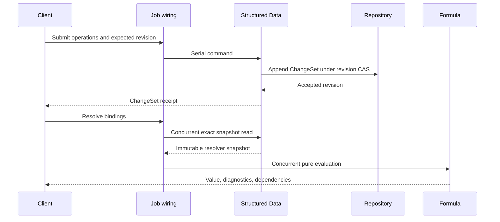
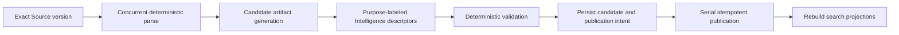

# Structured Data Capability Reference

Structured Data is the canonical project store for editable tables, typed variables, and stable names. It gives Formula, Analysis, Spreadsheet, authored resources, agents, and research workflows one exact way to address quantitative and tabular project state.

Each project has an independent `StructuredDataSpace`. Every identity, read, mutation, revision, import, and projection carries both `userId` and `projectId`, allowing many projects to operate in the same runtime and database.

Structured Data has two related state families:

1. **Editable project data**: tables, columns, rows, cells, variables, and bindings governed by Base, append-only ChangeSets, and revision compare-and-swap.
2. **Imported structured artifacts**: immutable, source-grounded generations produced from CSV, XLSX, or exact Spreadsheet snapshots and published atomically.

Imported artifacts become editable through an explicit promotion operation that creates normal Structured Data identities and records lineage.

## Authority and integration boundaries

| Concern | Authority |
| --- | --- |
| Project tables, columns, rows, cells, variables, names, bindings, revisions, and ChangeSets | Structured Data |
| Exact value algebra and expression semantics | Formula |
| Sparse editable grids and stable spreadsheet ranges | Spreadsheet |
| Charts, analytical workspaces, scenarios, and immutable analysis results | Analysis |
| Uploaded file bytes and captured source versions | Sources |
| Model execution and provider selection | Platform Intelligence |
| Database connection, transaction, and migration runner | Platform Database |
| Structured Data SQL, repository adapter, and migrations | Structured Data |

Structured Data exposes immutable snapshots and typed commands. Consumers refer to stable IDs and exact revisions rather than copying mutable tables into their own canonical state.

## Repository placement

```text
apps/backend/src/
  3-capabilities/
    built-in/
      structured-data/
        domain/
          model.ts
          schema.ts
          values.ts
          bindings.ts
          operations.ts
          footprints.ts
          apply.ts
          errors.ts
        application/
          service.ts
          snapshots.ts
          queries.ts
          imports.ts
          promotion.ts
        ports/
          structuredDataRepository.ts
          sourceSnapshotReader.ts
          spreadsheetRangeReader.ts
          resourceValueReader.ts
        persistence/
          migrations.ts
          sqliteStructuredDataRepository.ts
        index.ts
        tests/

  4-job-wiring/
    structured-data/
      registerStructuredDataEndpointMappings.ts
      createStructuredDataJobs.ts
```

Capability code owns domain behavior and SQL. Job wiring owns request-envelope conversion, queue selection, response mode, and internal stage dispatch. The persistence adapter consumes the generic transaction and connection interfaces supplied by `0-platform/database`.

## Project scope and aggregate

```typescript
interface ProjectScope {
  userId: string;
  projectId: string;
}

interface StructuredDataSpace {
  id: string;
  userId: string;
  projectId: string;
  revision: number;
  baseSeq: number;
  lifecycle: "active" | "archived";
  createdAt: string;
  updatedAt: string;
}

interface StructuredDataBase {
  representationVersion: "structured-data/v1";
  tables: StructuredTable[];
  variables: StructuredVariable[];
  bindings: DataBinding[];
}
```

One space provides a coherent project namespace and one exact revision for resolver snapshots. A read resolves the Base through `baseSeq` plus the contiguous ChangeSet tail through `revision`.

## Canonical value and type model

Structured Data persists the seven non-executable Formula value kinds. It uses the same recursive table carrier:

```typescript
type DataValue =
  | { kind: "null" }
  | { kind: "number"; value: CanonicalRational }
  | { kind: "text"; value: string }
  | { kind: "logic"; value: boolean }
  | { kind: "list"; table: DataTableCarrier }
  | { kind: "record"; table: DataTableCarrier }
  | { kind: "table"; table: DataTableCarrier };

type DataValueKind = DataValue["kind"];

interface DataTableCarrier {
  fields: readonly string[];
  rows: readonly (readonly DataValue[])[];
}
```

The admitted kinds are `null`, `number`, `text`, `logic`, `list`, `record`, and `table`. Numbers use Formula's canonical reduced rational. Lists, records, and tables remain immutable and rectangular. Their field strings are ordered, exact, and case-sensitive. Cells recursively contain `DataValue`, allowing nested lists, records, and tables while excluding executable function values at every depth.

The shared carrier has the same shape constraints as Formula:

| Kind | Carrier shape |
| --- | --- |
| `list` | One field named `value`; zero or more rows |
| `record` | Exactly one row; zero or more fields |
| `table` | Zero or more fields; zero or more rows |

Schema validation checks both the outer shape and every nested carrier recursively.

Column and variable schemas use a recursive type descriptor:

```typescript
type DataType =
  | { kind: "null" }
  | { kind: "number"; unit?: string }
  | { kind: "text" }
  | { kind: "logic" }
  | { kind: "list"; element: DataType }
  | { kind: "record"; fields: DataFieldType[] }
  | { kind: "table"; columns: DataFieldType[] }
  | { kind: "union"; variants: DataType[] };

interface DataFieldType {
  id: string;
  name: string;
  type: DataType;
  nullable: boolean;
}
```

`union` is a schema descriptor rather than a Formula value kind. A stored value still has exactly one admitted Formula kind. Schema validation recursively checks nested structured cells and returns a path to the first incompatible value.

## Tables

```typescript
interface StructuredTable {
  id: string;
  name: string;
  description?: string;
  columns: StructuredColumn[];
  rows: StructuredRow[];
  lifecycle: "active" | "archived";
  createdAt: string;
  updatedAt: string;
}

interface StructuredColumn {
  id: string;
  name: string;
  rank: string;
  type: DataType;
  nullable: boolean;
  description?: string;
  role:
    | "dimension"
    | "measure"
    | "identifier"
    | "time"
    | "assumption"
    | "output";
}

interface StructuredRow {
  id: string;
  rank: string;
  values: Readonly<Record<string, DataValue>>;
}

interface StableDataCellRef {
  tableId: string;
  rowId: string;
  columnId: string;
}
```

Rows and columns use stable IDs and sortable ranks. Display order may change while references remain valid. A missing sparse cell resolves to canonical `null` when its column admits null; required columns must contain an admitted value.

Column names are unique, exact, and case-sensitive within a table so the table converts directly into Formula's table carrier. Table identity and schema are separate from display names. A rename updates the current label while Formula bindings, Analysis fields, and resource bindings continue to refer to stable IDs.

## Variables

```typescript
interface StructuredVariable {
  id: string;
  name: string;
  description?: string;
  type: DataType;
  value: DataValue;
  unit?: string;
  role: "variable" | "assumption" | "constant" | "output";
  lifecycle: "active" | "archived";
  createdAt: string;
  updatedAt: string;
}
```

A variable may hold a scalar or structured value. A table-valued variable is therefore valid and can itself contain nested table-valued cells. Variables remain first-class stable targets for Formula, Analysis scenarios, resource bindings, and agents.

## Names and bindings

A project-visible name is a stable binding object:

```typescript
type BindingTarget =
  | { kind: "variable"; variableId: string }
  | { kind: "table"; tableId: string }
  | { kind: "table-column"; tableId: string; columnId: string }
  | {
      kind: "table-cell";
      tableId: string;
      rowId: string;
      columnId: string;
    }
  | {
      kind: "spreadsheet-range";
      spreadsheetId: string;
      start: StableCellRef;
      end: StableCellRef;
      pinnedRevision?: number;
    }
  | {
      kind: "resource-value";
      resourceKind: "document" | "slides" | "spreadsheet";
      resourceId: string;
      targetId: string;
      pinnedRevision?: number;
    }
  | {
      kind: "analysis-result";
      analysisId: string;
      resultId: string;
      outputName: string;
    };

interface DataBinding {
  id: string;
  userId: string;
  projectId: string;
  scope: "project" | "analysis" | "resource";
  ownerId?: string;
  displayName: string;
  normalizedLookupKey: string;
  target: BindingTarget;
  expectedType?: DataType;
  lifecycle: "active" | "archived";
}
```

An active lookup key is unique within:

```text
userId + projectId + scope + ownerId + normalizedLookupKey
```

Authored references bind to `DataBinding.id`. A rename changes `displayName` and `normalizedLookupKey` while preserving identity and target. Retargeting is a separate typed operation and therefore visible in history.

Project-visible Spreadsheet ranges are represented by bindings whose targets contain stable Spreadsheet row and column IDs. Spreadsheet owns the range snapshot; Structured Data owns the name.

## Formula resolver snapshots

Structured Data builds immutable resolver snapshots:

```typescript
interface StructuredResolverRequest {
  scope: ProjectScope;
  names?: string[];
  bindingIds?: string[];
  atRevision?: number;
}

interface StructuredResolverSnapshot {
  id: string;
  userId: string;
  projectId: string;
  structuredDataRevision: number;
  bindings: ResolvedFormulaBinding[];
  externalInputs: ExactExternalInputRef[];
  snapshotDigest: string;
}
```

The snapshot resolves every requested binding to:

- stable binding and target identities;
- an exact owner revision;
- an immutable Formula-compatible value;
- a value digest;
- the complete external input manifest for Spreadsheet, Analysis, or resource targets.

One Formula evaluation observes one resolver snapshot. External reads complete before the snapshot is released to Formula.

## Base, revisions, and ChangeSets

```typescript
interface StructuredDataSubmission {
  submissionId: string;
  expectedRevision: number;
  operations: StructuredDataOperation[];
}

interface StructuredDataChangeSet {
  id: string;
  spaceId: string;
  userId: string;
  projectId: string;
  submissionId: string;
  submissionHash: string;
  priorRevision: number;
  revision: number;
  seq: number;
  authorId: string;
  createdAt: string;
  operations: StructuredDataOperation[];
  inverseOperations: StructuredDataOperation[];
  footprint: StructuredDataFootprint;
  undoOf?: string;
  redoOf?: string;
}

interface StructuredDataFootprint {
  structuralTables: string[];
  tableSchemas: string[];
  rows: Array<{ tableId: string; rowId: string }>;
  cells: StableDataCellRef[];
  variables: string[];
  bindings: string[];
}
```

An accepted submission:

1. canonicalizes the request and computes `submissionHash`;
2. returns the original result for an identical `(spaceId, submissionId, submissionHash)` retry;
3. compares `expectedRevision` with the current revision;
4. applies a retained stale submission only when its semantic footprint is disjoint from every intervening ChangeSet;
5. applies the closed operation list to an immutable working state;
6. validates identities, schemas, values, bindings, and resulting invariants;
7. computes inverse operations and the complete footprint;
8. appends one ChangeSet and advances revision in one transaction.

Schema edits conflict with stale edits to affected cells. Row edits can proceed independently across distinct stable rows. Cell updates can proceed independently across distinct `(tableId, rowId, columnId)` targets when intervening structural operations preserve those targets.

Undo and redo append compensating ChangeSets at the current head. Base compaction folds a contiguous ChangeSet prefix into normalized Base tables and advances `baseSeq` under compare-and-swap while leaving the logical revision unchanged.

## Typed operation vocabulary

```typescript
type StructuredDataOperation =
  | { type: "archive-space" }
  | { type: "restore-space" }
  | { type: "create-table"; table: NewStructuredTable }
  | { type: "rename-table"; tableId: string; name: string }
  | {
      type: "set-table-description";
      tableId: string;
      description?: string;
    }
  | { type: "archive-table"; tableId: string }
  | { type: "restore-table"; tableId: string }
  | {
      type: "add-column";
      tableId: string;
      column: NewStructuredColumn;
      defaultValue?: DataValue;
    }
  | {
      type: "update-column";
      tableId: string;
      columnId: string;
      patch: StructuredColumnPatch;
      conversion?: ValueConversionPlan;
    }
  | { type: "move-column"; tableId: string; columnId: string; afterColumnId?: string }
  | { type: "remove-column"; tableId: string; columnId: string }
  | {
      type: "insert-rows";
      tableId: string;
      afterRowId?: string;
      rows: NewStructuredRow[];
    }
  | {
      type: "update-cells";
      tableId: string;
      cells: Array<{
        rowId: string;
        columnId: string;
        value: DataValue;
      }>;
    }
  | {
      type: "move-rows";
      tableId: string;
      rowIds: string[];
      afterRowId?: string;
    }
  | { type: "remove-rows"; tableId: string; rowIds: string[] }
  | { type: "create-variable"; variable: NewStructuredVariable }
  | { type: "set-variable"; variableId: string; value: DataValue }
  | {
      type: "update-variable";
      variableId: string;
      patch: StructuredVariablePatch;
    }
  | { type: "archive-variable"; variableId: string }
  | { type: "restore-variable"; variableId: string }
  | { type: "create-binding"; binding: NewDataBinding }
  | {
      type: "rename-binding";
      bindingId: string;
      displayName: string;
    }
  | {
      type: "retarget-binding";
      bindingId: string;
      target: BindingTarget;
    }
  | { type: "archive-binding"; bindingId: string }
  | { type: "restore-binding"; bindingId: string }
  | {
      type: "promote-imported-artifact";
      artifactId: string;
      generation: number;
      promotion: StructuredPromotionPlan;
    };
```

Bulk operations remain typed and bounded. Import promotion creates a deterministic operation recipe and applies it as one serial submission.

## Queries

Structured Data supports stable-ID and bounded set reads:

```typescript
interface StructuredTableReadRequest {
  scope: ProjectScope;
  tableId: string;
  atRevision?: number;
  columnIds?: string[];
  rowIds?: string[];
  afterRank?: string;
  limit: number;
}

interface StructuredTableQueryRequest {
  scope: ProjectScope;
  tableId: string;
  atRevision?: number;
  condition?: {
    source: string;
    languageVersion: "formula/v1";
  };
  projectColumnIds?: string[];
  orderBy?: Array<{
    columnId: string;
    direction: "ascending" | "descending";
  }>;
  limit: number;
}
```

A set query freezes one Structured Data revision, binds current exact column names to stable Column IDs, converts requested rows into an immutable Formula table, and applies Formula's field projection or Boolean condition-query semantics. Results include the exact Structured Data revision, projected Column IDs, query digest, and continuation cursor.

## Public request types

```typescript
interface CreateStructuredDataSpaceRequest {
  scope: ProjectScope;
  requestId: string;
}

interface SubmitStructuredDataRequest {
  scope: ProjectScope;
  submission: StructuredDataSubmission;
}

interface RequestStructuredImport {
  scope: ProjectScope;
  idempotencyKey: string;
  sourceId: string;
  sourceVersionId: string;
  format: "csv" | "xlsx" | "spreadsheet-snapshot";
  policyVersion: string;
}
```

| Request type | Kind | Result |
| --- | --- | --- |
| `structured-data.create-space.v1` | Idempotent command | Project space at revision zero |
| `structured-data.get-space.v1` | Query | Metadata, Base/tail, or resolved snapshot |
| `structured-data.tables.list.v1` | Query | Bounded table summaries |
| `structured-data.tables.read.v1` | Query | Exact stable-ID row and column window |
| `structured-data.tables.query.v1` | Query | Bounded set filter/projection result |
| `structured-data.variables.list.v1` | Query | Typed variables at an exact revision |
| `structured-data.bindings.resolve.v1` | Query | Immutable Formula resolver snapshot |
| `structured-data.submit.v1` | Idempotent command | Accepted ChangeSet or typed conflict |
| `structured-data.undo.v1` | Idempotent command | Compensating ChangeSet |
| `structured-data.redo.v1` | Idempotent command | Compensating ChangeSet |
| `structured-data.history.list.v1` | Query | Bounded ChangeSet summaries |
| `structured-data.import.request.v1` | Idempotent command | Import attempt identity |
| `structured-data.import.status.v1` | Query | Attempt, generation, and diagnostics |
| `structured-data.artifacts.search.v1` | Query | Descriptor matches |
| `structured-data.artifacts.read.v1` | Query | Exact bounded artifact slice |
| `structured-data.artifacts.promote.v1` | Idempotent command | Promotion ChangeSet |

## Request-to-job mapping

| Work | Queue | Response |
| --- | --- | --- |
| Space, table, variable, history, artifact, and resolver reads | Concurrent | Inline |
| Set-based bounded table query | Concurrent | Inline |
| Create, submit, undo, redo, archive, restore, and promote | Serial | Inline |
| Parse/profile source, infer descriptors, and build candidate generation | Concurrent | Deferred |
| Publish an imported generation | Serial internal stage | Internal |
| Compact Base | Serial internal stage | Internal |

```typescript
const structuredDataJobFactories: EndpointJobFactoryMap = {
  "structured-data.get-space.v1": createConcurrentInlineJob(getSpace),
  "structured-data.tables.read.v1": createConcurrentInlineJob(readTable),
  "structured-data.tables.query.v1": createConcurrentInlineJob(queryTable),
  "structured-data.bindings.resolve.v1":
    createConcurrentInlineJob(resolveBindings),
  "structured-data.submit.v1": createSerialInlineJob(submit),
  "structured-data.undo.v1": createSerialInlineJob(undo),
  "structured-data.redo.v1": createSerialInlineJob(redo),
  "structured-data.import.request.v1":
    createConcurrentDeferredJob(requestImport),
  "structured-data.artifacts.promote.v1":
    createSerialInlineJob(promoteArtifact),
};
```

The endpoint registry determines queue and response mode. Concurrent import work persists a candidate generation and emits a typed publication intent. Job wiring enqueues the serial publication stage after the concurrent stage releases its pool slot.

Every internal stage uses a deterministic idempotency key:

```typescript
interface StructuredDataStageIntent {
  requestType:
    | "structured-data.import.publish.v1"
    | "structured-data.base.compact.v1";
  idempotencyKey: string;
  userId: string;
  projectId: string;
  payload: unknown;
}
```

## Imported structured artifacts

```typescript
interface StructuredImport {
  id: string;
  userId: string;
  projectId: string;
  sourceId: string;
  sourceVersionId: string;
  format: "csv" | "xlsx" | "spreadsheet-snapshot";
  policyVersion: string;
  state:
    | "queued"
    | "running"
    | "candidate-ready"
    | "ready"
    | "failed"
    | "interrupted";
  currentGeneration?: number;
  createdAt: string;
  updatedAt: string;
}

interface StructuredArtifact {
  id: string;
  importId: string;
  userId: string;
  projectId: string;
  generation: number;
  kind: "table" | "model-region" | "worksheet-map" | "workbook-map";
  locator: SourceLocator;
  schema: DataType;
  shape: { rows: number; columns: number };
  payloadRef: ArtifactPayloadRef;
  contentHash: string;
  descriptor: StructuredDescriptor;
  lineage: StructuredArtifactLineage;
}
```

Each generation is immutable. Refresh builds a candidate generation beside the current generation, reuses artifacts with matching content hashes, validates the complete candidate, and advances `currentGeneration` atomically.

Descriptor generation may call Platform Intelligence with a purpose label such as `describe-structured-schema`. The request contains bounded schema, profile, and sample cards. The capability validates referenced fields, ranges, relationships, and statistics against deterministic extraction before publication.

Promotion pins `artifactId`, `generation`, and `contentHash`, creates stable table/column/row identities, and records source lineage in the resulting ChangeSet.

## Persistence

All canonical and derived rows carry `user_id` and `project_id`. Capability migrations create the following Base, history, import, and projection tables.

### Space and normalized Base

```sql
CREATE TABLE structured_data_spaces (
  id          TEXT PRIMARY KEY,
  user_id     TEXT NOT NULL,
  project_id  TEXT NOT NULL,
  revision    INTEGER NOT NULL DEFAULT 0,
  base_seq    INTEGER NOT NULL DEFAULT 0,
  lifecycle   TEXT NOT NULL DEFAULT 'active',
  created_at  TEXT NOT NULL,
  updated_at  TEXT NOT NULL,
  UNIQUE (user_id, project_id, id),
  UNIQUE (user_id, project_id)
);

CREATE INDEX structured_data_spaces_project
  ON structured_data_spaces(project_id, lifecycle, updated_at DESC, id);

CREATE TABLE structured_data_base_tables (
  space_id     TEXT NOT NULL,
  user_id      TEXT NOT NULL,
  project_id   TEXT NOT NULL,
  id           TEXT NOT NULL,
  name         TEXT NOT NULL,
  description  TEXT,
  lifecycle    TEXT NOT NULL,
  created_at   TEXT NOT NULL,
  updated_at   TEXT NOT NULL,
  PRIMARY KEY (space_id, id),
  UNIQUE (user_id, project_id, space_id, id),
  FOREIGN KEY (user_id, project_id, space_id)
    REFERENCES structured_data_spaces(user_id, project_id, id)
    ON DELETE CASCADE
);

CREATE INDEX structured_data_tables_project_name
  ON structured_data_base_tables(project_id, lifecycle, name, id);

CREATE TABLE structured_data_base_columns (
  space_id     TEXT NOT NULL,
  table_id     TEXT NOT NULL,
  user_id      TEXT NOT NULL,
  project_id   TEXT NOT NULL,
  id           TEXT NOT NULL,
  name         TEXT NOT NULL,
  rank         TEXT NOT NULL,
  type_json    BLOB NOT NULL,
  nullable     INTEGER NOT NULL,
  role         TEXT NOT NULL,
  description  TEXT,
  PRIMARY KEY (space_id, table_id, id),
  UNIQUE (user_id, project_id, space_id, table_id, id),
  FOREIGN KEY (user_id, project_id, space_id, table_id)
    REFERENCES structured_data_base_tables(
      user_id, project_id, space_id, id
    ) ON DELETE CASCADE
);

CREATE INDEX structured_data_columns_rank
  ON structured_data_base_columns(space_id, table_id, rank, id);

CREATE TABLE structured_data_base_rows (
  space_id    TEXT NOT NULL,
  table_id    TEXT NOT NULL,
  user_id     TEXT NOT NULL,
  project_id  TEXT NOT NULL,
  id          TEXT NOT NULL,
  rank        TEXT NOT NULL,
  PRIMARY KEY (space_id, table_id, id),
  UNIQUE (user_id, project_id, space_id, table_id, id),
  FOREIGN KEY (user_id, project_id, space_id, table_id)
    REFERENCES structured_data_base_tables(
      user_id, project_id, space_id, id
    ) ON DELETE CASCADE
);

CREATE INDEX structured_data_rows_rank
  ON structured_data_base_rows(space_id, table_id, rank, id);

CREATE TABLE structured_data_base_cells (
  space_id    TEXT NOT NULL,
  table_id    TEXT NOT NULL,
  row_id      TEXT NOT NULL,
  column_id   TEXT NOT NULL,
  user_id     TEXT NOT NULL,
  project_id  TEXT NOT NULL,
  value_json  BLOB NOT NULL,
  value_hash  TEXT NOT NULL,
  PRIMARY KEY (space_id, table_id, row_id, column_id),
  FOREIGN KEY (user_id, project_id, space_id, table_id, row_id)
    REFERENCES structured_data_base_rows(
      user_id, project_id, space_id, table_id, id
    ) ON DELETE CASCADE,
  FOREIGN KEY (user_id, project_id, space_id, table_id, column_id)
    REFERENCES structured_data_base_columns(
      user_id, project_id, space_id, table_id, id
    ) ON DELETE CASCADE
);

CREATE INDEX structured_data_cells_column
  ON structured_data_base_cells(space_id, table_id, column_id, row_id);
```

### Variables, bindings, and ChangeSets

```sql
CREATE TABLE structured_data_base_variables (
  space_id      TEXT NOT NULL,
  user_id       TEXT NOT NULL,
  project_id    TEXT NOT NULL,
  id            TEXT NOT NULL,
  name          TEXT NOT NULL,
  type_json     BLOB NOT NULL,
  value_json    BLOB NOT NULL,
  value_hash    TEXT NOT NULL,
  unit          TEXT,
  role          TEXT NOT NULL,
  lifecycle     TEXT NOT NULL,
  created_at    TEXT NOT NULL,
  updated_at    TEXT NOT NULL,
  PRIMARY KEY (space_id, id),
  UNIQUE (user_id, project_id, space_id, id),
  FOREIGN KEY (user_id, project_id, space_id)
    REFERENCES structured_data_spaces(user_id, project_id, id)
    ON DELETE CASCADE
);

CREATE INDEX structured_data_variables_project_role
  ON structured_data_base_variables(project_id, lifecycle, role, id);

CREATE TABLE structured_data_base_bindings (
  space_id               TEXT NOT NULL,
  user_id                TEXT NOT NULL,
  project_id             TEXT NOT NULL,
  id                     TEXT NOT NULL,
  scope                  TEXT NOT NULL,
  owner_id               TEXT,
  display_name           TEXT NOT NULL,
  normalized_lookup_key  TEXT NOT NULL,
  target_json            BLOB NOT NULL,
  expected_type_json     BLOB,
  lifecycle              TEXT NOT NULL,
  PRIMARY KEY (space_id, id),
  UNIQUE (user_id, project_id, space_id, id),
  FOREIGN KEY (user_id, project_id, space_id)
    REFERENCES structured_data_spaces(user_id, project_id, id)
    ON DELETE CASCADE
);

CREATE UNIQUE INDEX structured_data_bindings_active_lookup
  ON structured_data_base_bindings(
    user_id,
    project_id,
    scope,
    COALESCE(owner_id, ''),
    normalized_lookup_key
  )
  WHERE lifecycle = 'active';

CREATE INDEX structured_data_bindings_project
  ON structured_data_base_bindings(
    project_id, lifecycle, normalized_lookup_key, id
  );

CREATE TABLE structured_data_change_sets (
  id                TEXT PRIMARY KEY,
  space_id          TEXT NOT NULL,
  user_id           TEXT NOT NULL,
  project_id        TEXT NOT NULL,
  submission_id     TEXT NOT NULL,
  submission_hash   TEXT NOT NULL,
  prior_revision    INTEGER NOT NULL,
  revision          INTEGER NOT NULL,
  seq               INTEGER NOT NULL,
  author_id         TEXT NOT NULL,
  operations_json   BLOB NOT NULL,
  inverse_ops_json  BLOB NOT NULL,
  footprint_json    BLOB NOT NULL,
  undo_of           TEXT,
  redo_of           TEXT,
  created_at        TEXT NOT NULL,
  UNIQUE (space_id, seq),
  UNIQUE (space_id, submission_id),
  FOREIGN KEY (user_id, project_id, space_id)
    REFERENCES structured_data_spaces(user_id, project_id, id)
    ON DELETE CASCADE
);

CREATE INDEX structured_data_changes_project_recent
  ON structured_data_change_sets(
    project_id, created_at DESC, id
  );
```

### Imports and artifacts

```sql
CREATE TABLE structured_imports (
  id                  TEXT PRIMARY KEY,
  user_id             TEXT NOT NULL,
  project_id          TEXT NOT NULL,
  source_id           TEXT NOT NULL,
  source_version_id   TEXT NOT NULL,
  format              TEXT NOT NULL,
  policy_version      TEXT NOT NULL,
  state               TEXT NOT NULL,
  current_generation  INTEGER,
  created_at          TEXT NOT NULL,
  updated_at          TEXT NOT NULL,
  UNIQUE (
    project_id, source_version_id, policy_version
  ),
  UNIQUE (user_id, project_id, id)
);

CREATE INDEX structured_imports_project_state
  ON structured_imports(
    project_id, state, updated_at DESC, id
  );

CREATE TABLE structured_artifacts (
  id                TEXT PRIMARY KEY,
  import_id         TEXT NOT NULL,
  user_id           TEXT NOT NULL,
  project_id        TEXT NOT NULL,
  generation        INTEGER NOT NULL,
  kind              TEXT NOT NULL,
  content_hash      TEXT NOT NULL,
  locator_json      BLOB NOT NULL,
  schema_json       BLOB NOT NULL,
  shape_json        BLOB NOT NULL,
  payload_ref_json  BLOB NOT NULL,
  descriptor_json   BLOB NOT NULL,
  lineage_json      BLOB NOT NULL,
  created_at        TEXT NOT NULL,
  UNIQUE (import_id, generation, id),
  FOREIGN KEY (user_id, project_id, import_id)
    REFERENCES structured_imports(user_id, project_id, id)
    ON DELETE CASCADE
);

CREATE INDEX structured_artifacts_generation
  ON structured_artifacts(
    import_id, generation, kind, id
  );

CREATE INDEX structured_artifacts_project_kind
  ON structured_artifacts(project_id, kind, id);

CREATE TABLE structured_import_stage_results (
  import_id         TEXT NOT NULL,
  user_id           TEXT NOT NULL,
  project_id        TEXT NOT NULL,
  stage             TEXT NOT NULL,
  idempotency_key   TEXT NOT NULL,
  output_json       BLOB NOT NULL,
  next_intent_json  BLOB,
  created_at        TEXT NOT NULL,
  PRIMARY KEY (import_id, stage),
  UNIQUE (idempotency_key),
  FOREIGN KEY (user_id, project_id, import_id)
    REFERENCES structured_imports(user_id, project_id, id)
    ON DELETE CASCADE
);

CREATE INDEX structured_import_stages_project
  ON structured_import_stage_results(
    project_id, stage, created_at, import_id
  );
```

## SQL indexes and rebuildable projections

SQL indexes shown above accelerate canonical key, scope, order, lifecycle, status, and history reads. Rebuildable projection tables may additionally provide:

- binding-target reverse lookup;
- table and column profiles;
- descriptor full-text search;
- descriptor embeddings;
- source-lineage reverse lookup;
- resolver snapshot caches;
- table query result caches keyed by exact revision and query digest.

Each projection records its source revision or generation and projection-policy version. Rebuilding or deleting projection rows preserves Base, ChangeSets, imported generations, and stable identities.

## Capability ports

```typescript
interface SourceSnapshotReader {
  readExactStructuredSource(input: {
    scope: ProjectScope;
    sourceId: string;
    sourceVersionId: string;
  }): Promise<ExactSourceSnapshot>;
}

interface SpreadsheetRangeReader {
  readExactRange(input: {
    scope: ProjectScope;
    spreadsheetId: string;
    revision: number;
    start: StableCellRef;
    end: StableCellRef;
  }): Promise<DataValue>;
}

interface ResourceValueReader {
  readExactValue(
    input: ExactResourceValueRequest,
  ): Promise<DataValue>;
}

interface StructuredDataRepository {
  createSpace(input: CreateStructuredDataSpace): Promise<StoredStructuredDataSpace>;
  loadSpace(
    scope: ProjectScope,
    atRevision?: number,
  ): Promise<StoredStructuredDataSpace>;
  appendChangeSet(
    input: AppendStructuredDataChangeSet,
  ): Promise<StructuredDataChangeSet>;
  replaceBase(
    input: ReplaceStructuredDataBase,
  ): Promise<void>;
  createImport(
    input: CreateStructuredImport,
  ): Promise<StructuredImport>;
  publishImportGeneration(
    input: PublishStructuredGeneration,
  ): Promise<void>;
}
```

Platform Intelligence is injected for descriptor proposals under a purpose label. Formula is injected as a pure engine for query predicates and projections. Source and Spreadsheet reads use exact-version capability ports assembled in application wiring.

## Mutation and evaluation flow



## Import and publication flow



## Governing invariants

1. Every object and operation is scoped by `userId` and `projectId`.
2. Each project space has one monotonic revision and contiguous ChangeSet sequence.
3. Identical submission retries return the original ChangeSet.
4. Stable table, column, row, variable, and binding IDs survive rename and movement.
5. Stored numbers are exact rationals and stored structured values are recursively typed.
6. A table's outer rows remain rectangular while individual cells may contain nested tables.
7. Binding lookup names are unique within their declared scope; bound references use stable binding IDs.
8. One resolver snapshot pins one Structured Data revision and every external owner revision it observes.
9. Imported generations are immutable and become current through atomic publication.
10. Promotion records the exact imported generation and content hash.
11. Model-produced descriptors become canonical only after deterministic structural validation.
12. Base compaction preserves logical revision, stable identity, and replay equivalence.
13. Rebuildable projections can be recreated from Base, ChangeSets, or immutable generations.
14. Capability SQL and migrations remain colocated with Structured Data.

## Acceptance criteria

- Multiple projects create and read independent Structured Data spaces in the same database.
- Tables, variables, and bindings survive restart with stable identities.
- Scalar and nested list, record, and table values round-trip through persistence.
- A schema-incompatible nested value identifies the exact field and cell path.
- Invalid operations reject atomically.
- Concurrent stale writes to the same cell conflict.
- Provably disjoint cell edits can be applied against retained history.
- Undo and redo append compensating ChangeSets and preserve deterministic replay.
- Binding rename preserves stable references; retargeting appears as its own ChangeSet operation.
- One Formula evaluation observes exactly one immutable resolver snapshot.
- Set filters and projections follow Formula's field-first table semantics.
- CSV values preserve nulls, empty text, quoted delimiters, exact decimals, and leading-zero identifiers according to the import schema.
- An interrupted import preserves the previously published generation.
- An unchanged refresh reuses matching artifact content hashes.
- Promotion creates normal editable identities with source lineage.
- Deleting projection tables leaves canonical project data, history, imports, and artifacts intact.

## References

- [Product — Icarus Complete Product Definition](https://app.notion.com/p/3aeb6410e502810ba9c0c26442d5255a)
- [Architecture — Icarus Runtime Foundation & Repository Boundaries](https://app.notion.com/p/3adb6410e50281e09d83ed36daacf8d8)
- [Model — Icarus Request, Job & Dual-Queue Runtime](https://app.notion.com/p/3adb6410e50281c498f4d7f6a621eba2)
- [Model — Structured Data Capability & Descriptor Lattice](https://app.notion.com/p/3acb6410e5028157b9e4e8228237cfb8)
- [Taurus Omega — Formula Name Manager](https://app.notion.com/p/3a6b6410e50281299d19d09f40660dae)
- [Taurus Omega — Formula Value & Table Model](https://app.notion.com/p/3a6b6410e50281d3aff6cb92f54476cd)
- [Model — Spreadsheet Capability & Runtime Contract](https://app.notion.com/p/3abb6410e5028179a844c0af77b21ffe)
