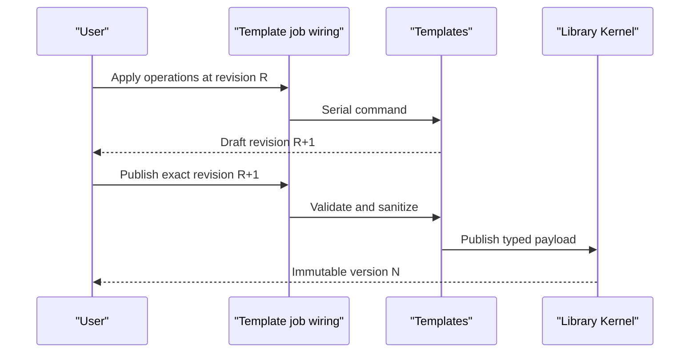
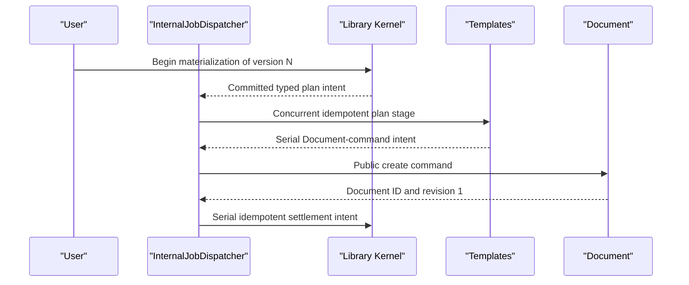

# Templates Capability Reference

## Purpose

Templates is a typed capability above the Library Kernel. It owns Template drafts, slots, kind-specific payload semantics, typed ChangeSets, immutable published payloads, previews, and materialization planning. The Library Kernel owns the asset, version, lineage, and materialization envelope. Document, Slides, and Spreadsheet own every resulting native Resource.

## Bottom line

A Template is a reusable structure for exactly one native Resource kind: Document, Slides, or Spreadsheet. Materialization creates independent Resource state from one exact Template version.

The capability has one mutable draft per scoped library asset, an append-only draft ChangeSet tail, and immutable published versions. Materialization pins a published version and creates or inserts through the destination capability’s public command port. The created Resource receives fresh IDs and its own revision history.

Document, Slides, and Spreadsheet register typed adapters behind the same Template contract.

## Runtime placement

Templates runs inside the Icarus backend. Preview and validation are TypeScript functions; a rendering adapter can invoke an isolated renderer for CPU-heavy output.

```plain text
apps/backend/src/
  3-capabilities/
    templates/
      domain/
        template.ts
        slots.ts
        operations.ts
        events.ts
      application/
        templateService.ts
        reducer.ts
        publisher.ts
        previewService.ts
        materializationPlanner.ts
      adapters/
        registry.ts
        documentTemplateAdapter.ts
        slidesTemplateAdapter.ts
        spreadsheetTemplateAdapter.ts
      ports/
        libraryKernel.ts
        resourceTemplateAdapters.ts
        contextReader.ts
        repository.ts
      persistence/
        migrations.ts
        sqliteTemplateRepository.ts
      projections/
        previewCache.ts
        compatibilityCatalog.ts
      index.ts
  4-job-wiring/
    internal/
      InternalJobDispatcher.ts
    templates/
      registerTemplateEndpointMappings.ts
      createTemplateDraftJobs.ts
      createTemplatePublishJobs.ts
      createTemplatePreviewJobs.ts
      createTemplateMaterializationJobs.ts
```

The generic web server remains in `2-transport`. `4-job-wiring/templates` maps request contracts to queue and response behavior; composition-owned `4-job-wiring/internal/InternalJobDispatcher` maps typed post-commit stage intents to later Jobs. Template adapters remain transport-neutral capability code.

## Authority and integration boundaries

### Templates owns

- Template kind: `document`, `slides`, or `spreadsheet`.
- One folded mutable draft and its revision.
- Stable context-slot IDs, names, descriptions, requirement rules, and references within the Template payload.
- Typed draft operations, inverses, validation, and replay.
- Immutable published Template payloads.
- Template-specific preview input and output.
- Snapshot sanitization, schema migration, ID remapping, and compatibility diagnostics.
- Materialization plans for new Resource creation or kind-compatible insertion.

### Integrated authority

- Library Kernel owns asset identity, user and project scope, display metadata, lifecycle, version envelope, lineage, and generic materialization receipt.
- Context owns project Context content and binding resolution.
- Document, Slides, and Spreadsheet own the created or edited Resource and every destination ChangeSet.
- Collaboration, Automation, Agents, Platform Intelligence, and Research retain their own state and execution contracts.
- Materialization captures exact lineage while producing independent Resource state.
- Templates receives typed snapshots and submits typed public commands through adapters.

## Domain model

```typescript
export type TemplateKind = "document" | "slides" | "spreadsheet";

export interface TemplateSlot {
  id: string;
  name: string;
  description: string;
  required: boolean;
  acceptedBindingKinds: Array<"context" | "source" | "resource">;
}

export interface TemplateDraft {
  assetId: string;
  userId: string;
  projectId: string;
  kind: TemplateKind;
  revision: number;
  baseSeq: number;
  schemaVersion: number;
  slots: TemplateSlot[];
  payload: unknown;
  updatedAt: string;
}

export interface PublishedTemplatePayload {
  assetId: string;
  userId: string;
  projectId: string;
  version: number;
  sourceDraftRevision: number;
  kind: TemplateKind;
  schemaVersion: number;
  slots: TemplateSlot[];
  payload: unknown;
  payloadDigest: string;
}
```

`payload` is `unknown` at the cross-kind boundary. Each registered adapter narrows it to a strict typed schema before use.

### Template adapter

```typescript
interface TemplateKindAdapter<DraftPayload, Snapshot, CreateCommand, InsertCommand> {
  kind: TemplateKind;
  validateDraft(payload: DraftPayload, slots: TemplateSlot[]): ValidationResult;
  sanitizeForPublish(payload: DraftPayload): Snapshot;
  preview(input: TemplatePreviewInput<Snapshot>): Promise<TemplatePreview>;
  planCreate(input: MaterializeCreateInput<Snapshot>): Promise<CreateCommand>;
  planInsert(input: MaterializeInsertInput<Snapshot>): Promise<InsertCommand>;
  remapIds(snapshot: Snapshot, ids: IdFactory): Snapshot;
}
```

The adapter retains reusable semantic content and slots while sanitizing transient editor state, source project IDs, collaboration state, prior ChangeSets, selections, resolved Context values, and expiring file URLs.

## Operations and job classification

| Request type | Queue | Response | Effect |
|---|---|---|---|
| `templates.create.v1` | Serial | Inline `201` | Create a Library asset and typed blank draft atomically |
| `templates.submit.v1` | Serial | Inline | Append a ChangeSet and fold the draft under revision CAS |
| `templates.get.v1`, `templates.list.v1`, `templates.version.get.v1` | Concurrent | Inline | Read an exact draft revision or immutable version |
| `templates.publish.v1` | Serial | Inline | Freeze a payload and coordinate the Library version envelope and head |
| `templates.preview.v1` | Concurrent | Inline when bounded | Compute an ephemeral prompt or content projection |
| `templates.preview.request.v1` | Concurrent | Deferred `202` | Produce a replaceable preview artifact |
| `templates.materialize.create.v1`, `templates.materialize.insert.v1` | Serial | Deferred `202` | Commit the Library receipt and return a plan-stage intent |
| `templates.materialization.plan` | Concurrent | Internal stage result | Build a typed create command or ordinary Resource operations |
| Destination command and Library settlement | Serial stages | Internal stage results | Commit destination state, then settle the receipt |

Because an Icarus Job declares one queue, materialization is a workflow of explicit stages: a serial Library receipt, a concurrent Template plan, a serial Document/Slides/Spreadsheet command, and a serial Library settlement.

Templates records or returns a typed next-stage intent with a deterministic key such as `materialization:{id}:plan:v1`. `InternalJobDispatcher` enqueues that stage after commit. The stage records its request digest and result through the Library materialization-stage coordinator; replay returns the prior result, while a changed digest is `idempotency_mismatch`. A Template stage returns its destination-command intent to job wiring, which owns Scheduler invocation.

## Draft ChangeSet and publication model

Supported operations are typed and deliberately small:

```typescript
type TemplateOperation =
  | { type: "slot.add"; slot: TemplateSlot; index: number }
  | { type: "slot.update"; slotId: string; patch: TemplateSlotPatch }
  | { type: "slot.move"; slotId: string; toIndex: number }
  | { type: "slot.remove"; slotId: string }
  | { type: "payload.apply"; operation: TemplateKindOperation }
  | { type: "draft.replace"; schemaVersion: number; payload: unknown };
```

Every draft command supplies `assetId`, `expectedRevision`, `clientRequestId`, and `requestDigest`. An identical retry returns the original ChangeSet, while reuse with a divergent digest returns `idempotency_mismatch`. The reducer validates the complete resulting draft and records both forward and inverse operations. Accepted ChangeSets never change. Folding may compact the base while retaining the accepted tail as history.

Publishing:

1. pins an exact draft revision;
2. validates all slots and internal references;
3. sanitizes the typed payload;
4. computes a canonical digest;
5. asks the Library Kernel to create version `head + 1`;
6. writes the typed payload keyed by `(assetId, version)` in the same transaction;
7. advances the Library head.

Publishing preserves the draft and its history. Each later edit creates a new draft revision and each later publish creates a new immutable version.

Template events:

- `TemplateDraftChanged`
- `TemplateVersionPublished`
- `TemplatePreviewProduced`
- `TemplateMaterializationPlanned`

They contain IDs, revisions, kind, diagnostics, and digests. Template content remains in canonical typed payload storage.

## Capability-owned tables

```sql
CREATE TABLE template_drafts (
  asset_id TEXT PRIMARY KEY,
  user_id TEXT NOT NULL,
  project_id TEXT NOT NULL,
  kind TEXT NOT NULL CHECK (kind IN ('document','slides','spreadsheet')),
  revision INTEGER NOT NULL,
  base_seq INTEGER NOT NULL,
  schema_version INTEGER NOT NULL,
  slots_json TEXT NOT NULL,
  payload_json TEXT NOT NULL,
  updated_at TEXT NOT NULL,
  UNIQUE (user_id, project_id, asset_id),
  FOREIGN KEY (user_id, project_id, asset_id)
    REFERENCES library_assets(user_id, project_id, id)
);

CREATE TABLE template_changesets (
  id TEXT PRIMARY KEY,
  asset_id TEXT NOT NULL,
  user_id TEXT NOT NULL,
  project_id TEXT NOT NULL,
  seq INTEGER NOT NULL,
  author_user_id TEXT NOT NULL,
  client_request_id TEXT NOT NULL,
  request_digest TEXT NOT NULL,
  expected_revision INTEGER NOT NULL,
  operations_json TEXT NOT NULL,
  inverse_json TEXT NOT NULL,
  created_at TEXT NOT NULL,
  UNIQUE (asset_id, seq),
  UNIQUE (user_id, project_id, asset_id, author_user_id, client_request_id),
  FOREIGN KEY (user_id, project_id, asset_id)
    REFERENCES template_drafts(user_id, project_id, asset_id)
);

CREATE TABLE template_version_payloads (
  asset_id TEXT NOT NULL,
  user_id TEXT NOT NULL,
  project_id TEXT NOT NULL,
  version INTEGER NOT NULL,
  source_draft_revision INTEGER NOT NULL,
  kind TEXT NOT NULL,
  schema_version INTEGER NOT NULL,
  slots_json TEXT NOT NULL,
  payload_json TEXT NOT NULL,
  payload_digest TEXT NOT NULL,
  created_at TEXT NOT NULL,
  PRIMARY KEY (asset_id, version),
  UNIQUE (user_id, project_id, asset_id, version),
  FOREIGN KEY (user_id, project_id, asset_id, version)
    REFERENCES library_asset_versions(user_id, project_id, asset_id, version)
);

CREATE TABLE template_preview_cache (
  asset_id TEXT NOT NULL,
  user_id TEXT NOT NULL,
  project_id TEXT NOT NULL,
  source_kind TEXT NOT NULL CHECK (source_kind IN ('draft','published')),
  source_revision INTEGER NOT NULL,
  binding_digest TEXT NOT NULL,
  renderer_version TEXT NOT NULL,
  preview_json TEXT NOT NULL,
  diagnostics_json TEXT NOT NULL,
  created_at TEXT NOT NULL,
  expires_at TEXT,
  PRIMARY KEY (
    user_id, project_id, asset_id, source_kind,
    source_revision, binding_digest, renderer_version
  ),
  FOREIGN KEY (user_id, project_id, asset_id)
    REFERENCES library_assets(user_id, project_id, id)
);
```

`template_preview_cache` is replaceable. The canonical draft and immutable published payloads remain authoritative. Template assets use lifecycle state and retained history.

## SQL indexes

```sql
CREATE INDEX template_changesets_tail
  ON template_changesets(user_id, project_id, asset_id, seq DESC);

CREATE INDEX template_version_payloads_kind_created
  ON template_version_payloads(user_id, project_id, kind, created_at DESC, asset_id, version);

CREATE INDEX template_preview_cache_expiry
  ON template_preview_cache(expires_at, user_id, project_id, asset_id);
```

The Library Kernel supplies catalog, scope, lifecycle, version, lineage, and materialization indexes. Templates contributes typed summaries through its safe summary port.

## Named rebuildable projections

### `template_preview`

The cached render of an exact draft revision or published version plus an exact ephemeral binding digest. It can be regenerated from the typed payload, adapter version, and selected bindings.

### `template_compatibility_catalog`

A computed list of legal destination modes and Resource kinds for each published version, derived from `kind`, adapter registration, schema version, and target capability support. It powers “Create new” and “Insert into” choices.

These named read models are rebuildable projections, distinct from SQL indexes and canonical Template state.

## Dependencies and ports

### Required

- Library Kernel asset, version, and materialization coordinators.
- `ContextBindingReader` for optional preview/materialization bindings.
- `DocumentTemplatePort`, `SlidesTemplatePort`, and `SpreadsheetTemplatePort`.
- Database, clock, IDs, digest, and logger.

### Provided

- Draft commands and exact draft/version readers.
- `TemplatePreviewPort`.
- `TemplateMaterializationPlanner`.
- Safe summary provider used by the Library catalog.

### Destination command law

Adapters may return:

- `CreateDocumentFromSnapshot`
- `ApplyDocumentOperations`
- `CreateDeckFromSnapshot`
- `ApplyDeckOperations`
- `CreateSpreadsheetFromSnapshot`
- `ApplySpreadsheetOperations`

The destination capability validates and commits these commands. Templates records the resulting target identity in the Library materialization receipt.

## Intelligence and web use

The Template Library’s AI surface is an Agent workflow: Agents read an exact scoped draft revision or published version and propose normal Template operations. Confirmation submits those operations through the Template command port. Research owns web retrieval.

## Principal flows

### Edit and publish



### Materialize into a Document



## Invariants

- Every Template belongs to exactly one Library asset of kind `template`.
- Every draft and published payload has exactly one Resource kind.
- Slot IDs are stable and unique within a Template.
- Renaming a slot rewrites all typed internal references atomically.
- Draft writes use revision CAS and append immutable ChangeSets.
- Published payloads are immutable and content-addressed.
- Preview bindings are ephemeral; canonical draft and published versions remain unchanged.
- Materialization pins an exact published version.
- Every materialized Resource-local ID is fresh.
- Materialization sanitizes and remaps the source snapshot into destination-owned IDs and state.
- A created Resource is independent; later Template lifecycle or version changes preserve it.
- Insert mode commits ordinary destination ChangeSets and respects the destination’s expected revision.
- Every materialization stage is idempotent by materialization ID, stage key, and request digest.
- Job wiring owns Scheduler invocation and each stage commits before its next intent is dispatched.

## Conformance scenarios

1. Create a blank draft, edit a typed Resource payload, add slots, publish a version, preview it, and create a new Resource.
2. Round-trip stored JSON through strict TypeScript schemas at every boundary.
3. Dispatch destination mutation and settlement as separate idempotent intents.
4. Materialize Document, Slides, and Spreadsheet versions through the same adapter registry.
5. Insert a published version against an exact destination revision.

## Acceptance criteria

- [ ] Templates uses the Library Kernel envelope for scope, versions, lineage, and materialization receipts.
- [ ] A stale draft revision returns a conflict and preserves current draft state.
- [ ] ChangeSet replay yields the same folded draft.
- [ ] Publishing commits the Library version envelope and typed payload atomically.
- [ ] A use of version N always reads version N even after N+1 is published.
- [ ] Prompt and bound previews leave canonical Template state unchanged.
- [ ] Every created Resource ID and nested Resource-local ID is fresh.
- [ ] The destination Resource owns the resulting state and ChangeSet.
- [ ] Duplicate materialization returns the original Resource result.
- [ ] Replaying any materialization stage returns its existing destination mutation or settlement.
- [ ] Preview cache and compatibility catalog rebuild from canonical records.
- [ ] Agents, Research, and destination capabilities interact through typed ports.

## References

- [Product — Icarus Complete Product Definition](https://app.notion.com/p/3aeb6410e502810ba9c0c26442d5255a)
- [Model — Icarus Request, Job & Dual-Queue Runtime](https://app.notion.com/p/3adb6410e50281c498f4d7f6a621eba2)
- [Architecture — Icarus Runtime Foundation & Repository Boundaries](https://app.notion.com/p/3adb6410e50281e09d83ed36daacf8d8)
- [Implementation — User Template Library](https://app.notion.com/p/3acb6410e50281d4a4d8ee542f91d595)
- [Implementation — User Context Library](https://app.notion.com/p/3acb6410e502814e928ae1f10eac6f75)
- [Model — Slides Capability & Runtime Contract](https://app.notion.com/p/3abb6410e50281df8762c162e9a6eb13)
- [Model — Spreadsheet Capability & Runtime Contract](https://app.notion.com/p/3abb6410e5028179a844c0af77b21ffe)
- [Taurus Omega — Document Editor Outcome Checklist](https://app.notion.com/p/3a5b6410e50281d58042cde7c2b7e516)
