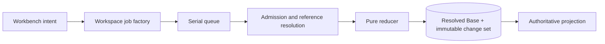

# Capability — Workspace

Workspace is the durable workbench-shell state for a `userId + projectId` scope. It owns the permanent `overview`, `research`, and `analyze` destinations, open editable-Resource tabs, active focus, tab order, panel geometry, and bounded per-tab view state.

## Purpose and boundary

Workspace restores the workbench exactly enough that the user can resume work after a refresh or restart.

It owns:

- one default Workspace per `userId + projectId`;
- the permanent Overview, Research, and Analyze tabs;
- open Document, Slides, and Spreadsheet tabs;
- active-tab identity and tab order;
- workspace-wide panel geometry;
- per-tab Context lens, Inspector target/mode, and bounded viewport envelopes;
- Workspace revisions, submissions, change sets, and shell undo/redo.

Project metadata, Questions, Context definitions, Research state, editor content, source material, and comments retain their capability owners. Workspace stores stable typed references and reads titles through editor summary ports. Pointer, caret, hover, drag, and other transient interaction state stays in the frontend session.

Opening a view affects shell state. Knowledge admission remains governed by Source Versions, admitted Evidence, and literal Media OCR.

## Runtime placement

```plain text
apps/backend/src/3-capabilities/workspace/
  domain/
    model.ts
    operations.ts
    reducer.ts
    validation.ts
  application/
    service.ts
  ports/
    repository.ts
    resourceReaders.ts
  persistence/
    migrations/
      001-workspace.ts
    sqliteWorkspaceRepository.ts
  index.ts

apps/backend/src/4-job-wiring/workspace/
  registerWorkspaceEndpointMappings.ts
  workspaceJobFactories.ts
```

Workspace is composed into the backend. The repository port, migrations, and `SqliteWorkspaceRepository` stay inside Workspace. `1-init` receives the Platform Database handle, constructs the adapter, and injects it. Frontend-facing DTOs with cross-runtime value belong in `packages/shared`.

## Public operations

| Operation | Effect |
|---|---|
| `workspace.get` | Reads or lazily creates the default Workspace. |
| `workspace.open-resource` | Opens or activates a stable Document, Slides, or Spreadsheet reference. |
| `workspace.activate-tab` | Changes focus. |
| `workspace.close-tab` | Removes a closeable tab and deterministically repairs focus. |
| `workspace.close-others` | Closes all other closeable tabs. |
| `workspace.reorder-tabs` | Moves stable tab IDs while ordinals represent presentation order. |
| `workspace.set-chrome` | Persists bounded Context/Inspector widths. |
| `workspace.set-panel-view` | Persists collapse state, Context lens, or stable Inspector target envelope. |
| `workspace.set-resource-view` | Persists an editor-owned bounded viewport envelope. |
| `workspace.reveal-target` | Opens/activates the target Resource and exposes a stable target for navigation or undo. |
| `workspace.undo` / `workspace.redo` | Compensates the current eligible Workspace change set. |

Overview, Research, and Analyze are non-closeable, deterministically identified, and pinned in that order.

## Request-to-job mapping

| Request | Queue | Response |
|---|---|---|
| get | `concurrent` | `inline` |
| every shell mutation | `serial` | `inline` |
| undo / redo / reveal | `serial` | `inline` |

Viewport and panel sync may be coalesced in the frontend before submission. Every accepted mutation remains part of the same revision protocol.

## Aggregate and change sets

The Workspace head stores a resolved `baseJson` plus a logical revision. The reducer is pure and receives already-resolved Resource references:

```typescript
interface Scope {
  userId: string;
  projectId: string;
}

interface VersionedView {
  kind: string;
  schemaVersion: number;
  data: Record<string, unknown>;
}

type TabView = VersionedView;

type ResourceRef = {
  kind: "document" | "slides" | "spreadsheet";
  id: string;
};

type StableTargetRef =
  | { kind: "resource"; resource: ResourceRef }
  | { kind: "resource_node"; resource: ResourceRef; nodeId: string }
  | { kind: "question"; questionId: string }
  | { kind: "analysis"; analysisId: string };

interface WorkspaceBase {
  schemaVersion: 1;
  tabs: WorkspaceTab[];
  activeTabId: string;
  chrome: { contextWidthPx: number; inspectorWidthPx: number };
}

type WorkspaceTab =
  | { id: string; kind: "system"; destination: "overview" | "research" | "analyze"; view: TabView }
  | { id: string; kind: "resource"; resource: { kind: "document" | "slides" | "spreadsheet"; id: string }; view: TabView };

type WorkspaceOperation =
  | { kind: "open_resource"; tabId: string; resource: ResourceRef; view: TabView }
  | { kind: "activate_tab"; tabId: string }
  | { kind: "close_tab"; tabId: string }
  | { kind: "close_others"; exceptTabId: string }
  | { kind: "move_tab"; tabId: string; beforeTabId: string | null }
  | { kind: "set_chrome"; contextWidthPx?: number; inspectorWidthPx?: number }
  | { kind: "set_panel_view"; tabId: string; panel: "context" | "inspector"; view: VersionedView }
  | { kind: "set_resource_view"; tabId: string; view: VersionedView }
  | { kind: "reveal_target"; target: StableTargetRef };

interface MutateWorkspaceRequest {
  scope: { userId: string; projectId: string };
  workspaceId: string;
  expectedRevision: number;
  submissionId: string;
  historyClass: "undoable" | "sync_only";
  operations: readonly WorkspaceOperation[];
}

interface WorkspaceSnapshot {
  workspaceId: string;
  userId: string;
  projectId: string;
  revision: number;
  base: WorkspaceBase;
  createdAt: string;
  updatedAt: string;
}
```

Each submission carries `expectedRevision`, `submissionId`, and a closed operation batch. The transaction writes the complete next Base and one immutable change set. Change sets store exact inverse operations, `historyClass` (`undoable` or `sync_only`), and compensation lineage. Reads load the resolved Base directly.

High-frequency viewport, width, disclosure, and lens-memory updates are `sync_only`. Open, close, activate, reorder, and reveal are undoable. Undo/redo creates a new compensation change set while prior history remains immutable.

## Canonical tables

```sql
CREATE TABLE workspaces (
  workspace_id TEXT PRIMARY KEY,
  user_id TEXT NOT NULL,
  project_id TEXT NOT NULL,
  slot_key TEXT NOT NULL DEFAULT 'default',
  revision INTEGER NOT NULL CHECK (revision >= 1),
  base_schema_version INTEGER NOT NULL DEFAULT 1,
  base_json TEXT NOT NULL,
  created_at TEXT NOT NULL,
  updated_at TEXT NOT NULL,
  UNIQUE (user_id, project_id, workspace_id)
);

CREATE TABLE workspace_change_sets (
  change_set_id TEXT PRIMARY KEY,
  user_id TEXT NOT NULL,
  project_id TEXT NOT NULL,
  workspace_id TEXT NOT NULL,
  revision INTEGER NOT NULL,
  base_revision INTEGER NOT NULL,
  submission_id TEXT NOT NULL,
  operations_json TEXT NOT NULL,
  inverse_json TEXT NOT NULL,
  history_class TEXT NOT NULL CHECK (history_class IN ('undoable', 'sync_only')),
  compensation_kind TEXT CHECK (compensation_kind IN ('undo', 'redo')),
  compensates_change_set_id TEXT,
  author_action_seq INTEGER,
  accepted_at TEXT NOT NULL,
  UNIQUE (
    user_id, project_id, workspace_id, change_set_id
  ),
  FOREIGN KEY (user_id, project_id, workspace_id)
    REFERENCES workspaces(user_id, project_id, workspace_id),
  FOREIGN KEY (
    user_id, project_id, workspace_id, compensates_change_set_id
  ) REFERENCES workspace_change_sets(
    user_id, project_id, workspace_id, change_set_id
  )
);
```

Exact indexes:

```sql
CREATE UNIQUE INDEX workspaces_user_project_slot
  ON workspaces(user_id, project_id, slot_key);

CREATE UNIQUE INDEX workspace_change_sets_revision
  ON workspace_change_sets(user_id, project_id, workspace_id, revision);

CREATE UNIQUE INDEX workspace_change_sets_submission
  ON workspace_change_sets(user_id, project_id, workspace_id, submission_id);

CREATE INDEX workspace_change_sets_history
  ON workspace_change_sets(user_id, project_id, workspace_id, revision DESC, change_set_id);

CREATE INDEX workspace_change_sets_undo_candidates
  ON workspace_change_sets(user_id, project_id, workspace_id, author_action_seq DESC, change_set_id)
  WHERE history_class = 'undoable' AND compensation_kind IS NULL;

CREATE INDEX workspace_change_sets_compensation
  ON workspace_change_sets(user_id, project_id, workspace_id, compensates_change_set_id)
  WHERE compensates_change_set_id IS NOT NULL;
```

Every Workspace-owned child repeats `user_id + project_id + workspace_id` and uses that composite identity in its foreign key. Resource and target references are typed external references validated through ports.

## Derived projections

The named rebuildable projection is the **Workspace Boot Projection**. It joins the resolved Base with editor-owned Resource summaries and stable-target validity. Frontend caches key it by `userId + projectId + workspaceId + revision`; server revision comparison preserves head authority.

## View-envelope contract

Workspace treats editor view state as a versioned, bounded envelope. Each owning editor publishes the envelope kind and validator used by Workspace admission:

```typescript
interface WorkspaceViewCodec<T> {
  kind: string;
  schemaVersion: number;
  maxEncodedBytes: number;
  decode(value: VersionedView): T;
  encode(value: T): VersionedView;
  migrate(value: VersionedView): VersionedView;
}

interface DocumentViewState {
  anchorNodeId: string | null;
  scrollOffsetPx: number;
  zoom: number;
  outlineExpandedNodeIds: readonly string[];
}

interface SlidesViewState {
  slideId: string | null;
  zoom: number;
  filmstripScrollOffsetPx: number;
  inspectorMode: string;
}

interface SpreadsheetViewState {
  sheetId: string | null;
  activeCell: { row: number; column: number } | null;
  frozenRows: number;
  frozenColumns: number;
  zoom: number;
}
```

Workspace stores a validated envelope while the editor capability defines its meaning. Schema migration occurs through the registered codec before a revised envelope is committed.

## Principal shell flows

### Restore

The frontend requests `workspace.get`, receives one resolved Base and its revision, then resolves Resource summaries in the Workspace Boot Projection. Missing or stale targets are represented explicitly so the shell can retain tab identity and offer a stable recovery action.

### Open or reveal

`workspace.open-resource` validates a typed Resource reference. An existing tab becomes active; a new reference creates one stable tab ID at the requested position. `workspace.reveal-target` composes target validation with the same open-or-activate reducer and stores a stable editor target for the destination view.

### Close and repair focus

Closing the active tab selects the nearest closeable neighbor to the right, then the left, then Overview. `close-others` applies the same deterministic rule to one closed batch. The inverse records the complete removed tab positions and prior active tab.

### Concurrent client edits

The serial queue orders shell mutations admitted by one backend process. `expectedRevision` protects the Workspace head across clients and processes. A losing client reloads the current Base, re-evaluates its stable-ID operation, and retries when the operation remains applicable. Stable tab and target IDs make this rebase deterministic.

## Dependencies and narrow ports

Workspace uses:

```typescript
interface ResourceSummaryReader {
  getSummary(scope: Scope, ref: ResourceRef): Promise<{ exists: boolean; title?: string }>;
}

interface StableTargetReader {
  validateTarget(scope: Scope, target: StableTargetRef): Promise<"valid" | "stale" | "missing">;
}
```

Composition supplies adapters from Document, Slides, and Spreadsheet behind these ports. Workspace uses the Platform Database, clock, and ID generator.

## Key flow



## Invariants

1. Exactly one Overview, one Research, and one Analyze system tab exist.
2. System tabs remain open and occupy their fixed order.
3. At most one tab exists for each editable Resource identity.
4. Active tab always resolves.
5. Stored targets use stable IDs; display ordinals remain presentation values.
6. Every opaque view envelope has a kind, schema version, and byte bound.
7. Editor capabilities remain authoritative for Resource bodies and titles.
8. Revision compare-and-swap and submission idempotency are mandatory.
9. Undo creates compensation and preserves immutable history.
10. Durable shell state and transient interaction state have distinct storage lifetimes.

## Acceptance criteria

- A new Workspace always contains Overview, Research, and Analyze in order.
- Opening the same Resource twice activates one stable tab.
- Closing the active Resource selects a deterministic neighbor or Overview.
- Restarting the backend restores the acknowledged Workspace state.
- Stale revisions return a typed conflict; duplicate submissions are idempotent.
- Undo candidate selection skips sync-only view changes and reaches the earlier undoable navigation action.
- Resource summaries and target validation arrive exclusively through typed editor ports.

## References

- [Model — Workspace Capability & Runtime Contract](https://app.notion.com/p/3acb6410e50281ddaa6dca8f6e1802fb)
- [Architecture — Workbench Shell, Workspace & Stage Lifecycle](https://app.notion.com/p/3adb6410e50281b88424fd8694de4740)
- [Architecture — Taurus Alpha Frontend System Index](https://app.notion.com/p/3adb6410e502818fb987d5f5004117e3)
- [Product — Icarus Complete Product Definition](https://app.notion.com/p/3aeb6410e502810ba9c0c26442d5255a)
